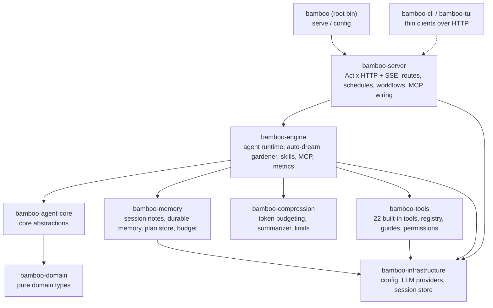

# Bamboo 🎋

<p align="center">
  
</p>

> **Bamboo — Zenith 的本地优先 Rust 智能体运行时（执行引擎）**
> **Bamboo — the local-first Rust agent runtime that powers Zenith (the execution engine).**

---

## 1. 这是什么 / What is this

**中文**
Bamboo 是一个能在你自己电脑上运行的 AI 助理"大脑"。它不只是聊天——它会记笔记、长出可被检索的长期记忆、会用工具（读写文件、运行命令、搜索网页），还能在对话变得很长时自动把内容压缩整理，让助理不会"忘事"也不会"卡住"。它把这些能力都装进一个小巧、可自己托管的程序里，数据默认留在本地。

**English**
Bamboo is the "brain" of an AI assistant that runs on your own machine. It does far more than chat — it takes notes, grows a searchable long-term memory, uses tools (read/write files, run commands, search the web), and automatically compacts very long conversations so the assistant never "forgets" or grinds to a halt. All of this lives inside one compact, self-hostable program, with your data staying local by default.

If Bodhi is the AI product you see, **Bamboo is the engine running underneath it.**

---

## 2. 一览能力 / Key Capabilities at a Glance

| 能力 / Capability | 说明 / What it does |
|---|---|
| 🧠 **记忆系统 / Memory system** | 会话便签、Dream 笔记本、跨会话的持久记忆，可自动梦境化（auto-dream）与后台整理（gardener） |
| 🗜️ **上下文压缩 / Context compression** | 滚动摘要 + 近窗保留的混合压缩，超大工具输出自动裁剪，按模型上下文窗口预算执行 |
| 🛠️ **内置工具 / Built-in tools** | 22 个内置工具：文件、搜索、Shell、Web、计划模式、任务、权限请求等 |
| 🎯 **技能系统 / Skills** | 可选/可发现的技能，按请求提示做轻量选择，含内置 docx / pdf / pptx / xlsx / skill-creator |
| 🔌 **MCP 扩展 / MCP** | Model Context Protocol 客户端，挂接外部工具服务器 |
| ⏰ **工作流与调度 / Workflows & schedules** | 声明式工作流装载 + cron 风格的调度触发引擎 |
| 🌐 **HTTP / SSE** | Actix 服务、REST API、Server-Sent Events 流式，兼容 OpenAI / Anthropic / Gemini 端点 |
| 🏗️ **多 Provider / Multi-provider** | anthropic（默认）、openai、gemini、copilot、bodhi 路由 |

---

## 3. 架构 / Architecture

**中文**
Bamboo 是一个 Cargo **workspace**：根目录是一个很薄的二进制（`bamboo-agent`，提供 `bamboo` 命令），真正的逻辑分布在 `crates/` 下的多个 crate 中。生产服务由 `crates/bamboo-server` 提供——没有重复的服务实现。`bamboo-agent-core` 只依赖 `bamboo-domain`，保持核心抽象的纯净。

**English**
Bamboo is a Cargo **workspace**: a thin root binary (`bamboo-agent`, which exposes the `bamboo` command) sits on top of focused crates under `crates/`. The live server is `crates/bamboo-server` (there is no duplicate server tree). `bamboo-agent-core` depends **only** on `bamboo-domain`, keeping the core abstractions clean.



**Workspace members** (from `Cargo.toml`):
`bamboo-domain`, `bamboo-infrastructure`, `bamboo-engine`, `bamboo-agent-core`, `bamboo-memory`, `bamboo-compression`, `bamboo-tools`, `bamboo-cli`, `bamboo-server`, `bamboo-tui`, plus the root `bamboo-agent` bin.

**在 Zenith 中的位置 / Place in the Zenith stack:** lotus（React UI）与 bamboo 通过 **HTTP** 通信；bodhi（Tauri 外壳）只是承载界面的容器。bamboo 是执行引擎，bodhi-server（Go）负责账号/持久化/计费与 LLM 代理。

---

## 4. 旗舰能力深读 / Signature Deep-Dives

### 4.1 记忆系统 / Memory System  · `crates/bamboo-memory`

记忆分三层 / Memory has three layers:

- **会话便签 / Session notes** — 由 `session_note` 工具写入（动作：`session_read` / `session_append` / `session_replace` / `session_clear` / `session_list_topics`），是当前会话内的临时草稿/事实。
- **Dream 笔记本 / Dream notebook** — 后台把一段会话"梦境化"，提炼成结构化的候选记忆并整合进笔记本（`auto_dream.rs`）。
- **持久记忆 / Durable memory** — 跨会话存活，带 frontmatter（类型、状态、来源、关系、检索元数据），作用域分为 `session` / `project` / `global`（`memory_store/types.rs`）。

**自动梦境 / Auto-dream**（`MemoryConfig.auto_dream_enabled`，**默认关闭**，因为会消耗模型 token）在会话演进时抽取（extraction）、整合（consolidation）并生成 Dream；支持三种模式：`Incremental`、`Refine`、`Rebuild`。

**Gardener（后台园丁）**（`bamboo-engine/src/gardener.rs`，`gardener_enabled` 默认关闭）专门拆分"多主题的 blob 记忆"。它有成本护栏：单次运行硬性拆分上限、缓慢节奏（默认按天），且**当确定性预筛找不到候选时不调用任何 LLM**——空闲的 gardener 零成本。拆分的"工作清单"由 `MemoryStore::scan_blob_candidates` 免费产出，只有拆分"决策"才用模型。

> 为什么重要 / Why it matters: 记忆系统让助理在长期使用中越来越懂你的项目，而成本可控、数据本地。

### 4.2 上下文压缩 / Context Compression · `crates/bamboo-compression`

长会话不会无限膨胀。Bamboo 用**混合策略**：滚动摘要（rolling summary）+ 近期消息窗口（recent window）。

- `counter` — 通过 tiktoken BPE 或启发式估算计 token（`TiktokenTokenCounter` / `HeuristicTokenCounter`）。
- `segmenter` — 分段时保持工具调用的原子性（不会把一次 tool call 拆散）。
- `limits` — **刻意不内置 per-model 表**。真实上下文/输出上限来自 (1) provider 运行时元数据，(2) 用户在 `model_limits.json` 的覆盖；都没有则回落到全局默认 **200K 上下文 / 64K 输出**。这样模型更新换代也不会让表过时。
- `summarizer` / `preparation` — 构建压缩计划、生成摘要消息、按预算准备上下文（`prepare_hybrid_context`），并能估算 prompt cache 节省。
- **超大输出处理 / Oversized output** — 工具产生的超大输出在 `bamboo-tools/output_manager.rs` 处会被裁剪/管理，避免一次性塞爆上下文。

> 为什么重要 / Why it matters: 助理可以做长时间、多步骤的工作而不会因上下文溢出而崩溃或"失忆"。

### 4.3 技能系统 / Skill System · `crates/bamboo-engine/src/skills`

技能（skills）是可启用的能力包。运行时按会话元数据解析"已选技能"（支持 JSON 数组或逗号分隔的旧格式），并对**未选技能**做轻量、基于请求提示（request hint）的相关性挑选注入上下文（上限 `MAX_UNSELECTED_SKILLS_IN_CONTEXT = 24`），避免把所有技能都塞进提示词。还包含访问控制与运行时元数据。

内置技能在 `builtin_skills/`：`docx`、`pdf`、`pptx`、`xlsx`、`skill-creator`。

### 4.4 工具、工作流、调度、MCP / Tools, Workflows, Schedules, MCP

- **工具 / Tools**（`bamboo-tools`，**22 个内置**，在 `executor.rs::register_builtin_tools` 注册）：`Bash`、`BashOutput`、`KillShell`、`Read`、`Write`、`Edit`、`NotebookEdit`、`Glob`、`Grep`、`GetFileInfo`、`Workspace`、`WebFetch`、`WebSearch`、`JsRepl`、`Task`、`Sleep`、`EnterPlanMode`、`ExitPlanMode`、`RequestPermissions`、`SessionNote`、`ConclusionWithOptions` 等。工具带**使用指南（guides）**注入运行时、**权限/策略感知**执行路径，以及并行执行支持（`parallel.rs`）。
- **工作流 / Workflows** — 声明式装载（`bamboo-server/src/workflow/loader.rs`），通过 `/bamboo/workflows` 暴露。
- **调度 / Schedules** — cron 风格的触发引擎与存储（`bamboo-server/src/schedules/`：`manager`、`trigger_engine`、`session_factory`、`store`）。
- **MCP** — Model Context Protocol 客户端（`bamboo-engine/src/mcp/`：`manager`、`protocol`、`transports`、`tool_index`），通过 `/mcp`、`/servers` 路由管理外部工具服务器。

---

## 5. 快速开始 / Quick Start & Development

### 启动服务 / Run the server

```bash
# 从仓库内构建并运行 / build & run from the workspace
cargo run --bin bamboo -- serve

# 或安装后运行 / or install then run
cargo install --path .
bamboo serve
```

`bamboo serve` 支持的参数（均覆盖配置文件 / all override config file）：
`--port`、`--bind`、`--data-dir`、`--static-dir`、`--workers`。
另一个子命令 `bamboo config [--path] [--show-secrets]` 用于查看配置。

**默认值 / Defaults**（已对照代码核实 / verified against code）：

- HTTP API: `http://127.0.0.1:9562/api/v1`（端口默认 `9562`，绑定默认 `127.0.0.1`）
- 健康检查 / Health: `GET /api/v1/health`
- 数据目录 / Data dir: `BAMBOO_DATA_DIR` 或 `${HOME}/.bamboo`
- 默认 provider: `anthropic`

### 示例配置 / Example configuration

`${HOME}/.bamboo/config.json`：

```json
{
  "provider": "anthropic",
  "server": {
    "port": 9562,
    "bind": "127.0.0.1"
  },
  "providers": {
    "anthropic": {
      "api_key": "sk-ant-...",
      "model": "claude-sonnet-4-6"
    }
  }
}
```

> 配置优先级 / Config precedence: 文件 < 环境变量 < CLI 参数。环境变量包括 `BAMBOO_DATA_DIR`、`BAMBOO_PORT`、`BAMBOO_BIND`、`BAMBOO_PROVIDER`、`BAMBOO_WORKERS`、`BAMBOO_CORS_ALLOW_ORIGINS`。

### Docker

```bash
cd docker && docker compose up -d --build
curl http://localhost:9562/api/v1/health
```

`docker-compose.yml` 映射 `9562:9562`，并设置 `BAMBOO_DATA_DIR=/data`、`BAMBOO_PORT=9562`、`BAMBOO_BIND=0.0.0.0`。

### 常用 API 路由 / Selected API routes

REST 前缀 `/api/v1`：`chat`、`stream`、`complete`、`sessions`、`skills`、`tools`、`tools/execute`、`models`、`commands`、`workflows`、`metrics/*`、`mcp`、`servers`、`stop/{session_id}`、`health`。
另有 provider 兼容端点：`/openai/v1`、`/anthropic/v1`、`/gemini/v1beta`、`/v1/{chat/completions,responses,messages}`。

### 测试与质量 / Tests & quality

```bash
cargo test            # workspace tests
cargo clippy          # lints (.clippy.toml present)
cargo build --release
```

---

## 6. 其余技术栈 / The Rest of the Stack

Zenith 是一个 monorepo，bamboo 是其中的执行引擎子模块。

| 模块 / Module | 角色 / Role |
|---|---|
| [**bodhi**](../bodhi) | 桌面 AI 产品界面（Tauri 外壳）/ Desktop AI product surface (Tauri shell) |
| [**lotus**](../lotus) | React + Vite 前端 UI 层（通过 HTTP 调用 bamboo）/ React+Vite UI layer (talks to bamboo over HTTP) |
| **bamboo** | 本地优先 Rust 智能体运行时（本仓库 this repo）/ Local-first Rust agent runtime |
| [**bodhi-server**](../bodhi-server) | Go 后端：认证 / 持久化 / 计费配额 / LLM 代理 / Go backend: auth, persistence, billing+quota, LLM proxy |
| [**pavilion**](../pavilion) | 官网与文档 / Official website & docs |
| [**Zenith (root)**](../) | monorepo 入口 + 子模块指针 + 发布列车 / Monorepo entry, submodule pointers, release train |

**模块内文档 / In-module docs:**
- API 参考 / API reference: [`docs/guides/API.md`](./docs/guides/API.md)
- 迁移指南 / Migration: [`docs/guides/MIGRATION_GUIDE.md`](./docs/guides/MIGRATION_GUIDE.md)
- [CONTRIBUTING](./CONTRIBUTING.md) · [CHANGELOG](./CHANGELOG.md) · [SECURITY](./SECURITY.md)

---

## License

MIT
