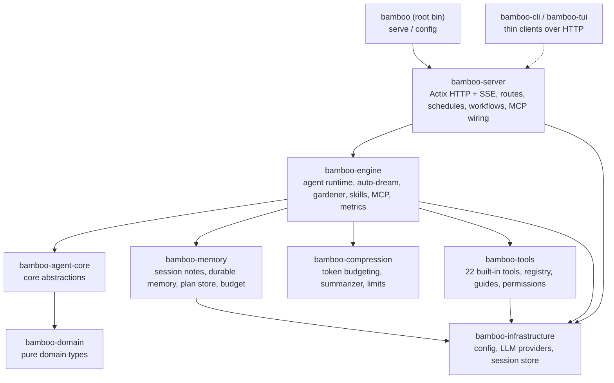

# Bamboo 🎋

<p align="center">
  
</p>

> 📖 中文版请看 **[README.zh-CN.md](./README.zh-CN.md)**

> **Bamboo — the local-first Rust agent runtime that powers Zenith (the execution engine).**

---

## What is this

Bamboo is the "brain" of an AI assistant that runs on your own machine. It does far more than chat — it takes notes, grows a searchable long-term memory, uses tools (read/write files, run commands, search the web), and automatically compacts very long conversations so the assistant never "forgets" or grinds to a halt. All of this lives inside one compact, self-hostable program, with your data staying local by default.

If Bodhi is the AI product you see, **Bamboo is the engine running underneath it.**

---

## Key Capabilities at a Glance

| Capability | What it does |
|---|---|
| 🧠 **Memory system** | Session notes, Dream notebook, cross-session durable memory, with auto-dream and background gardener |
| 🗜️ **Context compression** | Hybrid compression with rolling summary + recent-window retention, automatic trimming of oversized tool output, executed against the model's context-window budget |
| 🛠️ **Built-in tools** | 22 built-in tools: files, search, Shell, Web, plan mode, tasks, permission requests, and more |
| 🎯 **Skills** | Optional/discoverable skills with lightweight selection based on request hints, including built-in docx / pdf / pptx / xlsx / skill-creator |
| 🔌 **MCP** | Model Context Protocol client that hooks into external tool servers |
| ⏰ **Workflows & schedules** | Declarative workflow loading + a cron-style schedule trigger engine |
| 🌐 **HTTP / SSE** | Actix server, REST API, Server-Sent Events streaming, compatible with OpenAI / Anthropic / Gemini endpoints |
| 🏗️ **Multi-provider** | anthropic (default), openai, gemini, copilot, bodhi routing |

---

## Architecture

Bamboo is a Cargo **workspace**: a thin root binary (`bamboo-agent`, which exposes the `bamboo` command) sits on top of focused crates under `crates/`. The live server is `crates/bamboo-server` (there is no duplicate server tree). `bamboo-agent-core` depends **only** on `bamboo-domain`, keeping the core abstractions clean.



**Workspace members** (from `Cargo.toml`):
`bamboo-domain`, `bamboo-infrastructure`, `bamboo-engine`, `bamboo-agent-core`, `bamboo-memory`, `bamboo-compression`, `bamboo-tools`, `bamboo-cli`, `bamboo-server`, `bamboo-tui`, plus the root `bamboo-agent` bin.

**Place in the Zenith stack:** lotus (the React UI) and bamboo communicate over **HTTP**; bodhi (the Tauri shell) is just the container that hosts the interface. Bamboo is the execution engine, and bodhi-server (Go) handles accounts/persistence/billing and the LLM proxy.

---

## Signature Deep-Dives

### Memory System · `crates/bamboo-memory`

Memory has three layers:

- **Session notes** — written by the `session_note` tool (actions: `session_read` / `session_append` / `session_replace` / `session_clear` / `session_list_topics`); these are temporary drafts/facts within the current session.
- **Dream notebook** — a background process "dreams" over a stretch of conversation, distilling it into structured candidate memories and consolidating them into the notebook (`auto_dream.rs`).
- **Durable memory** — survives across sessions, with frontmatter (type, status, source, relations, retrieval metadata), scoped as `session` / `project` / `global` (`memory_store/types.rs`).

**Auto-dream** (`MemoryConfig.auto_dream_enabled`, **off by default** because it consumes model tokens) performs extraction, consolidation, and Dream generation as the conversation evolves; it supports three modes: `Incremental`, `Refine`, `Rebuild`.

**Gardener** (`bamboo-engine/src/gardener.rs`, `gardener_enabled` off by default) specializes in splitting "multi-topic blob memories." It has cost guardrails: a hard per-run split cap, a slow cadence (daily by default), and **it calls no LLM when the deterministic pre-screen finds no candidates** — an idle gardener costs nothing. The split "work list" is produced for free by `MemoryStore::scan_blob_candidates`; only the split "decision" uses the model.

> Why it matters: the memory system lets the assistant understand your project better over long-term use, while keeping cost controlled and data local.

### Context Compression · `crates/bamboo-compression`

Long conversations don't grow without bound. Bamboo uses a **hybrid strategy**: a rolling summary + a recent message window.

- `counter` — counts tokens via tiktoken BPE or heuristic estimation (`TiktokenTokenCounter` / `HeuristicTokenCounter`).
- `segmenter` — preserves the atomicity of tool calls when segmenting (it won't split a single tool call apart).
- `limits` — **deliberately ships no per-model table**. Real context/output limits come from (1) provider runtime metadata, (2) user overrides in `model_limits.json`; with neither, it falls back to a global default of **200K context / 64K output**. This way the table never goes stale as models are updated.
- `summarizer` / `preparation` — builds the compression plan, generates the summary message, prepares context against the budget (`prepare_hybrid_context`), and can estimate prompt-cache savings.
- **Oversized output** — oversized output produced by tools is trimmed/managed at `bamboo-tools/output_manager.rs`, avoiding stuffing the context all at once.

> Why it matters: the assistant can do long, multi-step work without crashing from context overflow or "losing its memory."

### Skill System · `crates/bamboo-engine/src/skills`

Skills are enableable capability bundles. At runtime it resolves the "selected skills" from session metadata (supporting JSON arrays or the legacy comma-separated format), and performs lightweight, request-hint-based relevance selection for **unselected skills** to inject into context (capped at `MAX_UNSELECTED_SKILLS_IN_CONTEXT = 24`), avoiding stuffing every skill into the prompt. It also includes access control and runtime metadata.

Built-in skills live in `builtin_skills/`: `docx`, `pdf`, `pptx`, `xlsx`, `skill-creator`.

### Tools, Workflows, Schedules, MCP

- **Tools** (`bamboo-tools`, **22 built-in**, registered in `executor.rs::register_builtin_tools`): `Bash`, `BashOutput`, `KillShell`, `Read`, `Write`, `Edit`, `NotebookEdit`, `Glob`, `Grep`, `GetFileInfo`, `Workspace`, `WebFetch`, `WebSearch`, `JsRepl`, `Task`, `Sleep`, `EnterPlanMode`, `ExitPlanMode`, `RequestPermissions`, `SessionNote`, `ConclusionWithOptions`, and more. Tools come with **usage guides** injected at runtime, a **permission/policy-aware** execution path, and parallel execution support (`parallel.rs`).
- **Workflows** — declarative loading (`bamboo-server/src/workflow/loader.rs`), exposed via `/bamboo/workflows`.
- **Schedules** — a cron-style trigger engine and store (`bamboo-server/src/schedules/`: `manager`, `trigger_engine`, `session_factory`, `store`).
- **MCP** — Model Context Protocol client (`bamboo-engine/src/mcp/`: `manager`, `protocol`, `transports`, `tool_index`), managing external tool servers via the `/mcp`, `/servers` routes.

---

## Quick Start & Development

### Run the server

```bash
# build & run from the workspace
cargo run --bin bamboo -- serve

# or install then run
cargo install --path .
bamboo serve
```

Arguments supported by `bamboo serve` (all override the config file):
`--port`, `--bind`, `--data-dir`, `--static-dir`, `--workers`.
The other subcommand, `bamboo config [--path] [--show-secrets]`, is used to inspect configuration.

**Defaults** (verified against code):

- HTTP API: `http://127.0.0.1:9562/api/v1` (port defaults to `9562`, bind defaults to `127.0.0.1`)
- Health: `GET /api/v1/health`
- Data dir: `BAMBOO_DATA_DIR` or `${HOME}/.bamboo`
- Default provider: `anthropic`

### Call the agent loop

Once the server is running, the simplest way to run the **full agent loop** — the LLM plans, calls tools, and streams its work — is two HTTP calls: kick off a turn with `POST /api/v1/chat`, then watch the live events on the SSE feed `GET /api/v1/stream`.

```bash
# 1. Start an agent turn. This runs the agent loop against the LLM and returns immediately.
#    Response: { "session_id": "...", "stream_url": "...", "status": "streaming" }
curl -s http://127.0.0.1:9562/api/v1/chat \
  -H 'Content-Type: application/json' \
  -d '{
        "message": "List the files in the current directory and tell me what this project does.",
        "model": "claude-sonnet-4-6"
      }'

# 2. Watch the agent work in real time (resumable SSE event feed).
#    Each event is one step of the loop: assistant text, tool calls, tool results,
#    token usage, and completion.
curl -N http://127.0.0.1:9562/api/v1/stream
```

`message` and `model` are the only required fields. Useful optionals: `session_id` (continue a conversation), `system_prompt`, `selected_skill_ids`, `workspace_path`, `provider`, `images`. The `chat` call returns right away and the loop runs in the background; the `stream` endpoint (SSE, resumable via `?since=<seq>` or the `Last-Event-ID` header) is where the assistant's reasoning, tool calls, and final answer arrive as they happen.

### Use it as a Rust SDK (in-process)

No server needed — the **same agent loop** runs in-process by calling Rust methods directly. Build an `Agent` once, then call `agent.execute(&mut session, req)`; the loop streams `AgentEvent`s back over an `mpsc` channel. The public types (`Agent`, `AgentBuilder`, `ExecuteRequest`, `AgentEvent`, `Session`) are re-exported from the `bamboo_engine` crate.

```rust
use std::sync::Arc;
use tokio::sync::{mpsc, RwLock};
use tokio_util::sync::CancellationToken;

use bamboo_engine::{Agent, AgentEvent, ExecuteRequest, Session, SkillManager};
use bamboo_engine::metrics::{MetricsCollector, SqliteMetricsStorage};
use bamboo_infrastructure::{Config, JsonlStorage, LockedSessionStore, SessionStoreV2};
use bamboo_infrastructure::provider_factory::create_provider;
use bamboo_tools::BuiltinToolExecutor;

#[tokio::main]
async fn main() -> anyhow::Result<()> {
    let home = dirs::home_dir().unwrap().join(".bamboo");

    // 1. Config (provider + API key are read from ~/.bamboo/config.json) and the LLM provider.
    let config = Config::from_data_dir(Some(home.clone()));
    let provider = create_provider(&config).await?;            // the handle that talks to the LLM

    // 2. Wire the runtime's dependencies.
    let jsonl = JsonlStorage::new(home.join("storage"));
    jsonl.init().await?;
    let storage = Arc::new(jsonl);
    let session_store = Arc::new(SessionStoreV2::new(home.clone()).await?);
    let metrics = MetricsCollector::spawn(
        Arc::new(SqliteMetricsStorage::new(home.join("metrics.db"))),
        7, // metrics retention (days)
    );

    // 3. Build the agent.
    let agent = Agent::builder()
        .storage(storage.clone())
        .persistence(Arc::new(LockedSessionStore::new(storage.clone())))
        .attachment_reader(session_store.clone())
        .skill_manager(Arc::new(SkillManager::new()))
        .metrics_collector(metrics)
        .config(Arc::new(RwLock::new(config)))
        .provider(provider)
        .default_tools(Arc::new(BuiltinToolExecutor::new()))
        .build()
        .expect("agent fully configured");

    // 4. Run one turn and stream the events.
    let mut session = Session::new("demo-session", "claude-sonnet-4-6");
    let (tx, mut rx) = mpsc::channel::<AgentEvent>(256);

    let req = ExecuteRequest {
        initial_message: "List the files here and tell me what this project does.".into(),
        event_tx: tx,
        cancel_token: CancellationToken::new(),
        model: Some("claude-sonnet-4-6".into()),
        // Every other field is an `Option` → `None` falls back to the config defaults.
        tools: None, provider_override: None, provider_name: None, provider_type: None,
        fast_model: None, fast_model_provider: None, background_model: None,
        background_model_provider: None, summarization_model: None,
        summarization_model_provider: None, reasoning_effort: None,
        auxiliary_model_resolver: None, disabled_tools: None, disabled_skill_ids: None,
        selected_skill_ids: None, selected_skill_mode: None, image_fallback: None,
        gold_config: None, app_data_dir: Some(home),
    };

    // `execute` drives the loop; events arrive on `rx` as it plans, calls tools, and answers.
    let handle = tokio::spawn(async move { agent.execute(&mut session, req).await });
    while let Some(event) = rx.recv().await {
        println!("{event:?}"); // assistant text, tool calls, tool results, token usage, completion
    }
    handle.await??;
    Ok(())
}
```

Add the bamboo crates as dependencies (path or git — the runtime crates are part of this workspace):

```toml
[dependencies]
bamboo-engine = { git = "https://github.com/bigduu/Bamboo-agent" }
bamboo-infrastructure = { git = "https://github.com/bigduu/Bamboo-agent" }
bamboo-tools = { git = "https://github.com/bigduu/Bamboo-agent" }
tokio = { version = "1", features = ["full"] }
tokio-util = "0.7"
dirs = "5"
anyhow = "1"
```

> Prefer not to manage these dependencies yourself? Run `bamboo serve` and use the HTTP API above — it drives the exact same loop. The full type reference lives in [`docs/guides/API.md`](./docs/guides/API.md).

### Example configuration

`${HOME}/.bamboo/config.json`:

```json
{
  "provider": "anthropic",
  "server": {
    "port": 9562,
    "bind": "127.0.0.1"
  },
  "providers": {
    "anthropic": {
      "api_key": "sk-ant-...",
      "model": "claude-sonnet-4-6"
    }
  }
}
```

> Config precedence: file < environment variables < CLI arguments. Environment variables include `BAMBOO_DATA_DIR`, `BAMBOO_PORT`, `BAMBOO_BIND`, `BAMBOO_PROVIDER`, `BAMBOO_WORKERS`, `BAMBOO_CORS_ALLOW_ORIGINS`.

### Docker

```bash
cd docker && docker compose up -d --build
curl http://localhost:9562/api/v1/health
```

`docker-compose.yml` maps `9562:9562` and sets `BAMBOO_DATA_DIR=/data`, `BAMBOO_PORT=9562`, `BAMBOO_BIND=0.0.0.0`.

### Selected API routes

REST prefix `/api/v1`: `chat`, `execute/{session_id}`, `stream`, `sessions`, `skills`, `tools`, `tools/execute`, `models`, `commands`, `workflows`, `metrics/*`, `mcp`, `servers`, `stop/{session_id}`, `health`.
There are also provider-compatible endpoints: `/openai/v1`, `/anthropic/v1`, `/gemini/v1beta`, `/v1/{chat/completions,responses,messages}`.

### Tests & quality

```bash
cargo test            # workspace tests
cargo clippy          # lints (.clippy.toml present)
cargo build --release
```

---

## The Rest of the Stack

Zenith is a monorepo, and bamboo is the execution-engine submodule within it.

| Module | Role |
|---|---|
| [**bodhi**](../bodhi) | Desktop AI product surface (Tauri shell) |
| [**lotus**](../lotus) | React+Vite UI layer (talks to bamboo over HTTP) |
| **bamboo** | Local-first Rust agent runtime (this repo) |
| [**bodhi-server**](../bodhi-server) | Go backend: auth, persistence, billing+quota, LLM proxy |
| [**pavilion**](../pavilion) | Official website & docs |
| [**Zenith (root)**](../) | Monorepo entry, submodule pointers, release train |

**In-module docs:**
- API reference: [`docs/guides/API.md`](./docs/guides/API.md)
- Migration: [`docs/guides/MIGRATION_GUIDE.md`](./docs/guides/MIGRATION_GUIDE.md)
- [CONTRIBUTING](./CONTRIBUTING.md) · [CHANGELOG](./CHANGELOG.md) · [SECURITY](./SECURITY.md)

---

## License

MIT
