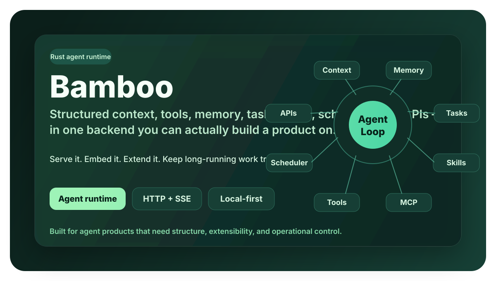
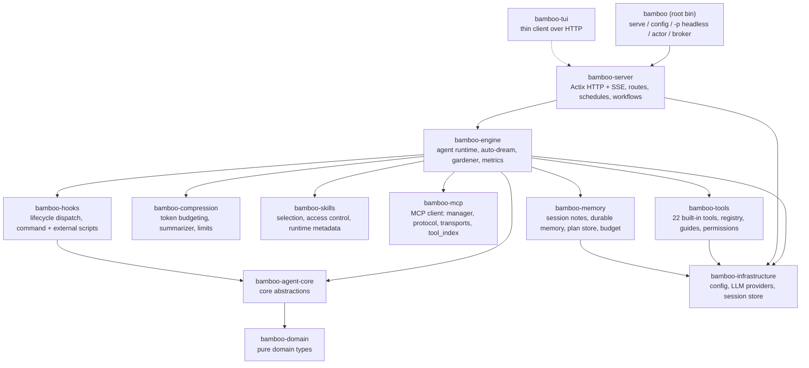

<div align="center">

# Bamboo 🎋



### The local-first AI agent runtime, in Rust.

**Persistent memory, 22 built-in tools, skills, MCP, workflows & schedules — behind one HTTP + SSE API.**
Run it as a server, or embed the same agent loop as a Rust crate. Your data stays on your machine.

[](https://crates.io/crates/bamboo-agent)
[](https://docs.rs/bamboo-agent)
[](https://github.com/bigduu/Bamboo-agent/actions/workflows/ci.yml)
[](./LICENSE)
[](./README.zh-CN.md)

</div>

---

## What is this

Bamboo is the "brain" of an AI assistant that runs on your own machine. It does far more than chat — it takes notes, grows a searchable long-term memory, uses tools (read/write files, run commands, search the web), and automatically compacts very long conversations so the assistant never "forgets" or grinds to a halt. All of this lives inside one compact, self-hostable program, with your data staying local by default.

If Bodhi is the AI product you see, **Bamboo is the engine running underneath it.**

---

## Key Capabilities at a Glance

| Capability | What it does |
|---|---|
| 🧠 **Memory system** | Session notes, Dream notebook, cross-session durable memory, with auto-dream and background gardener |
| 🗜️ **Context compression** | Hybrid compression with rolling summary + recent-window retention, automatic trimming of oversized tool output, executed against the model's context-window budget |
| 🛠️ **Built-in tools** | 22 built-in tools: files, search, Shell, Web, plan mode, tasks, permission requests, and more |
| 🎯 **Skills** | Optional/discoverable skills with lightweight selection based on request hints, including built-in docx / pdf / pptx / xlsx / skill-creator |
| 🔌 **MCP** | Model Context Protocol client that hooks into external tool servers |
| ⏰ **Workflows & schedules** | Declarative workflow loading + a cron-style schedule trigger engine |
| 🌐 **HTTP / SSE** | Actix server, REST API, Server-Sent Events streaming, compatible with OpenAI / Anthropic / Gemini endpoints |
| 🏗️ **Multi-provider** | anthropic (default), openai, gemini, copilot, bodhi routing |

---

## Architecture

Bamboo is a Cargo **workspace**: a thin root binary (`bamboo-agent`, which exposes the `bamboo` command) sits on top of focused crates organized into four tiers — `crates/core/` (types + interfaces), `crates/infra/` (independent services), `crates/engine/` (core logic), and `crates/app/` (executables + entry points). The live server is `crates/app/bamboo-server` (there is no duplicate server tree). `bamboo-agent-core` depends **only** on `bamboo-domain`, keeping the core abstractions clean.



**Workspace members** (from `Cargo.toml`), organized by tier:

- **`crates/core/`** — `bamboo-domain` (pure domain types), `bamboo-agent-core` (core abstractions)
- **`crates/infra/`** — `bamboo-config`, `bamboo-llm`, `bamboo-storage`, `bamboo-a2a`, `bamboo-infrastructure`, `bamboo-memory`, `bamboo-metrics`, `bamboo-notification`, `bamboo-skills`, `bamboo-mcp`, `bamboo-permission`, `bamboo-compression`, `bamboo-subagent`, `bamboo-hooks`, `bamboo-analytics` (dev-only)
- **`crates/engine/`** — `bamboo-engine`, `bamboo-tools`
- **`crates/app/`** — `bamboo-server`, `bamboo-server-tools`, `bamboo-sdk`, `bamboo-tui`, `bamboo-client-core`, `bamboo-broker`

…plus the root `bamboo-agent` binary.

**Place in the Zenith stack:** lotus (the React UI) and bamboo communicate over **HTTP**; bodhi (the Tauri shell) is just the container that hosts the interface. Bamboo is the execution engine, and bodhi-server (Go) handles accounts/persistence/billing and the LLM proxy.

---

## Signature Deep-Dives

### Memory System · `crates/infra/bamboo-memory`

Memory has three layers:

- **Session notes** — written by the `session_note` tool (actions: `session_read` / `session_append` / `session_replace` / `session_clear` / `session_list_topics`); these are temporary drafts/facts within the current session.
- **Dream notebook** — a background process "dreams" over a stretch of conversation, distilling it into structured candidate memories and consolidating them into the notebook (`auto_dream.rs`).
- **Durable memory** — survives across sessions, with frontmatter (type, status, source, relations, retrieval metadata), scoped as `session` / `project` / `global` (`memory_store/types.rs`).

**Auto-dream** (`MemoryConfig.auto_dream_enabled`, **off by default** because it consumes model tokens) performs extraction, consolidation, and Dream generation as the conversation evolves; it supports three modes: `Incremental`, `Refine`, `Rebuild`.

**Gardener** (`bamboo-engine/src/gardener.rs`, `gardener_enabled` off by default) specializes in splitting "multi-topic blob memories." It has cost guardrails: a hard per-run split cap, a slow cadence (daily by default), and **it calls no LLM when the deterministic pre-screen finds no candidates** — an idle gardener costs nothing. The split "work list" is produced for free by `MemoryStore::scan_blob_candidates`; only the split "decision" uses the model.

> Why it matters: the memory system lets the assistant understand your project better over long-term use, while keeping cost controlled and data local.

### Context Compression · `crates/infra/bamboo-compression`

Long conversations don't grow without bound. Bamboo uses a **hybrid strategy**: a rolling summary + a recent message window.

- `counter` — counts tokens via tiktoken BPE or heuristic estimation (`TiktokenTokenCounter` / `HeuristicTokenCounter`).
- `segmenter` — preserves the atomicity of tool calls when segmenting (it won't split a single tool call apart).
- `limits` — **deliberately ships no per-model table**. Explicit user overrides in `model_limits.json` take precedence over provider runtime metadata; with neither, Bamboo falls back to **1M total input+output context / 128K output**. Prompt fitting reserves the output allowance and tokenizer safety margin from that total window, and root sessions re-read the instance-local override file each round.
- `summarizer` / `preparation` — builds the compression plan, generates the summary message, prepares context against the budget (`prepare_hybrid_context`), and can estimate prompt-cache savings.
- **Oversized output** — oversized output produced by tools is trimmed/managed at `bamboo-tools/output_manager.rs`, avoiding stuffing the context all at once.

> Why it matters: the assistant can do long, multi-step work without crashing from context overflow or "losing its memory."

### Skill System · `crates/infra/bamboo-skills`

Skills are enableable capability bundles. At runtime it resolves the "selected skills" from session metadata (supporting JSON arrays or the legacy comma-separated format), and performs lightweight, request-hint-based relevance selection for **unselected skills** to inject into context (capped at `MAX_UNSELECTED_SKILLS_IN_CONTEXT = 24`), avoiding stuffing every skill into the prompt. It also includes access control and runtime metadata.

Built-in skills live in `builtin_skills/`: `docx`, `pdf`, `pptx`, `xlsx`, `skill-creator`.

### Tools, Workflows, Schedules, MCP

- **Tools** (`bamboo-tools`, **22 built-in**, registered in `executor.rs::register_builtin_tools`): `Bash`, `BashOutput`, `KillShell`, `Read`, `Write`, `Edit`, `NotebookEdit`, `Glob`, `Grep`, `GetFileInfo`, `Workspace`, `WebFetch`, `WebSearch`, `JsRepl`, `Task`, `Sleep`, `EnterPlanMode`, `ExitPlanMode`, `RequestPermissions`, `SessionNote`, `ConclusionWithOptions`, and more. Tools come with **usage guides** injected at runtime, a **permission/policy-aware** execution path, and parallel execution support (`parallel.rs`).
- **Workflows** — declarative loading (`bamboo-server/src/workflow/loader.rs`), exposed via `/bamboo/workflows`.
- **Schedules** — a cron-style trigger engine and store (`bamboo-server/src/schedules/`: `manager`, `trigger_engine`, `session_factory`, `store`).
- **MCP** — Model Context Protocol client (`crates/infra/bamboo-mcp/`: `manager`, `protocol`, `transports`, `tool_index`), managing external tool servers via the `/mcp`, `/servers` routes.

---

## Quick Start & Development

Building Bamboo from source requires **Rust 1.95 or newer**.

### First-run setup

Configure a provider + API key without hand-editing JSON:

```bash
# interactive — prompts for provider + API key (uses a default model unless --model is given)
bamboo init

# or non-interactive (CI / scripting)
bamboo init --non-interactive --provider anthropic --api-key "sk-ant-..."

# verify the install (config present, provider keyed, server reachable)
bamboo doctor

# set/rotate a single value later
bamboo config set providers.openai.api_key "sk-..."
bamboo config set provider openai
```

`init` writes `~/.bamboo/config.json` (override with `--data-dir`) and stores the key **encrypted at rest**. `doctor` exits non-zero if a blocking problem is found, so it doubles as a readiness check.

### Run the server

```bash
# build & run from the workspace
cargo run --bin bamboo -- serve

# or install then run
cargo install --path .
bamboo serve
```

Arguments supported by `bamboo serve` (all override the config file):
`--port`, `--bind`, `--data-dir`, `--static-dir`, `--workers` (plus `--parent-pid`, a sidecar orphan-guard: the process exits when that PID goes away).

**Other subcommands** (`bamboo --help` / `bamboo <cmd> --help` for the full list):

| Command | What it does |
|---|---|
| `bamboo serve` | Start the HTTP/SSE server (above). |
| `bamboo tui` | Full-screen terminal client (chat, sessions, MCP, schedules, skills, config) over a running server; offers to auto-start a local one when unreachable (`--auto-serve`/`--no-auto-serve`). |
| `bamboo init` | First-run setup: write `config.json` with a provider + API key (interactive, or `--non-interactive` for CI). |
| `bamboo doctor` | Diagnose the install (config present, provider keyed, server reachable); exits non-zero on a blocking problem. |
| `bamboo config [--path] [--show-secrets]` | Inspect the resolved configuration. |
| `bamboo config set <key> <value>` | Set one value by dotted key. Secret-aware keys (`providers.<p>.api_key`, `provider_instances.<id>.api_key`, `notifications.ntfy.token`, `notifications.bark.device_key`) are stored encrypted at rest; every other key is a generic validated dot-path (e.g. `server.port 9563`, `tools.disabled '["Bash"]'`) — JSON values are parsed as JSON, unknown keys / type mismatches are rejected before writing. `--dry-run` previews the diff. |
| `bamboo -p "<prompt>"` | One-shot **headless** agent run (boots the full runtime incl. sub-agents, prints the result, exits). Use `-p -` to read the prompt from stdin. Optional `-s <session>` to continue, `-m provider:model` **or** a bare `-m <model>` (bound to `--provider`, else the configured default provider) to pin the model, `--provider <name>` to select a provider, `--reasoning-effort <low\|medium\|high\|xhigh>`, `--skill-mode <mode>`, `--workspace`, `--data-dir`, `--stream-json` (NDJSON on stdout), `--echo` (keyless transport smoke). |
| `bamboo completions <shell>` | Print a shell completion script (`bash`/`zsh`/`fish`/`powershell`/`elvish`), e.g. `bamboo completions zsh > ~/.zfunc/_bamboo`. |
| `bamboo actor run\|serve\|list\|call` | Drive the sub-agent actor fabric from the terminal (spawn + stream, run as a service, discover, or send a task). |
| `bamboo broker serve` | Run the standalone sub-agent message broker (WebSocket bus over durable mailboxes). |
| `bamboo broker-agent serve` | Run a broker-connected agent (local / Docker / remote) that answers Ask/Task for its mailbox. |
| `bamboo health` | Probe a running server's `/health` (exit non-zero if unreachable/unhealthy — usable as a readiness check). |
| `bamboo status` | One-screen overview of a running server: address, health, session counts. |
| `bamboo sessions` | List sessions on a running server (stop one with `bamboo stop <id>`). |
| `bamboo stop <session_id>` | Stop a running session's agent loop. |
| `bamboo history <session_id>` | Print a session's message transcript from a running server (review a headless `-p` run's log); reports the true message total and notes when cold history is capped. |
| `bamboo respond <session_id> [<answer>\|--pending]` | Answer a session's pending question / permission gate out-of-band — the run resumes server-side (e.g. unblock a headless or scheduled run). `--pending [--json]` prints the waiting question and its options instead. |
| `bamboo session show\|delete <id>` | Per-session lifecycle: `show [--json]` prints one session's detail (model, status, pending question, placement…); `delete` removes it (confirms unless `--yes`; running descendants are cancelled first). |
| `bamboo schedules list\|show\|create\|delete\|run\|runs` | Manage schedules (timed tasks) on a running server: list/inspect, create (`--cron`/`--every`/`--daily` + `--prompt`, or a raw `--json <file\|->` payload), delete (confirms unless `--yes`), trigger now, and view run history. |
| `bamboo skills list` | List the skills the agent would load from `<data_dir>/skills` (offline; no server needed). |
| `bamboo mcp list` | List the MCP servers configured in `config.json` (offline; no server needed). |
| `bamboo mcp status\|connect\|disconnect\|refresh\|tools\|add\|remove` | Manage MCP servers on a running instance over `/api/v1/mcp`: live connection state + tool counts (`status [--json]`), enable/connect + disable/disconnect a server, re-list tools (`refresh [<id>]`), inspect tools (`tools [<id>] [--json]`), add from a raw JSON payload (`add --json <file\|->`), and delete (`remove <id>`, confirms unless `--yes`; a removed server can be re-added with `add`). |

The admin commands (`health` / `status` / `sessions` / `stop` / `history` / `respond` / `session` / `schedules`) are thin HTTP clients over a running `bamboo serve`; point them at a non-default server with `--server-url` / `--port` / `--data-dir`. The read commands (`skills list` / `mcp list`) work offline against `--data-dir` (default `~/.bamboo`); the other `mcp` verbs are server-backed and take the same connection flags. (`bamboo subagent-worker` also exists but is an internal worker process spawned by the server — not for interactive use.)

A global `--log-level <error|warn|info|debug|trace>` sets the default log level for any command when `RUST_LOG` is unset (`RUST_LOG` still wins when present).

**Defaults** (verified against code):

- HTTP API: `http://127.0.0.1:9562/api/v1` (port defaults to `9562`, bind defaults to `127.0.0.1`)
- Health: `GET /api/v1/health`
- Data dir: `BAMBOO_DATA_DIR` or `${HOME}/.bamboo`
- Default provider: `anthropic`

### Call the agent loop

Once the server is running, driving the **full agent loop** — the LLM plans, calls tools, and streams its work — is three HTTP calls: create the turn with `POST /api/v1/chat`, **start the loop** with `POST /api/v1/execute/{session_id}`, then watch the SSE feed `GET /api/v1/events/{session_id}`.

```bash
# 1. Create a turn. This PERSISTS the message and returns immediately — it does
#    NOT run the loop yet. Response includes the session id and events URL:
#    { "session_id": "...", "stream_url": "/api/v1/events/<id>", "status": "streaming" }
SID=$(curl -s http://127.0.0.1:9562/api/v1/chat \
  -H 'Content-Type: application/json' \
  -d '{"message":"List the files here and tell me what this project does.","model":"claude-sonnet-4-6"}' \
  | jq -r .session_id)

# 2. Start the agent loop for that session. The body may be empty ({}) — every
#    field (model/provider/skill_mode/reasoning_effort/…) is an optional override.
curl -s -X POST "http://127.0.0.1:9562/api/v1/execute/$SID" \
  -H 'Content-Type: application/json' -d '{}'

# 3. Watch the loop in real time (SSE): assistant text, tool calls, tool results,
#    token usage, and completion arrive as they happen.
curl -N "http://127.0.0.1:9562/api/v1/events/$SID"
```

On `POST /api/v1/chat`, `message` and `model` are the only required fields; useful optionals are `session_id` (continue a conversation), `system_prompt`, `selected_skill_ids`, `workspace_path`, `provider`, `images`. Note that `chat` only **persists** the turn — you must then `POST /api/v1/execute/{session_id}` to actually run the loop. Besides the per-session `GET /api/v1/events/{session_id}` feed, there is an account-wide, resumable change feed `GET /api/v1/stream` (SSE, resumable via `?since=<seq>` or the `Last-Event-ID` header) that streams events across **all** sessions — handy for multi-session sync.

### Use it as a Rust SDK (in-process)

No server needed — the **same agent loop** runs in-process. The `bamboo_sdk` crate is an ergonomic **facade** over the engine: you supply a model and an instruction, `.with_defaults_for_data_dir` wires the eight runtime dependencies (storage, persistence, attachment reader, skills, metrics, config, provider, default tools) from `~/.bamboo`, and then `agent.run(&mut session, input)` drives one turn (draining events internally) while `agent.run_stream(session, input)` streams `AgentEvent`s back over an `mpsc` channel. To **interrupt** a streaming run, use `run_stream_cancellable(...)` which also returns a `CancellationToken` (call `.cancel()` to stop the loop); `run_with_cancel` / `run_session_with_cancel` accept a caller-owned token for the non-streaming path. Select the provider ergonomically with `.provider_name("openai")` on the builder (a following `.api_key(...)` applies to it). Every call funnels into the engine's single canonical execution path — the facade never forks the loop. The ergonomic types live in `bamboo_sdk::agent` (`Agent`, `AgentBuilder`, `ExecuteRequestBuilder`, `CancellationToken`, plus re-exported `AgentEvent`, `Session`, …).

```rust
use bamboo_sdk::agent::{Agent, Session};

#[tokio::main]
async fn main() -> anyhow::Result<()> {
    let home = dirs::home_dir().unwrap().join(".bamboo");

    // Build the agent. One call assembles storage, persistence, skills,
    // metrics, the provider (from ~/.bamboo/config.json), and the default
    // built-in tool set — no manual dependency wiring.
    let agent = Agent::builder()
        .model("claude-sonnet-4-6")
        .instruction("You are a helpful coding agent.")
        .with_defaults_for_data_dir(home)
        .await
        .expect("wire runtime deps")
        .build()
        .expect("agent fully configured");

    // Stream one turn: `run_stream` appends the user message, runs the loop on
    // a background task, and hands back a receiver of AgentEvents.
    let session = Session::new("demo-session", "claude-sonnet-4-6");
    let mut rx = agent.run_stream(
        session,
        "List the files here and tell me what this project does.",
    );
    while let Some(event) = rx.recv().await {
        println!("{event:?}"); // assistant text, tool calls, tool results, token usage, completion
    }
    Ok(())
}
```

> **Precondition:** `with_defaults_for_data_dir` reads `~/.bamboo/config.json` (the same config `bamboo serve` uses) and needs the active provider configured with a non-empty `api_key` — otherwise provider creation returns an error (here surfaced by `.expect`). A fresh data dir with no `config.json` defaults to `anthropic` with no key and will fail; `copilot` is the only provider that authenticates keyless (cached OAuth). Fix it with `bamboo init` (or `bamboo config set providers.<p>.api_key …`), or pass `.api_key("sk-…")` on the builder before `with_defaults_for_data_dir`.

> Don't need the event stream? `agent.run(&mut session, input).await?` drives the turn to completion and leaves the answer as the last message on `session`. For full control over per-request overrides (split fast/background/summarization models, skill selection, provider handles, …) build an `ExecuteRequest` with `ExecuteRequestBuilder` (both re-exported from `bamboo_sdk::agent`) and call `agent.execute(&mut session, req)` — the same canonical engine path `run` / `run_stream` funnel into.

**Approval / clarification + resume.** A run can pause mid-loop waiting for input — a `conclusion_with_options` clarification, or a gated tool call under a configured `PermissionChecker` — surfaced as `AgentEvent::NeedClarification` / `ToolApprovalRequested`. Resolve it with `agent.answer(session_id, "Approve").await?` (the in-process equivalent of the HTTP `POST /sessions/{id}/respond` endpoint — same use-case function under the hood, so behavior matches exactly), then continue with `agent.resume_stream(outcome.session)` / `agent.resume(&mut session)` — or do both in one call with `agent.answer_and_resume_stream(session_id, "Approve").await?`. `AnswerOutcome` also carries any plan-mode transition and the permission grants an approval implied (auto-applied to the builder's `.permission_checker(...)`, if one was configured). When the approved question was a gated tool call, resuming also **re-executes that tool for real** — against the agent's own tool executor — and writes the genuine output back over the synthetic placeholder before the loop continues, matching the HTTP server's behavior exactly (no extra call needed).
>
> A separate mechanism, `AgentEvent::ChildApprovalRequested`, covers an out-of-process CHILD sub-agent's gated tool (only reachable if you've also wired the engine's actor/broker transport — `with_defaults_for_data_dir` does not). Answer those with `agent.answer_child_approval(child_session_id, request_id, approved)` instead of `agent.answer`.

**Permission and tool policy.** `.permission_mode(PermissionMode::Plan | AcceptEdits | DontAsk | Default | BypassPermissions | Auto)` installs Bamboo's standard permission stack. `Auto` emits no approval prompts while retaining explicit policy and platform denials; the typed `BypassPermissions` mode still honors forced confirmations. `.permission_checker(custom)` supplies a custom implementation. In contrast, the SDK-specific `.bypass_permissions()` shortcut explicitly selects its historical no-checker, fully ungated behavior; it is not equivalent to `.permission_mode(PermissionMode::BypassPermissions)`. These three setters are last-call-wins even across `with_defaults_for_data_dir(...).await?`. Leaving `.tools(...)` unset exposes the assembled built-in (+ MCP) surface, while `.tools([])` or `.no_tools()` intentionally creates a zero-tool agent; any explicit tool selection has final precedence over assembled or injected default executors. A fully injected `.default_tools(...)` executor owns its own permission behavior and is not wrapped by the SDK policy setters.

**Session ergonomics.** `agent.new_session(id)` creates a session from the explicit builder model or effective provider-config model, while `agent.load_session(id)`, `agent.list_sessions()` (most-recently-updated first), `agent.session_history(id)`, and `agent.delete_session(id)` cover the common persistence operations. `agent.get_session(id)` remains a compatibility alias for `load_session`. `list_sessions` needs the concrete session-index handle `with_defaults_for_data_dir` assembles.

**MCP.** `.mcp_server(config)` / `.mcp_servers([...])` on the builder connect MCP servers (in `with_defaults_for_data_dir`) and merge their tools into the built-in tool surface via `CompositeToolExecutor` — each server's `initialize` instructions are folded into the tool guidance automatically.

**Dependency override order.** Explicit `.provider(...)`, `.config(...)`, and `.default_tools(...)` injections override defaults whether called before or after `with_defaults_for_data_dir`; an injected provider present before defaults also skips redundant config-driven provider creation. Explicit `.tools(...)` / `.no_tools()` remains the final tool-executor policy.

**Typed errors.** `with_defaults_for_data_dir` / `build` / `answer` / the session-ergonomics methods all return `Result<_, SdkError>` — a `thiserror` enum (`ProviderInit`, `UnsupportedApiKeyProvider`, `ModelNotConfigured`, `StoreInit`, `SkillInit`, `McpServerStart`, `SessionNotFound`, `NoPendingQuestion`, `InvalidResponse`, …) instead of a bare `String`, so callers can match on the failure kind. `UnsupportedApiKeyProvider` makes `.api_key(...)` on `copilot`/unknown providers fail explicitly instead of warning and continuing; `ModelNotConfigured` prevents `new_session` from fabricating an empty model. `SdkError` also wraps `AgentError` (`#[from]`) so it composes with `run`/`run_stream`'s existing typed error in a function returning `Result<_, SdkError>`.

Add the facade crate as a dependency (path or git):

```toml
[dependencies]
bamboo-sdk = { git = "https://github.com/bigduu/Bamboo-agent" }
tokio = { version = "1", features = ["full"] }
dirs = "5"
anyhow = "1"
```

> Prefer not to manage these dependencies yourself? Run `bamboo serve` and use the HTTP API above — it drives the exact same loop. The full SDK type reference is the rustdoc at [docs.rs/bamboo-agent](https://docs.rs/bamboo-agent) (the published crate re-exports the facade as `bamboo_agent::agent`); [`docs/guides/API.md`](./docs/guides/API.md) covers the HTTP/SSE surface.

### Example configuration

The easiest way to create this is `bamboo init` (see [First-run setup](#first-run-setup)), which writes it for you and encrypts the key. The equivalent file at `${HOME}/.bamboo/config.json`:

```json
{
  "provider": "anthropic",
  "server": {
    "port": 9562,
    "bind": "127.0.0.1"
  },
  "providers": {
    "anthropic": {
      "api_key": "sk-ant-...",
      "model": "claude-sonnet-4-6"
    }
  }
}
```

> Config precedence: file < environment variables < CLI arguments. Environment variables include `BAMBOO_DATA_DIR`, `BAMBOO_PORT`, `BAMBOO_BIND`, `BAMBOO_PROVIDER`, `BAMBOO_WORKERS`, `BAMBOO_CORS_ALLOW_ORIGINS`, and per-provider keys `BAMBOO_OPENAI_API_KEY` / `BAMBOO_ANTHROPIC_API_KEY` / `BAMBOO_GEMINI_API_KEY` (supplied at runtime, never persisted to disk — for Docker/CI/secret-manager deploys without a plaintext key in `config.json`).
>
> This is a minimal example. For every key (multi-provider instances, MCP servers, memory/auto-dream/gardener, sub-agents + the `claude_code` executor, the IM `connect` bridge, `plugin_trust`, notifications, keyword masking, and the full env var list), see [`docs/config-reference.md`](./docs/config-reference.md).

### Docker

```bash
cd docker && docker compose up -d --build
curl http://localhost:9562/api/v1/health
```

`docker-compose.yml` publishes to the host loopback only (`127.0.0.1:9562:9562`), runs as a non-root user, drops all capabilities, and uses an isolated named volume. **Do not widen the publish to expose the agent directly on a network:** a fresh instance is unauthenticated, and the server treats every private-LAN (RFC1918) peer as trusted-local and skips the password check by design — so LAN exposure is unauthenticated even after you set a password. To reach it from other machines, keep the loopback publish and front it with an authenticating reverse proxy on a trusted network. It also sets `BAMBOO_DATA_DIR=/data`, `BAMBOO_PORT=9562`, `BAMBOO_BIND=0.0.0.0` (in-container bind; exposure is controlled at the publish layer).

### Selected API routes

REST prefix `/api/v1`: `chat`, `execute/{session_id}`, `stream`, `sessions`, `skills`, `tools`, `tools/execute`, `models`, `commands`, `workflows`, `metrics/*`, `mcp`, `servers`, `stop/{session_id}`, `health`.
There are also provider-compatible endpoints: `/openai/v1`, `/anthropic/v1`, `/gemini/v1beta`, `/v1/{chat/completions,responses,messages}`.

### Tests & quality

```bash
cargo test            # workspace tests
cargo clippy          # lints (.clippy.toml present)
cargo build --release
```

---

## The Rest of the Stack

Zenith is a monorepo, and bamboo is the execution-engine submodule within it.

| Module | Role |
|---|---|
| [**bodhi**](../bodhi) | Desktop AI product surface (Tauri shell) |
| [**lotus**](../lotus) | React+Vite UI layer (talks to bamboo over HTTP) |
| **bamboo** | Local-first Rust agent runtime (this repo) |
| [**bodhi-server**](../bodhi-server) | Go backend: auth, persistence, billing+quota, LLM proxy |
| [**pavilion**](../pavilion) | Official website & docs |
| [**Zenith (root)**](../) | Monorepo entry, submodule pointers, release train |

**In-module docs:** start at [`docs/README.md`](./docs/README.md) for the full index. Highlights:
- Getting started: [`docs/guides/GETTING_STARTED.md`](./docs/guides/GETTING_STARTED.md)
- Configuration reference (every `config.json` key + env vars): [`docs/config-reference.md`](./docs/config-reference.md)
- Lifecycle hooks (command + external scripts, events, payloads, decisions): [`docs/lifecycle-hooks.md`](./docs/lifecycle-hooks.md)
- How-to guides: [Connect/IM bridge](./docs/guides/CONNECT.md) · [Plugins](./docs/guides/PLUGINS.md) · [Deploy](./docs/guides/DEPLOY.md)
- API reference: [`docs/guides/API.md`](./docs/guides/API.md)
- Migration: [`docs/guides/MIGRATION_GUIDE.md`](./docs/guides/MIGRATION_GUIDE.md)
- Runnable SDK examples: [`examples/`](./examples)
- [CONTRIBUTING](./CONTRIBUTING.md) · [CHANGELOG](./CHANGELOG.md) · [SECURITY](./SECURITY.md)

---

## License

MIT
