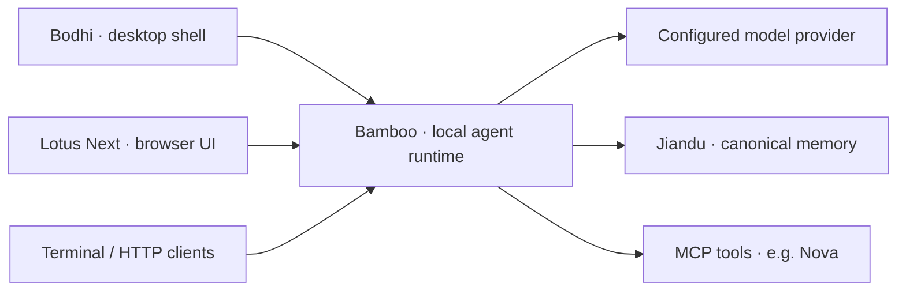

# Bamboo 🎋


*Brand illustration, not a software screenshot. Bamboo symbolizes resilience.*

### Run an AI agent on your project, from your terminal or your own app.

Bamboo is the local agent harness at the core of [Zenith](https://github.com/bigduu/Zenith). Give it a workspace and a configured model: it can read files, use tools, keep sessions, and expose the same runtime to a browser, desktop shell, or Rust application.

[中文](./README.zh-CN.md) · [crates.io](https://crates.io/crates/bamboo-agent) · [API](./docs/guides/API.md) · [MIT](./LICENSE)

## What you can use it for

| Your task | How Bamboo helps |
|---|---|
| Understand or work on a repository | Run a prompt against a workspace, inspect tool activity, and continue the session later. File and shell access follows the runtime's permission policy. |
| Build an assistant into your app | Use HTTP plus live WebSocket/SSE events, or embed the Rust SDK instead of building another agent loop. |
| Keep useful project context | Session notes and Jiandu-backed durable memory can carry selected facts across turns and sessions. Compression manages context budgets; it cannot guarantee perfect recall. |
| Connect your existing tools | Add MCP servers, skills, service plugins, and scheduled prompts as your workflow needs them. |

The runtime and session storage run locally. **Configured model providers, MCP servers, web tools, and plugins may send data outside the machine.** Local hosting does not mean an offline model or zero external API cost.

## Source checkout or published package?

This README describes the **Zenith-pinned development source**, audited at `025641317c5703226052a4b94a52d1844615c352`. It is not a claim that every command or capability is in the latest crates.io release. Check the installed binary's `bamboo --help` and the [release/source audit](./docs/readme-audit.md) when comparing versions. Source manifests deliberately use `0.0.0`; publishing stamps the release version separately.

## See the browser interface prepare project context


[Static image](docs/demos/project-workspace.png) · [Recording details](docs/demos/README.md)

Real source-checkout recording with a disposable workspace and a real Bamboo
backend. It shows project creation and selection, with no provider call or claimed
agent task completion. It is not a recording of the published desktop package.

## Try it

### Install

For a published package:

```bash
cargo install bamboo-agent --locked
bamboo --help
```

For the source described here, use **Rust 1.95+** and run from this checkout:

```bash
node scripts/frontend-package.cjs stage
cargo install --path . --locked
```

The staging command verifies the committed frontend package. Normal builds require the locked **Lotus Next** artifact; they fail if it is missing or invalid. They do not silently download a moving `latest`. The exact identity is in [frontend-package-lock.json](./scripts/frontend-package-lock.json).

For an intentionally API-only source build:

```bash
BAMBOO_FRONTEND_BUILD_MODE=api-only cargo build --bin bamboo
```

That POSIX shell assignment needs PowerShell's `$env:BAMBOO_FRONTEND_BUILD_MODE = "api-only"` on Windows. API-only builds have no compiled-in browser UI. See the [deployment guide](./docs/guides/DEPLOY.md) and [frontend staging script](./scripts/frontend-package.cjs) for explicit external or local frontend paths.

### Configure and open the local interface

```bash
bamboo init
bamboo serve
```

`init` interactively configures your provider and stores its key encrypted at rest under the Bamboo data directory (normally `~/.bamboo/`). `config.json` holds configuration metadata rather than the encrypted provider key. Use a model available to your provider/account. With the frontend included, open **http://127.0.0.1:9562**. In another terminal:

```bash
bamboo health
bamboo doctor
```

The health endpoint is `GET /api/v1/health`. `doctor` also checks configuration/provider readiness and can fail when the server is not running. `serve --port`, `--bind`, `--data-dir`, `--static-dir`, and `--workers` override configuration; run `bamboo serve --help` for the full list.

### Work from the terminal

```bash
bamboo -p "Summarize the README in this workspace." --workspace /path/to/project
bamboo sessions
bamboo history <session-id>
bamboo -p "What should I read next?" -s <session-id>
```

Headless runs use the full agent runtime and the configured provider. If an interactive `bamboo -p` run pauses for a tool permission or question, answer the prompt in that same terminal. Browser responses and `bamboo respond <session-id> --pending` / `bamboo respond <session-id> "<answer>"` target runs owned by a separately running `bamboo serve`; they do not unblock the in-process headless run. Do not disable permission checks just to make an example finish.

No key yet? `bamboo -p "ping" --echo` is a **transport smoke test only**: it uses an echo executor, not an LLM, and does not demonstrate model reasoning or successful tool work.

### Call it from your application

With a configured provider and running server, the legacy HTTP/SSE sequence is **chat → execute → events**. `chat` persists the message; `execute` starts the agent loop. The example requires `curl` and `jq`; replace the model with one your account supports.

```bash
SID=$(curl -fsS http://127.0.0.1:9562/api/v1/chat \
  -H 'Content-Type: application/json' \
  -d '{"message":"Say hello.","model":"YOUR_MODEL_ID"}' | jq -r .session_id)
curl -fsS -X POST "http://127.0.0.1:9562/api/v1/execute/$SID" \
  -H 'Content-Type: application/json' -d '{}'
curl -N "http://127.0.0.1:9562/api/v1/events/$SID"
```

The browser uses the shared `/v2/stream` WebSocket; legacy SSE routes remain available. For SDK embedding, `bamboo_sdk::agent::Agent` provides `run`, `run_stream`, and `execute` over the same engine. Defaults require a configured provider; they do not supply credentials. See [first-run CLI / HTTP / SDK examples](./docs/guides/GETTING_STARTED.md), [API reference](./docs/guides/API.md), and the [published crate's rustdoc](https://docs.rs/bamboo-agent).

## Your data and operating boundaries

- Bamboo configuration and sessions default to `~/.bamboo` (`BAMBOO_DATA_DIR` or `--data-dir` can override it). Jiandu owns canonical memory separately under `~/.jiandu`. `BAMBOO_JIANDU_DATA_DIR` must be a non-empty absolute path when used for isolation; `--data-dir` alone does not relocate memory.
- Bamboo selects prompt context and budgets; Jiandu owns memory persistence, lexical retrieval, and derived Dream snapshot bytes. Dream is orientation material, not canonical truth. No duplicate Bamboo memory index or embedding pipeline is required.
- Keep the service on loopback. A fresh instance is unauthenticated, and private-LAN peers are treated as trusted-local by the current server even when a password is set. For remote access, keep loopback binding/publishing and put an authenticating reverse proxy in front on a trusted network.
- The [Docker Compose configuration](./docker/docker-compose.yml) publishes `127.0.0.1:9562:9562`, uses a non-root user and named data volume, and drops capabilities. Run `cd docker && docker compose up -d --build` to build that setup. Provider setup is still required.
- Terminal, server, and browser interfaces do not themselves supply native desktop control. [Nova](https://github.com/bigduu/Nova) is a separate MCP capability with its own platform and permission requirements. This documentation audit is not a macOS/Windows runtime certification.

## Where Bamboo fits


```mermaid
flowchart LR
  Bodhi["Bodhi · desktop shell"] --> Bamboo["Bamboo · local agent runtime"]
  Lotus["Lotus Next · browser UI"] --> Bamboo
  CLI["Terminal / HTTP clients"] --> Bamboo
  Bamboo --> Provider["Configured model provider"]
  Bamboo --> Jiandu["Jiandu · canonical memory"]
  Bamboo --> MCP["MCP tools · e.g. Nova"]
```

Bodhi starts and health-checks its owned Bamboo sidecar. External-server reuse is limited to the explicitly selected legacy rollback path. In this source revision, Bamboo's default embedded frontend is **Lotus Next**, not the legacy Lotus UI. The optional [bodhi-server](https://github.com/bigduu/bodhi-server) account/provider service is not required for the local path. [Magpie](https://github.com/bigduu/Magpie) connects messaging channels; [Pavilion](https://github.com/bigduu/Pavilion) hosts the website/docs. See [Zenith](https://github.com/bigduu/Zenith) for the complete module map.

The Cargo workspace has four tiers: `crates/core` (types/interfaces), `crates/infra` (storage, providers, memory, MCP, permissions and other services), `crates/engine` (agent loop/tools), and `crates/app` (server, SDK, TUI, broker and client). The root `bamboo` binary composes these; source-level actor/broker commands are advanced entry points, not a promise of unlimited concurrency or release maturity.

## Develop and explore

```bash
cargo fmt --check
cargo test
cargo clippy
```

Bare Cargo commands use the manifest's `default-members`; `cargo test` is not every workspace member. The dev-only analytics crate is excluded by default. Inspect [Cargo.toml](./Cargo.toml) before using `--workspace`.

- [Architecture](./docs/design/architecture-overview.md) · [Configuration](./docs/config-reference.md)
- [Plugins](./docs/guides/PLUGINS.md) · [Migration](./docs/guides/MIGRATION_GUIDE.md) · [Documentation index](./docs/README.md)
- [Contributing](./CONTRIBUTING.md) · [Changelog](./CHANGELOG.md) · [Security](./SECURITY.md)

## License

[MIT](./LICENSE)
