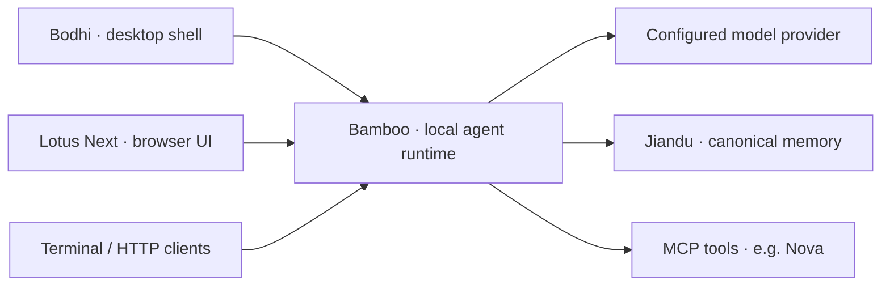

# Bamboo 🎋


*Brand illustration, not a software screenshot. Bamboo symbolizes resilience.*

### Run an AI agent on your project, from your terminal or your own app.

Bamboo is the local agent harness at the core of [Zenith](https://github.com/bigduu/Zenith). Give it a workspace and a configured model: it can read files, use tools, keep sessions, and expose the same runtime to a browser, desktop shell, or Rust application.

[中文](./README.zh-CN.md) · [crates.io](https://crates.io/crates/bamboo-agent) · [API](./docs/guides/API.md) · [MIT](./LICENSE)

## What you can use it for

| Your task | How Bamboo helps |
|---|---|
| Understand or work on a repository | Run a prompt against a workspace, inspect tool activity, and continue the session later. File and shell access follows the runtime's permission policy. |
| Build an assistant into your app | Use HTTP plus live WebSocket/SSE events, or embed the Rust SDK instead of building another agent loop. |
| Keep useful project context | Session notes and Jiandu-backed durable memory can carry selected facts across turns and sessions. Compression manages context budgets; it cannot guarantee perfect recall. |
| Connect your existing tools | Add MCP servers, skills, service plugins, and scheduled prompts as your workflow needs them. |

The runtime and session storage run locally. **Configured model providers, MCP servers, web tools, and plugins may send data outside the machine.** Local hosting does not mean an offline model or zero external API cost.

## Source checkout or published package?

This README describes the **development source checkout**, with the original product audit at `025641317c5703226052a4b94a52d1844615c352` and this documentation refresh based on `dev` revision `10ca51ccdf1f253ff6ec1e78f21b4c74835e1582`. It is not a claim that every command or capability is in the latest crates.io release. Check the installed binary's `bamboo --help` and the [release/source audit](./docs/readme-audit.md) when comparing versions. Source manifests deliberately use `0.0.0`; publishing stamps the release version separately. The recording below retains its separate, older source provenance.

## See the browser interface prepare project context


[Static image](docs/demos/project-workspace.png) · [Recording details](docs/demos/README.md)

Real source-checkout recording with a disposable workspace and a real Bamboo
backend. It shows project creation and selection, with no provider call or claimed
agent task completion. It is not a recording of the published desktop package.

## Try it

### Install

For a published package:

```bash
cargo install bamboo-agent --locked
bamboo --help
```

For the source described here, use **Rust 1.95+** and run from this checkout:

```bash
node scripts/frontend-package.cjs stage
cargo install --path . --locked
```

The staging command verifies the committed frontend package. Normal builds require the locked **Lotus Next** artifact; they fail if it is missing or invalid. They do not silently download a moving `latest`. The exact identity is in [frontend-package-lock.json](./scripts/frontend-package-lock.json).

For an intentionally API-only source build:

```bash
BAMBOO_FRONTEND_BUILD_MODE=api-only cargo build --bin bamboo
```

That POSIX shell assignment needs PowerShell's `$env:BAMBOO_FRONTEND_BUILD_MODE = "api-only"` on Windows. API-only builds have no compiled-in browser UI. See the [deployment guide](./docs/guides/DEPLOY.md) and [frontend staging script](./scripts/frontend-package.cjs) for explicit external or local frontend paths.

### Configure and open the local interface

```bash
bamboo init
bamboo serve
```

`init` interactively configures your provider and stores its key encrypted at rest under the Bamboo data directory (normally `~/.bamboo/`). `config.json` holds configuration metadata rather than the encrypted provider key. Use a model available to your provider/account. With the frontend included, open **http://127.0.0.1:9562**. In another terminal:

```bash
bamboo health
bamboo doctor
```

The health endpoint is `GET /api/v1/health`; `bamboo health` requires a reachable server. `doctor` checks configuration and provider credentials, failing on those errors; its server-reachability probe is informational, so an absent server alone does not make `doctor` fail. `serve --port`, `--bind`, `--data-dir`, `--static-dir`, and `--workers` override configuration; run `bamboo serve --help` for the full list.

### Work from the terminal

```bash
bamboo -p "Summarize the README in this workspace." --workspace /path/to/project
bamboo sessions
bamboo history <session-id>
bamboo -p "What should I read next?" -s <session-id>
```

Headless runs use the full agent runtime and the configured provider. If an interactive `bamboo -p` run pauses for a tool permission or question, answer the prompt in that same terminal. Browser responses and `bamboo respond <session-id> --pending` / `bamboo respond <session-id> "<answer>"` target runs owned by a separately running `bamboo serve`; they do not unblock the in-process headless run. Do not disable permission checks just to make an example finish.

No key yet? `bamboo -p "ping" --echo` is a **transport smoke test only**: it uses an echo executor, not an LLM, and does not demonstrate model reasoning or successful tool work.

### Call it from your application

With a configured provider and running server, the legacy HTTP/SSE sequence is **chat → subscribe → execute**. `chat` persists the message; `execute` starts the agent loop. The example requires `curl` and `jq`; replace the model with one your account supports. In terminal A, create the session and open its live event stream:

```bash
SID=$(curl -fsS http://127.0.0.1:9562/api/v1/chat \
  -H 'Content-Type: application/json' \
  -d '{"message":"Say hello.","model":"YOUR_MODEL_ID"}' | jq -r .session_id)
printf 'Session: %s\n' "$SID"
curl -iNfsS "http://127.0.0.1:9562/api/v1/events/$SID"
```

Keep terminal A open. Once its HTTP 200 response headers appear, copy the printed session ID into terminal B and start the run:

```bash
SID="<session-id printed in terminal A>"
curl -fsS -X POST "http://127.0.0.1:9562/api/v1/execute/$SID" \
  -H 'Content-Type: application/json' -d '{}'
```

Watch terminal A for live events; subscribing after execution can miss response tokens. The browser uses the shared `/v2/stream` WebSocket; legacy SSE routes remain available.

### Use it as a Rust SDK (in-process)

For SDK embedding, `bamboo_sdk::agent::Agent` provides `run`, `run_stream`, and `execute` over the same engine. Defaults require a configured provider; they do not supply credentials. See [first-run CLI / HTTP / SDK examples](./docs/guides/GETTING_STARTED.md), [API reference](./docs/guides/API.md), and the [published crate's rustdoc](https://docs.rs/bamboo-agent).

## Your data and operating boundaries

- Bamboo configuration and sessions default to `~/.bamboo` (`BAMBOO_DATA_DIR` or `--data-dir` can override it). Jiandu owns canonical memory separately under `~/.jiandu`. `BAMBOO_JIANDU_DATA_DIR` must be a non-empty absolute path when used for isolation; `--data-dir` alone does not relocate memory.
- Bamboo selects prompt context and budgets; Jiandu owns memory persistence, lexical retrieval, and derived Dream snapshot bytes. Dream is orientation material, not canonical truth. No duplicate Bamboo memory index or embedding pipeline is required.
- Keep the service on loopback. A fresh instance is unauthenticated, and private-LAN peers are treated as trusted-local by the current server even when a password is set. For remote access, keep loopback binding/publishing and put an authenticating reverse proxy in front on a trusted network.
- The [Docker Compose configuration](./docker/docker-compose.yml) publishes `127.0.0.1:9562:9562`, uses a non-root user and named data volume, and drops capabilities. Run `cd docker && docker compose up -d --build` to build that setup. Provider setup is still required.
- Terminal, server, and browser interfaces do not themselves supply native desktop control. [Nova](https://github.com/bigduu/Nova) is a separate MCP capability with its own platform and permission requirements. This documentation audit is not a macOS/Windows runtime certification.

## Where Bamboo fits


```mermaid
flowchart LR
  Bodhi["Bodhi · desktop shell"] --> Bamboo["Bamboo · local agent runtime"]
  Lotus["Lotus Next · browser UI"] --> Bamboo
  CLI["Terminal / HTTP clients"] --> Bamboo
  Bamboo --> Provider["Configured model provider"]
  Bamboo --> Jiandu["Jiandu · canonical memory"]
  Bamboo --> MCP["MCP tools · e.g. Nova"]
```

Bodhi starts and health-checks its owned Bamboo sidecar. External-server reuse is limited to the explicitly selected legacy rollback path. In this source revision, Bamboo's default embedded frontend is **Lotus Next**, not the legacy Lotus UI. The optional [bodhi-server](https://github.com/bigduu/bodhi-server) account/provider service is not required for the local path. [Magpie](https://github.com/bigduu/Magpie) connects messaging channels; [Pavilion](https://github.com/bigduu/Pavilion) hosts the website/docs. See [Zenith](https://github.com/bigduu/Zenith) for the complete module map.

The Cargo workspace has four tiers: `crates/core` (types/interfaces), `crates/infra` (storage, providers, memory, MCP, permissions and other services), `crates/engine` (agent loop/tools), and `crates/app` (server, SDK, TUI, broker and client). The root `bamboo` binary composes these; source-level actor/broker commands are advanced entry points, not a promise of unlimited concurrency or release maturity.

## Develop and explore

```bash
cargo fmt --check
cargo test
cargo clippy
```

Bare Cargo commands use the manifest's `default-members`; `cargo test` is not every workspace member. The dev-only analytics crate is excluded by default. Inspect [Cargo.toml](./Cargo.toml) before using `--workspace`.

- [Architecture](./docs/design/architecture-overview.md) · [Configuration](./docs/config-reference.md) · [Skill bundle input](./docs/design/codex-skill-input.md)
- [Plugins](./docs/guides/PLUGINS.md) · [Migration](./docs/guides/MIGRATION_GUIDE.md) · [Documentation index](./docs/README.md)
- [Contributing](./CONTRIBUTING.md) · [Changelog](./CHANGELOG.md) · [Security](./SECURITY.md)

Ordinary Instruction publications also retain a private source binding. The
main file and invocation-policy sidecars are captured through the same bounded
source capability and parsed once. Raw edits, physical file/root replacement,
and policy presence changes invalidate the publication even when normalized
metadata is equal. Captured policy bytes must agree with the auxiliary snapshot;
read errors and links cannot become an absent policy.

Source roots share a bounded handle pool across mode, Project and workspace
stores. Temporary walks and old publications remain charged while referenced;
Invalid/LKG entries and failed refreshes cannot grant future progressive API
access. Public catalog serde, legacy Workflow adapters and deterministic
orchestration keep their existing interfaces. The source binding itself adds no
caller permission, activation, or runtime registration.

The portable source fixtures run in the existing manual/promotion Build matrix.
Windows uses cap4.0.3 opened-handle identity with checked by-handle values; a
candidate requires real Windows/Linux/macOS fixture results before portable
acceptance. Ordinary eager instruction/resource storage remains until #1563.

`bamboo_skills::progressive` exports a source-validated Instruction catalog. `bamboo_server_tools::SkillsListTool`
exports a paged metadata Tool requiring a trusted caller/current-input resolver.
Known host ceilings distinguish `None`, empty and populated sets; stale UI
selection cannot grant manual invocation. Pages charge ToolResult and provider
cache envelopes, advance to metadata EOF, or return an explicit budget error.
The byte ceiling bounds each page-bearing block; unrelated request history is
outside this per-page budget.
`SkillsListTool::render_catalog` uses the same fresh metadata projection and the
pinned Codex allocator: a 2% context budget, an 8,000-character fallback, or an
independent configured token cap. Names, locators, root aliases and omission
notices consume that budget; descriptions share remaining space round-robin.
These exported APIs have no live registry or body-reader integration yet.

Engine's `session_app::skill_input::prepare_skill_input` is a pure, unwired
ordinary User-content converter. The host must supply current-input restrictions
and correlated typed selections/snapshots; catalog, configured IDs and client
fragment text establish no invocation. Explicit bodies use an 8,000 UTF-8-byte
limit with visible warnings; bounded arguments are rejected rather than cut.
`session_app::plan_legacy_skill_history` prepares loaded-only ordinary Assistant
history after the complete original tool batch. It validates typed historical
data and a unique successful active receipt, retains originals and uses the
existing 512 KiB bound. Unsupported history stays intact. Neither helper is
called by chat, runner setup, providers or persistence; live cutover is separate.

`bamboo_server_tools::SkillInputFactory` is an unwired host preparation entry
point for an actual User that has not been appended. It requires a freshly
resolved caller and typed current selections; host ceilings, disabled/manual
policy, Root Ultra and Project/workspace scope remain separate restrictions.
New Sessions require explicit host provenance and first/final absent storage
rows. Existing Sessions reuse their persistence owner before publication guards
and a final direct fallible storage read. Definition, schema, mode and Source
are borrowed from one current publication, with charged raw/physical validation
before rendering and before success. Only ordinary Message data and warnings
return; no Session, pin or reader permission is written. No production caller
uses this factory. Its fixtures establish preparation, not live runtime cutover.

The runner's existing Instruction activation path is factored into a private,
stateless `legacy_instruction` adapter. It still publishes the selected pin,
requires one model-issued `load_skill` call, suppresses first-round answer text,
and refreshes the existing repository activation metadata before continuation.
Durable workflow context, resume behavior, terminal degraded results and
WorkflowRun ordering retain their existing contracts. The adapter adds no
caller grant, Session field, source reader or lifecycle writer.

This extraction does not wire the pure input/history helpers or register the
progressive catalog/read Tools. The legacy Instruction path remains the only
live protocol; an atomic live cutover is a separate migration step.

Chat's existing typed Instruction selection uses a private `legacy_selection`
adapter. Candidate revisions and snapshots still come from the same Skills
resolver, with isolated staging pins and the existing metadata checkpoint.
Hooks, images, Root modes and input admission remain in the chat handler.

The final selected-input commit retains the original persistence and runners
guards through durable save, admission and pin handoff. It remains detached
from response cancellation; those guards are released before activation.
Ordinary requests keep their existing input and idempotent replay behavior.
This adapter adds no caller grant, Session field, reader registration or
additional writer. The pure prepared-input helpers remain unwired.

Native chat and queued HTTP input use private constructors for the same User
Message and inbox envelope. Native chat retains its attachment storage, append
and pending marker; queued input retains authenticated admission and its durable
retry identity. The four fresh-input SDK wrappers share one synchronous append
helper at their original call positions, including synchronous stream creation.
Session-only execution and resume retain their supplied history. These helpers
preserve the existing public and serialized layouts and introduce no Skill
factory or live reader registration.

## License

Project-owned code is licensed under the [MIT License](./LICENSE).
Third-party materials retain their own licenses and copyright notices:

- `builtin_skills/skill-creator` retains its [Apache-2.0 license](./builtin_skills/skill-creator/LICENSE.txt).
- Codex-derived tool-search, Skill-input and catalog/list/render code retain its [Apache-2.0 license and source notices](./THIRD_PARTY_NOTICES.md).

The exported Rust `SkillsListTool::selected_source` helper applies the same mandatory
current-caller/input, host ceiling, config and source validation as list/render.
It returns complete raw UTF-8 `SKILL.md` or a published auxiliary file (up to8MiB),
with byte/entry/inflight limits shared by a manager's stores. Owned data remains
charged through the last real owner and carries no future execution permission.
`probe_selected_source` rechecks current authority and raw/physical identity with
bounded charged scratch. These APIs do not register a `skills_read` Tool or provide
paging/cache/runtime activation. Existing publication storage has separate bounds.

The exported, unregistered `SkillsReadTool` reuses `SkillsListTool`'s mandatory
trusted caller resolver. Reads use stable packages plus `SKILL.md` or a published
relative resource. Follow `next_cursor` to complete EOF before applying instructions.
A finite owned snapshot cache retains shared byte charges through active borrows;
every continuation validates current caller/input, host policy and source identity.
UTF-8 pages charge the largest real OpenAI Chat/Responses, Anthropic cache
(including 1h), Gemini page-bearing block and complete ToolResult envelope.
`render_skill_usage_instructions` exposes complete budgeted guidance only when a
future runtime deliberately installs the read Tool. Live registration is deferred.

`skill_response_byte_budget` is an unwired scalar preparation helper. A future
trusted caller must supply its actual current tool-output token cap alongside the
existing response byte ceiling. Unknown caps and zero response bytes fail;
a known zero token cap means no hard token cap while retaining a finite512KiB
byte ceiling. Positive caps conservatively limit response bytes to that cap.
The helper grants no Skill access and changes no generic compressor behavior.
Impossible complete envelopes fail through the existing ToolError path rather
than emitting partial successful JSON or claiming EOF. Their plain failure text
has no successful-page token-bound promise. Test-owned Reader overlays exercise
this composition through the actual Runtime and outbound provider converters;
they do not install a production Reader or establish configured-provider access.
Engine observes the actual Session's output cap after continuing BeforeTool
hooks and scopes that scalar to the same executor future and exact Session/call
IDs. Generic compression receives that same captured value. A known zero keeps
its finite Reader envelope; an unknown value is not replaced with a saved or
model-name-derived default. Pre-dispatch blocks and synthesized timeouts retain
the original local compression projection and carry no retained observation.

`scope_tool_output_cap` and `observed_tool_output_cap` support same-future
in-process composition without changing public context, Session or SDK layouts.
The scope is host-constructible data, never a caller or Source permission grant.
A genuine Reader still performs fresh caller, input, ceiling, configuration,
Session, Source and cache validation on every page. Inline forwarding preserves
matching context; nested new-call IDs, SDK approval replay, opaque/no-context
executors and remote transports do not acquire a cap from old Session history.
Unwrapped spawned/blocking tasks and detached completions do not inherit it.
Moving a whole scoped future preserves its own per-poll observation, and scope
exit, cancellation and unwind restore the caller's previous scope.

Production Reader registration, current-input intent transport, default trusted
caller resolution and output-helper composition remain disconnected until the
separate atomic cutover. Existing legacy execution remains the only live path.

Server and deployed workers construct the existing `load_skill` and
`read_skill_resource` overlays through `assemble_legacy_skill_tools` in
`skill_runtime/assembly.rs`. Server retains its Project store and the actual
permission-checked pre-Skill context registry; workers retain their absent
optional adapters. Strict-native workers bypass this construction, and SDK
defaults retain their existing tool registration. The old classes remain
exported. This refactor preserves legacy invocation, resource and metadata
behavior; it does not register progressive catalog/read Tools or wire the
prepared ordinary-input helpers. The atomic live cutover remains separate.

Canonical User envelopes can retain bounded, untrusted Skill request data in
`SessionMessageContent::skill_request`. A current HTTP `workflow_selection`
supplies one exact id/source/revision/args selection with no mode. Existing
queued and Root envelopes preserve this data and include it in retry identity;
the existing native Message path and queue admission conditions are unchanged.
This carrier does not prepare or invoke a Skill, authorize a source/body read,
or identify a historical message as current input. Fresh caller, current User,
Source, schema, configuration and policy checks remain mandatory at eventual
use. The existing Workflow/Instruction activation path remains live.

Absent request data keeps legacy JSON, `.text()` construction, provider
text/parts and canonical proof/idempotency bytes compatible. The new optional
public field intentionally changes Rust struct-literal construction: existing
`SessionMessageContent { text, parts }` callers must write
`SessionMessageContent { text, parts, skill_request: None }`. Data bounds limit
request shape and size; they do not guarantee admission under the existing
whole-envelope Inbox limit. Guidance, peer messages and child/runtime
presentation cannot turn this data into a fresh User request.

Execution wrappers can carry a separately owned `UntrustedExecutionInputs`
parameter into the execution-private config. HTTP checked queue admission
supplies only this call's newly committed User IDs after ACK succeeds; SDK
`run`, `run_with_cancel`, `run_stream` and `run_stream_cancellable` supply the
exact User each just appended, with no request derived from its text.
Old session/resume/custom execute/spawn entrypoints default to `None`.
The public `SessionExecutionArgs`, `ExecuteRequest` and Server spawn argument
layouts remain unchanged. At most 128 ID/request records are retained, each
request bounded by the existing I-W rules; this transport is separate from the
later aggregate projection cap and does not classify inputs as current.
Admission/startup failure drops the local data; transcript recovery cannot
mint it again. No message/images, Skill bodies or Source authority objects
are retained. This remains unwired caller data, without preparation, Reader
registration, resource reads, grants or a live Skill cutover. Native nonqueued
Chat still requires its own accepted fresh handoff; history cannot supply it.

A separate unwired Engine helper can project borrowed request records into one
bounded, untrusted batch. It checks all original I-W request data, then charges
one private compact view including exact session/execution/input IDs, canonical
source/kind/wrapper provenance, original timestamps and explicit absent requests.
The whole batch is limited to 128 records and 256 KiB of compact UTF-8 bytes;
record/selection slots are bounded separately. Owned data copies only validated
lengths, without retaining Message/image/Source objects or source capacities.
The helper establishes no New/current-input evidence, publication or permission;
queued observation, execution transport and live Skill cutover remain separate.
