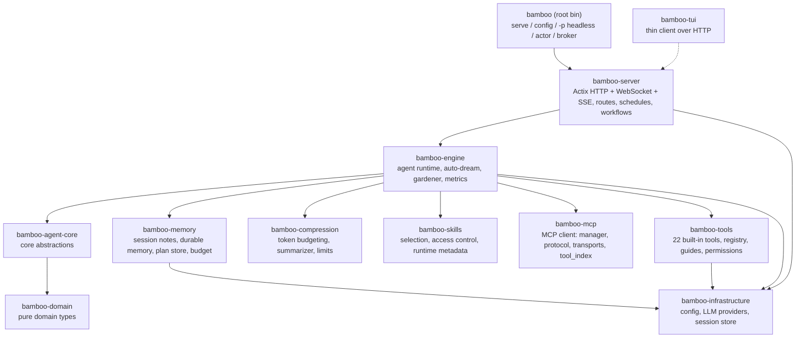

<div align="center">

# Bamboo 🎋


### 本地优先的 AI agent 运行时，Rust 编写。

**持久记忆、22 个内置工具、skills、MCP、workflows、schedules —— 统一在 HTTP + WebSocket + SSE API 之后。**
既能作为服务器运行，也能把同一套 agent loop 作为 Rust crate 嵌入。数据始终留在你自己机器上。

[](https://crates.io/crates/bamboo-agent)
[](https://docs.rs/bamboo-agent)
[](https://github.com/bigduu/Bamboo-agent/actions/workflows/ci.yml)
[](./LICENSE)
[](./README.md)

</div>

---

## 这是什么

Bamboo 是一个能在你自己电脑上运行的 AI 助理"大脑"。它不只是聊天——它会记笔记、长出可被检索的长期记忆、会用工具（读写文件、运行命令、搜索网页），还能在对话变得很长时自动把内容压缩整理，让助理不会"忘事"也不会"卡住"。它把这些能力都装进一个小巧、可自己托管的程序里，数据默认留在本地。

如果说 Bodhi 是你看到的 AI 产品，那么 **Bamboo 就是它底下运行的引擎。**

---

## 一览能力

| 能力 | 说明 |
|---|---|
| 🧠 **记忆系统** | 会话便签、由 Jiandu 持有的派生 Dream 快照和跨会话持久记忆，支持自动生成 Dream 与后台整理（gardener） |
| 🗜️ **上下文压缩** | 滚动摘要 + 近窗保留的混合压缩，超大工具输出自动裁剪，按模型上下文窗口预算执行 |
| 🛠️ **内置工具** | 22 个内置工具：文件、搜索、Shell、Web、计划模式、任务、权限请求等 |
| 🎯 **技能系统** | 可选/可发现的技能，按请求提示做轻量选择，含内置 docx / pdf / pptx / xlsx / skill-creator |
| 🔌 **MCP 扩展** | Model Context Protocol 客户端，挂接外部工具服务器 |
| ⏰ **工作流与调度** | 声明式工作流装载 + cron 风格的调度触发引擎 |
| 🌐 **HTTP / WebSocket / SSE** | Actix 服务、REST API、共享 `/v2/stream` WebSocket、legacy SSE 事件流，以及兼容 OpenAI / Anthropic / Gemini 的端点 |
| 🏗️ **多 Provider** | anthropic（默认）、openai、gemini、copilot、bodhi 路由 |

---

## 架构

Bamboo 是一个 Cargo **workspace**：根目录是一个很薄的二进制（`bamboo-agent`，提供 `bamboo` 命令），真正的逻辑按四层组织在 `crates/` 下——`crates/core/`（类型与接口）、`crates/infra/`（独立服务）、`crates/engine/`（核心逻辑）、`crates/app/`（可执行文件与入口）。生产服务由 `crates/app/bamboo-server` 提供——没有重复的服务实现。`bamboo-agent-core` 只依赖 `bamboo-domain`，保持核心抽象的纯净。



**Workspace 成员**（来自 `Cargo.toml`），按层级组织：

- **`crates/core/`** — `bamboo-domain`（纯领域类型）、`bamboo-agent-core`（核心抽象）
- **`crates/infra/`** — `bamboo-config`、`bamboo-llm`、`bamboo-storage`、`bamboo-a2a`、`bamboo-infrastructure`、`bamboo-memory`、`bamboo-metrics`、`bamboo-notification`、`bamboo-skills`、`bamboo-mcp`、`bamboo-permission`、`bamboo-compression`、`bamboo-subagent`、`bamboo-analytics`（仅开发用）
- **`crates/engine/`** — `bamboo-engine`、`bamboo-tools`
- **`crates/app/`** — `bamboo-server`、`bamboo-server-tools`、`bamboo-sdk`、`bamboo-tui`、`bamboo-client-core`、`bamboo-broker`

…以及根二进制 `bamboo-agent`。

**在 Zenith 中的位置：** Bodhi 是 Tauri 桌面外壳，负责启动或复用本机 `bamboo serve`、等待 `GET /api/v1/health`，并管理 sidecar 生命周期。打包版本由 Bamboo 提供内嵌的 Lotus 前端。Lotus 通过 HTTP 发送请求，实时事件默认复用一条共享的 `/v2/stream` WebSocket；只有显式禁用 v2 transport 或首次 WebSocket 连接无法建立时，才回退到 legacy 账号级与会话级 SSE 事件流。Bamboo 仍是执行引擎。`bodhi-server` 是独立、可选的托管账号与 provider 路径；本地 Bodhi → Bamboo → Lotus 链路不依赖它。

---

## 旗舰能力深读

### 记忆系统 · Jiandu + `crates/infra/bamboo-memory`

Bamboo 不再维护第二套记忆实现。窄 `bamboo-memory` facade 通过精确版本依赖，把规范存储、确定性词法检索、会话便签和 Dream 快照交给 Jiandu。

Jiandu 持有规范持久化、派生索引、词法召回和落盘的 Dream 快照字节。Bamboo 负责 prompt 选择与预算，可对召回短名单做可选 rerank，并选择刷新 Dream 所用的模型与节奏；它不会复制 Jiandu 的记忆引擎。

- **会话便签** — `session_note` 工具（`read` / `append` / `replace` / `clear` / `list_topics`）保存单个会话内抗压缩的上下文。
- **持久记忆** — 原子化的 Global 或一等 Project 事实，包含类型、状态、来源、关系和词法检索元数据。Jiandu 是唯一事实源，不存在 embedding 流水线。
- **Dream** — 由 Jiandu 持有的 Global 或 Project 派生方向快照，不是规范记忆记录。Bamboo 先抽取事实和 Ledger 候选，再捕获 Jiandu generation、读取规范 `MEMORY.md`、只合成一次，最后请求 Jiandu 通过 compare-and-swap 发布，避免过时任务覆盖新事实。

Jiandu 默认使用独立的 `~/.jiandu` 数据根目录。Bamboo 配置、会话和面向未来事项的 Ledger 仍留在 `~/.bamboo`，两套存储不会混在一起。

**Gardener（后台园丁）**（`bamboo-engine/src/gardener.rs`）负责拆分多主题 blob 并整合重复项。它有单次运行硬上限，且**当确定性预筛找不到候选时不调用任何 LLM**；只有经过模型审阅的维护决策会产生模型成本。

> 为什么重要：记忆系统让助理在长期使用中越来越懂你的项目，而成本可控、数据本地。

### 上下文压缩 · `crates/infra/bamboo-compression`

长会话不会无限膨胀。Bamboo 用**混合策略**：滚动摘要（rolling summary）+ 近期消息窗口（recent window）。

- `counter` — 通过 tiktoken BPE 或启发式估算计 token（`TiktokenTokenCounter` / `HeuristicTokenCounter`）。
- `segmenter` — 分段时保持工具调用的原子性（不会把一次 tool call 拆散）。
- `limits` — **刻意不内置 per-model 表**。`model_limits.json` 中的显式用户覆盖优先于 provider 运行时元数据；两者都没有时回落到全局默认 **1M 输入+输出总上下文 / 128K 输出**。构建 prompt 时会从总窗口预留输出额度和 tokenizer 安全余量，root session 每轮都会重新读取当前实例目录下的覆盖文件。
- `summarizer` / `preparation` — 构建压缩计划、生成摘要消息、按预算准备上下文（`prepare_hybrid_context`），并能估算 prompt cache 节省。
- **超大输出处理** — 工具产生的超大输出在 `bamboo-tools/output_manager.rs` 处会被裁剪/管理，避免一次性塞爆上下文。

> 为什么重要：助理可以做长时间、多步骤的工作而不会因上下文溢出而崩溃或"失忆"。

### 技能系统 · `crates/infra/bamboo-skills`

技能（skills）是可启用的能力包。运行时按会话元数据解析"已选技能"（支持 JSON 数组或逗号分隔的旧格式），并对**未选技能**做轻量、基于请求提示（request hint）的相关性挑选注入上下文（上限 `MAX_UNSELECTED_SKILLS_IN_CONTEXT = 24`），避免把所有技能都塞进提示词。还包含访问控制与运行时元数据。

内置技能在 `builtin_skills/`：`docx`、`pdf`、`pptx`、`xlsx`、`skill-creator`。

### 工具、工作流、调度、MCP

- **工具**（`bamboo-tools`，**22 个内置**，在 `executor.rs::register_builtin_tools` 注册）：`Bash`、`BashOutput`、`KillShell`、`Read`、`Write`、`Edit`、`NotebookEdit`、`Glob`、`Grep`、`GetFileInfo`、`Workspace`、`WebFetch`、`WebSearch`、`JsRepl`、`Task`、`Sleep`、`EnterPlanMode`、`ExitPlanMode`、`RequestPermissions`、`SessionNote`、`ConclusionWithOptions` 等。工具带**使用指南（guides）**注入运行时、**权限/策略感知**执行路径，以及并行执行支持（`parallel.rs`）。
- **工作流** — 声明式装载（`bamboo-server/src/workflow/loader.rs`），通过 `/bamboo/workflows` 暴露。
- **调度** — cron 风格的触发引擎与存储（`bamboo-server/src/schedules/`：`manager`、`trigger_engine`、`session_factory`、`store`）。
- **MCP** — Model Context Protocol 客户端（`crates/infra/bamboo-mcp/`：`manager`、`protocol`、`transports`、`tool_index`），通过 `/mcp`、`/servers` 路由管理外部工具服务器。

---

## 快速开始与开发

从源码构建 Bamboo 需要 **Rust 1.95 或更高版本**。

### 启动服务

```bash
# 从仓库内构建并运行
cargo run --bin bamboo -- serve

# 或安装后运行
cargo install --path .
bamboo serve
```

`bamboo serve` 支持的参数（均覆盖配置文件）：
`--port`、`--bind`、`--data-dir`、`--static-dir`、`--workers`（外加 `--parent-pid`：当该 PID 消失时进程自动退出，用于 sidecar 守护）。

**其他子命令**（完整列表见 `bamboo --help` / `bamboo <cmd> --help`）：

| 命令 | 作用 |
|---|---|
| `bamboo serve` | 启动 HTTP/WebSocket/SSE 服务（见上）。 |
| `bamboo tui` | 全屏终端客户端（聊天、会话、MCP、定时任务、技能、配置），连接运行中的服务；本地服务不可达时会提示自动拉起（`--auto-serve`/`--no-auto-serve`）。 |
| `bamboo init` | 首次安装引导：写入含 provider + API key 的 `config.json`（交互式，CI 用 `--non-interactive`）。 |
| `bamboo doctor` | 诊断安装状态（配置存在、provider 已配 key、服务可达）；有阻塞问题时以非零退出。 |
| `bamboo config [--path] [--show-secrets]` | 查看解析后的配置。 |
| `bamboo config set <key> <value>` | 按点号路径设置单个配置项。密钥类路径（`providers.<p>.api_key`、`provider_instances.<id>.api_key`、`notifications.ntfy.token`、`notifications.bark.device_key`）落盘时加密；其余路径为通用校验写入（如 `server.port 9563`、`tools.disabled '["Bash"]'`）——值可解析为 JSON 时按 JSON 处理，未知键/类型不符会在写入前被拒绝。`--dry-run` 预览差异。 |
| `bamboo -p "<prompt>"` | 一次性 **headless** 智能体运行（启动完整运行时，含子代理，打印结果后退出）。`-p -` 从 stdin 读提示词。可选 `-s <session>` 继续会话、`-m provider:model` 或裸 `-m <model>`（绑定 `--provider`，否则用默认 provider）、`--provider <name>`、`--reasoning-effort <low\|medium\|high\|xhigh>`、`--skill-mode <mode>`、`--workspace`、`--data-dir`、`--stream-json`（stdout 输出 NDJSON）、`--echo`（无 key 的链路冒烟）。 |
| `bamboo completions <shell>` | 输出 shell 补全脚本（`bash`/`zsh`/`fish`/`powershell`/`elvish`），如 `bamboo completions zsh > ~/.zfunc/_bamboo`。 |
| `bamboo actor run\|serve\|list\|call` | 从终端驱动子代理 actor fabric（启动并流式输出、作为服务常驻、发现、或发送任务）。 |
| `bamboo broker serve` | 运行独立的子代理消息 broker（基于持久 mailbox 的 WebSocket 总线）。 |
| `bamboo broker-agent serve` | 运行连接到 broker 的代理（本地 / Docker / 远程），为其 mailbox 应答 Ask/Task。 |
| `bamboo health` | 探测运行中服务的 `/health`（不可达/不健康时以非零退出，可用作就绪检查）。 |
| `bamboo status` | 运行中服务的一屏概览：地址、健康状态、会话数。 |
| `bamboo sessions` | 列出运行中服务的会话（用 `bamboo stop <id>` 停止某个会话）。 |
| `bamboo stop <session_id>` | 停止某个运行中会话的 agent loop。 |
| `bamboo history <session_id>` | 打印某会话的消息记录（用于复查 headless `-p` 运行的日志）；显示真实消息总数,冷历史被截断时会注明。 |
| `bamboo respond <session_id> [<answer>\|--pending]` | 在会话外应答挂起的提问/权限门（运行随之在服务端恢复）——可解锁被卡住的 headless 或定时任务运行。`--pending [--json]` 改为打印等待中的问题及其选项。 |
| `bamboo session show\|delete <id>` | 单会话生命周期：`show [--json]` 打印会话详情（模型、状态、挂起问题、部署位置…）；`delete` 删除会话（无 `--yes` 时二次确认；先取消运行中的子代理）。 |
| `bamboo schedules list\|show\|create\|delete\|run\|runs` | 管理运行中服务上的定时任务：列出/查看、创建（`--cron`/`--every`/`--daily` + `--prompt`，或 `--json <file\|->` 原始载荷）、删除（无 `--yes` 时二次确认）、立即触发、查看运行历史。 |
| `bamboo skills list` | 列出 `<data_dir>/skills` 下智能体会加载的技能（离线，无需服务）。 |
| `bamboo mcp list` | 列出 `config.json` 中配置的 MCP 服务器（离线，无需服务）。 |
| `bamboo mcp status\|connect\|disconnect\|refresh\|tools\|add\|remove` | 通过 `/api/v1/mcp` 管理运行中实例的 MCP 服务器：实时连接状态与工具数（`status [--json]`）、启用连接/停用断开、重新拉取工具列表（`refresh [<id>]`）、查看工具（`tools [<id>] [--json]`）、按原始 JSON 载荷新增（`add --json <file\|->`）、删除（`remove <id>`，无 `--yes` 时二次确认；删除后可用 `add` 重新加回）。 |

管理类命令（`health` / `status` / `sessions` / `stop` / `history` / `respond` / `session` / `schedules`）是针对运行中 `bamboo serve` 的轻量 HTTP 客户端；用 `--server-url` / `--port` / `--data-dir` 指向非默认服务。只读命令（`skills list` / `mcp list`）离线读取 `--data-dir`（默认 `~/.bamboo`）；其余 `mcp` 动词依赖运行中的服务,使用同样的连接参数。（`bamboo subagent-worker` 也存在，但它是服务端派生的内部 worker 进程，不用于交互。）

**默认值**（已对照代码核实）：

- HTTP API: `http://127.0.0.1:9562/api/v1`（端口默认 `9562`，绑定默认 `127.0.0.1`）
- 健康检查: `GET /api/v1/health`
- 数据目录: `BAMBOO_DATA_DIR` 或 `${HOME}/.bamboo`
- 默认 provider: `anthropic`

### 调用 agent loop

服务启动后，跑通**完整 agent loop**（LLM 规划、调用工具、流式输出全过程）需要三次 HTTP 调用：用 `POST /api/v1/chat` 创建一轮，用 `POST /api/v1/execute/{session_id}` **启动 loop**，再用 SSE 事件流 `GET /api/v1/events/{session_id}` 实时观察。

```bash
# 1. 创建一轮。它只【持久化】这条消息并立即返回，此时【还没有】跑 loop。
#    返回含 session id 与事件 URL：
#    { "session_id": "...", "stream_url": "/api/v1/events/<id>", "status": "streaming" }
SID=$(curl -s http://127.0.0.1:9562/api/v1/chat \
  -H 'Content-Type: application/json' \
  -d '{"message":"列出当前目录的文件，并告诉我这个项目是做什么的。","model":"claude-sonnet-4-6"}' \
  | jq -r .session_id)

# 2. 为该会话启动 agent loop。body 可为空（{}）——每个字段
#    （model/provider/skill_mode/reasoning_effort 等）都是可选覆盖项。
curl -s -X POST "http://127.0.0.1:9562/api/v1/execute/$SID" \
  -H 'Content-Type: application/json' -d '{}'

# 3. 实时观察 loop（SSE）：助手文本、工具调用、工具结果、token 用量、完成，按发生顺序到达。
curl -N "http://127.0.0.1:9562/api/v1/events/$SID"
```

`POST /api/v1/chat` 只有 `message` 和 `model` 是必填项；常用可选项：`session_id`（续接同一会话）、`system_prompt`、`selected_skill_ids`、`workspace_path`、`provider`、`images`。注意 `chat` 只**持久化**这一轮——必须再 `POST /api/v1/execute/{session_id}` 才会真正跑 loop。除了单会话的 `GET /api/v1/events/{session_id}` 事件流,还有一个账户级、可断点续传的变更流 `GET /api/v1/stream`（SSE，支持 `?since=<seq>` 或 `Last-Event-ID` 头续传），它汇聚**所有**会话的事件——适合多会话同步。

### 作为 Rust SDK 直接调用（进程内）

不需要起服务——**同一套 agent loop** 可以直接在进程内跑起来。`bamboo_sdk` crate 是引擎之上的一层符合人体工学的**门面（facade）**：你只需给出 model 和一段 instruction，`.with_defaults_for_data_dir` 会从 `~/.bamboo` 装配好八项运行时依赖（storage、persistence、attachment reader、skills、metrics、config、provider、默认工具集），随后 `agent.run(&mut session, input)` 驱动一轮（内部自动消费事件），`agent.run_stream(session, input)` 则通过 `mpsc` channel 把 `AgentEvent` 流式吐回来。每条调用最终都汇入引擎那唯一一条 canonical 执行路径——门面绝不另起一套 loop。符合人体工学的类型都在 `bamboo_sdk::agent`（`Agent`、`AgentBuilder`、`ExecuteRequestBuilder`，以及重导出的 `AgentEvent`、`Session` 等）。

```rust
use bamboo_sdk::agent::{Agent, Session};

#[tokio::main]
async fn main() -> anyhow::Result<()> {
    let home = dirs::home_dir().unwrap().join(".bamboo");

    // 构建 agent。一次调用即装配好 storage、persistence、skills、metrics、
    // provider（从 ~/.bamboo/config.json 读取）和默认内置工具集——无需手动接线。
    let agent = Agent::builder()
        .model("claude-sonnet-4-6")
        .instruction("你是一个乐于助人的编码 agent。")
        .with_defaults_for_data_dir(home)
        .await
        .expect("装配运行时依赖")
        .build()
        .expect("agent fully configured");

    // 流式跑一轮：`run_stream` 追加用户消息，在后台任务里驱动 loop，
    // 并返回一个 AgentEvent 接收端。
    let session = Session::new("demo-session", "claude-sonnet-4-6");
    let mut rx = agent.run_stream(
        session,
        "列出这里的文件，并告诉我这个项目是做什么的。",
    );
    while let Some(event) = rx.recv().await {
        println!("{event:?}"); // 助手文本、工具调用、工具结果、token 用量、完成
    }
    Ok(())
}
```

> 不需要事件流？`agent.run(&mut session, input).await?` 会把这一轮跑到结束，答案就是 `session` 上的最后一条消息。需要对每次请求做精细覆盖（拆分 fast/background/summarization 模型、skill 选择、provider 句柄等）时，用 `ExecuteRequestBuilder` 构造一个 `ExecuteRequest`（两者都从 `bamboo_sdk::agent` 重导出）再调用 `agent.execute(&mut session, req)`——这正是 `run` / `run_stream` 内部调用的同一条 canonical 引擎路径。

把门面 crate 加为依赖（path 或 git）：

```toml
[dependencies]
bamboo-sdk = { git = "https://github.com/bigduu/Bamboo-agent" }
tokio = { version = "1", features = ["full"] }
dirs = "5"
anyhow = "1"
```

> 不想自己管理这些依赖？直接 `bamboo serve` 使用上面的服务 API —— 它们驱动的是完全相同的 loop。完整 SDK 类型参考是 [docs.rs/bamboo-agent](https://docs.rs/bamboo-agent) 上的 rustdoc（已发布 crate 把门面重导出为 `bamboo_agent::agent`）；[`docs/guides/API.md`](./docs/guides/API.md) 覆盖 HTTP/WebSocket/SSE 接口。

### 示例配置

`${HOME}/.bamboo/config.json`：

```json
{
  "provider": "anthropic",
  "server": {
    "port": 9562,
    "bind": "127.0.0.1"
  },
  "providers": {
    "anthropic": {
      "api_key": "sk-ant-...",
      "model": "claude-sonnet-4-6"
    }
  }
}
```

> 配置优先级：文件 < 环境变量 < CLI 参数。环境变量包括 `BAMBOO_DATA_DIR`、`BAMBOO_PORT`、`BAMBOO_BIND`、`BAMBOO_PROVIDER`、`BAMBOO_WORKERS`、`BAMBOO_CORS_ALLOW_ORIGINS`。

### Docker

```bash
cd docker && docker compose up -d --build
curl http://localhost:9562/api/v1/health
```

`docker-compose.yml` 仅发布到主机回环地址（`127.0.0.1:9562:9562`），以非 root 用户运行，丢弃所有 capability，并使用独立的命名卷。**请勿把发布放宽以直接把 agent 暴露到网络：** 新实例默认无鉴权，而且服务端按设计会把所有私网（RFC1918）来源视为可信本地、跳过密码校验——因此即使设置了密码，局域网暴露仍然是无鉴权的。要从其他机器访问，请保留回环发布，并在可信网络中用带鉴权的反向代理置于其前。同时设置 `BAMBOO_DATA_DIR=/data`、`BAMBOO_PORT=9562`、`BAMBOO_BIND=0.0.0.0`（容器内绑定；暴露范围由发布层控制）。

### 常用 API 路由

REST 前缀 `/api/v1`：`chat`、`execute/{session_id}`、`stream`、`sessions`、`skills`、`tools`、`tools/execute`、`models`、`commands`、`workflows`、`metrics/*`、`mcp`、`servers`、`stop/{session_id}`、`health`。
共享实时传输使用 WebSocket `/v2/stream`；`/api/v1/stream` 与 `/api/v1/events/{session_id}` 保留为 legacy SSE 事件流。
另有 provider 兼容端点：`/openai/v1`、`/anthropic/v1`、`/gemini/v1beta`、`/v1/{chat/completions,responses,messages}`。

### 测试与质量

```bash
cargo test            # workspace tests
cargo clippy          # lints (.clippy.toml present)
cargo build --release
```

---

## 其余技术栈

[`Zenith`](https://github.com/bigduu/Zenith) 是一个薄层 monorepo，Bamboo 是其中的执行引擎子模块。

| 模块 | 角色 |
|---|---|
| [**Bodhi**](https://github.com/bigduu/Bodhi-AI) | Tauri 桌面外壳：启动或复用 Bamboo、等待健康检查通过、管理 sidecar 生命周期，并展示由 Bamboo 提供的 Lotus |
| [**Lotus**](https://github.com/bigduu/Lotus) | 当前 React + Vite UI：HTTP 请求、默认共享 `/v2/stream` WebSocket、legacy SSE fallback |
| [**Bamboo**](https://github.com/bigduu/Bamboo-agent) | 本地优先 Rust 智能体运行时与打包版 Lotus 宿主（本仓库） |
| [**bodhi-server**](https://github.com/bigduu/bodhi-server) | 可选托管服务：账号、API key、加密 provider 凭据、模型路由、计费配额与 provider proxy |
| [**Pavilion**](https://github.com/bigduu/Pavilion) | 官方网站与文档入口 |
| [**Jiandu**](https://github.com/bigduu/Jiandu) | 小型文件系统共享记忆边界：Rust library + stdio MCP server |
| [**Nova**](https://github.com/bigduu/Nova) | 通过 MCP 暴露的原生 computer-use 能力 |
| [**Lotus Next**](https://github.com/bigduu/lotus-next) | 与 Lotus 并行开发的实验性下一代前端；不是当前 Bodhi 默认 UI |
| [**Magpie**](https://github.com/bigduu/Magpie) | Bamboo 的 IM connector，可独立运行，也可作为 Bamboo service plugin 使用 |

**模块内文档：**
- API 参考: [`docs/guides/API.md`](./docs/guides/API.md)
- 迁移指南: [`docs/guides/MIGRATION_GUIDE.md`](./docs/guides/MIGRATION_GUIDE.md)
- [CONTRIBUTING](./CONTRIBUTING.md) · [CHANGELOG](./CHANGELOG.md) · [SECURITY](./SECURITY.md)

---

## License

MIT
