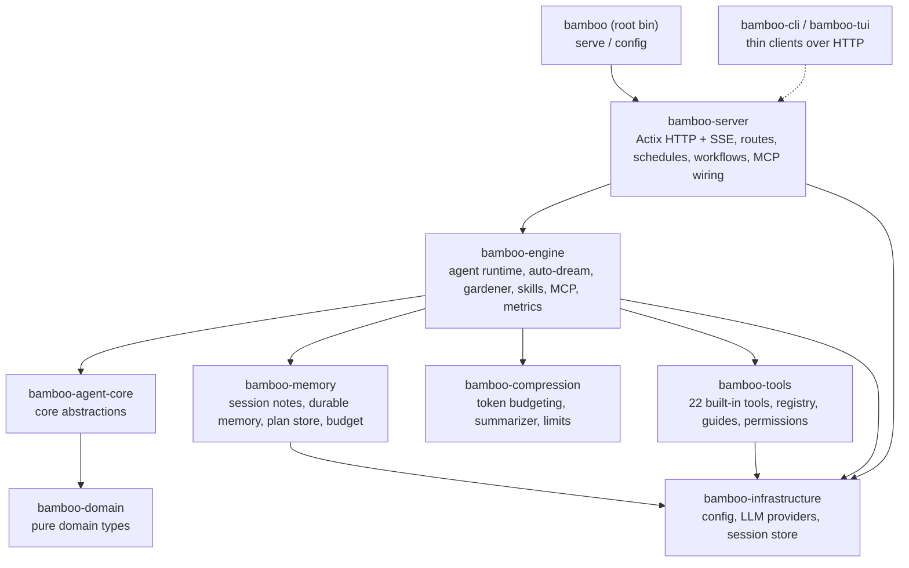

# Bamboo 🎋

<p align="center">
  
</p>

> 📖 For English, see **[README.md](./README.md)**

> **Bamboo — Zenith 的本地优先 Rust 智能体运行时（执行引擎）**

---

## 这是什么

Bamboo 是一个能在你自己电脑上运行的 AI 助理"大脑"。它不只是聊天——它会记笔记、长出可被检索的长期记忆、会用工具（读写文件、运行命令、搜索网页），还能在对话变得很长时自动把内容压缩整理，让助理不会"忘事"也不会"卡住"。它把这些能力都装进一个小巧、可自己托管的程序里，数据默认留在本地。

如果说 Bodhi 是你看到的 AI 产品，那么 **Bamboo 就是它底下运行的引擎。**

---

## 一览能力

| 能力 | 说明 |
|---|---|
| 🧠 **记忆系统** | 会话便签、Dream 笔记本、跨会话的持久记忆，可自动梦境化（auto-dream）与后台整理（gardener） |
| 🗜️ **上下文压缩** | 滚动摘要 + 近窗保留的混合压缩，超大工具输出自动裁剪，按模型上下文窗口预算执行 |
| 🛠️ **内置工具** | 22 个内置工具：文件、搜索、Shell、Web、计划模式、任务、权限请求等 |
| 🎯 **技能系统** | 可选/可发现的技能，按请求提示做轻量选择，含内置 docx / pdf / pptx / xlsx / skill-creator |
| 🔌 **MCP 扩展** | Model Context Protocol 客户端，挂接外部工具服务器 |
| ⏰ **工作流与调度** | 声明式工作流装载 + cron 风格的调度触发引擎 |
| 🌐 **HTTP / SSE** | Actix 服务、REST API、Server-Sent Events 流式，兼容 OpenAI / Anthropic / Gemini 端点 |
| 🏗️ **多 Provider** | anthropic（默认）、openai、gemini、copilot、bodhi 路由 |

---

## 架构

Bamboo 是一个 Cargo **workspace**：根目录是一个很薄的二进制（`bamboo-agent`，提供 `bamboo` 命令），真正的逻辑分布在 `crates/` 下的多个 crate 中。生产服务由 `crates/bamboo-server` 提供——没有重复的服务实现。`bamboo-agent-core` 只依赖 `bamboo-domain`，保持核心抽象的纯净。



**Workspace 成员**（来自 `Cargo.toml`）：
`bamboo-domain`、`bamboo-infrastructure`、`bamboo-engine`、`bamboo-agent-core`、`bamboo-memory`、`bamboo-compression`、`bamboo-tools`、`bamboo-cli`、`bamboo-server`、`bamboo-tui`，以及根二进制 `bamboo-agent`。

**在 Zenith 中的位置：** lotus（React UI）与 bamboo 通过 **HTTP** 通信；bodhi（Tauri 外壳）只是承载界面的容器。bamboo 是执行引擎，bodhi-server（Go）负责账号/持久化/计费与 LLM 代理。

---

## 旗舰能力深读

### 记忆系统 · `crates/bamboo-memory`

记忆分三层：

- **会话便签** — 由 `session_note` 工具写入（动作：`session_read` / `session_append` / `session_replace` / `session_clear` / `session_list_topics`），是当前会话内的临时草稿/事实。
- **Dream 笔记本** — 后台把一段会话"梦境化"，提炼成结构化的候选记忆并整合进笔记本（`auto_dream.rs`）。
- **持久记忆** — 跨会话存活，带 frontmatter（类型、状态、来源、关系、检索元数据），作用域分为 `session` / `project` / `global`（`memory_store/types.rs`）。

**自动梦境**（`MemoryConfig.auto_dream_enabled`，**默认关闭**，因为会消耗模型 token）在会话演进时抽取（extraction）、整合（consolidation）并生成 Dream；支持三种模式：`Incremental`、`Refine`、`Rebuild`。

**Gardener（后台园丁）**（`bamboo-engine/src/gardener.rs`，`gardener_enabled` 默认关闭）专门拆分"多主题的 blob 记忆"。它有成本护栏：单次运行硬性拆分上限、缓慢节奏（默认按天），且**当确定性预筛找不到候选时不调用任何 LLM**——空闲的 gardener 零成本。拆分的"工作清单"由 `MemoryStore::scan_blob_candidates` 免费产出，只有拆分"决策"才用模型。

> 为什么重要：记忆系统让助理在长期使用中越来越懂你的项目，而成本可控、数据本地。

### 上下文压缩 · `crates/bamboo-compression`

长会话不会无限膨胀。Bamboo 用**混合策略**：滚动摘要（rolling summary）+ 近期消息窗口（recent window）。

- `counter` — 通过 tiktoken BPE 或启发式估算计 token（`TiktokenTokenCounter` / `HeuristicTokenCounter`）。
- `segmenter` — 分段时保持工具调用的原子性（不会把一次 tool call 拆散）。
- `limits` — **刻意不内置 per-model 表**。真实上下文/输出上限来自 (1) provider 运行时元数据，(2) 用户在 `model_limits.json` 的覆盖；都没有则回落到全局默认 **200K 上下文 / 64K 输出**。这样模型更新换代也不会让表过时。
- `summarizer` / `preparation` — 构建压缩计划、生成摘要消息、按预算准备上下文（`prepare_hybrid_context`），并能估算 prompt cache 节省。
- **超大输出处理** — 工具产生的超大输出在 `bamboo-tools/output_manager.rs` 处会被裁剪/管理，避免一次性塞爆上下文。

> 为什么重要：助理可以做长时间、多步骤的工作而不会因上下文溢出而崩溃或"失忆"。

### 技能系统 · `crates/bamboo-engine/src/skills`

技能（skills）是可启用的能力包。运行时按会话元数据解析"已选技能"（支持 JSON 数组或逗号分隔的旧格式），并对**未选技能**做轻量、基于请求提示（request hint）的相关性挑选注入上下文（上限 `MAX_UNSELECTED_SKILLS_IN_CONTEXT = 24`），避免把所有技能都塞进提示词。还包含访问控制与运行时元数据。

内置技能在 `builtin_skills/`：`docx`、`pdf`、`pptx`、`xlsx`、`skill-creator`。

### 工具、工作流、调度、MCP

- **工具**（`bamboo-tools`，**22 个内置**，在 `executor.rs::register_builtin_tools` 注册）：`Bash`、`BashOutput`、`KillShell`、`Read`、`Write`、`Edit`、`NotebookEdit`、`Glob`、`Grep`、`GetFileInfo`、`Workspace`、`WebFetch`、`WebSearch`、`JsRepl`、`Task`、`Sleep`、`EnterPlanMode`、`ExitPlanMode`、`RequestPermissions`、`SessionNote`、`ConclusionWithOptions` 等。工具带**使用指南（guides）**注入运行时、**权限/策略感知**执行路径，以及并行执行支持（`parallel.rs`）。
- **工作流** — 声明式装载（`bamboo-server/src/workflow/loader.rs`），通过 `/bamboo/workflows` 暴露。
- **调度** — cron 风格的触发引擎与存储（`bamboo-server/src/schedules/`：`manager`、`trigger_engine`、`session_factory`、`store`）。
- **MCP** — Model Context Protocol 客户端（`bamboo-engine/src/mcp/`：`manager`、`protocol`、`transports`、`tool_index`），通过 `/mcp`、`/servers` 路由管理外部工具服务器。

---

## 快速开始与开发

### 启动服务

```bash
# 从仓库内构建并运行
cargo run --bin bamboo -- serve

# 或安装后运行
cargo install --path .
bamboo serve
```

`bamboo serve` 支持的参数（均覆盖配置文件）：
`--port`、`--bind`、`--data-dir`、`--static-dir`、`--workers`。
另一个子命令 `bamboo config [--path] [--show-secrets]` 用于查看配置。

**默认值**（已对照代码核实）：

- HTTP API: `http://127.0.0.1:9562/api/v1`（端口默认 `9562`，绑定默认 `127.0.0.1`）
- 健康检查: `GET /api/v1/health`
- 数据目录: `BAMBOO_DATA_DIR` 或 `${HOME}/.bamboo`
- 默认 provider: `anthropic`

### 调用 agent loop

服务启动后，跑通**完整 agent loop**（LLM 规划、调用工具、流式输出全过程）最简单的方式就是两次 HTTP 调用：用 `POST /api/v1/chat` 发起一轮，再用 SSE 事件流 `GET /api/v1/stream` 实时观察。

```bash
# 1. 发起一轮 agent 执行。它会针对 LLM 跑起 agent loop 并立即返回。
#    返回：{ "session_id": "...", "stream_url": "...", "status": "streaming" }
curl -s http://127.0.0.1:9562/api/v1/chat \
  -H 'Content-Type: application/json' \
  -d '{
        "message": "列出当前目录的文件，并告诉我这个项目是做什么的。",
        "model": "claude-sonnet-4-6"
      }'

# 2. 实时观察 agent 工作（可断点续传的 SSE 事件流）。
#    每个事件就是 loop 的一步：助手文本、工具调用、工具结果、token 用量、完成。
curl -N http://127.0.0.1:9562/api/v1/stream
```

只有 `message` 和 `model` 是必填项。常用可选项：`session_id`（续接同一会话）、`system_prompt`、`selected_skill_ids`、`workspace_path`、`provider`、`images`。`chat` 调用会立即返回、loop 在后台运行；助手的推理、工具调用与最终答案都从 `stream` 端点（SSE，支持 `?since=<seq>` 或 `Last-Event-ID` 头续传）按发生顺序到达。

### 作为 Rust SDK 直接调用（进程内）

不需要起服务——**同一套 agent loop** 可以直接在进程内通过调用 Rust method 跑起来。构建一次 `Agent`，然后调用 `agent.execute(&mut session, req)`；loop 会通过 `mpsc` channel 把 `AgentEvent` 流式吐回来。公开类型（`Agent`、`AgentBuilder`、`ExecuteRequest`、`AgentEvent`、`Session`）都从 `bamboo_engine` crate 重导出。

```rust
use std::sync::Arc;
use tokio::sync::{mpsc, RwLock};
use tokio_util::sync::CancellationToken;

use bamboo_engine::{Agent, AgentEvent, ExecuteRequest, Session, SkillManager};
use bamboo_engine::metrics::{MetricsCollector, SqliteMetricsStorage};
use bamboo_infrastructure::{Config, JsonlStorage, LockedSessionStore, SessionStoreV2};
use bamboo_infrastructure::provider_factory::create_provider;
use bamboo_tools::BuiltinToolExecutor;

#[tokio::main]
async fn main() -> anyhow::Result<()> {
    let home = dirs::home_dir().unwrap().join(".bamboo");

    // 1. 配置（provider 与 API key 从 ~/.bamboo/config.json 读取）和 LLM provider。
    let config = Config::from_data_dir(Some(home.clone()));
    let provider = create_provider(&config).await?;            // 真正与 LLM 通信的句柄

    // 2. 装配运行时依赖。
    let jsonl = JsonlStorage::new(home.join("storage"));
    jsonl.init().await?;
    let storage = Arc::new(jsonl);
    let session_store = Arc::new(SessionStoreV2::new(home.clone()).await?);
    let metrics = MetricsCollector::spawn(
        Arc::new(SqliteMetricsStorage::new(home.join("metrics.db"))),
        7, // 指标保留天数
    );

    // 3. 构建 agent。
    let agent = Agent::builder()
        .storage(storage.clone())
        .persistence(Arc::new(LockedSessionStore::new(storage.clone())))
        .attachment_reader(session_store.clone())
        .skill_manager(Arc::new(SkillManager::new()))
        .metrics_collector(metrics)
        .config(Arc::new(RwLock::new(config)))
        .provider(provider)
        .default_tools(Arc::new(BuiltinToolExecutor::new()))
        .build()
        .expect("agent fully configured");

    // 4. 跑一轮，并流式消费事件。
    let mut session = Session::new("demo-session", "claude-sonnet-4-6");
    let (tx, mut rx) = mpsc::channel::<AgentEvent>(256);

    let req = ExecuteRequest {
        initial_message: "列出这里的文件，并告诉我这个项目是做什么的。".into(),
        event_tx: tx,
        cancel_token: CancellationToken::new(),
        model: Some("claude-sonnet-4-6".into()),
        // 其余字段都是 `Option` —— `None` 即回落到配置默认值。
        tools: None, provider_override: None, provider_name: None, provider_type: None,
        fast_model: None, fast_model_provider: None, background_model: None,
        background_model_provider: None, summarization_model: None,
        summarization_model_provider: None, reasoning_effort: None,
        auxiliary_model_resolver: None, disabled_tools: None, disabled_skill_ids: None,
        selected_skill_ids: None, selected_skill_mode: None, image_fallback: None,
        gold_config: None, app_data_dir: Some(home),
    };

    // `execute` 驱动整个 loop；它规划、调用工具、给出答案的过程会以事件形式到达 `rx`。
    let handle = tokio::spawn(async move { agent.execute(&mut session, req).await });
    while let Some(event) = rx.recv().await {
        println!("{event:?}"); // 助手文本、工具调用、工具结果、token 用量、完成
    }
    handle.await??;
    Ok(())
}
```

把 bamboo 的 crate 加为依赖（path 或 git —— 这些运行时 crate 是本 workspace 的一部分）：

```toml
[dependencies]
bamboo-engine = { git = "https://github.com/bigduu/Bamboo-agent" }
bamboo-infrastructure = { git = "https://github.com/bigduu/Bamboo-agent" }
bamboo-tools = { git = "https://github.com/bigduu/Bamboo-agent" }
tokio = { version = "1", features = ["full"] }
tokio-util = "0.7"
dirs = "5"
anyhow = "1"
```

> 不想自己管理这些依赖？直接 `bamboo serve` 用上面的 HTTP API —— 它驱动的是完全相同的 loop。完整类型参考见 [`docs/guides/API.md`](./docs/guides/API.md)。

### 示例配置

`${HOME}/.bamboo/config.json`：

```json
{
  "provider": "anthropic",
  "server": {
    "port": 9562,
    "bind": "127.0.0.1"
  },
  "providers": {
    "anthropic": {
      "api_key": "sk-ant-...",
      "model": "claude-sonnet-4-6"
    }
  }
}
```

> 配置优先级：文件 < 环境变量 < CLI 参数。环境变量包括 `BAMBOO_DATA_DIR`、`BAMBOO_PORT`、`BAMBOO_BIND`、`BAMBOO_PROVIDER`、`BAMBOO_WORKERS`、`BAMBOO_CORS_ALLOW_ORIGINS`。

### Docker

```bash
cd docker && docker compose up -d --build
curl http://localhost:9562/api/v1/health
```

`docker-compose.yml` 映射 `9562:9562`，并设置 `BAMBOO_DATA_DIR=/data`、`BAMBOO_PORT=9562`、`BAMBOO_BIND=0.0.0.0`。

### 常用 API 路由

REST 前缀 `/api/v1`：`chat`、`execute/{session_id}`、`stream`、`sessions`、`skills`、`tools`、`tools/execute`、`models`、`commands`、`workflows`、`metrics/*`、`mcp`、`servers`、`stop/{session_id}`、`health`。
另有 provider 兼容端点：`/openai/v1`、`/anthropic/v1`、`/gemini/v1beta`、`/v1/{chat/completions,responses,messages}`。

### 测试与质量

```bash
cargo test            # workspace tests
cargo clippy          # lints (.clippy.toml present)
cargo build --release
```

---

## 其余技术栈

Zenith 是一个 monorepo，bamboo 是其中的执行引擎子模块。

| 模块 | 角色 |
|---|---|
| [**bodhi**](../bodhi) | 桌面 AI 产品界面（Tauri 外壳） |
| [**lotus**](../lotus) | React + Vite 前端 UI 层（通过 HTTP 调用 bamboo） |
| **bamboo** | 本地优先 Rust 智能体运行时（本仓库） |
| [**bodhi-server**](../bodhi-server) | Go 后端：认证 / 持久化 / 计费配额 / LLM 代理 |
| [**pavilion**](../pavilion) | 官网与文档 |
| [**Zenith (root)**](../) | monorepo 入口 + 子模块指针 + 发布列车 |

**模块内文档：**
- API 参考: [`docs/guides/API.md`](./docs/guides/API.md)
- 迁移指南: [`docs/guides/MIGRATION_GUIDE.md`](./docs/guides/MIGRATION_GUIDE.md)
- [CONTRIBUTING](./CONTRIBUTING.md) · [CHANGELOG](./CHANGELOG.md) · [SECURITY](./SECURITY.md)

---

## License

MIT
