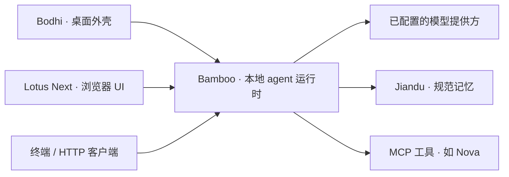

# Bamboo 🎋


*品牌插画，非软件截图。竹子象征韧性。*

### 在终端或自己的应用里，让 AI agent 处理你的项目。

Bamboo 是 [Zenith](https://github.com/bigduu/Zenith) 的本地 agent harness 核心。为它指定工作区并配置模型，就可以读取文件、调用工具、保存会话，并把同一套运行时接入浏览器、桌面外壳或 Rust 应用。

[English](./README.md) · [crates.io](https://crates.io/crates/bamboo-agent) · [API](./docs/guides/API.md) · [MIT](./LICENSE)

## 它能帮你做什么

| 你的任务 | Bamboo 提供的能力 |
|---|---|
| 理解或处理一个代码仓库 | 针对工作区运行提示词、查看工具活动，之后继续同一会话。文件和 shell 操作遵循运行时权限策略。 |
| 为自己的应用接入助手 | 使用 HTTP 和实时 WebSocket/SSE 事件，或嵌入 Rust SDK，复用现有 agent loop。 |
| 保留有用的项目上下文 | 会话便签和 Jiandu 持久记忆可在轮次、会话之间保留选定事实。压缩管理上下文预算，但不保证永不遗忘。 |
| 接入已有工具 | 按需添加 MCP 服务、技能、service plugin 和定时提示词。 |

运行时和会话存储在本地。**配置的模型提供方、MCP 服务、网页工具和插件可能把数据发往机器之外。** 本地部署不等于离线模型，也不等于无需支付外部 API 费用。

## 源码与发布包的区别

本文描述 **开发源码检出**：最初产品审查基线为 `025641317c5703226052a4b94a52d1844615c352`，本次文档更新基于 `dev` 提交 `10ca51ccdf1f253ff6ec1e78f21b4c74835e1582`，不表示每个命令和能力都已进入最新 crates.io 发布版。比较版本时请查看已安装程序的 `bamboo --help` 和[版本/源码审查](./docs/readme-audit.md)。源码 manifest 有意使用 `0.0.0` 占位，发布流程另行写入发布版本。下方录屏保留其独立的较早源码来源说明。


## 看界面准备项目上下文


[静态图片](docs/demos/project-workspace.png) · [录制说明](docs/demos/README.md)

真实源码检出的浏览器录屏，使用独立临时工作区和真实 Bamboo 后端。
仅展示项目创建与选择，没有调用模型，也不代表 agent 已完成任务或已发布桌面版验证。

## 开始使用

### 安装

安装已发布包：

```bash
cargo install bamboo-agent --locked
bamboo --help
```

若要构建本文描述的源码，需要 **Rust 1.95+**，在本仓库运行：

```bash
node scripts/frontend-package.cjs stage
cargo install --path . --locked
```

staging 命令验证仓库已提交的前端资源。常规构建需要固定的 **Lotus Next** 资源包，资源缺失或无效会导致构建失败，不会悄悄下载浮动的 `latest`。精确版本见 [frontend-package-lock.json](./scripts/frontend-package-lock.json)。

有意只构建 API 服务时：

```bash
BAMBOO_FRONTEND_BUILD_MODE=api-only cargo build --bin bamboo
```

上面的环境变量赋值使用 POSIX shell 语法；Windows PowerShell 中先运行 `$env:BAMBOO_FRONTEND_BUILD_MODE = "api-only"`。API-only 构建不含内嵌浏览器界面。外部或本地前端路径见[部署指南](./docs/guides/DEPLOY.md)和[前端 staging 脚本](./scripts/frontend-package.cjs)。

### 配置并打开本地界面

```bash
bamboo init
bamboo serve
```

`init` 交互式配置 provider，并在 Bamboo 数据目录（通常为 `~/.bamboo/`）下加密保存密钥。`config.json` 保存配置元数据，不保存加密后的 provider 密钥。选择你的 provider/账号实际支持的模型。包含前端的构建可打开 **http://127.0.0.1:9562**。在另一个终端运行：

```bash
bamboo health
bamboo doctor
```

健康检查端点是 `GET /api/v1/health`，`bamboo health` 需要可达的服务。`doctor` 检查配置与 provider 凭据，相关错误会使其失败；服务可达性探测仅提供信息，服务未启动本身不会让 `doctor` 失败。`serve --port`、`--bind`、`--data-dir`、`--static-dir` 和 `--workers` 可覆盖配置，完整参数见 `bamboo serve --help`。

### 从终端处理任务

```bash
bamboo -p "总结这个工作区的 README。" --workspace /path/to/project
bamboo sessions
bamboo history <session-id>
bamboo -p "接下来应该读哪些文件？" -s <session-id>
```

Headless 运行使用完整 agent 运行时和已配置的 provider。交互式 `bamboo -p` 因工具权限请求或提问暂停时，请在同一个终端回答提示。浏览器回应和 `bamboo respond <session-id> --pending` / `bamboo respond <session-id> "<answer>"` 面向独立运行的 `bamboo serve` 所拥有的任务，不能解除进程内 headless 任务的等待。不要仅为了跑通示例而关闭权限检查。

还没有密钥？`bamboo -p "ping" --echo` **仅用于传输链路冒烟**：它使用 echo executor 而非 LLM，不证明模型推理或工具任务成功。

### 接入自己的应用

配置 provider 并启动服务后，legacy HTTP/SSE 调用顺序为 **chat → execute → events**。`chat` 保存消息，`execute` 才启动 agent loop。示例需要 `curl` 和 `jq`，请把模型名替换为账号支持的模型。

```bash
SID=$(curl -fsS http://127.0.0.1:9562/api/v1/chat \
  -H 'Content-Type: application/json' \
  -d '{"message":"你好。","model":"YOUR_MODEL_ID"}' | jq -r .session_id)
curl -fsS -X POST "http://127.0.0.1:9562/api/v1/execute/$SID" \
  -H 'Content-Type: application/json' -d '{}'
curl -N "http://127.0.0.1:9562/api/v1/events/$SID"
```

浏览器使用共享的 `/v2/stream` WebSocket，legacy SSE 路由仍可用。

### 作为进程内 Rust SDK 使用

嵌入 SDK 时，`bamboo_sdk::agent::Agent` 通过 `run`、`run_stream`、`execute` 使用同一引擎；默认装配需要已配置的 provider，不会提供凭据。参见 [CLI / HTTP / SDK 入门示例](./docs/guides/GETTING_STARTED.md)、[API 参考](./docs/guides/API.md)及[发布包 rustdoc](https://docs.rs/bamboo-agent)。

## 数据与运行边界

- Bamboo 配置和会话默认在 `~/.bamboo`，可用 `BAMBOO_DATA_DIR` 或 `--data-dir` 覆盖。Jiandu 独立持有 `~/.jiandu` 下的规范记忆。隔离运行时，`BAMBOO_JIANDU_DATA_DIR` 必须是非空绝对路径；仅设置 `--data-dir` 不会迁移记忆目录。
- Bamboo 负责提示词上下文选择和预算；Jiandu 负责记忆持久化、词法检索和 Dream 派生快照。Dream 是方向性参考，不是规范事实源。不需要第二套 Bamboo 记忆索引或 embedding 流水线。
- 服务应保持回环绑定。新实例默认无鉴权；当前服务将私有局域网来源视为可信本地，即使设置密码也会跳过密码校验。远程访问应保留回环绑定/端口发布，在可信网络中通过有鉴权的反向代理接入。
- [Docker Compose 配置](./docker/docker-compose.yml) 发布 `127.0.0.1:9562:9562`，使用非 root 用户和命名数据卷，并丢弃 capability。运行 `cd docker && docker compose up -d --build` 可构建此配置，仍需配置 provider。
- 终端、服务端和浏览器界面本身不提供原生桌面控制。[Nova](https://github.com/bigduu/Nova) 是独立的 MCP 能力，有自己的平台和权限要求。本次文档审查不代表已验证 macOS/Windows 运行表现。

## Bamboo 在套件中的位置


```mermaid
flowchart LR
  Bodhi["Bodhi · 桌面外壳"] --> Bamboo["Bamboo · 本地 agent 运行时"]
  Lotus["Lotus Next · 浏览器 UI"] --> Bamboo
  CLI["终端 / HTTP 客户端"] --> Bamboo
  Bamboo --> Provider["已配置的模型提供方"]
  Bamboo --> Jiandu["Jiandu · 规范记忆"]
  Bamboo --> MCP["MCP 工具 · 如 Nova"]
```

Bodhi 启动并健康检查自己管理的 Bamboo sidecar；只有显式选择旧版回滚路径时才复用外部服务。在此源码版本中，Bamboo 默认内嵌前端是 **Lotus Next**，不是旧 Lotus。可选的 [bodhi-server](https://github.com/bigduu/bodhi-server) 账号/provider 服务并非本地链路的必需组件。[Magpie](https://github.com/bigduu/Magpie) 连接消息渠道；[Pavilion](https://github.com/bigduu/Pavilion) 提供网站/文档。完整模块导航见 [Zenith](https://github.com/bigduu/Zenith)。

Cargo workspace 分为四层：`crates/core`（类型/接口）、`crates/infra`（存储、provider、记忆、MCP、权限等服务）、`crates/engine`（agent loop/工具）、`crates/app`（服务端、SDK、TUI、broker 和客户端）。根 `bamboo` 二进制组合这些模块；源码中的 actor/broker 命令是高级入口，不构成无限并发或发布成熟度承诺。

## 开发与深入阅读

```bash
cargo fmt --check
cargo test
cargo clippy
```

裸 Cargo 命令使用 manifest 的 `default-members`，`cargo test` 不等于测试所有 workspace 成员。仅用于开发的 analytics crate 默认被排除；使用 `--workspace` 前请查看 [Cargo.toml](./Cargo.toml)。

- [架构](./docs/design/architecture-overview.md) · [配置](./docs/config-reference.md)
- [插件](./docs/guides/PLUGINS.md) · [迁移](./docs/guides/MIGRATION_GUIDE.md) · [文档目录](./docs/README.md)
- [贡献](./CONTRIBUTING.md) · [变更日志](./CHANGELOG.md) · [安全](./SECURITY.md)

## 许可证

项目自有代码采用 [MIT 许可证](./LICENSE)。第三方材料保留各自的许可证和版权声明：

- `builtin_skills/skill-creator` 保留其 [Apache-2.0 许可证](./builtin_skills/skill-creator/LICENSE.txt)。
