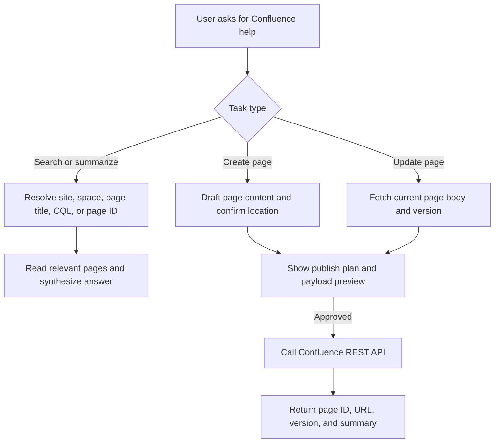

# Confluence Server/Data Center Copilot

Use this skill when the work touches a Confluence Server or Data Center instance and
the task needs more than generic writing. The goal is to help the user safely search,
read, summarize, create, and update Confluence content through the REST API without
guessing at targets or damaging existing pages.

## Workflow overview



## What this skill should handle

Use this skill for tasks such as:
- Searching pages by title, space, label, or CQL and summarizing the results
- Batch searching with keyword-context extraction for summarizing across many pages without blowing up context
- Fetching specific pages by ID and extracting decisions, action items, risks, or open questions
- Publishing meeting notes, release notes, runbooks, SOPs, incident notes, or knowledge-base articles
- Updating existing pages in place while preserving important structure
- Deleting (trashing) pages with dry-run preview
- Helping the user locate the correct parent page, page ID, or page tree position before publishing
- Browsing the page tree recursively with depth control to understand space structure
- Applying or removing labels, and planning attachment uploads after page creation or update
- Listing all spaces when the user doesn't know the space key
- Viewing page version history and comparing historical versions
- Translating rough notes or Markdown-like content into Confluence storage format that is simple and durable
- Running in privacy-aware modes such as metadata-only search, scoped read, or command-only execution
- Handling large result sets with top-N selection, batched reading, and structured summaries or tables

## Default operating rules

1. Default to read-only unless the user clearly asks to create or update a page.
2. Resolve the exact target before writing: base URL, authentication method, space key, page title, and either a parent page or a page ID.
3. If the user raises privacy concerns, switch explicitly into `strict_metadata`, `strict_scoped_read`, or `command_only`. If they do not choose, default to `strict_metadata`.
4. In `strict_metadata`, do not fetch `body.storage`, attachment bytes, or page excerpts. Use only metadata such as page ID, title, space, URL, labels, ancestors, and version.
5. In `strict_scoped_read`, fetch page content only after explicit approval and only inside a bounded scope such as a page ID or a specific `space` plus `parent page ID`.
6. In `command_only`, generate commands and payloads but do not execute Confluence calls or inspect returned content.
7. Prefer a dry run when the destination is ambiguous or the requested change is broad. Confluence writes are persistent and often affect shared team documentation.
8. In normal mode, updates require the latest `version.number` and current `body.storage`. In stricter modes, fetch only what the chosen mode allows.
9. Preserve important structure already on the page, especially macros, tables, callouts, labels, anchors, and hand-maintained sections, unless the user explicitly wants a full rewrite.
10. If several candidate pages match, present the most likely matches with page IDs, titles, and spaces, then ask the user to choose instead of guessing.
11. If the user has not provided credentials or the target instance details, ask only for the minimum missing information.
12. Build non-trivial JSON payloads with a serializer such as `python3 - <<'PY'` or `jq -n` instead of hand-escaping long storage markup.
13. Treat labels and attachments as follow-up operations to page create or update unless the local instance documents a different workflow.
14. For large search result sets, use `search_summarize.py` which fetches results with `body.storage` expanded in a **single search request**, strips HTML, and extracts keyword-context snippets. Never search first and then fetch pages one by one with `get_page.py` — that is a wasteful N+1 pattern.
15. Never print secrets back to the user. Refer to them by variable name or redact them.

## Privacy and strict modes

Switch modes when the user says things like "strict mode", "privacy mode", "metadata only", "don't send page content to AI", "only this space or parent is allowed", or "just give me commands".

- `normal`: Full search, read, summarize, create, and update workflow.
- `strict_metadata`: Search and plan with metadata only. Good for page discovery, page tree work, labels, attachment planning, and creates driven by user-provided content.
- `strict_scoped_read`: Stay metadata-only until the user explicitly allows content reads and gives a bounded scope such as a page ID or a specific `space` plus `parent page ID`. Read only the smallest set of pages needed inside that scope.
- `command_only`: Do not execute Confluence calls or inspect responses. Generate `curl`, `jq`, `python3`, or shell steps only.

If a privacy-sensitive request does not specify a mode, start in `strict_metadata` and ask whether `strict_scoped_read` is allowed.

## Inputs to collect only when needed

Gather only what is necessary for the current task:
- Confluence base URL, for example `https://confluence.example.internal`
- Authentication method: username and password, personal access token, or another user-provided header format
- Space key such as `ENG`, `OPS`, or `PLAT`
- Parent page ID for new content, or existing page ID for updates
- The desired page title
- Optional labels, audience, template type, or section-level update instructions
- Optional attachment file paths, desired filenames, or upload comments
- Optional privacy mode: `normal`, `strict_metadata`, `strict_scoped_read`, or `command_only`
- Optional read scope for strict modes: allowed page ID, allowed space, allowed parent page ID, and whether content reads are approved
- Optional result-set controls such as maximum pages to read, preferred batch size, or whether the user wants a table or structured summary

If the user already gave enough detail, do not interrogate them again. Move straight into search, drafting, or publishing.

## Suggested environment variables

Prefer environment variables when possible so the user does not have to paste credentials into chat.

- `CONFLUENCE_BASE_URL`
- `CONFLUENCE_USERNAME`
- `CONFLUENCE_PASSWORD`
- `CONFLUENCE_PAT`
- `CONFLUENCE_SPACE_KEY`

Use whichever authentication method the instance supports. If both username/password and PAT are absent, ask the user how their Server or Data Center instance authenticates REST calls.

## Helper scripts

The `scripts/` directory contains ready-to-use Python CLI tools for common Confluence operations. All scripts use **only Python stdlib** (no pip install needed) and produce structured JSON output for easy parsing.

The shared client module `scripts/confluence_client.py` handles authentication (PAT or basic auth), base URL resolution, SSL verification, and JSON response formatting. All other scripts import it automatically.

Set `CONFLUENCE_VERIFY_SSL=0` if the instance uses self-signed certificates.

### Available scripts

| Script | Purpose | Example |
| --- | --- | --- |
| `search_pages.py` | Search by title, space, or CQL | `python3 scripts/search_pages.py --title "Runbook" --space ENG` |
| `search_summarize.py` | Batch search with keyword-context snippets for summarization | `python3 scripts/search_summarize.py --cql 'space=OPS and label=postmortem' --keywords "root cause" --top 10` |
| `get_page.py` | Fetch page by ID with configurable expand | `python3 scripts/get_page.py --page-id 123456` |
| `create_page.py` | Create page with safe JSON payload | `python3 scripts/create_page.py --space ENG --title "New Page" --parent-id 987654 --body-file /tmp/body.html` |
| `update_page.py` | Update page with auto version handling and 409 retry | `python3 scripts/update_page.py --page-id 123456 --body-file /tmp/updated.html` |
| `delete_page.py` | Delete (trash) a page with dry-run support | `python3 scripts/delete_page.py --page-id 123456 --dry-run` |
| `list_children.py` | List child pages (single level) with pagination | `python3 scripts/list_children.py --page-id 123456` |
| `page_tree.py` | Recursive page tree with configurable depth | `python3 scripts/page_tree.py --page-id 123456 --depth 3 --flat` |
| `page_history.py` | View version history, fetch historical versions | `python3 scripts/page_history.py --page-id 123456 --version 5 --expand-body` |
| `list_spaces.py` | List all spaces with optional type/keyword filter | `python3 scripts/list_spaces.py --type global --query "platform"` |
| `manage_labels.py` | Get, add, or remove labels | `python3 scripts/manage_labels.py --page-id 123456 --action remove --labels outdated,draft` |
| `upload_attachment.py` | Upload file attachment | `python3 scripts/upload_attachment.py --page-id 123456 --file report.pdf` |
| `markdown_to_storage.py` | Convert Markdown to Confluence storage format | `python3 scripts/markdown_to_storage.py --input notes.md` |
| `section_editor.py` | Section-level page content editing | `python3 scripts/section_editor.py --page-id 123456 --heading "Rollback" --new-content "<p>Updated</p>"` |

### When to use scripts vs inline curl

**Prefer scripts** for:
- Creating or updating pages with complex body content (avoids JSON escaping issues)
- Section-level edits that require parsing the existing page body
- Converting Markdown to storage format
- Operations that benefit from auto version increment and 409 retry

**Prefer inline curl** for:
- Quick one-off metadata queries in `command_only` or `strict_metadata` mode
- Simple CQL searches with short output
- When the user explicitly requests curl commands

### Combining scripts

A typical create-from-markdown workflow:

```bash
# 1. Convert Markdown to Confluence storage
python3 scripts/markdown_to_storage.py --input notes.md --output /tmp/body.html

# 2. Create the page
python3 scripts/create_page.py --space ENG --title "Release Notes v2.3" \
  --parent-id 987654 --body-file /tmp/body.html

# 3. Add labels (use the page ID from step 2 output)
python3 scripts/manage_labels.py --page-id NEW_PAGE_ID --action add --labels release-notes
```

A section-level update workflow:

```bash
# 1. List sections to find the right heading
python3 scripts/section_editor.py --page-id 123456 --list-sections

# 2. Dry-run the section replacement
python3 scripts/section_editor.py --page-id 123456 --heading "Rollback" \
  --new-content "<p>Updated rollback steps</p>" --dry-run

# 3. Push the update
python3 scripts/section_editor.py --page-id 123456 --heading "Rollback" \
  --new-content "<p>Updated rollback steps</p>"
```

A page discovery and cleanup workflow:

```bash
# 1. Don't know the space key? List all spaces first
python3 scripts/list_spaces.py --type global --query "ops"

# 2. Browse the page tree to find where things live
python3 scripts/page_tree.py --page-id 123456 --depth 3 --flat

# 3. Check version history to see who changed what
python3 scripts/page_history.py --page-id 123456 --limit 10

# 4. Remove outdated labels
python3 scripts/manage_labels.py --page-id 123456 --action remove --labels outdated,draft

# 5. Dry-run a page deletion before committing
python3 scripts/delete_page.py --page-id 789012 --dry-run
```

A batch summarization workflow (avoids context blowup):

```bash
# Search across many pages with keyword-context extraction
python3 scripts/search_summarize.py \
  --cql 'space=OPS and label=postmortem and lastmodified > "2025-03-01"' \
  --keywords "root cause" "remediation" "timeline" \
  --top 10 --context-chars 200

# The output is compact JSON with per-page keyword snippets
# Feed directly to AI for summarization — no need to fetch each page body
```

## REST API playbook

The exact behavior can vary slightly by Confluence version, so verify against the local instance if a first attempt returns 404 or 400. Common Server and Data Center patterns are:

| Goal | Method | Path |
| --- | --- | --- |
| Find a page by title and space | GET | `/rest/api/content?type=page&title=...&spaceKey=...` |
| Search with CQL | GET | `/rest/api/content/search?cql=...` |
| Fetch page metadata only | GET | `/rest/api/content/{id}?expand=version,space,ancestors` |
| Fetch a page with body and version | GET | `/rest/api/content/{id}?expand=body.storage,version,space,ancestors` |
| Fetch a historical version | GET | `/rest/api/content/{id}?status=historical&version={n}&expand=body.storage,version` |
| Create a page | POST | `/rest/api/content` |
| Update a page | PUT | `/rest/api/content/{id}` |
| Delete (trash) a page | DELETE | `/rest/api/content/{id}` |
| List child pages | GET | `/rest/api/content/{id}/child/page` |
| List version history | GET | `/rest/api/content/{id}/version` |
| Inspect labels | GET | `/rest/api/content/{id}/label` |
| Add labels to a page | POST | `/rest/api/content/{id}/label` |
| Remove a label from a page | DELETE | `/rest/api/content/{id}/label/{label}` |
| Upload an attachment to a page | POST | `/rest/api/content/{id}/child/attachment` |
| List all spaces | GET | `/rest/api/space` |

When using shell commands, prefer `curl` with JSON payloads. If the request is authenticated, use either basic auth or a bearer token depending on the instance. In `strict_metadata`, prefer metadata-only fetches and label/tree endpoints instead of `body.storage` expansions.

### Authentication pattern

Use one of these shapes and avoid echoing secrets:

```bash
BASE_URL="${CONFLUENCE_BASE_URL%/}"

# Basic auth pattern
curl -sS -u "$CONFLUENCE_USERNAME:$CONFLUENCE_PASSWORD" \
  "$BASE_URL/rest/api/content/123456?expand=body.storage,version"

# Bearer token pattern
curl -sS -H "Authorization: Bearer $CONFLUENCE_PAT" \
  "$BASE_URL/rest/api/content/123456?expand=body.storage,version"
```

## Safe shell and payload patterns

Confluence storage bodies often contain quotes, code blocks, tables, and line breaks. Do not hand-escape long XHTML into a one-liner if you can avoid it. Prefer generating payload JSON with Python or jq and then posting the file.

```bash
python3 - <<'PY' > /tmp/confluence-create.json
import json

payload = {
    "type": "page",
    "title": "Weekly Platform Sync - 2026-03-21",
    "space": {"key": "PLAT"},
    "ancestors": [{"id": 987654}],
    "body": {
        "storage": {
            "value": "<h1>Summary</h1><p>...</p>",
            "representation": "storage"
        }
    }
}

print(json.dumps(payload))
PY

curl -sS \
  -H "Content-Type: application/json" \
  -H "Authorization: Bearer $CONFLUENCE_PAT" \
  -d @/tmp/confluence-create.json \
  "$BASE_URL/rest/api/content"
```

Use the same pattern for updates. This reduces malformed JSON and invalid storage markup errors.

## Windows and PowerShell notes

If the user is on Windows, read `references/windows-powershell.md` for PowerShell-specific environment setup, `curl.exe` usage, UTF-8 payload handling, and complete examples. Key rules: use `curl.exe` not bare `curl`, prefer generating a JSON payload file with Python, and use `$env:` syntax for variables.

## Translating natural language to search parameters

Users describe what they want in natural language. Your job is to translate that into concrete CQL, title, space, keywords, and time filters before calling any script. Confluence search is **not** a natural-language search engine — it needs structured parameters.

### Two-layer filtering model

Confluence searching works in two layers:

1. **CQL (server-side)**: coarse filter — narrows by space, label, date range, text contains. This is what the Confluence REST API processes. CQL `text~"keyword"` does full-text search but is fuzzy and may return noise.
2. **`--keywords` in search_summarize.py (client-side)**: precise extraction — after results come back, strips HTML and finds exact keyword matches with context windows. This is what makes the output compact and relevant for AI summarization.

Both layers serve different purposes. Use CQL to **reduce the result set** to a manageable size, and `--keywords` to **extract the specific information** the user cares about.

### Translation examples

| User says (natural language) | CQL (server-side filter) | keywords (client-side extract) |
| --- | --- | --- |
| "过去一年 OPS 事故大家怎么处理的" | `space=OPS and label=postmortem and lastmodified > "2025-03-24"` | `"root cause" "remediation" "timeline"` |
| "ENG 空间里关于 rollback 的 runbook" | `space=ENG and label=runbook and text~"rollback"` | `"rollback" "rollback procedure"` |
| "platform team 最近的 release notes 有哪些 breaking changes" | `space=PLAT and label=release-notes order by lastmodified desc` | `"breaking" "incompatible" "migration"` |
| "who changed the VPN onboarding page recently" | Not a search task — use `page_history.py` | N/A |
| "find all pages Alice created last month in ENG" | `space=ENG and creator=alice and created > "2025-02-24"` | (none, metadata query) |

### How to decompose a natural language request

1. **Identify the space**: look for team names, project names, or explicit space keys. If unknown, use `list_spaces.py` first.
2. **Identify labels/page types**: "postmortem", "runbook", "release notes", "SOP" → these are usually Confluence labels.
3. **Identify time range**: "past year", "last month", "since January" → translate to `lastmodified > "YYYY-MM-DD"` or `created > "YYYY-MM-DD"`.
4. **Identify content keywords**: what specific information does the user want extracted? These become `--keywords` for client-side snippet extraction.
5. **Identify the intent**: summarize across many pages → `search_summarize.py`; read one specific page → `get_page.py`; find where a page lives → `search_pages.py` with metadata.

If you are unsure about the space key or labels, ask the user. Do not guess — a wrong space key returns zero results silently.

### CQL quick reference

CQL (Confluence Query Language) is the main structured search syntax. Use it with `--cql` in `search_pages.py` and `search_summarize.py`.

**Operators and fields:**

| Field | Operator | Example | What it does |
| --- | --- | --- | --- |
| `space` | `=` | `space=ENG` | Exact space key match |
| `title` | `=` | `title="VPN Onboarding"` | Exact title match |
| `title` | `~` | `title~"onboarding"` | Title contains (fuzzy) |
| `text` | `~` | `text~"rollback procedure"` | Full-text body search (may be noisy) |
| `label` | `=` | `label=postmortem` | Has this label |
| `label` | `in` | `label in (runbook, sop)` | Has any of these labels |
| `type` | `=` | `type=page` | Content type (page, blogpost, comment) |
| `creator` | `=` | `creator=alice` | Created by this username |
| `lastmodified` | `>`, `<`, `>=` | `lastmodified > "2025-01-01"` | Modified after date (YYYY-MM-DD) |
| `created` | `>`, `<`, `>=` | `created >= "2025-06-01"` | Created after date |
| `ancestor` | `=` | `ancestor=123456` | Descendant of this page ID |

**Combining with `and` / `or`:**

```
space=OPS and label=postmortem and lastmodified > "2025-03-01"
space=ENG and (label=runbook or label=sop)
space=PLAT and text~"breaking change" and type=page
```

**Ordering:**

```
space=ENG and type=page order by lastmodified desc
space=OPS and label=incident order by created desc
```

**Common pitfalls:**
- `text~` does fuzzy full-text search — it may match pages where the keyword appears in comments, macros, or metadata. Use `--keywords` for precise client-side filtering on top.
- `title=` is **exact match** (case-insensitive). Use `title~` for contains.
- Date format must be `"YYYY-MM-DD"` with double quotes inside the CQL string.
- `ancestor=ID` is useful to restrict search to a subtree under a known parent page.
- `label` values are lowercase by convention. `label=Release-Notes` may fail; use `label=release-notes`.

## Search and read workflow

When the user wants to find or summarize information:

1. **Translate the natural language request** into structured parameters (space, CQL, keywords, time range) using the rules above.
2. Resolve the search scope.
   - Specific page ID if known → use `get_page.py` (1 API request)
   - Title and space if mostly known → use `search_pages.py` (1 request, already expands body)
   - CQL for broader search → use `search_pages.py --cql` or `search_summarize.py` (1 request)
3. Choose the narrowest reliable search method in this order when possible: `page ID` -> `title + space` -> `CQL` -> parent discovery.
4. Prefer search-first behavior when the title is ambiguous.
5. In `strict_metadata`, keep the whole workflow metadata-only. Return page IDs, titles, spaces, URLs, labels, ancestor context, version, and other safe metadata without fetching `body.storage`.
6. In `strict_scoped_read`, stay metadata-only until the user explicitly allows content reads and the target falls inside the approved `page ID` or `space + parent page ID` scope.
7. **For single-page reads**: use `get_page.py --page-id ID` (1 request with body expansion).
8. **For multi-page summarization**: use `search_summarize.py` which fetches body in the **same search request** and extracts keyword-context snippets client-side. **Do not** search first then call `get_page.py` per result — that is a N+1 anti-pattern.
9. Summarize what matters to the task rather than dumping raw storage XHTML.
10. Return page identifiers so the user can verify the target.

### Large result set strategy — use search_summarize.py

When the search scope spans multiple pages (5+), always prefer `search_summarize.py` over fetching pages individually:

1. Use `search_summarize.py --cql '...' --keywords "..." --top 10 --context-chars 200` — this performs a **single search request** with `expand=body.storage`, strips HTML client-side, and returns compact keyword-context snippets.
2. For comparison tasks, use the snippet output for per-page mini-summaries, then aggregate into a table.
3. Tell the user what subset was read, especially if you used `--top` to limit results.
4. **Anti-pattern**: Do NOT search with metadata-only first, pick N page IDs, then call `get_page.py` on each one. That is N+1 requests and wastes API quota. The search API already supports expanding `body.storage` in the same call.

### Batch search and summarization with search_summarize.py

When the user wants to summarize findings across many pages (e.g. "how have incidents been handled over the past year"), use `scripts/search_summarize.py` instead of fetching pages one by one. This script performs a single search request with `body.storage` expanded, strips HTML from each result, and extracts keyword-context snippets (default 200 chars before/after each keyword match). This keeps the AI context compact and avoids recursive per-page fetches.

```bash
# Search with keyword context extraction — top 10 results, 200-char windows
python3 scripts/search_summarize.py \
  --cql 'space=OPS and label=postmortem and lastmodified > "2025-03-01"' \
  --keywords "root cause" "remediation" "timeline" \
  --top 10 --context-chars 200

# Multiple keywords, narrower result set
python3 scripts/search_summarize.py \
  --title "incident" --space OPS \
  --keywords "root cause" "remediation" --top 5

# No keywords: returns first 500-char excerpt per page
python3 scripts/search_summarize.py \
  --cql 'space=ENG and lastmodified > "2025-01-01"' --top 10
```

The output is a single JSON blob with per-page metadata, text length, and keyword snippets (or excerpts when no keywords are given). Feed this directly to the AI for summarization rather than dumping full page bodies into context.

### Search examples

```bash
# Search by exact title in a space
curl -sS "$BASE_URL/rest/api/content?type=page&spaceKey=ENG&title=VPN%20Onboarding"

# Search with CQL
curl -sS "$BASE_URL/rest/api/content/search?cql=space=ENG%20and%20title~%22onboarding%22"

# Fetch a specific page
curl -sS "$BASE_URL/rest/api/content/123456?expand=body.storage,version,space,ancestors"
```

## Parent discovery workflow

When the user wants to publish but only knows the space or rough area of the page tree:

1. Search for likely parent pages by title keywords, labels, or CQL.
2. If one candidate looks promising, inspect its child pages to confirm the local structure.
3. Present the best 3-5 candidates with page ID, title, space, and ancestor context when available.
4. If one candidate is clearly dominant and the user has implicitly authorized publishing there, you can proceed. If there is real ambiguity, ask the user to choose.
5. For recurring structures like postmortems, runbooks, or release notes, prefer the established cluster instead of inventing a new branch.
6. In `strict_metadata`, parent discovery is a strong default because it relies mostly on page tree structure and metadata.
7. In `strict_scoped_read`, treat `space + parent page ID` as a preferred bounded read scope for any later content reads.

### Parent discovery examples

```bash
# Find likely container pages
curl -sS "$BASE_URL/rest/api/content/search?cql=space=PLAT%20and%20title~%22postmortem%22"

# Inspect the children under a candidate parent
curl -sS "$BASE_URL/rest/api/content/123456/child/page"
```

## Create page workflow

When the user wants a new page:

1. Confirm the destination space and parent page. If the parent is unclear, search for likely parent pages first.
2. Draft the page content in a clean structure that matches the user's purpose.
3. If the request is even slightly ambiguous, show a compact publish plan before writing.
4. Use simple Confluence storage markup. Favor durable XHTML-like structures over overly clever formatting.
5. In `strict_metadata` or `command_only`, only create from user-provided or clearly non-sensitive content. Do not read other page bodies just to draft a new page.
6. In `strict_scoped_read`, only reuse existing page content if the user explicitly approved reads within the allowed scope.
7. Apply labels or attachment steps only after the page itself exists and the page ID is known.
8. After creation, return the new page ID, title, location, and any URL supplied by the API response.

### Create payload shape

```json
{
  "type": "page",
  "title": "Weekly Platform Sync - 2026-03-21",
  "space": { "key": "PLAT" },
  "ancestors": [{ "id": 123456 }],
  "body": {
    "storage": {
      "value": "<h1>Summary</h1><p>...</p><h2>Decisions</h2><ul><li>...</li></ul>",
      "representation": "storage"
    }
  }
}
```

## Update page workflow

When the user wants to update an existing page:

1. In normal mode, fetch the current page first, including `body.storage` and `version`.
2. In `strict_metadata`, do not fetch page body. Limit yourself to planning, metadata inspection, labels, attachments, or command generation unless the user switches modes.
3. In `strict_scoped_read`, fetch page body only if the page is inside the approved scope and the user explicitly allowed content reads.
4. Decide whether the task is a section-level edit or a full-page rewrite.
5. If the change is section-level, identify the target heading or block boundary before editing. If the target cannot be located reliably, show the intended insertion or replacement strategy and ask.
6. Preserve macros, tables, anchors, and unrelated sections unless the user explicitly requests a broader rewrite.
7. Increment `version.number` exactly once from the latest fetched version.
8. If the update fails with a version conflict, refetch the page and retry with the new version, but only if the chosen privacy mode allows that read.

### Update payload shape

```json
{
  "id": "123456",
  "type": "page",
  "title": "Platform Runbook",
  "version": { "number": 8 },
  "body": {
    "storage": {
      "value": "<p>updated body here</p>",
      "representation": "storage"
    }
  }
}
```

### Section-level edit heuristics

When preserving the page matters, work from the current `body.storage.value`:

- Identify the nearest heading, macro boundary, or table region that contains the requested change.
- Replace or insert only that region rather than regenerating unrelated sections.
- Keep surrounding headings, macros, panel blocks, and tables byte-for-byte when possible.
- If the page uses unusual macros or deeply nested storage markup, switch to a draft-and-confirm flow before pushing the update.
- In `strict_metadata`, do not attempt section-level edits from guessed structure. Either ask the user for the exact replacement content or switch to `strict_scoped_read`.

## Labels and attachments workflow

Treat labels and attachments as separate page-management steps after the page itself exists.

1. Create or update the page first and capture the page ID.
2. Apply labels with a dedicated label call if the user asked for them.
3. Upload attachments only after the destination page ID is confirmed.
4. If the attachment filename already exists, check whether the user wants a new version or a differently named file.

### Label payload shape

```json
[
  { "prefix": "global", "name": "release-notes" },
  { "prefix": "global", "name": "payments" }
]
```

### Attachment upload example

```bash
curl -sS -X POST \
  -H "Authorization: Bearer $CONFLUENCE_PAT" \
  -H "X-Atlassian-Token: nocheck" \
  -F "file=@rollout-checklist.pdf" \
  -F "comment=Rollout checklist for 2026-03-21 release" \
  "$BASE_URL/rest/api/content/123456/child/attachment"
```

If the deployment expects `no-check` instead of `nocheck`, follow the local instance convention. Always keep label and attachment steps separate from `body.storage`.

## Authoring guidance for Confluence storage format

Confluence Server and Data Center pages are often stored as XHTML-like storage markup. Keep the generated body conservative and easy to maintain.

- Prefer straightforward tags such as `<p>`, `<h1>`, `<h2>`, `<ul>`, `<ol>`, `<table>`, `<tr>`, `<th>`, `<td>`, `<code>`, and `<pre>`.
- Close tags properly and keep nesting simple.
- Preserve existing macros and special Confluence blocks unless the user explicitly wants them removed.
- If the user starts from Markdown or rough notes, convert it into clear storage markup instead of pasting raw Markdown into the page body.
- For section-level edits, replace only the intended section when possible instead of regenerating the whole body.

If you need ready-made document structures, read `references/page-templates.md`.
If you need endpoint reminders or CQL examples, read `references/rest-api-cheatsheet.md`.

## Content shaping guidance

Use the user's context to choose an appropriate structure instead of forcing one rigid layout.

- **Meeting notes**: title, attendees, agenda, discussion notes, decisions, action items
- **Release notes**: release summary, notable changes, impact, rollout notes, rollback notes, known issues
- **Runbooks and SOPs**: purpose, prerequisites, steps, validation, rollback, escalation
- **Incident or postmortem pages**: summary, timeline, impact, root cause, remediation, follow-ups
- **Knowledge base or how-to articles**: summary, when to use it, steps, troubleshooting, related pages

Keep the content clean and scannable. Confluence pages are usually read quickly by teams, so headings and short lists matter.

## Response format

Read `references/response-templates.md` for structured response templates (read-only findings, metadata-only results, result-set handling, publish plans). Use the appropriate template to keep outputs consistent and scannable.

## API call efficiency — avoid N+1 patterns

Every Confluence REST call has latency and quota cost. The scripts are designed to minimize API calls. Follow these rules:

| Task | Correct approach | Wrong approach (N+1) |
| --- | --- | --- |
| Summarize 10 pages | `search_summarize.py --top 10` (1 request) | Search metadata → loop `get_page.py` ×10 (11 requests) |
| Page tree | `page_tree.py` uses `/descendant/page` (1 + ⌈N/200⌉ requests) | Recursive `/child/page` per node (1 per node) |
| Multi-page body read | `search_pages.py --cql '...'` expands body in search (1 request) | Search metadata-only → loop `get_page.py` (N+1 requests) |
| Add N labels | `manage_labels.py --action add` (1 POST with array) | N individual POST calls |
| Remove N labels | `manage_labels.py --action remove` (N DELETEs — API limitation) | Same, unavoidable |

The search API (`/rest/api/content/search` and `/rest/api/content`) supports `expand=body.storage` directly. There is no need to search first for IDs and then fetch body in separate calls.

## Common failure modes

- **401 or 403**: credentials, headers, or permissions are wrong
- **404**: wrong base URL, wrong REST path for the instance version, or the page does not exist
- **409 or stale version**: someone updated the page after the last fetch; refetch and retry
- **400 invalid storage**: simplify the markup and remove risky structure
- **Ambiguous title matches**: search first, list candidates, and ask the user to confirm

## When to slow down and ask

Pause and ask for confirmation when:
- The user wants to update a page but did not identify which one
- The page title matches multiple results in different spaces
- The user wants a large rewrite of a heavily structured page
- The request might replace macros, inline comments, or collaboratively maintained sections
- The authentication method or base URL is still unclear
- The requested parent page or attachment destination is still ambiguous
- The user asked for privacy-sensitive handling but did not specify whether `strict_metadata`, `strict_scoped_read`, or `command_only` is acceptable
- A content read would go beyond the approved `space`, `parent page ID`, or `page ID` scope
- A large result set would require reading more pages than the default top-N limit

## Example prompts this skill should handle

- "Search our Confluence Server ENG space for pages about VPN onboarding and summarize the latest two."
- "Create release notes in the OPS space under page 987654 using these bullet points."
- "Update Confluence page 123456 with the new rollback procedure, but preserve the existing macros and page structure."
- "Find the most likely parent page for a new postmortem in the Platform space, show me the candidates, then publish once I approve."
- "Add labels to Confluence page 123456 and plan the attachment upload for the rollout checklist file once I confirm the target page."
- "Use strict mode: search only inside ENG under parent page 456789, list the best candidates, and do not read content until I approve."
- "We got 20 release-note pages back; rank them, read only the top 10, and generate a comparison table."

## Scope guardrails

This skill is tuned for Confluence Server and Data Center REST API workflows.
If the user is clearly working with Confluence Cloud, do not bluff. Say that this skill is optimized for Server and Data Center and adapt carefully only if the user wants that.
If the user asks for global administration changes, permission schemes, or plugin-specific macros, help draft a careful plan but do not invent unsupported endpoints or hidden capabilities.
