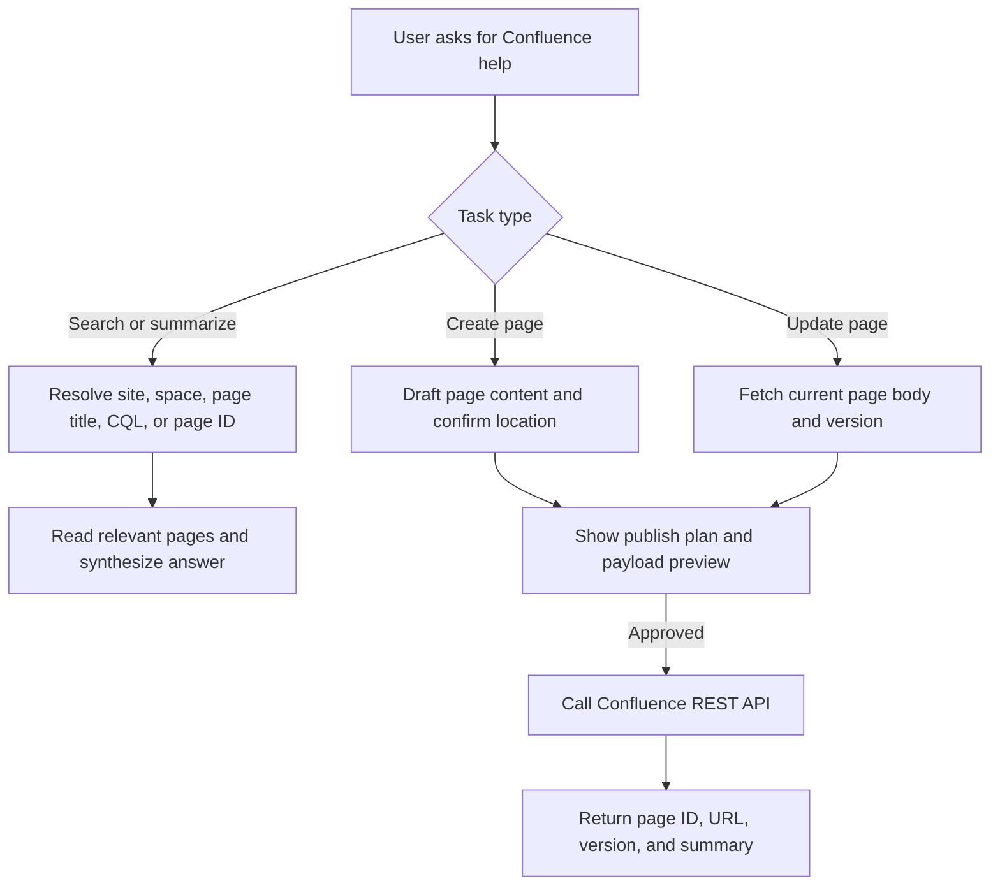

# Confluence Server/Data Center Copilot

Use this skill when the work touches a Confluence Server or Data Center instance and
the task needs more than generic writing. The goal is to help the user safely search,
read, summarize, create, and update Confluence content through the REST API without
guessing at targets or damaging existing pages.

## Workflow overview



## What this skill should handle

Use this skill for tasks such as:
- Searching pages by title, space, label, or CQL and summarizing the results
- Fetching specific pages by ID and extracting decisions, action items, risks, or open questions
- Publishing meeting notes, release notes, runbooks, SOPs, incident notes, or knowledge-base articles
- Updating existing pages in place while preserving important structure
- Helping the user locate the correct parent page, page ID, or page tree position before publishing
- Applying labels or planning attachment uploads after page creation or update
- Translating rough notes or Markdown-like content into Confluence storage format that is simple and durable
- Running in privacy-aware modes such as metadata-only search, scoped read, or command-only execution
- Handling large result sets with top-N selection, batched reading, and structured summaries or tables

## Default operating rules

1. Default to read-only unless the user clearly asks to create or update a page.
2. Resolve the exact target before writing: base URL, authentication method, space key, page title, and either a parent page or a page ID.
3. If the user raises privacy concerns, switch explicitly into `strict_metadata`, `strict_scoped_read`, or `command_only`. If they do not choose, default to `strict_metadata`.
4. In `strict_metadata`, do not fetch `body.storage`, attachment bytes, or page excerpts. Use only metadata such as page ID, title, space, URL, labels, ancestors, and version.
5. In `strict_scoped_read`, fetch page content only after explicit approval and only inside a bounded scope such as a page ID or a specific `space` plus `parent page ID`.
6. In `command_only`, generate commands and payloads but do not execute Confluence calls or inspect returned content.
7. Prefer a dry run when the destination is ambiguous or the requested change is broad. Confluence writes are persistent and often affect shared team documentation.
8. In normal mode, updates require the latest `version.number` and current `body.storage`. In stricter modes, fetch only what the chosen mode allows.
9. Preserve important structure already on the page, especially macros, tables, callouts, labels, anchors, and hand-maintained sections, unless the user explicitly wants a full rewrite.
10. If several candidate pages match, present the most likely matches with page IDs, titles, and spaces, then ask the user to choose instead of guessing.
11. If the user has not provided credentials or the target instance details, ask only for the minimum missing information.
12. Build non-trivial JSON payloads with a serializer such as `python3 - <<'PY'` or `jq -n` instead of hand-escaping long storage markup.
13. Treat labels and attachments as follow-up operations to page create or update unless the local instance documents a different workflow.
14. For large search result sets, rank candidates by metadata, read only the top relevant pages, and summarize in batches instead of dumping every raw page body into context.
15. Never print secrets back to the user. Refer to them by variable name or redact them.

## Privacy and strict modes

Switch modes when the user says things like "strict mode", "privacy mode", "metadata only", "don't send page content to AI", "only this space or parent is allowed", or "just give me commands".

- `normal`: Full search, read, summarize, create, and update workflow.
- `strict_metadata`: Search and plan with metadata only. Good for page discovery, page tree work, labels, attachment planning, and creates driven by user-provided content.
- `strict_scoped_read`: Stay metadata-only until the user explicitly allows content reads and gives a bounded scope such as a page ID or a specific `space` plus `parent page ID`. Read only the smallest set of pages needed inside that scope.
- `command_only`: Do not execute Confluence calls or inspect responses. Generate `curl`, `jq`, `python3`, or shell steps only.

If a privacy-sensitive request does not specify a mode, start in `strict_metadata` and ask whether `strict_scoped_read` is allowed.

## Inputs to collect only when needed

Gather only what is necessary for the current task:
- Confluence base URL, for example `https://confluence.example.internal`
- Authentication method: username and password, personal access token, or another user-provided header format
- Space key such as `ENG`, `OPS`, or `PLAT`
- Parent page ID for new content, or existing page ID for updates
- The desired page title
- Optional labels, audience, template type, or section-level update instructions
- Optional attachment file paths, desired filenames, or upload comments
- Optional privacy mode: `normal`, `strict_metadata`, `strict_scoped_read`, or `command_only`
- Optional read scope for strict modes: allowed page ID, allowed space, allowed parent page ID, and whether content reads are approved
- Optional result-set controls such as maximum pages to read, preferred batch size, or whether the user wants a table or structured summary

If the user already gave enough detail, do not interrogate them again. Move straight into search, drafting, or publishing.

## Suggested environment variables

Prefer environment variables when possible so the user does not have to paste credentials into chat.

- `CONFLUENCE_BASE_URL`
- `CONFLUENCE_USERNAME`
- `CONFLUENCE_PASSWORD`
- `CONFLUENCE_PAT`
- `CONFLUENCE_SPACE_KEY`

Use whichever authentication method the instance supports. If both username/password and PAT are absent, ask the user how their Server or Data Center instance authenticates REST calls.

## REST API playbook

The exact behavior can vary slightly by Confluence version, so verify against the local instance if a first attempt returns 404 or 400. Common Server and Data Center patterns are:

| Goal | Method | Path |
| --- | --- | --- |
| Find a page by title and space | GET | `/rest/api/content?type=page&title=...&spaceKey=...` |
| Search with CQL | GET | `/rest/api/content/search?cql=...` |
| Fetch page metadata only | GET | `/rest/api/content/{id}?expand=version,space,ancestors` |
| Fetch a page with body and version | GET | `/rest/api/content/{id}?expand=body.storage,version,space,ancestors` |
| Create a page | POST | `/rest/api/content` |
| Update a page | PUT | `/rest/api/content/{id}` |
| List child pages | GET | `/rest/api/content/{id}/child/page` |
| Inspect labels | GET | `/rest/api/content/{id}/label` |
| Add labels to a page | POST | `/rest/api/content/{id}/label` |
| Upload an attachment to a page | POST | `/rest/api/content/{id}/child/attachment` |

When using shell commands, prefer `curl` with JSON payloads. If the request is authenticated, use either basic auth or a bearer token depending on the instance. In `strict_metadata`, prefer metadata-only fetches and label/tree endpoints instead of `body.storage` expansions.

### Authentication pattern

Use one of these shapes and avoid echoing secrets:

```bash
BASE_URL="${CONFLUENCE_BASE_URL%/}"

# Basic auth pattern
curl -sS -u "$CONFLUENCE_USERNAME:$CONFLUENCE_PASSWORD" \
  "$BASE_URL/rest/api/content/123456?expand=body.storage,version"

# Bearer token pattern
curl -sS -H "Authorization: Bearer $CONFLUENCE_PAT" \
  "$BASE_URL/rest/api/content/123456?expand=body.storage,version"
```

## Safe shell and payload patterns

Confluence storage bodies often contain quotes, code blocks, tables, and line breaks. Do not hand-escape long XHTML into a one-liner if you can avoid it. Prefer generating payload JSON with Python or jq and then posting the file.

```bash
python3 - <<'PY' > /tmp/confluence-create.json
import json

payload = {
    "type": "page",
    "title": "Weekly Platform Sync - 2026-03-21",
    "space": {"key": "PLAT"},
    "ancestors": [{"id": 987654}],
    "body": {
        "storage": {
            "value": "<h1>Summary</h1><p>...</p>",
            "representation": "storage"
        }
    }
}

print(json.dumps(payload))
PY

curl -sS \
  -H "Content-Type: application/json" \
  -H "Authorization: Bearer $CONFLUENCE_PAT" \
  -d @/tmp/confluence-create.json \
  "$BASE_URL/rest/api/content"
```

Use the same pattern for updates. This reduces malformed JSON and invalid storage markup errors.

## Windows and PowerShell notes

If the user is on Windows, prefer PowerShell over `cmd.exe` for Confluence work. PowerShell handles environment variables, multi-line commands, and JSON preparation more reliably.

1. Set environment variables with PowerShell syntax such as `$env:CONFLUENCE_BASE_URL = "https://confluence.example.internal"`.
2. Prefer `curl.exe` instead of bare `curl` so PowerShell does not route the call through an alias or wrapper unexpectedly.
3. For complex JSON payloads, do not hand-escape long storage markup inline. Prefer generating a JSON file with Python and then posting that file.
4. When the Unix examples use heredoc syntax like `python3 - <<'PY'`, translate that into a PowerShell here-string piped into Python, or write a temporary `.py` file first.
5. Be careful with Windows attachment paths such as `C:\Users\Alice\Downloads\rollout-checklist.pdf`, especially when the path contains spaces.
6. Write payload files as UTF-8 when possible so non-ASCII page titles and storage markup survive correctly.
7. In `command_only` mode for Windows users, prefer emitting PowerShell examples explicitly rather than Bash.

### PowerShell environment examples

```powershell
$env:CONFLUENCE_BASE_URL = "https://confluence.example.internal"
$env:CONFLUENCE_PAT = "your_token_here"
$env:CONFLUENCE_SPACE_KEY = "ENG"
$BASE_URL = $env:CONFLUENCE_BASE_URL.TrimEnd('/')

curl.exe -sS `
  -H "Authorization: Bearer $env:CONFLUENCE_PAT" `
  "$BASE_URL/rest/api/content?limit=1"
```

### PowerShell payload example

```powershell
@'
import json

payload = {
    "type": "page",
    "title": "Weekly Platform Sync - 2026-03-21",
    "space": {"key": "PLAT"},
    "ancestors": [{"id": 987654}],
    "body": {
        "storage": {
            "value": "<h1>Summary</h1><p>...</p>",
            "representation": "storage"
        }
    }
}

with open("confluence-create.json", "w", encoding="utf-8") as f:
    json.dump(payload, f, ensure_ascii=False)
'@ | python -

curl.exe -sS `
  -H "Content-Type: application/json" `
  -H "Authorization: Bearer $env:CONFLUENCE_PAT" `
  -d "@confluence-create.json" `
  "$BASE_URL/rest/api/content"
```

## Search and read workflow

When the user wants to find or summarize information:

1. Resolve the search scope.
   - Specific page ID if known
   - Title and space if mostly known
   - CQL if the user needs a broader search across labels, text, creators, or dates
2. Choose the narrowest reliable search method in this order when possible: `page ID` -> `title + space` -> `CQL` -> parent discovery.
3. Prefer search-first behavior when the title is ambiguous.
4. In `strict_metadata`, keep the whole workflow metadata-only. Return page IDs, titles, spaces, URLs, labels, ancestor context, version, and other safe metadata without fetching `body.storage`.
5. In `strict_scoped_read`, stay metadata-only until the user explicitly allows content reads and the target falls inside the approved `page ID` or `space + parent page ID` scope.
6. In normal mode, fetch the page body with `expand=body.storage,version,space,ancestors` before summarizing.
7. For large result sets, rank candidates first, then read only the top relevant pages instead of every match.
8. Summarize what matters to the task rather than dumping raw storage XHTML.
9. Return page identifiers so the user can verify the target.

### Large result set strategy

If the search returns many plausible pages, do not read them all at once.

1. Start with metadata-only ranking: page ID, title, space, labels, modified time, and ancestor path.
2. Unless the user asks otherwise, narrow to the top 5 most relevant pages for normal summaries, or the top 10 for comparison or table-building tasks.
3. If pages are long, extract only the sections needed for the task, or produce per-page structured notes before a final summary.
4. For comparison tasks, prefer a two-pass approach: per-page mini-summary first, then a final aggregate table or report.
5. Tell the user what subset was read, especially if you truncated or limited the result set.

### Search examples

```bash
# Search by exact title in a space
curl -sS "$BASE_URL/rest/api/content?type=page&spaceKey=ENG&title=VPN%20Onboarding"

# Search with CQL
curl -sS "$BASE_URL/rest/api/content/search?cql=space=ENG%20and%20title~%22onboarding%22"

# Fetch a specific page
curl -sS "$BASE_URL/rest/api/content/123456?expand=body.storage,version,space,ancestors"
```

## Parent discovery workflow

When the user wants to publish but only knows the space or rough area of the page tree:

1. Search for likely parent pages by title keywords, labels, or CQL.
2. If one candidate looks promising, inspect its child pages to confirm the local structure.
3. Present the best 3-5 candidates with page ID, title, space, and ancestor context when available.
4. If one candidate is clearly dominant and the user has implicitly authorized publishing there, you can proceed. If there is real ambiguity, ask the user to choose.
5. For recurring structures like postmortems, runbooks, or release notes, prefer the established cluster instead of inventing a new branch.
6. In `strict_metadata`, parent discovery is a strong default because it relies mostly on page tree structure and metadata.
7. In `strict_scoped_read`, treat `space + parent page ID` as a preferred bounded read scope for any later content reads.

### Parent discovery examples

```bash
# Find likely container pages
curl -sS "$BASE_URL/rest/api/content/search?cql=space=PLAT%20and%20title~%22postmortem%22"

# Inspect the children under a candidate parent
curl -sS "$BASE_URL/rest/api/content/123456/child/page"
```

## Create page workflow

When the user wants a new page:

1. Confirm the destination space and parent page. If the parent is unclear, search for likely parent pages first.
2. Draft the page content in a clean structure that matches the user's purpose.
3. If the request is even slightly ambiguous, show a compact publish plan before writing.
4. Use simple Confluence storage markup. Favor durable XHTML-like structures over overly clever formatting.
5. In `strict_metadata` or `command_only`, only create from user-provided or clearly non-sensitive content. Do not read other page bodies just to draft a new page.
6. In `strict_scoped_read`, only reuse existing page content if the user explicitly approved reads within the allowed scope.
7. Apply labels or attachment steps only after the page itself exists and the page ID is known.
8. After creation, return the new page ID, title, location, and any URL supplied by the API response.

### Create payload shape

```json
{
  "type": "page",
  "title": "Weekly Platform Sync - 2026-03-21",
  "space": { "key": "PLAT" },
  "ancestors": [{ "id": 123456 }],
  "body": {
    "storage": {
      "value": "<h1>Summary</h1><p>...</p><h2>Decisions</h2><ul><li>...</li></ul>",
      "representation": "storage"
    }
  }
}
```

## Update page workflow

When the user wants to update an existing page:

1. In normal mode, fetch the current page first, including `body.storage` and `version`.
2. In `strict_metadata`, do not fetch page body. Limit yourself to planning, metadata inspection, labels, attachments, or command generation unless the user switches modes.
3. In `strict_scoped_read`, fetch page body only if the page is inside the approved scope and the user explicitly allowed content reads.
4. Decide whether the task is a section-level edit or a full-page rewrite.
5. If the change is section-level, identify the target heading or block boundary before editing. If the target cannot be located reliably, show the intended insertion or replacement strategy and ask.
6. Preserve macros, tables, anchors, and unrelated sections unless the user explicitly requests a broader rewrite.
7. Increment `version.number` exactly once from the latest fetched version.
8. If the update fails with a version conflict, refetch the page and retry with the new version, but only if the chosen privacy mode allows that read.

### Update payload shape

```json
{
  "id": "123456",
  "type": "page",
  "title": "Platform Runbook",
  "version": { "number": 8 },
  "body": {
    "storage": {
      "value": "<p>updated body here</p>",
      "representation": "storage"
    }
  }
}
```

### Section-level edit heuristics

When preserving the page matters, work from the current `body.storage.value`:

- Identify the nearest heading, macro boundary, or table region that contains the requested change.
- Replace or insert only that region rather than regenerating unrelated sections.
- Keep surrounding headings, macros, panel blocks, and tables byte-for-byte when possible.
- If the page uses unusual macros or deeply nested storage markup, switch to a draft-and-confirm flow before pushing the update.
- In `strict_metadata`, do not attempt section-level edits from guessed structure. Either ask the user for the exact replacement content or switch to `strict_scoped_read`.

## Labels and attachments workflow

Treat labels and attachments as separate page-management steps after the page itself exists.

1. Create or update the page first and capture the page ID.
2. Apply labels with a dedicated label call if the user asked for them.
3. Upload attachments only after the destination page ID is confirmed.
4. If the attachment filename already exists, check whether the user wants a new version or a differently named file.

### Label payload shape

```json
[
  { "prefix": "global", "name": "release-notes" },
  { "prefix": "global", "name": "payments" }
]
```

### Attachment upload example

```bash
curl -sS -X POST \
  -H "Authorization: Bearer $CONFLUENCE_PAT" \
  -H "X-Atlassian-Token: nocheck" \
  -F "file=@rollout-checklist.pdf" \
  -F "comment=Rollout checklist for 2026-03-21 release" \
  "$BASE_URL/rest/api/content/123456/child/attachment"
```

If the deployment expects `no-check` instead of `nocheck`, follow the local instance convention. Always keep label and attachment steps separate from `body.storage`.

## Authoring guidance for Confluence storage format

Confluence Server and Data Center pages are often stored as XHTML-like storage markup. Keep the generated body conservative and easy to maintain.

- Prefer straightforward tags such as `<p>`, `<h1>`, `<h2>`, `<ul>`, `<ol>`, `<table>`, `<tr>`, `<th>`, `<td>`, `<code>`, and `<pre>`.
- Close tags properly and keep nesting simple.
- Preserve existing macros and special Confluence blocks unless the user explicitly wants them removed.
- If the user starts from Markdown or rough notes, convert it into clear storage markup instead of pasting raw Markdown into the page body.
- For section-level edits, replace only the intended section when possible instead of regenerating the whole body.

If you need ready-made document structures, read `references/page-templates.md`.
If you need endpoint reminders or CQL examples, read `references/rest-api-cheatsheet.md`.

## Content shaping guidance

Use the user's context to choose an appropriate structure instead of forcing one rigid layout.

- **Meeting notes**: title, attendees, agenda, discussion notes, decisions, action items
- **Release notes**: release summary, notable changes, impact, rollout notes, rollback notes, known issues
- **Runbooks and SOPs**: purpose, prerequisites, steps, validation, rollback, escalation
- **Incident or postmortem pages**: summary, timeline, impact, root cause, remediation, follow-ups
- **Knowledge base or how-to articles**: summary, when to use it, steps, troubleshooting, related pages

Keep the content clean and scannable. Confluence pages are usually read quickly by teams, so headings and short lists matter.

## Response format

For read-only tasks, use this structure:

```markdown
## Confluence findings
- Site: ...
- Space: ...
- Pages checked: ...
- Candidate pages: ...
- Summary: ...
- Open questions: ...
```

For `strict_metadata` or the metadata phase of `strict_scoped_read`, use this structure:

```markdown
## Confluence metadata findings
- Mode: strict_metadata or strict_scoped_read
- Allowed scope: page ID, space, parent page ID, or none yet
- Site: ...
- Space: ...
- Candidate pages: page IDs, titles, labels, ancestor path, modified time
- Pages selected for content read: none yet or [list]
- Open questions: ...
```

When you apply a top-N or batch limit, make it explicit:

```markdown
## Result-set handling
- Total matches: ...
- Ranked candidates considered: ...
- Pages read in full or in part: ...
- Batch strategy: top 5, top 10, per-page mini-summaries, section extraction, etc.
```

For write tasks, use this structure before or after the API call as appropriate:

```markdown
## Publish plan
- Action: create or update
- Site: ...
- Space: ...
- Parent page or page ID: ...
- Title: ...
- Labels: ...
- Post-create actions: labels, attachments, none
- Risks or assumptions: ...

## Draft content
[show the key structure or the body preview if useful]

## API result
- Status: ...
- Page ID: ...
- Version: ...
- URL: ...
```

## Common failure modes

- **401 or 403**: credentials, headers, or permissions are wrong
- **404**: wrong base URL, wrong REST path for the instance version, or the page does not exist
- **409 or stale version**: someone updated the page after the last fetch; refetch and retry
- **400 invalid storage**: simplify the markup and remove risky structure
- **Ambiguous title matches**: search first, list candidates, and ask the user to confirm

## When to slow down and ask

Pause and ask for confirmation when:
- The user wants to update a page but did not identify which one
- The page title matches multiple results in different spaces
- The user wants a large rewrite of a heavily structured page
- The request might replace macros, inline comments, or collaboratively maintained sections
- The authentication method or base URL is still unclear
- The requested parent page or attachment destination is still ambiguous
- The user asked for privacy-sensitive handling but did not specify whether `strict_metadata`, `strict_scoped_read`, or `command_only` is acceptable
- A content read would go beyond the approved `space`, `parent page ID`, or `page ID` scope
- A large result set would require reading more pages than the default top-N limit

## Example prompts this skill should handle

- "Search our Confluence Server ENG space for pages about VPN onboarding and summarize the latest two."
- "Create release notes in the OPS space under page 987654 using these bullet points."
- "Update Confluence page 123456 with the new rollback procedure, but preserve the existing macros and page structure."
- "Find the most likely parent page for a new postmortem in the Platform space, show me the candidates, then publish once I approve."
- "Add labels to Confluence page 123456 and plan the attachment upload for the rollout checklist file once I confirm the target page."
- "Use strict mode: search only inside ENG under parent page 456789, list the best candidates, and do not read content until I approve."
- "We got 20 release-note pages back; rank them, read only the top 10, and generate a comparison table."

## Scope guardrails

This skill is tuned for Confluence Server and Data Center REST API workflows.
If the user is clearly working with Confluence Cloud, do not bluff. Say that this skill is optimized for Server and Data Center and adapt carefully only if the user wants that.
If the user asks for global administration changes, permission schemes, or plugin-specific macros, help draft a careful plan but do not invent unsupported endpoints or hidden capabilities.

