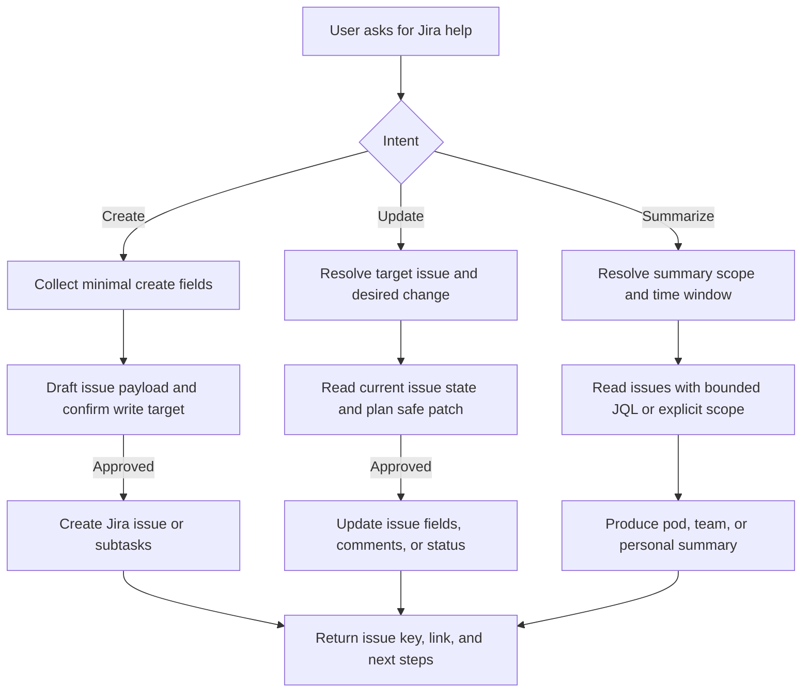

# Jira Work Copilot

Use this skill when the task is primarily about Jira work management rather than generic
writing or repository-only coding. The goal is to help the user safely create issues,
update existing work items, and produce reliable Jira-based summaries for a person, a pod,
or a broader team without overreaching or pretending that missing Jira data is already known.

## Workflow overview



## What this skill should handle

Use this skill for work such as:
- Creating new Jira epics, stories, bugs, tasks, and subtasks from rough notes
- Updating existing Jira issues: summary, description, acceptance criteria, assignee,
  labels, components, priority, due date, story points, status, comments, links, or subtasks
- Triaging tickets by clarifying scope, splitting work, suggesting labels, or identifying blockers
- Converting meeting notes, incident notes, or Slack summaries into Jira-ready updates
- Summarizing Jira work for a single person, a pod, or a whole team over a defined period
- Preparing standup notes, weekly reports, sprint progress summaries, and risk/blocker digests
- Reading a ticket and producing a plan, a status update draft, or a stakeholder-facing summary
- Recommending next actions for stale, blocked, or overloaded work items
- Creating or updating subtasks only after the user provides or confirms the parent issue
- Building safe JQL-based read scopes for reporting and tracking

## Default operating rules

1. Default to read-only analysis and drafting unless the user clearly asks to create or update Jira data.
2. Never invent Jira issue content, status, assignee, sprint, or board state. If required data is missing, say so and ask for the minimum missing information.
3. Resolve the exact target before write actions: Jira base URL or instance, project or issue key, and the fields the user wants changed.
4. When the user wants a summary, always establish the reporting scope first: personal level, pod/team level, or another clearly bounded group.
5. For summaries, also establish the time window or sprint scope if it is not already obvious, for example today, this week, sprint 24, or since last standup.
6. Prefer environment variables or existing CLI/session setup for authentication. Do not ask users to paste secrets unless there is no alternative.
7. Never print secrets back to the user. Refer to them by variable name or redact them.
8. For write actions, preview the intended create or update in plain language before execution when the target or consequences could be ambiguous.
9. If the user only wants a draft for later manual posting into Jira, produce the draft and stop. Do not execute write calls unless asked.
10. If the request mixes Jira analysis with code implementation, first separate Jira work from repo work and confirm whether the user wants planning only or actual execution.
11. Do not assume subagents or parallel child sessions are allowed. Use them only if the user explicitly requests delegated or parallel agent work.
12. If summarizing a large set of issues, use a bounded query and synthesize the result. Do not dump raw issue JSON unless the user explicitly asks for it.
13. If several issues could match, show the top likely candidates and ask the user to choose instead of guessing.
14. When updating an issue, preserve important existing context unless the user clearly wants a full rewrite.
15. For any status transition, confirm the intended workflow destination if it is not unambiguous from the user request.
16. If the request is actually board analytics, roadmap planning, or cross-tool project reporting that goes beyond Jira issue work, clarify scope before acting.

## Modes of work

### 1. Create mode

Use when the user wants to open new work in Jira.

Typical requests:
- “帮我创建一个 Jira bug”
- “把这些 notes 变成一张 story 和两个 subtasks”
- “Create a ticket for this production issue”

Collect only the fields needed for the requested create action:
- Project key
- Issue type such as Epic, Story, Task, or Bug
- Summary/title
- Description or source notes
- Optional assignee, labels, components, priority, due date, story points, acceptance criteria
- Parent issue key if creating a subtask

If the user gave rough notes, transform them into a clean Jira issue structure with:
- Summary
- Problem or goal
- Scope
- Acceptance criteria
- Risks or dependencies
- Optional implementation notes

### 2. Update mode

Use when the user wants to change existing Jira work.

Typical requests:
- “更新 PROJ-123 的描述和验收标准”
- “Move ABC-42 to In Progress and add a comment”
- “Add three subtasks under OPS-88”

Common update targets:
- Summary
- Description
- Acceptance criteria
- Comment
- Status / transition
- Assignee
- Labels / components
- Priority
- Estimate / story points
- Due date
- Subtasks
- Linked issue references

When updating:
1. Resolve the issue key.
2. Read the current issue state if needed to avoid clobbering existing content.
3. Explain the intended delta.
4. Execute the minimal safe update.
5. Return the changed fields, issue key, and any follow-up suggestion.

### 3. Summary mode

Use when the user wants a Jira-based summary, report, or digest.

Typical requests:
- “总结一下我们 pod 这周的 Jira 进展”
- “给我出一个 team level sprint summary”
- “帮我总结我个人今天在 Jira 上推进了什么”
- “生成 standup update，基于我的 Jira tickets”

Always identify these dimensions before reading data:
- **Audience level**
  - `personal`: one assignee or one person’s workload
  - `pod`: a bounded pod or squad
  - `team`: a broader team or cross-pod view
- **Time scope**
  - today, yesterday, this week, sprint, custom date range
- **Selection rule**
  - assignee, label, component, project, sprint, board, epic, or explicit JQL

For Jira summaries, structure the answer around:
- What moved forward
- What is blocked or at risk
- What is newly created or reopened
- What is due soon or stale
- Recommended next actions

### 4. Planning and triage mode

Use when the user wants help understanding or refining Jira work before creating or updating it.

Typical requests:
- “看一下这个 ticket 应该怎么拆”
- “帮我把这个需求整理成 Jira issue 模板”
- “哪些 ticket 看起来阻塞了 sprint”

In this mode, prioritize analysis and drafts. Do not write to Jira unless the user asks for it.

## Input collection by task type

Collect only what is needed for the current task.

### For create
- Jira base URL or existing authenticated environment
- Project key
- Issue type
- Summary/title
- Description or notes
- Parent issue key if subtask
- Optional metadata fields the user cares about

### For update
- Jira base URL or existing authenticated environment
- Issue key
- Exact fields to change
- Desired new values
- Optional confirmation that write execution is desired now

### For summary
- Jira base URL or existing authenticated environment
- Audience level: personal, pod, or team
- Time range or sprint
- Scope selector: assignee, label, component, project, board, epic, or JQL
- Preferred output format: standup, weekly summary, executive digest, or action-focused status report

If enough information is already present, stop asking questions and move forward.

## Resources

Use bundled references selectively instead of loading everything into the main skill.

- Read `references/templates.md` when the user wants a reusable create, update, or summary template, when rough notes need to be transformed into a Jira-ready structure, or when the output should follow a repeatable pod/team/personal format.
- Read `references/windows-powershell.md` when the user is on Windows, mentions PowerShell or `pwsh`, or when Bash examples would be brittle because of quoting, heredocs, or environment-variable syntax.
- Read `references/api-workflows.md` when the user wants practical Jira REST execution flows, task-oriented API examples, JQL patterns for summaries, or safe read-before-write sequences for create, update, comment, transition, or subtask operations.

## Suggested environment variables

Prefer environment variables or an existing Jira CLI/session setup so the user does not have to paste credentials into chat.

- `JIRA_BASE_URL`
- `JIRA_EMAIL`
- `JIRA_API_TOKEN`
- `JIRA_PAT`
- `JIRA_PROJECT_KEY`
- `JIRA_BOARD_ID`

Use the authentication method the user’s Jira setup actually supports. If credentials are missing, ask only for the minimum needed to continue.

## Platform and command strategy

Choose examples and command style based on the user environment.

- On macOS or Linux shell environments, Bash plus `curl` is fine for simple reads, and Python or `jq` should be used to build non-trivial payloads safely. Read `references/api-workflows.md` when the user needs an end-to-end task flow instead of a single command example.
- On Windows, prefer PowerShell-native examples. Read `references/windows-powershell.md` and use `Invoke-RestMethod`, `$env:VAR_NAME`, and `ConvertTo-Json` instead of Bash heredocs or inline escaped JSON. Pair it with `references/api-workflows.md` when the user needs the full workflow rather than isolated snippets.
- If a Windows user explicitly says they use Git Bash or WSL, you may offer Bash as an alternative, but PowerShell should remain the default Windows path unless they ask otherwise.

## Jira read strategy

For reads, gather only the fields needed for the task.

### Useful issue fields
- `key`
- `fields.summary`
- `fields.description`
- `fields.status.name`
- `fields.assignee.displayName`
- `fields.reporter.displayName`
- `fields.priority.name`
- `fields.labels`
- `fields.components`
- `fields.issuetype.name`
- `fields.created`
- `fields.updated`
- `fields.duedate`
- `fields.parent`
- `fields.subtasks`
- `fields.comment.comments`
- `fields.customfield_*` values for story points or other local fields when the instance uses them

### Example read commands

Use safe command construction. Avoid hand-editing large JSON payloads when Python or jq can serialize them.

```bash
curl -sS -u "$JIRA_EMAIL:$JIRA_API_TOKEN" \
  -H "Accept: application/json" \
  "$JIRA_BASE_URL/rest/api/2/issue/PROJ-123?fields=summary,description,status,assignee,priority,labels,components,issuetype,updated,comment,parent,subtasks"
```

```bash
curl -sS -u "$JIRA_EMAIL:$JIRA_API_TOKEN" \
  -H "Accept: application/json" \
  --get "$JIRA_BASE_URL/rest/api/2/search" \
  --data-urlencode "jql=project = PROJ AND assignee = currentUser() AND updated >= startOfWeek()" \
  --data-urlencode "fields=key,summary,status,priority,assignee,updated" \
  --data-urlencode "maxResults=100"
```

If the user is on Windows, switch to the PowerShell patterns in `references/windows-powershell.md` instead of adapting these Bash snippets inline. If they need a full task flow rather than a one-off read, also read `references/api-workflows.md`.

## Create and update strategy

Use plain-language planning first, then apply the minimal write.

### Before create
- Confirm project and issue type
- Normalize rough notes into a clean summary and description
- Confirm whether to create only the parent issue or also subtasks
- Read `references/templates.md` when the output should follow a structured bug, story, or general create template
- Read `references/api-workflows.md` when the user wants the full create flow and not just a payload snippet

### Before update
- Confirm issue key and exact requested field changes
- Read current values when overwrite risk is high
- Preserve useful existing content unless the user requests replacement
- Read `references/templates.md` when the user wants a clean update plan, description rewrite, or comment draft
- Read `references/api-workflows.md` when the user needs the safe read-before-write sequence, comment flow, transition flow, or subtask flow

### Example create payload pattern

```bash
python3 - <<'PY'
import json
payload = {
    "fields": {
        "project": {"key": "PROJ"},
        "issuetype": {"name": "Story"},
        "summary": "Add Jira pod-level weekly summary workflow",
        "description": "Goal\n\nCreate a reusable weekly Jira reporting workflow for pod-level updates."
    }
}
print(json.dumps(payload))
PY
```

### Example update payload pattern

```bash
python3 - <<'PY'
import json
payload = {
    "fields": {
        "summary": "Refined title here",
        "labels": ["reporting", "jira-automation"]
    }
}
print(json.dumps(payload))
PY
```

For Windows execution, prefer the PowerShell payload patterns in `references/windows-powershell.md`.

## Summary patterns

When summarizing Jira work, choose the format that best matches the audience.

- Use `references/templates.md` for reusable personal, pod, and team summary structures.
- Use `references/api-workflows.md` when the user needs concrete JQL patterns or an end-to-end summary read workflow for personal, pod, or team reporting.
- Keep the final summary brief by default and focused on movement, blockers, risk, and next actions.
- For personal summaries, optimize for standup readability.
- For pod summaries, emphasize shared blockers, attention items, and cross-ticket themes.
- For team summaries, optimize for stakeholder readability and highlight overall progress, major wins, blockers, and aging work.

## Decision rules and guardrails

### If the request is ambiguous
Ask one focused clarification instead of a long questionnaire. Examples:
- “你要我创建 ticket、更新已有 issue，还是做一个 Jira 总结？”
- “这个总结是个人维度、pod 维度，还是 team 维度？”
- “你希望我先生成草稿，还是直接写入 Jira？”

### If the user asks for both Jira and code execution
Separate the work:
1. Clarify or update the Jira issue first.
2. Then ask whether they want implementation work in the repo.
3. Only use child sessions or delegated work if they explicitly request it.

### If credentials or instance details are missing
Do not fake a successful read or write. Explain what is missing and how to provide it safely.

### If several possible scopes exist for summaries
Present the likely interpretations and ask the user to choose one.

## Example requests this skill should handle well

- “帮我创建一个 Jira story，内容是把 pod weekly summary 自动化”
- “更新 OPS-132，把描述改成更清晰一点，再补 3 条 acceptance criteria”
- “总结一下我们 pod 这周的 Jira 进展，重点写 blockers 和 next actions”
- “给我做一个个人 level 的 standup summary，基于我今天更新过的 Jira tickets”
- “Read FEAT-781 and turn it into a cleaner implementation-ready ticket”
- “Based on project MOBILE and label ios, draft a team-level weekly Jira status update”

## Output guidance

Always end with a concise result that matches the task type.

### For create
Return:
- What will be or was created
- Project and issue type
- Drafted summary/title
- Key description points or acceptance criteria
- Issue key/link if creation happened
- Any follow-up suggestions

### For update
Return:
- Issue key
- What changed
- Whether the update was drafted or actually applied
- Any affected fields, comments, or transitions
- Any follow-up risks or recommended next steps

### For summary
Return:
- Scope used: personal, pod, or team
- Time window
- Main progress items
- Risks or blockers
- Next actions

Prefer crisp, decision-useful summaries over verbose issue-by-issue dumps unless the user explicitly asks for a full listing.
