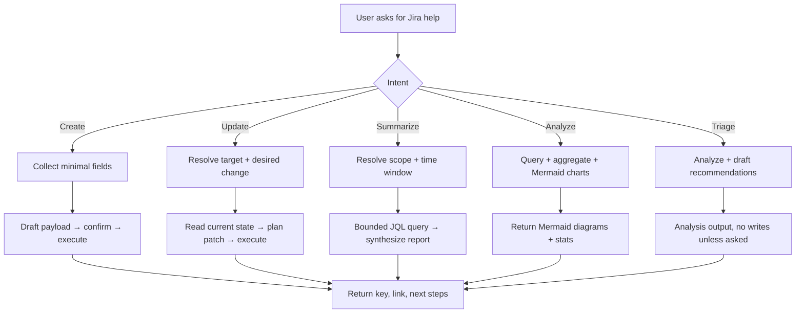

# Jira Work Copilot

Help users safely create issues, update work items, and produce reliable Jira-based summaries without overreaching or pretending that missing data is already known.

## Workflow overview



## Operating rules

1. **Read-first by default.** Draft and analyze unless the user clearly asks to create or update.
2. **Never invent data.** If issue content, status, assignee, or sprint info is missing, say so and ask for the minimum.
3. **Resolve the target before writing.** Confirm base URL, project/issue key, and intended field changes.
4. **Establish scope for summaries.** Identify audience level (personal/pod/team), time window, and selection criteria.
5. **Protect credentials.** Use environment variables; never print secrets. Ask only for what's missing.
6. **Preview before write.** Show the intended create or update in plain language before execution when consequences could be ambiguous.
7. **Respect draft intent.** If the user wants a draft for manual posting, produce it and stop.
8. **Separate Jira from code work.** If the request mixes Jira updates with repo implementation, handle Jira first and confirm before switching.
9. **Preserve existing content.** When updating, keep important context unless the user explicitly wants a full rewrite.
10. **Confirm transitions.** For status changes, verify the destination if it's not unambiguous.

## Modes of work

### 1. Create

Collect only what's needed: project key, issue type, summary/title, description, and any metadata the user cares about. Transform rough notes into a clean structure with summary, goal, scope, acceptance criteria, and risks.

For subtasks, confirm the parent issue first. Use `--dry-run` to preview:

```bash
python3 scripts/jira_create.py --project PLAT --type Story \
    --summary "Automate pod weekly summary" --dry-run

python3 scripts/jira_subtask.py --parent PLAT-101 \
    --summaries "Design schema|Implement API|Write tests" --dry-run
```

Read `references/templates.md` for structured bug/story/task templates.

### 2. Update

Resolve the issue key, read current state when overwrite risk is high, explain the intended delta, then execute the minimal change:

```bash
python3 scripts/jira_get.py OPS-132                    # Read first
python3 scripts/jira_update.py OPS-132 --summary "..." --add-labels "reviewed" --dry-run
python3 scripts/jira_comment.py OPS-132 --body "Scope clarified."
python3 scripts/jira_transition.py OPS-132 --to "In Progress"
```

Read `references/api-workflows.md` for safe read-before-write sequences.

### 3. Summarize

Always identify three dimensions before querying:
- **Audience:** personal (one person), pod (bounded squad), or team (cross-pod)
- **Time:** today, this week, sprint, month, or custom date range
- **Selector:** assignee, label, component, project, sprint, board, epic, or JQL

```bash
# Personal standup
python3 scripts/jira_summary.py --scope personal --time today --format table

# Pod weekly
python3 scripts/jira_summary.py --scope pod --project PLAT --label pod-alpha --time week --format table
```

Structure summaries around: progress → blockers/risks → new/reopened → due soon/stale → next actions.

Read `references/templates.md` for reusable summary structures.

### 4. Analyze (Mermaid charts)

For visual analytics, use `jira_analytics.py` which outputs Mermaid diagrams the AI renders inline:

```bash
# Team status report → Mermaid pie + bar (default)
python3 scripts/jira_analytics.py --scope team --project PLAT --time month

# By assignee, bar chart
python3 scripts/jira_analytics.py --scope team --project PLAT --group-by assignee --chart bar
```

Output formats: `mermaid` (default), `text`, `csv`, `json`, `markdown`. Run `--help` for all options (custom date ranges, split-by, file output, etc.).

### 5. Plan and triage

Prioritize analysis and drafts — do not write to Jira unless the user asks. Useful for:
- Breaking down tickets into subtasks
- Identifying sprint blockers or stale work
- Normalizing rough notes into Jira-ready structures
- Recommending next actions for overloaded assignees

Typical flow: read the ticket first, then propose a plan:

```bash
python3 scripts/jira_get.py PLAT-88                  # Read current state
# → Analyze and propose subtask breakdown or refinements
# → Only create/update after user approves the plan
python3 scripts/jira_subtask.py --parent PLAT-88 \
    --summaries "Design|Implement|Test" --dry-run    # Preview before creating
```

## Scripts

Cross-platform Python scripts in `scripts/`. All use only Python 3 stdlib — no pip required.

### Setup
- Python 3.9+
- Environment variables:
  - `JIRA_BASE_URL` — Jira instance URL (e.g., `https://company.atlassian.net`)
  - Auth: either `JIRA_EMAIL` + `JIRA_API_TOKEN` (Jira Cloud) or `JIRA_PAT` (Server/DC)
  - Optional: `JIRA_PROJECT_KEY`
- Assignee format differs by platform:
  - **Jira Cloud:** use `--assignee-id <accountId>` (e.g., `--assignee-id 5b10ac8d14c...`)
  - **Jira Server/DC:** use `--assignee <username>` (e.g., `--assignee jsmith`)

### Available scripts

| Script | Purpose | Key flags |
|---|---|---|
| `jira_common.py` | Shared library (auth, HTTP, JSON, logging) | — |
| `jira_get.py` | Fetch a single issue | `--fields`, `--expand`, `--raw` |
| `jira_search.py` | JQL search | `--jql`, `--max`, `--count-only` |
| `jira_create.py` | Create issue | `--project`, `--type`, `--summary`, `--dry-run` |
| `jira_update.py` | Update issue fields | `--summary`, `--labels`, `--add-labels`, `--dry-run` |
| `jira_comment.py` | Add or list comments | `--body`, `--list`, `--last` |
| `jira_transition.py` | Transition status | `--list`, `--to`, `--id`, `--comment` |
| `jira_subtask.py` | Create subtasks | `--parent`, `--summaries`, `--batch` |
| `jira_summary.py` | Summary queries | `--scope`, `--time`, `--format table` |
| `jira_analytics.py` | Mermaid analytics | `--scope`, `--group-by`, `--chart`, `--format` |

### When to use scripts vs inline commands

- **Use scripts** as the default — they handle auth, errors, JSON, and output automatically.
- **Use `--dry-run`** on write scripts to preview payloads before execution.
- **Use `--help`** on any script to see all available flags (e.g., `python3 scripts/jira_create.py --help`).
- **Use inline curl/python** only for highly custom payloads the scripts don't cover.
- **On Windows:** scripts work natively. If the user explicitly wants PowerShell-native snippets, read `references/windows-powershell.md`.

## Resources

Load selectively — not everything at once:

- **`references/templates.md`** — Reusable create, update, and summary templates. Read when transforming notes into Jira structures or following a repeatable reporting format.
- **`references/api-workflows.md`** — End-to-end REST flows, JQL patterns, and safe read-before-write sequences. Read when the user needs task-oriented API examples beyond what scripts provide.
- **`references/windows-powershell.md`** — PowerShell-native Jira patterns. Read only when the user is on Windows and explicitly asks for PowerShell instead of Python scripts.

## Guardrails

### Ambiguous requests
Ask one focused question, not a questionnaire:
- "你要创建 ticket、更新已有 issue，还是做总结？"
- "这个总结是个人、pod、还是 team 维度？"

### Mixed Jira + code requests
Handle Jira first, then confirm before switching to repo work.

### Missing credentials
Never fake a successful API call. Explain what's missing and how to set it up.

### Multiple possible scopes
Present candidates and ask the user to choose.

## Output guidance

### Create / Update
Return: what was created/changed, project + issue type, drafted content, issue key/link if executed, and follow-up suggestions.

### Summary
Return: scope, time window, progress highlights, blockers/risks, and next actions. Keep it brief — no raw JSON dumps unless requested.

### Analytics (Mermaid)
When `jira_analytics.py` outputs Mermaid syntax (the default), paste the output directly into the response — it already contains properly fenced mermaid code blocks with pie/bar charts, summary tables, and issue details. Do not wrap in additional code fences or modify the syntax. For other formats (CSV, JSON, text), present raw output as-is.
