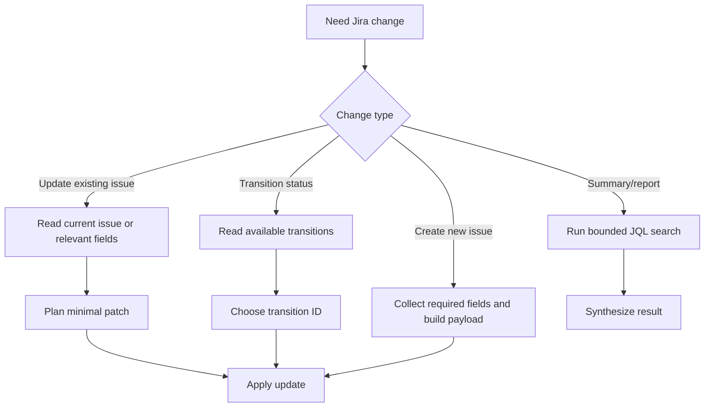
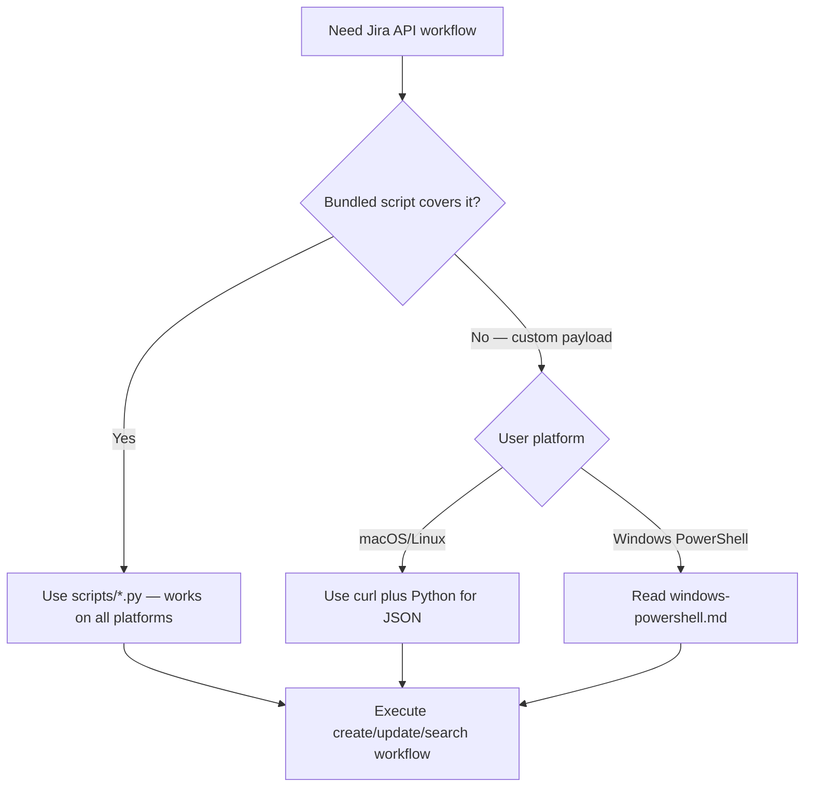

# Jira API Workflows Reference

Read this file when the user needs practical Jira REST execution patterns, reusable API flows, or explicit examples for create, update, comment, transition, subtask, or summary-related reads. This file complements the main skill and the Windows PowerShell reference by focusing on task-oriented API sequences rather than just isolated payload snippets.

## When to use this reference

Use this file when the user wants to:
- Actually create or update Jira issues through REST APIs
- Add comments or transition workflow states safely
- Create subtasks under a parent issue
- Build JQL queries for personal, pod, or team summaries
- Understand the minimal read-before-write pattern for Jira updates
- See cross-platform request strategy at the workflow level

## Core read-before-write principle

For Jira updates, do the minimum safe reads first.



## Common Jira REST endpoints

These are the main endpoints this skill is expected to use conceptually. Local Jira instances may differ slightly.

- Read one issue: `GET /rest/api/2/issue/{issueKey}`
- Search issues with JQL: `GET /rest/api/2/search` or `POST /rest/api/2/search`
- Create issue: `POST /rest/api/2/issue`
- Update issue fields: `PUT /rest/api/2/issue/{issueKey}`
- Add comment: `POST /rest/api/2/issue/{issueKey}/comment`
- List transitions: `GET /rest/api/2/issue/{issueKey}/transitions`
- Apply transition: `POST /rest/api/2/issue/{issueKey}/transitions`

Use `/rest/api/3/...` if the user’s Jira Cloud instance prefers that version. Do not silently switch versions without checking the environment.

## Authentication guidance

Prefer environment variables and avoid echoing secrets. The bundled Python scripts (`scripts/*.py`) handle auth automatically via `JIRA_BASE_URL` + `JIRA_EMAIL`/`JIRA_API_TOKEN` (or `JIRA_PAT`).

### Using bundled scripts (recommended)

```bash
# Scripts handle auth, errors, and JSON automatically
python3 scripts/jira_get.py PROJ-123
python3 scripts/jira_search.py --jql "project = PROJ" --max 20
```

### Fallback: raw curl (macOS/Linux one-off reads)

```bash
curl -sS -u "$JIRA_EMAIL:$JIRA_API_TOKEN" \
  -H "Accept: application/json" \
  "$JIRA_BASE_URL/rest/api/2/issue/PROJ-123"
```

### PowerShell pattern

For Windows PowerShell, read `references/windows-powershell.md` and prefer `Invoke-RestMethod` plus an explicit Authorization header.

## Workflow 1: Create a new issue

Use when the user wants to create a bug, story, task, epic, or subtask.

### Minimum fields
- Project key
- Issue type
- Summary
- Description or source notes
- Parent issue key if subtask

### Using bundled scripts (recommended)

```bash
python3 scripts/jira_create.py --project PLAT --type Story \
    --summary "Automate pod-level weekly Jira summary" \
    --labels "jira-automation,reporting" --dry-run
```

### Fallback: raw curl

```bash
payload=$(python3 -c "
import json; print(json.dumps({'fields': {
  'project': {'key': 'PLAT'}, 'issuetype': {'name': 'Story'},
  'summary': 'Automate pod-level weekly Jira summary',
  'labels': ['jira-automation', 'reporting']
}}))")

curl -sS -u "$JIRA_EMAIL:$JIRA_API_TOKEN" \
  -H "Content-Type: application/json" \
  -X POST "$JIRA_BASE_URL/rest/api/2/issue" -d "$payload"
```

### Create checklist
- Confirm whether this is draft-only or create-now
- Confirm project and issue type
- Normalize notes into clear summary plus description
- Include acceptance criteria when the request is feature or delivery oriented

## Workflow 2: Update issue fields

Use when the user wants to change summary, description, labels, assignee, priority, due date, story points, or similar fields.

### Recommended flow
1. Resolve issue key
2. Read relevant current fields if overwrite risk exists
3. Explain the intended delta
4. Apply minimal update
5. Return changed fields and next steps

### Using bundled scripts (recommended)

```bash
python3 scripts/jira_get.py OPS-132                                    # Read first
python3 scripts/jira_update.py OPS-132 --summary "Clarified scope" \
    --add-labels "ops,clarified" --dry-run                             # Preview
python3 scripts/jira_update.py OPS-132 --summary "Clarified scope" \
    --add-labels "ops,clarified"                                       # Execute
```

### Fallback: raw curl

```bash
payload=$(python3 -c "
import json; print(json.dumps({'fields': {
  'summary': 'Clarify OPS-132 scope and acceptance criteria',
  'labels': ['ops', 'clarified']
}}))")

curl -sS -u "$JIRA_EMAIL:$JIRA_API_TOKEN" \
  -H "Content-Type: application/json" \
  -X PUT "$JIRA_BASE_URL/rest/api/2/issue/OPS-132" -d "$payload"
```

### When to read first
Read first when:
- Rewriting description
- Replacing labels/components rather than appending
- Updating fields the user might want preserved
- The user asked for “make this clearer” rather than a literal overwrite

## Workflow 3: Add a comment

Use when the user wants a progress note, blocker note, or stakeholder update without changing core issue fields.

### Using bundled scripts (recommended)

```bash
python3 scripts/jira_comment.py OPS-132 --body "Status update: scope clarified, moving forward."
python3 scripts/jira_comment.py OPS-132 --body-file update.md       # From file
python3 scripts/jira_comment.py OPS-132 --list --last 5             # Read recent comments
```

### Fallback: raw curl

```bash
payload='{"body":"Status update: scope clarified."}'

curl -sS -u "$JIRA_EMAIL:$JIRA_API_TOKEN" \
  -H "Content-Type: application/json" \
  -X POST "$JIRA_BASE_URL/rest/api/2/issue/OPS-132/comment" -d "$payload"
```

### Comment use cases
- Short execution update
- Handoff note
- Blocker announcement
- Human-readable summary after a larger change

## Workflow 4: Transition status safely

Do not guess transition IDs. They are workflow-specific.

### Using bundled scripts (recommended)

```bash
python3 scripts/jira_transition.py OPS-132 --list                  # See available transitions
python3 scripts/jira_transition.py OPS-132 --to "In Progress"      # By name
python3 scripts/jira_transition.py OPS-132 --id 31 --comment "Starting work"  # By ID
```

### Fallback: raw curl

```bash
# Step 1: Read transitions
curl -sS -u "$JIRA_EMAIL:$JIRA_API_TOKEN" \
  -H "Accept: application/json" \
  "$JIRA_BASE_URL/rest/api/2/issue/OPS-132/transitions"

# Step 2: Apply chosen transition
curl -sS -u "$JIRA_EMAIL:$JIRA_API_TOKEN" \
  -H "Content-Type: application/json" \
  -X POST "$JIRA_BASE_URL/rest/api/2/issue/OPS-132/transitions" \
  -d '{"transition":{"id":"31"}}'
```

### Transition checklist
- Confirm desired destination state
- Read transitions first
- Use the instance-specific ID
- If the state name is ambiguous, ask the user before executing

## Workflow 5: Create subtasks

Use when the user wants the work broken down under a known parent issue.

### Using bundled scripts (recommended)

```bash
# Single subtask
python3 scripts/jira_subtask.py --parent PLAT-101 --summary "Draft pod summary query" --dry-run

# Multiple subtasks at once
python3 scripts/jira_subtask.py --parent PLAT-101 \
    --summaries "Design schema|Implement API|Write tests"

# Batch from JSON file
python3 scripts/jira_subtask.py --parent PLAT-101 --batch subtasks.json
```

### Fallback: raw curl

```bash
payload=$(python3 -c "
import json; print(json.dumps({'fields': {
  'project': {'key': 'PLAT'}, 'parent': {'key': 'PLAT-101'},
  'issuetype': {'name': 'Sub-task'},
  'summary': 'Draft pod summary query and output structure'
}}))")

curl -sS -u "$JIRA_EMAIL:$JIRA_API_TOKEN" \
  -H "Content-Type: application/json" \
  -X POST "$JIRA_BASE_URL/rest/api/2/issue" -d "$payload"
```

### Subtask checklist
- Confirm parent issue key
- Confirm whether one parent plus multiple subtasks are needed
- Make subtask summaries concrete and individually actionable

## Workflow 6: Personal summary query pattern

Use for one person’s standup, daily update, or weekly summary.

### Using bundled scripts

```bash
python3 scripts/jira_summary.py --scope personal --time today --format table
python3 scripts/jira_summary.py --scope personal --time week --format table
```

### Typical JQL selectors
- `assignee = currentUser()`
- `assignee = "user@company.com"`
- `updated >= startOfDay()`
- `updated >= startOfWeek()`
- `sprint = 123`

### Example JQL

```text
project = PROJ AND assignee = currentUser() AND updated >= startOfDay() ORDER BY updated DESC
```

### What to extract
- Issues that moved forward
- Issues currently in progress
- Blockers or stalled items
- Suggested next actions

## Workflow 7: Pod summary query pattern

Use for a bounded pod or squad.

### Using bundled scripts

```bash
python3 scripts/jira_summary.py --scope pod --project PLAT --label pod-alpha --time week --format table
```

### Common pod scoping options
- project + label
- project + component
- project + assignee set
- board or sprint scoped query
- explicit user-provided JQL

### Example JQL

```text
project = PLAT AND labels = pod-alpha AND updated >= startOfWeek() ORDER BY priority DESC, updated DESC
```

### What to extract
- Highlights
- Shared blockers or dependencies
- Attention items
- Ticket movement themes
- Recommended next actions

## Workflow 8: Team summary query pattern

Use for a broader leadership or stakeholder view.

### Using bundled scripts

```bash
python3 scripts/jira_summary.py --scope team --project MOBILE --sprint open --format table
python3 scripts/jira_analytics.py --scope team --project MOBILE --time month --group-by status
```

### Common team scoping options
- whole project
- current sprint
- multiple components
- specific board or release label

### Example JQL

```text
project = MOBILE AND sprint in openSprints() ORDER BY priority DESC, updated DESC
```

### What to extract
- Overall progress
- Major wins
- High-impact blockers
- Aging or due-soon work
- Escalations or asks

## Cross-platform workflow guide



## Practical safety rules

- Do not claim a create or update succeeded unless execution actually happened.
- If credentials or base URL are missing, stop and ask for the minimum required info.
- If the user wants a draft only, produce the draft and do not execute write calls.
- If the user requests a status transition, read transitions first instead of guessing IDs.
- If the request is summary-only, do bounded reads and synthesize rather than dumping raw JSON.
- If the user is on Windows, do not make Bash the default answer path.

## Guidance for the main skill

When the user asks for practical execution help rather than just planning:
- Read this file for end-to-end REST workflow guidance.
- Read `references/windows-powershell.md` as well if the user is on Windows.
- Read `references/templates.md` if the request also needs structured output wording for issue bodies or summaries.
