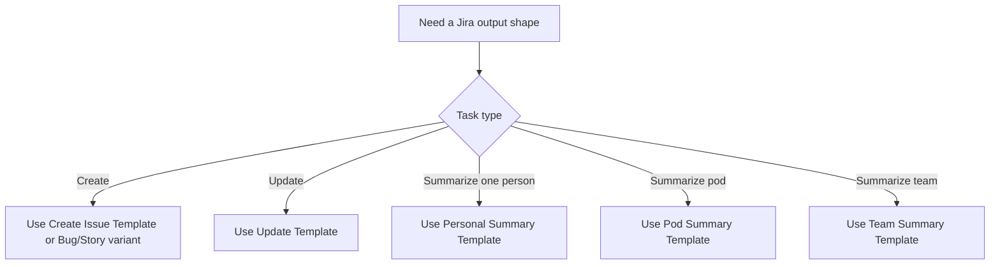

# Jira Templates Reference

Read this file when the user wants a reusable output template, when a create or update request needs a stronger structure, or when a summary should follow a predictable team format. Keep the final output lean; do not dump every template at once unless the user asks for a menu.

## When to use which template

- Use the **Create Issue Template** when the user wants a new Jira bug, story, task, epic, or subtask from rough notes.
- Use the **Update Template** when the user wants to revise an existing issue and needs a clear change plan or write-ready patch.
- Use the **Personal Summary Template** for standups, daily updates, or personal weekly recaps.
- Use the **Pod Summary Template** for a small squad or pod weekly status, risk review, or progress digest.
- Use the **Team Summary Template** for a broader manager-facing sprint or weekly summary.

## Create Issue Template

Use this when turning rough input into a Jira-ready issue draft.

```text
Jira Create Draft
- Project: <PROJECT_KEY>
- Issue type: <Story | Bug | Task | Epic | Subtask>
- Parent issue: <PARENT_KEY if subtask, else omit>
- Summary: <clear, action-oriented title>
- Problem / goal:
  <why this work exists>
- Scope:
  - <what is included>
  - <what is not included if important>
- Acceptance criteria:
  1. <criterion 1>
  2. <criterion 2>
  3. <criterion 3>
- Priority: <optional>
- Assignee: <optional>
- Labels: <optional>
- Components: <optional>
- Risks / dependencies:
  - <optional>
- Notes for Jira write:
  - <whether this is only a draft or should be created now>
```

### Create template guidance

- Write the summary as something a human can scan quickly on a board.
- Keep the description focused on problem, scope, and acceptance criteria rather than implementation trivia unless the user asked for technical detail.
- If information is missing, keep placeholders minimal and explicitly mark what still needs confirmation.

## Bug Template

Use this when the request is clearly defect-oriented.

```text
Jira Bug Draft
- Project: <PROJECT_KEY>
- Issue type: Bug
- Summary: <user-visible problem in one line>
- Impact:
  <who is affected and how>
- Symptoms:
  - <observable behavior>
- Expected behavior:
  - <what should happen>
- Steps to reproduce:
  1. <step>
  2. <step>
  3. <step>
- Environment:
  - <prod | staging | local | browser | app version>
- Acceptance criteria:
  1. <fix outcome>
  2. <regression guard>
  3. <validation condition>
- Priority: <optional>
- Labels / components: <optional>
```

## Story Template

Use this when the request is feature or workflow oriented.

```text
Jira Story Draft
- Project: <PROJECT_KEY>
- Issue type: Story
- Summary: <customer or team outcome>
- Goal:
  <what capability should exist>
- Context:
  <background or motivation>
- Scope:
  - <included>
  - <excluded if relevant>
- Acceptance criteria:
  1. <observable outcome>
  2. <observable outcome>
  3. <observable outcome>
- Dependencies:
  - <optional>
- Suggested subtasks:
  - <optional subtask>
  - <optional subtask>
```

## Update Template

Use this when preparing or previewing a Jira issue update.

```text
Jira Update Plan
- Issue key: <ISSUE_KEY>
- Update type: <description | status | comment | labels | assignee | subtasks | mixed>
- Current context needed:
  - <which fields should be read first, if any>
- Intended changes:
  - <field>: <new value or planned delta>
  - <field>: <new value or planned delta>
- Draft comment or description patch:
  <write-ready content if applicable>
- Risks of overwrite:
  - <what could be clobbered>
- Execution mode:
  - <draft only | apply now>
```

### Description rewrite pattern

When the user asks to improve or clarify an issue description, prefer this structure:

```text
Updated Jira Description
Goal
<short statement of what needs to happen>

Context
<why this matters, constraints, links, or dependencies>

Scope
- <included work>
- <included work>

Acceptance Criteria
1. <criterion>
2. <criterion>
3. <criterion>

Risks / Notes
- <optional>
```

### Comment template

Use this for execution updates, stakeholder notes, or blockers.

```text
Jira Comment Draft
- Status update:
  <what changed>
- Progress made:
  - <item>
- Blockers / risks:
  - <item>
- Next action:
  - <item>
```

## Personal Summary Template

Use this when summarizing one person’s work.

```text
Personal Jira Summary
- Scope: <person> | <time window>
- Progress made:
  - <issue key>: <meaningful movement>
  - <issue key>: <meaningful movement>
- In progress:
  - <issue key>: <current state>
- Blockers / risks:
  - <issue key or theme>: <why blocked>
- Next actions:
  - <likely next step>
```

### Personal summary guidance

- Optimize for standup readability.
- Prefer movement and obstacles over exhaustive ticket inventory.
- Keep it short unless the user explicitly asks for full detail.

## Pod Summary Template

Use this for a bounded pod or squad.

```text
Pod Jira Summary
- Scope: <pod> | <time window>
- Highlights:
  - <major progress item>
  - <major progress item>
- Tickets moved:
  - <issue key>: <movement>
  - <issue key>: <movement>
- Risks / blockers:
  - <shared blocker or dependency>
- Attention items:
  - <stale or urgent item>
- Recommended next actions:
  - <action>
  - <action>
```

### Pod summary guidance

- Emphasize changes that matter to the pod, not every small issue transition.
- Group related tickets into themes when that reads better than listing every key.
- Call out dependency and ownership problems explicitly.

## Team Summary Template

Use this for a broader audience such as managers or stakeholders.

```text
Team Jira Summary
- Scope: <team> | <time window>
- Overall progress:
  - <theme-level statement>
- Major wins:
  - <important advancement>
  - <important advancement>
- Risks / blockers:
  - <cross-team or high-impact issue>
- Aging / due soon:
  - <issue or theme requiring attention>
- Next actions / asks:
  - <decision, escalation, or follow-up>
```

### Team summary guidance

- Write for fast scanning by a broad audience.
- Prefer aggregated themes and meaningful signals over a raw ticket dump.
- Mention aging work, due-soon items, and cross-team blockers because these are usually what leaders care about most.

## Mini decision guide


