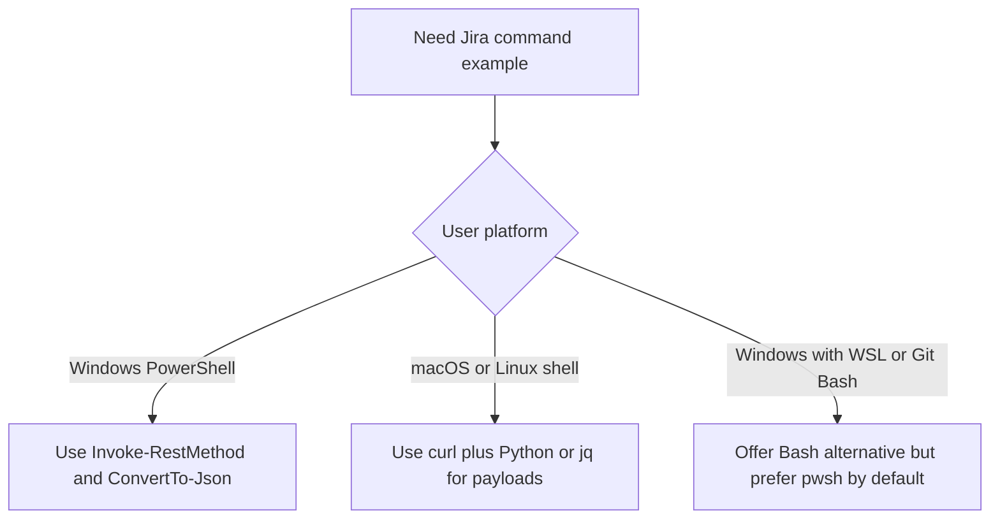

# Windows PowerShell Jira Workflow Reference

Read this file when the user is on Windows, mentions PowerShell, uses `pwsh` or `powershell`, or when Bash-style `curl`, heredocs, or environment variable syntax would be awkward or error-prone.

## Why this file exists

Many Jira REST examples online assume macOS or Linux shell behavior. On Windows, quoting, environment variables, multiline commands, and JSON payload construction behave differently. Use this reference to avoid brittle commands and to keep PowerShell examples readable and safe.

## Windows compatibility rules

1. Prefer **PowerShell-native** examples over Bash when the user is on Windows.
2. Prefer `Invoke-RestMethod` for Jira REST calls instead of alias-dependent `curl` behavior.
3. Use `$env:VAR_NAME` for environment variables in PowerShell.
4. Build JSON payloads from PowerShell hashtables and `ConvertTo-Json` rather than hand-escaping JSON strings.
5. For Basic auth with email and API token, build the Authorization header explicitly.
6. Never echo secrets back to the user. Refer to `$env:JIRA_API_TOKEN` or similar names instead.
7. If the user is on Windows but has Git Bash, WSL, or a compatible Unix shell, you may offer Bash as an alternative, but default to PowerShell unless they ask otherwise.

## Suggested environment variables on Windows

Use PowerShell syntax when showing examples:

- `$env:JIRA_BASE_URL`
- `$env:JIRA_EMAIL`
- `$env:JIRA_API_TOKEN`
- `$env:JIRA_PAT`
- `$env:JIRA_PROJECT_KEY`

If these are not set, explain what is missing and ask for the minimum required info.

## Auth header helper

Use this pattern for Jira Cloud style email + API token authentication:

```powershell
$pair = "$($env:JIRA_EMAIL):$($env:JIRA_API_TOKEN)"
$bytes = [System.Text.Encoding]::UTF8.GetBytes($pair)
$basicToken = [Convert]::ToBase64String($bytes)
$headers = @{
    Authorization = "Basic $basicToken"
    Accept        = "application/json"
    "Content-Type" = "application/json"
}
```

If the instance uses a PAT or another auth style, adapt the `Authorization` header to the user’s environment instead of forcing this pattern.

## Read a single issue

```powershell
$issueKey = "PROJ-123"
$fields = "summary,description,status,assignee,priority,labels,components,issuetype,updated,comment,parent,subtasks"
$url = "$($env:JIRA_BASE_URL)/rest/api/2/issue/$issueKey?fields=$fields"

$response = Invoke-RestMethod -Method Get -Uri $url -Headers $headers
$response | ConvertTo-Json -Depth 20
```

## Search issues with JQL

Prefer URL-encoding via .NET helpers or a request body rather than hand-encoding complex strings.

### GET-style example

```powershell
$jql = "project = PROJ AND assignee = currentUser() AND updated >= startOfWeek()"
$encodedJql = [System.Uri]::EscapeDataString($jql)
$fields = [System.Uri]::EscapeDataString("key,summary,status,priority,assignee,updated")
$url = "$($env:JIRA_BASE_URL)/rest/api/2/search?jql=$encodedJql&fields=$fields&maxResults=100"

$response = Invoke-RestMethod -Method Get -Uri $url -Headers $headers
$response.issues | ConvertTo-Json -Depth 20
```

### POST-style search example

Use this when JQL or field selection is long and readability matters.

```powershell
$body = @{
    jql        = "project = PROJ AND label = pod-alpha AND updated >= startOfWeek()"
    fields     = @("key", "summary", "status", "priority", "assignee", "updated")
    maxResults = 100
} | ConvertTo-Json -Depth 10

$response = Invoke-RestMethod -Method Post `
    -Uri "$($env:JIRA_BASE_URL)/rest/api/2/search" `
    -Headers $headers `
    -Body $body

$response.issues | ConvertTo-Json -Depth 20
```

## Create an issue

Build the payload as structured PowerShell objects.

```powershell
$payload = @{
    fields = @{
        project = @{ key = "PLAT" }
        issuetype = @{ name = "Story" }
        summary = "Automate pod-level weekly Jira summary"
        description = @"
Goal

Create a reusable Jira-based weekly summary workflow for pod reporting.

Acceptance Criteria
1. The workflow supports pod-level summary generation.
2. The output includes highlights, blockers, and next actions.
3. The workflow can be reused weekly with bounded scope.
"@
        labels = @("jira-automation", "reporting")
    }
} | ConvertTo-Json -Depth 20

$response = Invoke-RestMethod -Method Post `
    -Uri "$($env:JIRA_BASE_URL)/rest/api/2/issue" `
    -Headers $headers `
    -Body $payload

$response | ConvertTo-Json -Depth 10
```

## Update issue fields

```powershell
$issueKey = "OPS-132"
$payload = @{
    fields = @{
        summary = "Clarify OPS-132 scope and success criteria"
        labels  = @("ops", "clarified")
    }
} | ConvertTo-Json -Depth 20

Invoke-RestMethod -Method Put `
    -Uri "$($env:JIRA_BASE_URL)/rest/api/2/issue/$issueKey" `
    -Headers $headers `
    -Body $payload
```

## Add a comment

```powershell
$issueKey = "OPS-132"
$payload = @{
    body = @"
Status update
- Progress made: clarified scope and updated acceptance criteria.
- Blockers: awaiting confirmation from platform team.
- Next: finalize labels and move to In Progress.
"@
} | ConvertTo-Json -Depth 10

Invoke-RestMethod -Method Post `
    -Uri "$($env:JIRA_BASE_URL)/rest/api/2/issue/$issueKey/comment" `
    -Headers $headers `
    -Body $payload
```

## Transition an issue

Workflow transition IDs are instance-specific. Read available transitions first, then apply the chosen one.

### Read transitions

```powershell
$issueKey = "OPS-132"
$response = Invoke-RestMethod -Method Get `
    -Uri "$($env:JIRA_BASE_URL)/rest/api/2/issue/$issueKey/transitions" `
    -Headers $headers

$response.transitions | ConvertTo-Json -Depth 10
```

### Apply transition

```powershell
$issueKey = "OPS-132"
$payload = @{
    transition = @{ id = "31" }
} | ConvertTo-Json -Depth 10

Invoke-RestMethod -Method Post `
    -Uri "$($env:JIRA_BASE_URL)/rest/api/2/issue/$issueKey/transitions" `
    -Headers $headers `
    -Body $payload
```

## Create subtasks

```powershell
$payload = @{
    fields = @{
        project   = @{ key = "PLAT" }
        parent    = @{ key = "PLAT-101" }
        issuetype = @{ name = "Sub-task" }
        summary   = "Draft pod summary query and output structure"
        description = "Create the first version of the pod-level Jira reporting workflow."
    }
} | ConvertTo-Json -Depth 20

Invoke-RestMethod -Method Post `
    -Uri "$($env:JIRA_BASE_URL)/rest/api/2/issue" `
    -Headers $headers `
    -Body $payload
```

## Output handling on Windows

When the user wants a summary or preview on Windows, prefer readable console output or save JSON/text to files explicitly.

```powershell
$response.issues |
    Select-Object key,
                  @{Name='summary';Expression={$_.fields.summary}},
                  @{Name='status';Expression={$_.fields.status.name}},
                  @{Name='assignee';Expression={$_.fields.assignee.displayName}},
                  @{Name='updated';Expression={$_.fields.updated}} |
    Format-Table -AutoSize
```

## Cross-platform decision guide



## Common Windows pitfalls

- Do not assume Bash heredocs work in PowerShell.
- Do not rely on `curl` behaving like Unix curl; on some systems it maps to PowerShell aliases or behaves differently than expected.
- Do not hand-escape complex JSON inline when a hashtable plus `ConvertTo-Json` will be safer.
- Do not assume environment variables use `$VAR`; in PowerShell they use `$env:VAR`.
- Do not hardcode transition IDs or custom field IDs unless the user’s instance has confirmed them.

## Guidance for the skill

When the user is on Windows:
- Mention PowerShell examples first.
- If giving both Bash and PowerShell, clearly label them.
- Keep one primary path to avoid overwhelming the user.
- Prefer copy-pasteable blocks that work in a stock PowerShell session.
