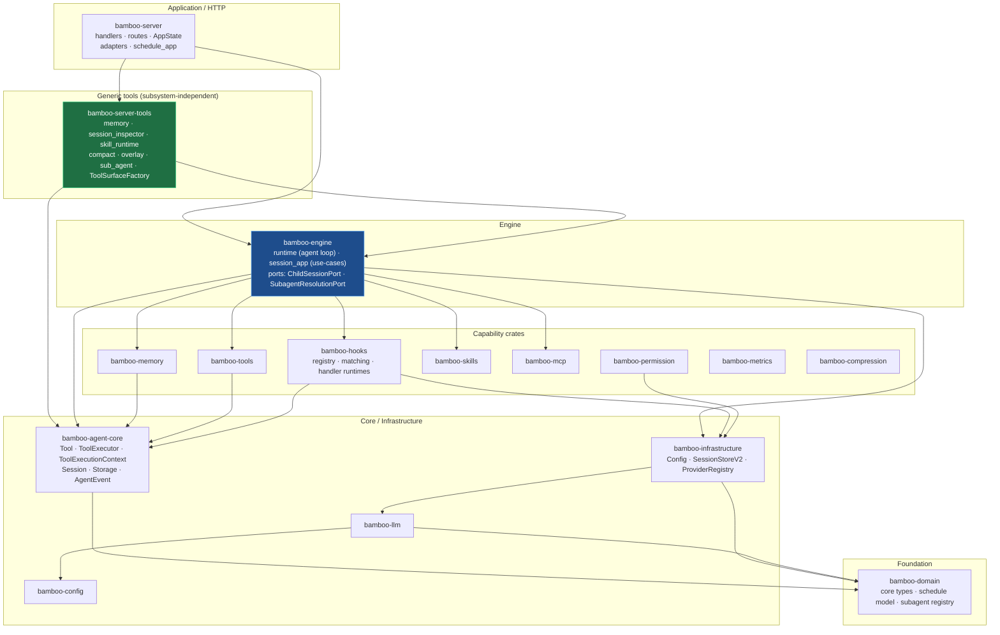
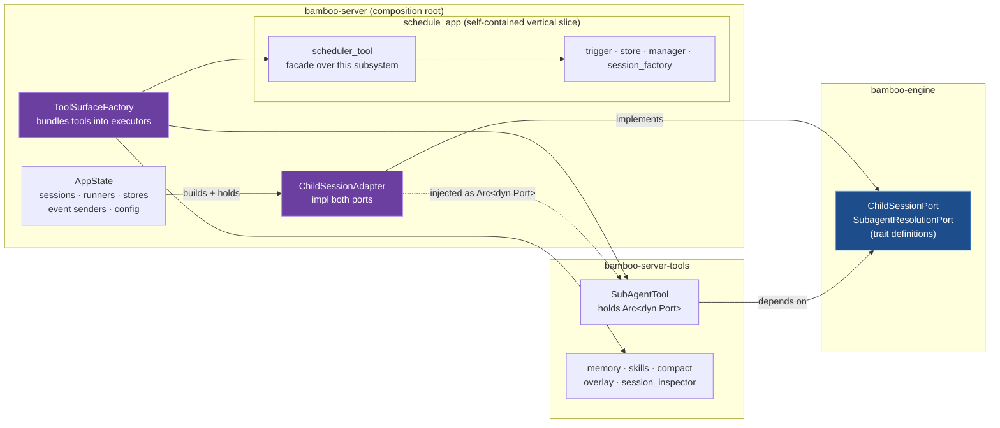

# Bamboo Crate Architecture

Layered Cargo workspace. Dependencies point **downward only** — no cycles.
The HTTP server is a thin top layer; the agent loop and use-cases live in
`bamboo-engine`; ports invert the dependency between generic tools and the
server's `AppState`.

## 1. Crate dependency layers

- **`bamboo-server-tools`** (green) — extracted in L1. Holds tools that are
  generic agent capabilities. Depends only on lower crates, never on
  `bamboo-server`/`AppState`.
- **`bamboo-engine`** (blue) — owns the agent loop **and** the port traits that
  let generic tools reach server runtime state without depending on the server.
- **`bamboo-hooks`** — owns lifecycle registration, matcher evaluation,
  deterministic dispatch, and the command/embedded-JavaScript runtimes. The
  engine owns lifecycle seams and applies returned control or context effects.

## 2. The port pattern (dependency inversion)

How a generic tool (`SubAgentTool`) reaches `AppState`-bound runtime state
without depending on `bamboo-server`, and why the scheduler tool stays inside
its subsystem instead.

**Reading it:**

- The dependency edge `SubAgentTool → AppState` is gone. It now points
  `SubAgentTool → Port` (engine), and `Adapter → Port` (server). The arrow was
  *inverted*: the tool and the server both depend on the engine-owned trait.
- `ChildSessionAdapter` (purple) is the only place the `AppState` runtime state
  is bound. It implements `ChildSessionPort` (session lifecycle: load/save/run/
  cancel + parent-wait + active children) and `SubagentResolutionPort`
  (subagent_type → model / metadata / prompt).
- `ToolSurfaceFactory` is the composition root that assembles the per-surface
  tool executors the agent runtime uses (Base / Child / WithTask / Root).
- **`scheduler_tool`** stays *inside* `schedule_app`: it is a facade over that
  subsystem (its args embed schedule-domain types; it returns schedule DTOs),
  not a subsystem-independent capability. Keeping it co-located preserves
  cohesion and makes `schedule_app` a clean slice ready to become its own crate.

## 3. What L1 changed

| | Before | After |
|---|---|---|
| Generic tools (memory, skills, compact, overlay, session_inspector) | `bamboo-server::server_tools` | `bamboo-server-tools` crate |
| `SubAgentTool` | held concrete `Arc<ChildSessionAdapter>` | holds `Arc<dyn ChildSessionPort>` + `Arc<dyn SubagentResolutionPort>`; lives in `bamboo-server-tools` |
| Ports | none | `ChildSessionPort` (extended) + `SubagentResolutionPort` in `bamboo-engine` |
| Scheduler tool | `bamboo-server::tools::schedule_tasks` | `bamboo-server::schedule_app::scheduler_tool` (with its subsystem) |
| `bamboo-server/src` | 49,465 LOC | 45,488 LOC |

Future moves this sets up: **L2** sink handler orchestration into
`engine::session_app` use-cases; **L5** lift the whole `schedule_app` slice
(incl. its tool) into a `bamboo-schedule` crate.
