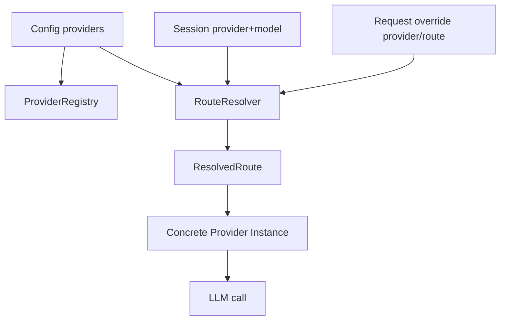
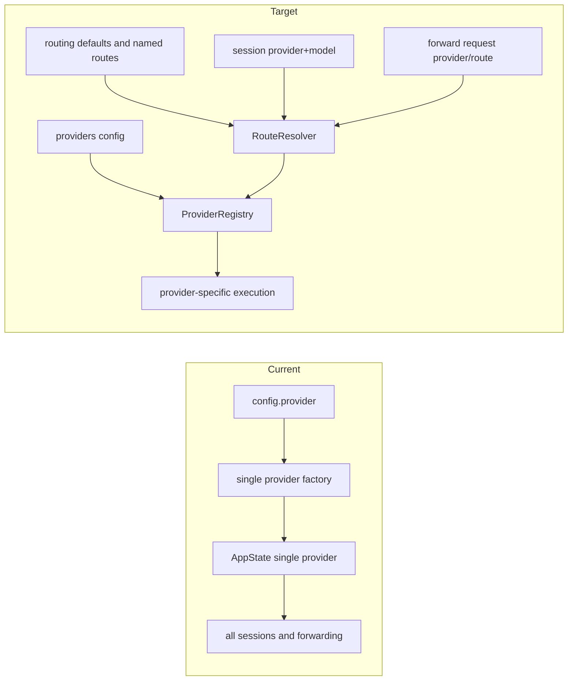
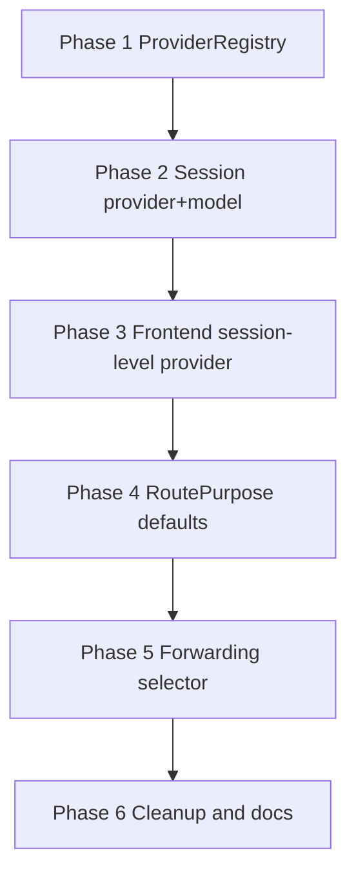

# Bamboo 多 Provider / 多模型路由重构方案

## 1. 结论

我建议把这次重构的目标定成两层：

1. **第一层：会话级多 provider**
   - 每个 session 持久化自己的 `provider + model`
   - 后端同时初始化多个 provider 实例
   - 执行时按 session 绑定的 provider 路由
   - 新建会话默认继承全局默认 provider

2. **第二层：能力级多 provider 路由**
   - `chat / fast / vision / memory_background / forwarding` 各自可以指向不同 provider/model
   - 标题生成、memory、vision、自动任务、转发接口都走统一 Route Resolver

这个方案和当前代码最兼容，迁移风险最低，扩展空间最大。

## 2. 当前代码现状

### 2.1 后端配置层仍然是单 active provider 语义

当前 `Config` 根上只有一个 `provider: String`，语义就是当前激活 provider：

- `bamboo/crates/bamboo-infrastructure/src/config/config.rs:206`
- `bamboo/crates/bamboo-infrastructure/src/config/config.rs:212`

同时 `providers` 只是 provider 配置集合：

- `bamboo/crates/bamboo-infrastructure/src/config/config.rs:291`
- `bamboo/crates/bamboo-infrastructure/src/config/config.rs:311`

### 2.2 所有默认模型/默认 reasoning 都依赖全局 provider

下面这些 helper 全都基于 `self.provider` 做分支：

- `get_model()` → `bamboo/crates/bamboo-infrastructure/src/config/config.rs:941`
- `get_fast_model()` → `bamboo/crates/bamboo-infrastructure/src/config/config.rs:965`
- `get_memory_background_model()` → `bamboo/crates/bamboo-infrastructure/src/config/config.rs:1000`
- `get_vision_model()` → `bamboo/crates/bamboo-infrastructure/src/config/config.rs:1072`
- `get_reasoning_effort()` → `bamboo/crates/bamboo-infrastructure/src/config/config.rs:1100`

这说明当前“默认模型/快模型/视觉模型/后台模型”都绑定在一个全局 provider 上。

### 2.3 Provider 工厂一次只创建一个 provider 实例

`create_provider_with_dir()` 对 `config.provider` 做 match，然后返回一个 `Arc<dyn LLMProvider>`：

- `bamboo/crates/bamboo-infrastructure/src/llm/provider_factory.rs:27`
- `bamboo/crates/bamboo-infrastructure/src/llm/provider_factory.rs:35`
- `bamboo/crates/bamboo-infrastructure/src/llm/provider_factory.rs:175`

这意味着运行时只有一个真正可用的 provider 实例。

### 2.4 AppState 也只持有一个全局 provider 句柄

`AppState` 里当前只有：

- `provider: Arc<RwLock<Arc<dyn LLMProvider>>>`
- `provider_handle: Arc<dyn LLMProvider>`

代码位置：

- `bamboo/crates/bamboo-server/src/app_state/mod.rs:167`
- `bamboo/crates/bamboo-server/src/app_state/mod.rs:176`

`reload_provider()` 也是按当前 `config.provider` 重新构建单实例：

- `bamboo/crates/bamboo-server/src/app_state/config_runtime.rs:35`
- `bamboo/crates/bamboo-server/src/app_state/config_runtime.rs:68`
- `bamboo/crates/bamboo-server/src/app_state/config_runtime.rs:75`

### 2.5 Session 只保存 model，没有 provider

`Session` 当前只有：

- `model: String`
- `reasoning_effort: Option<ReasoningEffort>`

代码位置：

- `bamboo/crates/bamboo-domain/src/session/types.rs:406`
- `bamboo/crates/bamboo-domain/src/session/types.rs:408`

当前 Session 结构无法表达：

- 这个 session 属于哪个 provider
- 这个 session 的 fast/vision/background 应该走哪个 provider
- 同名 model 在不同 provider 下的歧义

### 2.6 会话创建和执行都依赖全局默认 provider

创建 session 时：

- `CreateSessionConfig.default_model = config.get_model()`
- `CreateSessionConfig.default_reasoning_effort = config.get_reasoning_effort()`

代码位置：

- `bamboo/crates/bamboo-server/src/handlers/agent/sessions/handlers/crud/create.rs:62`
- `bamboo/crates/bamboo-server/src/handlers/agent/sessions/handlers/crud/create.rs:65`

执行时也一样：

- `ExecutionConfigSnapshot.default_model = config_snapshot.get_model()`
- `ExecutionConfigSnapshot.default_reasoning_effort = config_snapshot.get_reasoning_effort()`
- `ExecutionConfigSnapshot.provider_name = config_snapshot.provider.clone()`

代码位置：

- `bamboo/crates/bamboo-server/src/handlers/agent/execute/handler/mod.rs:43`
- `bamboo/crates/bamboo-server/src/handlers/agent/execute/handler/mod.rs:50`

`prepare_execute()` 当前模型决议链是：

- `session.model -> config.default_model -> request.model`

代码位置：

- `bamboo/crates/bamboo-server/src/session_app/execute.rs:41`
- `bamboo/crates/bamboo-server/src/session_app/execute.rs:48`

### 2.7 聊天阶段把 model 写回 session，但不保存 provider

`prepare_chat_turn()` 里：

- `session = repo.load_or_create(&input.session_id, &input.model)`
- `session.model = input.model`

代码位置：

- `bamboo/crates/bamboo-server/src/session_app/chat.rs:44`
- `bamboo/crates/bamboo-server/src/session_app/chat.rs:109`

当前后端会持久化“这轮用了哪个 model”，仍然缺少“这个 model 属于哪个 provider”。

### 2.8 设置 API 也是单 active provider 语义

设置接口返回：

- `provider`
- `available_providers`
- `providers`

代码位置：

- `bamboo/crates/bamboo-server/src/handlers/settings/provider/types.rs:6`
- `bamboo/crates/bamboo-server/src/handlers/settings/provider/types.rs:12`

更新接口也会直接 patch 根字段 `provider`，然后 reload 单 provider：

- `bamboo/crates/bamboo-server/src/handlers/settings/provider/endpoints/update.rs:19`
- `bamboo/crates/bamboo-server/src/handlers/settings/provider/endpoints/update.rs:46`
- `bamboo/crates/bamboo-server/src/handlers/settings/provider/endpoints/update.rs:55`

### 2.9 前端也把 provider 当成全局激活状态

前端 `providerStore` 当前是：

- `currentProvider`
- `providerConfig`
- `getActiveModel()` 按 `currentProvider` 取 `config.model`

代码位置：

- `lotus/src/pages/ChatPage/store/slices/providerSlice.ts:11`
- `lotus/src/pages/ChatPage/store/slices/providerSlice.ts:37`
- `lotus/src/pages/ChatPage/store/slices/providerSlice.ts:85`

### 2.10 前端 active model 优先级仍然是“session model + 全局 provider 默认 model”

`useActiveModel()` 当前逻辑：

1. 当前 session 的 `config.model`
2. `providerConfig.providers[currentProvider].model`

代码位置：

- `lotus/src/pages/ChatPage/hooks/useActiveModel.ts:33`
- `lotus/src/pages/ChatPage/hooks/useActiveModel.ts:49`

### 2.11 新建 session 和发消息都基于全局 currentProvider 的 active model

新建 session：

- `useProviderStore.getState().getActiveModel()`
- 然后 `agentClient.createSession({ model })`

代码位置：

- `lotus/src/pages/ChatPage/store/slices/chatSessionSlice.ts:490`
- `lotus/src/pages/ChatPage/store/slices/chatSessionSlice.ts:499`

发送消息：

- `useActiveModel(sessionId)` 得到 `activeModel`
- `sendMessage({ ..., model: activeModel })`

代码位置：

- `lotus/src/pages/ChatPage/hooks/useChatManager/useMessageStreaming.ts:293`
- `lotus/src/pages/ChatPage/hooks/useChatManager/useMessageStreaming.ts:310`

### 2.12 转发接口目前也是“协议前缀 + 当前全局 provider”

OpenAI / Anthropic / Gemini 路由当前只是不同协议入口：

- `bamboo/crates/bamboo-server/src/routes/provider.rs:10`
- `bamboo/crates/bamboo-server/src/routes/provider.rs:26`
- `bamboo/crates/bamboo-server/src/routes/provider.rs:39`

但具体执行依然拿的是：

- `app_state.get_provider().await`

代码位置：

- OpenAI models: `bamboo/crates/bamboo-server/src/handlers/openai/models.rs:18`
- OpenAI chat: `bamboo/crates/bamboo-server/src/handlers/openai/chat/non_stream.rs:37`
- Anthropic messages: `bamboo/crates/bamboo-server/src/handlers/anthropic/messages/non_stream.rs:19`

这意味着 `/openai/v1/*` 目前表达的是“OpenAI 协议”，实际底层依然是当前激活 provider。

### 2.13 Bodhi 对这次重构的影响很小

Bodhi 的前端实际上复用 Lotus：

- `bodhi/package.json:8`
- `bodhi/package.json:21`
- `bodhi/.frontend-package/frontend-manifest.json:3`

所以 UI 改造主战场在 `lotus`，Bodhi 主要做嵌入验证和打包验证。

## 3. 当前架构的核心问题

1. **provider 选择是全局共享状态**
   - 一个 provider 切换会影响所有新建会话、默认模型、兼容转发和系统辅助任务

2. **session 维度缺少 provider 身份**
   - 只能保存 `model`，无法稳定表达 `provider + model`

3. **多 provider 并发执行没有运行时支撑**
   - `AppState` 只有一个 provider 实例

4. **辅助能力无法跨 provider 组合**
   - `fast / vision / memory_background` 都绑定当前全局 provider

5. **协议转发接口缺少显式路由能力**
   - `/openai/v1/*`、`/anthropic/v1/*`、`/gemini/v1beta/*` 当前更像协议适配层，缺少 provider/route 选择能力

6. **前端把 provider 当成聊天全局状态**
   - 多会话并发使用不同 provider 时，当前 store 结构会互相污染

## 4. 目标能力模型

### 4.1 我建议的目标能力

#### A. 会话级绑定
每个 session 都有自己的主路由：

- `provider`
- `model`
- `reasoning_effort`

#### B. 能力级绑定
系统内部的不同任务可以各走自己的 route：

- `chat`
- `fast`
- `vision`
- `memory_background`
- `forward_openai`
- `forward_anthropic`
- `forward_gemini`

#### C. 转发级绑定
兼容接口支持明确指定：

- provider
- route
- protocol
- model

## 5. 推荐目标架构

### 5.1 核心抽象

#### ProviderId
```ts
"openai" | "anthropic" | "gemini" | "copilot"
```

#### ModelTarget
```ts
{
  provider: ProviderId,
  model: string
}
```

#### RoutePurpose
```ts
"chat" | "fast" | "vision" | "memory_background" | "forward_openai" | "forward_anthropic" | "forward_gemini"
```

#### NamedRoute
```ts
{
  name: string,
  provider: ProviderId,
  model?: string,
  reasoning_effort?: string,
  protocol?: "openai" | "anthropic" | "gemini",
  use_provider_defaults?: boolean
}
```

#### SessionRouteState
```ts
{
  provider: ProviderId,
  model: string,
  reasoning_effort?: string,
  route_name?: string
}
```

### 5.2 运行时结构



### 5.3 当前架构到目标架构的变化



## 6. 具体设计

## 6.1 配置层重构

### 推荐做法

**短期保留 `config.provider` 字段本身，改变它的语义：**

- 旧语义：当前激活 provider
- 新语义：默认 provider / 新会话默认 provider / 默认转发 provider

这个做法有三个优点：

1. 配置文件兼容性最好
2. 前后端现有字段可以平滑复用
3. migration 成本低

### 新增字段建议

```json
{
  "provider": "copilot",
  "providers": {
    "copilot": { "model": "gpt-4o" },
    "openai": { "model": "gpt-4.1", "fast_model": "gpt-4o-mini" },
    "gemini": { "model": "gemini-2.5-pro" }
  },
  "routing": {
    "defaults": {
      "chat": { "provider": "copilot" },
      "fast": { "provider": "openai", "model": "gpt-4o-mini" },
      "vision": { "provider": "gemini", "model": "gemini-2.5-pro" },
      "memory_background": { "provider": "openai", "model": "gpt-4o-mini" },
      "forward_openai": { "provider": "openai", "protocol": "openai" },
      "forward_anthropic": { "provider": "anthropic", "protocol": "anthropic" },
      "forward_gemini": { "provider": "gemini", "protocol": "gemini" }
    },
    "named": {
      "team-main": { "provider": "openai", "model": "gpt-4.1" },
      "cheap-fast": { "provider": "openai", "model": "gpt-4o-mini" }
    }
  }
}
```

### 配置方法调整建议

当前这些方法：

- `get_model()`
- `get_fast_model()`
- `get_vision_model()`
- `get_memory_background_model()`
- `get_reasoning_effort()`

建议演进为两层：

1. **兼容层**
   - 保留旧方法，语义变成“从默认 route 解析”

2. **新能力层**
   - `resolve_route_for_purpose(purpose)`
   - `resolve_model_target_for_provider(provider)`
   - `resolve_named_route(name)`

## 6.2 Provider 运行时重构

### 推荐做法：ProviderRegistry + Router

#### 新结构

```rust
pub struct ProviderRegistry {
    providers: HashMap<String, Arc<dyn LLMProvider>>,
}

pub struct RouteResolver {
    config: Arc<RwLock<Config>>,
}

pub struct RoutingProvider {
    registry: Arc<RwLock<ProviderRegistry>>,
    resolver: Arc<RouteResolver>,
}
```

### 为什么推荐这个结构

1. 现有大量调用点依赖 `Arc<dyn LLMProvider>`
2. `RoutingProvider` 可以继续实现 `LLMProvider`，减少引擎层震荡
3. `ProviderRegistry` 可以单独暴露 `get_provider_by_id()` 给 `/models` 等不适合走统一 trait 的场景

### AppState 目标结构

当前：

- `provider`
- `provider_handle`

目标：

- `provider_registry`
- `routing_provider_handle`
- `route_resolver`

可以保留：

- `get_provider()` 返回 router handle，兼容旧调用
- 新增 `get_provider_by_id(provider_id)`
- 新增 `resolve_route(...)`

### reload 行为

当前 `reload_provider()` 会重建一个 provider。

目标建议：

- `reload_providers()` 重建所有已配置 provider
- 支持部分 provider 构建失败时保留旧实例或用 unavailable stub 占位
- Settings 页仍然可以保存配置，即便其中一个 provider 当前不可用

## 6.3 Session 数据模型重构

### 推荐字段变化

当前：

```rust
pub model: String,
pub reasoning_effort: Option<ReasoningEffort>,
```

目标：

```rust
pub provider: Option<String>,
pub model: String,
pub reasoning_effort: Option<ReasoningEffort>,
pub route_name: Option<String>,
```

### 设计建议

我建议：

- **第一期先加 `provider: Option<String>`**
- `route_name` 留到第二期或第三期
- 新 session 一律写入 provider
- 旧 session 读到 `provider == None` 时，按默认 provider 解析并在下次写回时补齐

### SessionSummary / SessionIndexEntry 同步加 provider

当前前端 session list 只拿到 `model`：

- `bamboo/crates/bamboo-server/src/handlers/agent/sessions/types.rs:15`

建议新增：

```rust
pub provider: Option<String>,
```

这样前端可以在列表、标签、过滤器里直接显示 provider。

## 6.4 聊天 / 执行链路重构

### 聊天阶段

当前 `ChatRequest` 只有 `model`：

- `bamboo/crates/bamboo-server/src/handlers/agent/chat/types.rs:16`
- `bamboo/crates/bamboo-server/src/handlers/agent/chat/types.rs:32`

建议改成：

```rust
pub struct ChatRequest {
    pub message: String,
    pub session_id: Option<String>,
    pub provider: Option<String>,
    pub model: String,
    pub reasoning_effort: Option<ReasoningEffort>,
    ...
}
```

聊天 prepare 时：

1. 先 resolve `provider`
   - request.provider
   - existing session.provider
   - config.provider 默认 provider

2. 再 resolve `model`
   - request.model
   - session.model
   - provider default model

3. 将 `session.provider` 与 `session.model` 一起持久化

### 执行阶段

当前 `prepare_execute()` 只 resolve model / reasoning：

- `bamboo/crates/bamboo-server/src/session_app/execute.rs:41`
- `bamboo/crates/bamboo-server/src/session_app/execute.rs:58`

目标建议加上 `effective_provider`：

```rust
session.provider -> request.provider -> config.provider
```

最终执行产物应变成：

```rust
Ready {
  effective_provider,
  effective_model,
  effective_reasoning_effort,
  ...
}
```

这样 agent runner 和 metrics 都能拿到稳定 provider 身份。

## 6.5 辅助能力路由重构

当前这些系统任务都间接受全局 provider 影响：

- memory background model
- auto dream
- title generation
- mermaid fix
- vision/image fallback
- schedule 默认执行

### 推荐规则

#### 第一阶段
- 先让这些场景继续使用“当前默认 route”
- 当前行为保持稳定

#### 第二阶段
- 按 `RoutePurpose` 统一决议：
  - `chat`
  - `fast`
  - `vision`
  - `memory_background`

这样可以支持：

- 主对话走 Anthropic
- 标题/总结走 OpenAI 便宜模型
- 图片理解走 Gemini

## 6.6 转发接口重构

### 当前状态

当前前缀：

- `/openai/v1/*`
- `/anthropic/v1/*`
- `/gemini/v1beta/*`

表达的是协议外观，底层仍走当前全局 provider。

### 推荐目标

把“协议”和“路由”拆开。

#### 方案 A：默认前缀 + 显式 selector

保留：

- `/openai/v1/*`
- `/anthropic/v1/*`
- `/gemini/v1beta/*`

新增可选选择器：

- Header: `X-Bamboo-Provider: openai`
- Header: `X-Bamboo-Route: team-main`
- Query: `?provider=openai`
- Query: `?route=team-main`

#### 方案 B：路径化 selector

新增：

- `/openai/v1/providers/{provider}/chat/completions`
- `/openai/v1/routes/{route}/chat/completions`

### 推荐落地顺序

我建议：

1. **先做 A**，成本低，兼容性好
2. **再补 B**，方便调试与文档表达

### `/models` 的建议行为

当前 `/openai/v1/models` 使用 `app_state.get_provider()`：

- `bamboo/crates/bamboo-server/src/handlers/openai/models.rs:18`

目标建议：

- 如果指定 `provider/route`，返回该目标的 model 列表
- 如果未指定，返回默认 `forward_openai` route 的 model 列表

## 6.7 前端重构

### 6.7.1 状态模型重构

当前前端把 provider 当成全局聊天状态：

- `currentProvider`
- `selectedModel`

目标建议拆成三层：

#### A. Settings 层
- `defaultProvider`
- `providerConfigs`
- `routingDefaults`
- `namedRoutes`

#### B. New Session Draft 层
- `draftProvider`
- `draftModel`
- `draftReasoningEffort`

#### C. Session 层
- `session.config.provider`
- `session.config.model`
- `session.config.reasoningEffort`

### 6.7.2 useActiveModel 升级为 useActiveRoute

当前 hook：

- `lotus/src/pages/ChatPage/hooks/useActiveModel.ts:28`

建议升级为：

```ts
export function useActiveRoute(sessionId?: string | null) {
  return {
    provider,
    model,
    reasoningEffort,
  };
}
```

优先级：

1. 当前 session persisted provider/model
2. draft provider/model
3. settings 默认 provider + 默认 chat route

### 6.7.3 InputContainer 增加 provider 选择

当前 `InputContainer` 已经拿到：

- `currentProvider`
- `providerConfig`
- `activeModel`

代码位置：

- `lotus/src/pages/ChatPage/components/InputContainer/index.tsx:168`
- `lotus/src/pages/ChatPage/components/InputContainer/index.tsx:176`

建议改成：

- provider 下拉
- model 下拉
- reasoning 下拉

编辑当前 session 时，改动直接 patch session。

### 6.7.4 新建会话时显式传 provider

当前新建 session：

- `createSession({ model, reasoning_effort })`

代码位置：

- `lotus/src/pages/ChatPage/store/slices/chatSessionSlice.ts:494`

建议改成：

- `createSession({ provider, model, reasoning_effort })`

### 6.7.5 发消息时显式传 provider

当前发送消息：

- `sendMessage({ model: activeModel, ... })`

代码位置：

- `lotus/src/pages/ChatPage/hooks/useChatManager/useMessageStreaming.ts:293`
- `lotus/src/pages/ChatPage/hooks/useChatManager/useMessageStreaming.ts:310`

建议改成：

- `sendMessage({ provider: activeProvider, model: activeModel, reasoning_effort, ... })`

### 6.7.6 模型拉取统一改为“按 provider 拉取”

当前聊天侧 `ModelService.getModels()` 走的是 `/openai/v1/models`：

- `lotus/src/services/chat/ModelService.ts:39`
- `lotus/src/services/chat/ModelService.ts:45`

而 Settings 已经有更好的接口：

- `/bamboo/settings/provider/models`
- `lotus/src/services/config/SettingsService.ts:130`

建议统一：

- Chat composer / Settings 都走 `fetchProviderModels(provider)`
- `ModelService` 退回到 SDK/OpenAI 兼容调试用途

## 7. 推荐迁移顺序

## Phase 1：后端基础设施先到位

### 目标
让 Bamboo 同时持有多个 provider 实例。

### 任务
1. `provider_factory.rs` 新增：
   - `create_provider_for_type(config, provider_id)`
   - `create_provider_registry(config)`
2. `AppState` 增加：
   - `provider_registry`
   - `get_provider_by_id()`
3. 保留 `get_provider()`，返回 router/default handle
4. `reload_provider()` 升级为 `reload_providers()`

### 验收标准
- 配置了 2 个 provider 时，服务启动后两个 provider 都可查询状态
- 某个 provider 初始化失败时，其他 provider 仍可用

## Phase 2：Session 持久化 provider + model

### 目标
让每个 session 拥有稳定的 provider 身份。

### 任务
1. `Session` 增加 `provider`
2. `SessionSummary` / `SessionIndexEntry` 增加 `provider`
3. `CreateSessionRequest` / `PatchSessionRequest` / `ChatRequest` 加 `provider`
4. `prepare_chat_turn()`、`prepare_execute()` 加 provider 决议逻辑
5. 历史 session 兼容读取

### 验收标准
- 新建 session 后，session summary 可看到 provider
- 同时存在 OpenAI session 和 Anthropic session
- 切换默认 provider 不影响已有 session 执行

## Phase 3：前端把 provider 变成 session 级状态

### 目标
前端可以在不同 session 中同时使用不同 provider。

### 任务
1. `providerSlice` 改语义：
   - `currentProvider` → `defaultProvider`
2. session config 新增 `provider`
3. `useActiveModel` 升级为 `useActiveRoute`
4. `InputContainer` 增加 provider 选择器
5. create / patch / sendMessage 都传 `provider`

### 验收标准
- session A 用 OpenAI，session B 用 Anthropic，可来回切换
- session A/B 的 provider 不互相覆盖

## Phase 4：能力级 route defaults

### 目标
支持 chat / fast / vision / memory_background 各走不同 provider。

### 任务
1. config 新增 `routing.defaults`
2. RouteResolver 实现 `resolve_route_for_purpose()`
3. title generation / mermaid fix / memory / auto dream / image handling 接入 route purpose

### 验收标准
- chat 走 provider A
- fast/background 走 provider B
- vision 走 provider C
- metrics 能区分 provider/model

## Phase 5：兼容转发接口支持显式路由

### 目标
`/openai/v1/*` 等接口支持明确指定目标 provider/route。

### 任务
1. OpenAI / Anthropic / Gemini handlers 增加 route selector 提取
2. `/models` 支持 provider/route selector
3. 增加 header/query/path 三种选择方式中的至少两种
4. 文档补充 selector 规则

### 验收标准
- 外部 SDK 可以通过 header/query 指定 provider
- 默认转发仍保持兼容

## Phase 6：清理旧单-provider 假设

### 目标
移除容易引起歧义的全局 active provider 逻辑。

### 任务
1. UI 文案从 “Active Provider” 改成 “Default Provider”
2. 移除聊天侧对 `currentProvider` 的隐式依赖
3. 旧 helper 保留兼容层，内部改为 route resolver

### 验收标准
- 代码主路径里没有“全局激活 provider 驱动所有请求”的假设

## 8. 详细实施清单

## 8.1 后端改造点

### Config / infrastructure
- `bamboo/crates/bamboo-infrastructure/src/config/config.rs`
- `bamboo/crates/bamboo-infrastructure/src/llm/provider_factory.rs`
- `bamboo/crates/bamboo-infrastructure/src/lib.rs`

### Server app state / runtime
- `bamboo/crates/bamboo-server/src/app_state/mod.rs`
- `bamboo/crates/bamboo-server/src/app_state/init.rs`
- `bamboo/crates/bamboo-server/src/app_state/config_runtime.rs`
- `bamboo/crates/bamboo-server/src/app_state/provider_api.rs`

### Session / use case
- `bamboo/crates/bamboo-domain/src/session/types.rs`
- `bamboo/crates/bamboo-server/src/session_app/types.rs`
- `bamboo/crates/bamboo-server/src/session_app/chat.rs`
- `bamboo/crates/bamboo-server/src/session_app/execute.rs`
- `bamboo/crates/bamboo-server/src/session_app/session_create.rs`

### HTTP handlers / API contracts
- `bamboo/crates/bamboo-server/src/handlers/agent/chat/types.rs`
- `bamboo/crates/bamboo-server/src/handlers/agent/chat/handler/mod.rs`
- `bamboo/crates/bamboo-server/src/handlers/agent/sessions/types.rs`
- `bamboo/crates/bamboo-server/src/handlers/agent/sessions/handlers/crud/create.rs`
- `bamboo/crates/bamboo-server/src/handlers/settings/provider/types.rs`
- `bamboo/crates/bamboo-server/src/handlers/settings/provider/endpoints/get.rs`
- `bamboo/crates/bamboo-server/src/handlers/settings/provider/endpoints/update.rs`
- `bamboo/crates/bamboo-server/src/handlers/settings/provider/models/dispatch.rs`

### Forwarding handlers
- `bamboo/crates/bamboo-server/src/routes/provider.rs`
- `bamboo/crates/bamboo-server/src/handlers/openai/**/*`
- `bamboo/crates/bamboo-server/src/handlers/anthropic/**/*`
- `bamboo/crates/bamboo-server/src/handlers/gemini/**/*`

### Background / internal capabilities
- `bamboo/crates/bamboo-memory/**/*`
- `bamboo/crates/bamboo-server/src/schedule_app/**/*`
- 标题生成 / mermaid fix / 视觉相关路径

## 8.2 前端改造点

- `lotus/src/pages/ChatPage/types/providerConfig.ts`
- `lotus/src/pages/ChatPage/store/slices/providerSlice.ts`
- `lotus/src/pages/ChatPage/store/slices/modelSlice.ts`
- `lotus/src/pages/ChatPage/hooks/useActiveModel.ts`
- `lotus/src/pages/ChatPage/store/slices/chatSessionSlice.ts`
- `lotus/src/pages/ChatPage/hooks/useChatManager/useMessageStreaming.ts`
- `lotus/src/pages/ChatPage/components/InputContainer/index.tsx`
- `lotus/src/pages/SettingsPage/components/ProviderSettings/index.tsx`
- `lotus/src/services/config/SettingsService.ts`
- `lotus/src/services/chat/ModelService.ts`
- `lotus/src/services/chat/AgentService.ts`

## 8.3 Bodhi 改造点

Bodhi 代码主逻辑改动很少，重点是验证：

- `bodhi/package.json`
- `bodhi/src-tauri/src/lib.rs`

核心工作仍然在 Lotus。

## 9. API 兼容策略

### 建议兼容策略

#### 9.1 配置接口
- 保留 `provider` 字段
- 语义调整为默认 provider
- 新增 `routing` 字段

#### 9.2 Session 接口
- `provider` 字段新增为 optional
- 前端老版本不传时，后端使用默认 provider

#### 9.3 Chat 接口
- `provider` 字段新增为 optional
- 不传时按 session.provider 或默认 provider 处理

#### 9.4 转发接口
- 保留当前 `/openai/v1/*`、`/anthropic/v1/*`、`/gemini/v1beta/*`
- 增量支持 selector

## 10. 测试计划

## 10.1 后端测试

### 单元测试
1. route resolver
2. session provider fallback
3. config compatibility
4. provider registry reload
5. forwarding selector resolution

### 集成测试
1. OpenAI + Anthropic 同时配置
2. session A / session B 分别执行不同 provider
3. 默认 provider 改变后，旧 session 保持原 provider
4. `fast` route 跨 provider 生效
5. `/openai/v1/models?provider=openai` 返回目标 provider models

## 10.2 前端测试

1. provider store 语义变化测试
2. `useActiveRoute()` 优先级测试
3. 新建 session provider/model 传递测试
4. 切换 session 不污染 provider/model 测试
5. InputContainer provider selector 交互测试

## 10.3 E2E 测试

1. 创建两个 session，分别绑定不同 provider
2. 两个 session 交替发消息
3. 修改默认 provider，新 session 生效，旧 session 保持不变
4. Settings 中为不同 provider 拉取 models
5. forwarding 接口带 selector 请求成功

## 11. 风险与控制

### 风险 1：改动面很大
**控制策略**：先做 provider registry，再做 session provider，再做 route purpose。

### 风险 2：旧 session provider 无法精确反推
**控制策略**：旧 session 使用默认 provider fallback，并在首次写回时补齐 provider。

### 风险 3：前端全局状态与 session 状态混用
**控制策略**：把 defaultProvider 和 session provider 明确拆层。

### 风险 4：转发接口选择规则复杂
**控制策略**：先支持 header/query，后补 path selector。

## 12. 我建议你拍板的三个设计决定

### 决定 1
**保留 `config.provider` 字段，语义改为默认 provider。**

我建议直接这样做，兼容性最好。

### 决定 2
**Session 第一阶段直接新增 `provider` 字段。**

我建议第一阶段就做，不要继续把 provider 藏在 metadata。

### 决定 3
**RoutePurpose 分阶段落地。**

我建议：

- 第一阶段：只完成 session 级 provider + model
- 第二阶段：再完成 `fast / vision / memory_background / forwarding`

这个节奏最稳。

## 13. 推荐实施顺序摘要



## 14. 最终建议

我建议把这次重构定义成：

- **后端核心目标：single active provider → provider registry + route resolver**
- **前端核心目标：global currentProvider → settings defaultProvider + session provider**
- **数据核心目标：session 只存 model → session 持久化 provider + model**
- **转发核心目标：protocol prefix only → protocol + explicit route selection**

按这个方向推进，Bamboo 就能稳定支持：

1. 多 session 同时使用不同 provider
2. 单个产品内不同能力走不同 provider
3. 外部 SDK/兼容接口显式转发到指定 provider
