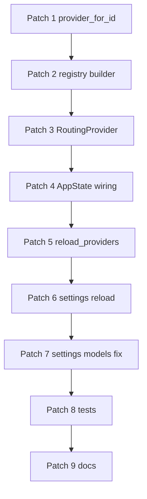

# Phase 1 Patch 级实施清单

基于 `bamboo/docs/phase1-provider-registry-plan.md`，这里把 Phase 1 进一步拆成可直接开工的 patch 顺序。

## Patch 1：提取按 provider_id 构建 provider 的能力

### 目标
把当前 `create_provider_with_dir(config, app_data_dir)` 内部按 `config.provider` 分支的逻辑提取成可复用的 `create_provider_for_id(...)`。

### 修改文件
- `bamboo/crates/bamboo-infrastructure/src/llm/provider_factory.rs`
- `bamboo/crates/bamboo-infrastructure/src/llm/mod.rs`

### 具体修改
1. 新增：
   - `create_provider_for_id(config: &Config, provider_id: &str, app_data_dir: PathBuf) -> Result<Arc<dyn LLMProvider>, LLMError>`
2. 让现有 `create_provider_with_dir(config, app_data_dir)` 变成：
   - `create_provider_for_id(config, config.provider.as_str(), app_data_dir)`
3. 保留 `AVAILABLE_PROVIDERS`
4. 保持现有 provider-specific 构建逻辑完全不变

### 验收标准
- 所有现有 provider factory 测试继续通过
- 不改动现有调用点行为

## Patch 2：新增 provider registry snapshot builder

### 目标
构建多 provider registry 的纯 builder 层，先不接 AppState。

### 新增文件
- `bamboo/crates/bamboo-infrastructure/src/llm/provider_registry.rs`

### 具体修改
新增结构：

```rust
pub struct ProviderRegistrySnapshot {
    pub default_provider_id: String,
    pub providers: HashMap<String, Arc<dyn LLMProvider>>,
    pub failed_providers: Vec<(String, String)>,
}
```

新增函数：

```rust
pub async fn create_provider_registry_with_dir(
    config: &Config,
    app_data_dir: PathBuf,
) -> ProviderRegistrySnapshot
```

策略：

1. 枚举所有“已配置 provider”
2. 逐个调用 `create_provider_for_id`
3. 记录成功与失败
4. 默认 provider 单独标记

### 已配置 provider 判定建议
- `copilot`: provider config 存在，或默认 provider 就是 copilot
- `openai`: `providers.openai.is_some()`
- `anthropic`: `providers.anthropic.is_some()`
- `gemini`: `providers.gemini.is_some()`

### 验收标准
- 一个 config 同时配置 openai + anthropic 时能同时拿到两个实例
- 某个 provider 失败时 `failed_providers` 有结构化记录

## Patch 3：server 侧新增 RoutingProvider

### 目标
提供一个新的 `Arc<dyn LLMProvider>` 兼容句柄，内部按默认 provider 路由。

### 新增文件
- `bamboo/crates/bamboo-server/src/routing_provider.rs`

### 具体修改
新增结构：

```rust
pub struct ProviderRegistryState {
    pub default_provider_id: String,
    pub providers: HashMap<String, Arc<dyn LLMProvider>>,
}

pub struct RoutingProvider {
    registry: Arc<RwLock<ProviderRegistryState>>,
}
```

实现 `LLMProvider`：
- `chat_stream`
- `chat_stream_with_options`
- `list_models`
- `list_model_info`

行为：
1. 读 `default_provider_id`
2. 从 `providers` 里取 provider
3. 调对应方法
4. provider 缺失时返回 `LLMError::Auth` / `LLMError::Api`

### 额外建议
加一个私有 helper：

```rust
async fn current_provider(&self) -> Result<Arc<dyn LLMProvider>>
```

### 验收标准
- RoutingProvider 能像旧 provider handle 一样工作
- `list_models()` 返回默认 provider 的 models

## Patch 4：AppState 切到 registry 语义

### 目标
把 AppState 从单 provider lock 改成多 provider registry lock。

### 修改文件
- `bamboo/crates/bamboo-server/src/app_state/mod.rs`
- `bamboo/crates/bamboo-server/src/app_state/init.rs`
- `bamboo/crates/bamboo-server/src/app_state/builder.rs`
- `bamboo/crates/bamboo-server/src/app_state/provider_api.rs`

### 具体修改

#### `app_state/mod.rs`
当前：
```rust
pub provider: Arc<RwLock<Arc<dyn LLMProvider>>>,
provider_handle: Arc<dyn LLMProvider>,
```

改成：
```rust
pub provider_registry: Arc<RwLock<ProviderRegistryState>>,
provider_handle: Arc<dyn LLMProvider>,
```

#### `app_state/init.rs`
当前：
- `build_provider_handles(provider)`

改成：
- `build_provider_registry_handles(registry_state)`

输出：
- `provider_registry_lock`
- `routing_provider_handle`

#### `app_state/builder.rs`
启动流程改成：
1. `Config::from_data_dir(...)`
2. `create_provider_registry_with_dir(...)`
3. 如果默认 provider 缺失，则给默认 provider 放一个 `UnconfiguredProvider`
4. `build_provider_registry_handles(...)`
5. `Agent::builder().provider(provider_handle.clone())`

#### `app_state/provider_api.rs`
保留：
- `get_provider()`

新增：
- `get_provider_by_id(provider_id)`
- `list_available_provider_ids()`
- `default_provider_id()`

### 验收标准
- `AppState::new()` 继续通过
- 现有调用 `state.get_provider().await` 不用改
- `state.get_provider_by_id("openai")` 可用

## Patch 5：实现 reload_providers()

### 目标
将 config reload 升级成 registry reload。

### 修改文件
- `bamboo/crates/bamboo-server/src/app_state/config_runtime.rs`

### 具体修改
新增：

```rust
pub async fn reload_providers(&self) -> Result<ProviderRegistryReloadReport, LLMError>
```

行为：
1. clone config
2. 构建新的 registry snapshot
3. 校验默认 provider 是否可用
4. 原子替换 `provider_registry`
5. 返回 report

兼容层：

```rust
pub async fn reload_provider(&self) -> Result<(), LLMError> {
    self.reload_providers().await.map(|_| ())
}
```

### 默认 provider reload 策略
推荐：
- 如果新默认 provider 构建失败且旧 registry 可用，保留旧 registry 并返回错误
- 如果这是启动初始化路径，才允许 stub 降级

### 验收标准
- 热更新成功时 registry 原子替换
- 热更新失败时旧 registry 保留

## Patch 6：设置接口接入新 reload report

### 目标
让 settings reload endpoint 返回多 provider 语义。

### 修改文件
- `bamboo/crates/bamboo-server/src/handlers/settings/provider/endpoints/reload.rs`
- `bamboo/crates/bamboo-server/src/handlers/settings/provider/endpoints/update.rs`

### 具体修改
- `reload.rs` 调用 `reload_providers()`
- response 增加：
  - `provider` / `default_provider`
  - `available_providers`
  - `failed_providers`

`update.rs` 当前保存配置后直接 `reload_provider()`：
- 改成调用 `reload_providers()`
- 返回多 provider report

### 验收标准
- 更新 provider 配置后，返回结构化可用/失败 provider 信息

## Patch 7：修复 settings provider models 的默认 provider 假设

### 目标
让 `fetch_provider_models(provider)` 真正按目标 provider 获取模型，尤其是 copilot。

### 修改文件
- `bamboo/crates/bamboo-server/src/handlers/settings/provider/models/dispatch.rs`

### 具体修改
当前 copilot 分支：
- `app_state.get_provider().await`

改成：
- `app_state.get_provider_by_id("copilot")`

未来如果再扩展其他 provider 本地直连，也走 `get_provider_by_id(target)`。

### 验收标准
- 默认 provider 不是 copilot 时，仍然可以拉取 copilot models

## Patch 8：测试补齐

### 修改/新增文件
- `bamboo/crates/bamboo-server/src/app_state/tests.rs`
- `bamboo/tests/provider_integration.rs`
- 视需要新增：
  - `bamboo/crates/bamboo-server/src/routing_provider/tests.rs`
  - `bamboo/crates/bamboo-infrastructure/src/llm/provider_registry/tests.rs`

### 测试项

#### A. infrastructure
1. `create_provider_for_id` 成功路径
2. `create_provider_registry_with_dir` 多 provider 构建
3. registry snapshot 正确记录 failed providers

#### B. routing provider
4. RoutingProvider 将请求路由到默认 provider
5. 修改 default provider 后 RoutingProvider 行为切换

#### C. app state
6. `AppState::new()` 在多 provider config 下初始化成功
7. `get_provider_by_id()` 返回目标 provider
8. `reload_providers()` 成功替换 registry
9. `reload_providers()` 默认 provider 失败时保留旧 registry

#### D. settings
10. settings provider models 的 copilot 分支不再依赖默认 provider

## Patch 9：文档和注释同步

### 修改文件
- `bamboo/crates/bamboo-server/src/app_state/mod.rs`
- `bamboo/crates/bamboo-server/src/app_state/provider_api.rs`
- `bamboo/crates/bamboo-server/src/app_state/config_runtime.rs`
- 相关 rustdoc 示例

### 修改内容
- 所有“single provider / active provider”措辞改成：
  - default provider
  - provider registry
  - routing provider

## 开工顺序建议



## 最小可合并里程碑

### Milestone A
- Patch 1 + Patch 2
- 产出：多 provider builder 能力

### Milestone B
- Patch 3 + Patch 4 + Patch 5
- 产出：运行时多 provider registry + 热重载

### Milestone C
- Patch 6 + Patch 7 + Patch 8
- 产出：settings/runtime 完整闭环

## Phase 1 结束定义

当下面几件事同时成立，Phase 1 就算完成：

1. Bamboo 启动时可同时初始化多个 provider
2. `Agent` 继续只拿一个 `Arc<dyn LLMProvider>` 句柄工作
3. 这个句柄实际是 `RoutingProvider`
4. AppState 能 `get_provider_by_id()`
5. `reload_providers()` 可用并稳定
6. settings provider model 拉取不再依赖默认 provider
