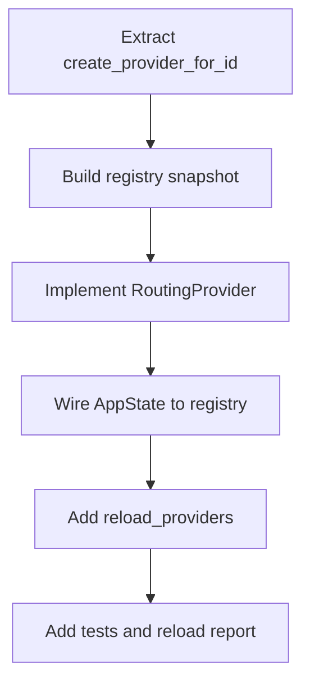

# Phase 1 细化方案：ProviderRegistry 与多 Provider 运行时

## 1. Phase 1 目标

Phase 1 只解决一件事：

**把 Bamboo 后端从“运行时只有一个 provider 实例”升级成“运行时同时持有多个 provider 实例”，同时尽量不改动现有 Agent/Handler 主调用链。**

这阶段先不做：

- Session 持久化 `provider`
- 前端 session 级 provider 选择
- capability-level route purpose
- forwarding selector

这阶段要交付的能力是：

1. 启动时可同时初始化多个 provider
2. 配置热更新时可同时 reload 多个 provider
3. 现有 `get_provider()` 主调用链继续可用
4. 新增 `get_provider_by_id()` 能力，为 Phase 2/3/4 打基础

## 2. 现有运行时边界

## 2.1 Agent / Runtime 只依赖 `Arc<dyn LLMProvider>`

`AgentRuntime` 当前持有：

- `provider: Arc<dyn LLMProvider>`

代码位置：

- `bamboo/crates/bamboo-engine/src/runtime/runtime.rs:47`
- `bamboo/crates/bamboo-engine/src/runtime/runtime.rs:48`

`AgentBuilder` 也是：

- `provider(Arc<dyn LLMProvider>)`

代码位置：

- `bamboo/crates/bamboo-engine/src/runtime/agent.rs:100`
- `bamboo/crates/bamboo-engine/src/runtime/agent.rs:101`

这对 Phase 1 很有利：

- 只要我们提供一个新的 `Arc<dyn LLMProvider>` 句柄
- Agent 层基本可以完全不动

## 2.2 `LLMProvider` trait 当前足够支撑 Router 方案

当前 trait 只有核心三件事：

- `chat_stream(...)`
- `chat_stream_with_options(...)`
- `list_models()` / `list_model_info()`

代码位置：

- `bamboo/crates/bamboo-infrastructure/src/llm/provider.rs:137`
- `bamboo/crates/bamboo-infrastructure/src/llm/provider.rs:157`
- `bamboo/crates/bamboo-infrastructure/src/llm/provider.rs:169`
- `bamboo/crates/bamboo-infrastructure/src/llm/provider.rs:185`
- `bamboo/crates/bamboo-infrastructure/src/llm/provider.rs:194`

这说明：

- 我们可以实现一个新的 `RoutingProvider: LLMProvider`
- 在内部根据当前默认 provider 把请求转发到 registry 中对应的 concrete provider
- 对现有调用点保持透明

## 2.3 当前 `ReloadableProvider` 是“单指针代理”

当前 `ReloadableProvider` 内部只有：

```rust
inner: Arc<RwLock<Arc<dyn LLMProvider>>>
```

代码位置：

- `bamboo/crates/bamboo-server/src/reloadable_provider.rs:13`
- `bamboo/crates/bamboo-server/src/reloadable_provider.rs:14`

这适合单 provider 热替换，不适合多 provider registry。

所以 Phase 1 应该把这个模式升级成：

- `ReloadableProviderRegistry`
- `RoutingProvider`

## 2.4 AppState 组装链当前很清晰

启动时：

1. 读 `Config`
2. `create_provider_with_dir(&config, bamboo_home_dir)`
3. `build_provider_handles(provider)`
4. `Agent::builder().provider(provider_handle.clone())`
5. `auto_dream` / handlers / forwarding 也共用 `provider_handle`

代码位置：

- `bamboo/crates/bamboo-server/src/app_state/builder.rs:50`
- `bamboo/crates/bamboo-server/src/app_state/builder.rs:54`
- `bamboo/crates/bamboo-server/src/app_state/builder.rs:109`
- `bamboo/crates/bamboo-server/src/app_state/builder.rs:139`
- `bamboo/crates/bamboo-server/src/app_state/builder.rs:171`

这条链说明 Phase 1 的主入口只有一个：

- `AppState::new()` / `AppState::new_with_provider()`

## 2.5 当前大量代码直接依赖 `get_provider()`

直接调用点很多：

- OpenAI / Anthropic / Gemini forwarding handlers
- provider models 查询
- maintenance / auto dream 等逻辑

示例：

- `bamboo/crates/bamboo-server/src/handlers/openai/chat/non_stream.rs:37`
- `bamboo/crates/bamboo-server/src/handlers/anthropic/messages/non_stream.rs:19`
- `bamboo/crates/bamboo-server/src/handlers/openai/models.rs:19`
- `bamboo/crates/bamboo-server/src/handlers/settings/provider/models/dispatch.rs:79`

所以 Phase 1 的关键原则是：

**保持 `get_provider()` 存在且行为兼容。**

## 2.6 现有降级策略：UnconfiguredProvider

启动 provider 失败时，当前会降级到：

- `UnconfiguredProvider`

代码位置：

- `bamboo/crates/bamboo-server/src/app_state/mod.rs:103`
- `bamboo/crates/bamboo-server/src/app_state/mod.rs:108`
- `bamboo/crates/bamboo-server/src/app_state/builder.rs:58`
- `bamboo/crates/bamboo-server/src/app_state/builder.rs:64`

Phase 1 应该保留这个思想，但粒度要细化成：

- registry 某个 provider 初始化失败，不拖垮整个 registry
- 默认 provider 若失败，router 返回明确错误

## 3. Phase 1 推荐设计

## 3.1 核心对象

### A. ProviderInstanceMap

```rust
pub type ProviderInstanceMap = HashMap<String, Arc<dyn LLMProvider>>;
```

### B. ProviderRegistryState

```rust
pub struct ProviderRegistryState {
    providers: ProviderInstanceMap,
    default_provider_id: String,
}
```

### C. ReloadableProviderRegistry

```rust
pub struct ReloadableProviderRegistry {
    inner: Arc<RwLock<ProviderRegistryState>>,
}
```

职责：

- 保存当前所有 provider 实例
- 支持整体替换
- 支持按 `provider_id` 获取 provider
- 支持读取当前默认 provider id

### D. RoutingProvider

```rust
pub struct RoutingProvider {
    registry: Arc<ReloadableProviderRegistry>,
}
```

职责：

- 实现 `LLMProvider`
- 对现有 `get_provider()` 保持兼容
- 在没有显式 selector 的情况下，将请求路由到当前 `default_provider_id`

### E. ProviderRegistryReloadReport

```rust
pub struct ProviderRegistryReloadReport {
    pub default_provider_id: String,
    pub available_provider_ids: Vec<String>,
    pub failed_provider_ids: Vec<(String, String)>,
}
```

职责：

- 让 reload 有结构化结果
- 后续可以返回给 settings UI

## 3.2 为什么 Phase 1 不直接引入完整 RouteResolver

原因很简单：

1. 当前绝大多数调用点没有 provider selector 参数
2. 当前 Session 也没有 provider 字段
3. 这阶段只需要“多 provider 持有能力”，不需要完整“多 provider 选择能力”

所以 Phase 1 先做：

- **ProviderRegistry**
- **RoutingProvider(默认路由到 config.provider)**

Phase 2 再扩展成：

- `get_provider_by_id(provider_id)`
- Session provider route
- RoutePurpose

## 4. Phase 1 对现有接口的兼容策略

## 4.1 `get_provider()` 保持不变

现有：

```rust
pub async fn get_provider(&self) -> Arc<dyn LLMProvider>
```

继续保留。

返回值不再是 `ReloadableProvider(single)`，而是：

- `RoutingProvider(default route to config.provider)`

这样现有调用点都不用改。

## 4.2 新增 `get_provider_by_id(provider_id)`

建议新增：

```rust
pub async fn get_provider_by_id(&self, provider_id: &str) -> Option<Arc<dyn LLMProvider>>
```

用途：

- Settings provider model 拉取
- 后续 forwarding selector
- 后续 Session provider 执行

## 4.3 `reload_provider()` 保留为兼容别名

当前大量代码和文档用 `reload_provider()`：

- `bamboo/crates/bamboo-server/src/app_state/config_runtime.rs:35`
- `bamboo/crates/bamboo-server/src/handlers/settings/provider/endpoints/reload.rs:18`
- `bamboo/crates/bamboo-server/src/handlers/settings/keyword_masking/handlers/update.rs:32`

建议：

- 新增 `reload_providers()`
- `reload_provider()` 内部直接调用 `reload_providers()`
- 现有 handler 不必立刻全改

## 4.4 `new_with_provider()` 保持测试友好

当前 `new_with_provider()` 支持注入一个 provider：

- `bamboo/crates/bamboo-server/src/app_state/builder.rs:85`

Phase 1 后建议保留两个入口：

### 入口 A：测试单 provider 注入
```rust
new_with_provider(..., provider: Arc<dyn LLMProvider>)
```

语义：

- 构造一个只有 `default`/当前配置 provider 的最小 registry

### 入口 B：测试多 provider 注入
```rust
new_with_provider_registry(..., registry_state: ProviderRegistryState)
```

语义：

- 直接注入多 provider registry

## 5. Phase 1 具体模块设计

## 5.1 infrastructure 层

### 新增建议

文件建议：

- `bamboo/crates/bamboo-infrastructure/src/llm/provider_registry.rs`

内容建议：

1. `build_provider_for_id(config, provider_id, app_data_dir)`
2. `build_provider_registry(config, app_data_dir)`
3. `ProviderBuildResult`
4. `ProviderRegistrySnapshot`

### provider_factory.rs 的处理方式

当前：

- `create_provider(config)`
- `create_provider_with_dir(config, app_data_dir)`

建议：

- 保留现有函数，用于兼容和内部复用
- 新增：
  - `create_provider_for_id(...)`
  - `create_provider_registry_with_dir(...)`

其中：

- `create_provider_with_dir` 继续等价于 `create_provider_for_id(config, config.provider)`
- Phase 1 的 AppState 新路径用 registry builder

## 5.2 server/app_state 层

### AppState 字段变更建议

当前：

```rust
pub provider: Arc<RwLock<Arc<dyn LLMProvider>>>,
provider_handle: Arc<dyn LLMProvider>,
```

Phase 1 建议改成：

```rust
pub provider_registry: Arc<RwLock<ProviderRegistryState>>,
provider_handle: Arc<dyn LLMProvider>,
```

兼容性考虑：

- `provider_handle` 名字可以保留
- 它的具体类型换成 `RoutingProvider`

### provider_api.rs 新增方法

建议 API：

```rust
pub async fn get_provider(&self) -> Arc<dyn LLMProvider>
pub async fn get_provider_by_id(&self, provider_id: &str) -> Option<Arc<dyn LLMProvider>>
pub async fn list_available_provider_ids(&self) -> Vec<String>
pub async fn default_provider_id(&self) -> String
```

## 5.3 reload 逻辑

### 当前 reload_provider 的问题

当前逻辑：

1. clone config
2. 构建当前 active provider
3. 覆盖 `self.provider`

代码位置：

- `bamboo/crates/bamboo-server/src/app_state/config_runtime.rs:35`
- `bamboo/crates/bamboo-server/src/app_state/config_runtime.rs:72`

### Phase 1 新逻辑

`reload_providers()`：

1. 读取 config
2. 遍历所有已配置 provider 节点
3. 尝试构建各 provider
4. 生成新的 registry state
5. 原子替换 registry
6. `RoutingProvider` 自动看到新 registry

### 降级策略

#### 情况 A：非默认 provider 构建失败
- 写 warning
- 不影响默认 provider
- registry 中省略该 provider 或放入 unavailable stub

#### 情况 B：默认 provider 构建失败，但旧默认 provider 仍可用
- 保留旧 registry
- 返回错误

#### 情况 C：默认 provider 构建失败且没有旧可用 provider
- registry 中为默认 provider 放 `UnconfiguredProvider`
- settings/UI 继续可用
- 实际聊天调用快速失败并给出明确错误

我更推荐：

- **启动阶段允许默认 provider 失败并降级成 stub**
- **显式 reload 时若默认 provider 失败，返回错误且保留旧 registry**

这样用户体验更稳。

## 5.4 RoutingProvider 的 Phase 1 行为

### chat_stream / chat_stream_with_options

RoutingProvider 在 Phase 1 的行为非常简单：

1. 读取 registry 当前默认 provider id
2. 取出对应 provider
3. 转发请求

### list_models

Phase 1 的 `RoutingProvider.list_models()` 也继续返回默认 provider 的 models。

这样：

- `get_provider()` 的兼容语义完整保留
- `openai/models` 这类现有接口行为不变

## 6. Phase 1 必改文件清单

## 6.1 核心新增文件

### `bamboo/crates/bamboo-infrastructure/src/llm/provider_registry.rs`
新增：

- provider registry snapshot
- registry builder
- provider-for-id builder

## 6.2 核心修改文件

### `bamboo/crates/bamboo-infrastructure/src/llm/provider_factory.rs`
修改：

- 抽出 `create_provider_for_id`
- 让 registry builder 复用现有 provider 创建逻辑

### `bamboo/crates/bamboo-infrastructure/src/llm/mod.rs`
修改：

- re-export registry 相关类型/函数

### `bamboo/crates/bamboo-server/src/reloadable_provider.rs`
建议：

- 保留单 provider 版本给兼容测试，或
- 直接替换成 registry-aware router 实现

我更推荐新增文件：

- `routing_provider.rs`
- `provider_registry_runtime.rs`

让职责更清晰。

### `bamboo/crates/bamboo-server/src/app_state/mod.rs`
修改：

- `provider` 字段替换为 `provider_registry`
- 保留 `provider_handle`
- 文档注释改为 registry 语义

### `bamboo/crates/bamboo-server/src/app_state/init.rs`
修改：

- `build_provider_handles` 改成 `build_provider_registry_handles`
- type alias 从单 provider lock 改成 registry lock

### `bamboo/crates/bamboo-server/src/app_state/builder.rs`
修改：

- `new()` 改为创建 registry
- 启动失败时只对默认 provider 用 stub 降级
- `new_with_provider()` 包装成单 provider registry
- 新增 `new_with_provider_registry()`

### `bamboo/crates/bamboo-server/src/app_state/provider_api.rs`
修改：

- 保留 `get_provider()`
- 新增 `get_provider_by_id()` / `list_available_provider_ids()` / `default_provider_id()`

### `bamboo/crates/bamboo-server/src/app_state/config_runtime.rs`
修改：

- `reload_provider()` → 调用 `reload_providers()`
- 新增结构化 reload 结果

### `bamboo/crates/bamboo-server/src/handlers/settings/provider/endpoints/reload.rs`
修改：

- 优先调用 `reload_providers()`
- 返回 default provider + available providers + failed providers

### `bamboo/crates/bamboo-server/src/handlers/settings/provider/models/dispatch.rs`
修改：

- Copilot 分支改成 `get_provider_by_id("copilot")`
- 去掉对默认 provider 的隐式依赖

## 7. Phase 1 暂时不改的文件

这些先不改动主逻辑，只依赖兼容层继续工作：

- `handlers/openai/**/*`
- `handlers/anthropic/**/*`
- `handlers/gemini/**/*`
- `session_app/chat.rs`
- `session_app/execute.rs`
- `session types / session summary`
- Lotus 前端所有文件

这是 Phase 1 最重要的边界控制。

## 8. Phase 1 实施步骤

## Step 1：提取 per-provider builder

在 infrastructure 中完成：

- `create_provider_for_id(config, provider_id, app_data_dir)`
- 保持与当前 `create_provider_with_dir` 行为一致

验收：

- openai / anthropic / gemini / copilot 四类都可单独构建

## Step 2：实现 registry snapshot builder

新增：

- `build_provider_registry_with_dir(config, app_data_dir)`

输出：

- available providers
- failed providers
- default provider id

验收：

- 配置多个 provider 时可返回多个实例

## Step 3：实现 RoutingProvider

新增：

- `RoutingProvider` 实现 `LLMProvider`
- 默认转发到 registry.default_provider_id

验收：

- 现有 `get_provider().list_models()` 仍可工作
- 现有 `chat_stream_with_options()` 路径不需要改 handler

## Step 4：替换 AppState 组装链

修改：

- `AppState::new()`
- `AppState::new_with_provider()`
- 新增 `new_with_provider_registry()`

验收：

- `AppState::new()` 保持通过
- 现有 tool / agent runtime 初始化不受影响

## Step 5：实现 `reload_providers()`

新增：

- registry 原子替换
- 默认 provider 失败时保留旧 registry
- 结构化 reload report

验收：

- reload 成功时所有 provider 同步更新
- reload 失败时当前运行不被破坏

## Step 6：补 API 与测试

新增：

- `get_provider_by_id()`
- `list_available_provider_ids()`
- reload report tests

验收：

- settings provider models 对 copilot 不再依赖默认 provider
- app_state tests 覆盖多 provider registry 初始化与 reload

## 9. 测试清单

## 9.1 单元测试

### infrastructure
1. `create_provider_for_id` 对每种 provider 的成功/失败用例
2. `build_provider_registry_with_dir` 能返回多个 provider
3. 默认 provider 不可构建时返回结构化失败信息

### server
4. `RoutingProvider` 将调用路由到当前默认 provider
5. `reload_providers()` 成功替换 registry
6. `reload_providers()` 默认 provider 失败时保留旧 registry
7. `get_provider_by_id("copilot")` 返回 copilot 实例

## 9.2 集成测试

1. `AppState::new()` 在多个 provider 配置下成功初始化
2. `settings/provider/reload` 返回新的 reload report
3. `settings/provider/models` 的 copilot 路径不受默认 provider 影响

## 10. Phase 1 验收标准

### 必须满足

1. Bamboo 运行时可以同时持有多个 provider 实例
2. `get_provider()` 行为兼容当前默认 provider 逻辑
3. 新增 `get_provider_by_id()`
4. `reload_providers()` 支持多 provider 热更新
5. 默认 provider reload 失败时运行时保持稳定
6. 现有 agent 执行主路径无需大改仍能工作

### 可以留到 Phase 2

1. session-level provider
2. forwarding 显式 selector
3. 前端 provider/model session 化
4. fast/vision/memory_background route purpose

## 11. 我对 Phase 1 的推荐实现风格

### 推荐原则

1. **新增，不大拆**
   - 尽量增加 registry 层
   - 尽量不重写 engine / handler 主流程

2. **兼容优先**
   - `get_provider()` 保持
   - `reload_provider()` 保持
   - `create_provider_with_dir()` 保持

3. **先拿到多 provider 运行时，再推进 session route**
   - 这是后续所有改造的基础设施

## 12. Phase 1 最终建议

Phase 1 最值得直接开工的顺序是：



这条路径最稳，改动面可控，能快速把 Bamboo 后端底座从单 provider 升到多 provider 运行时。