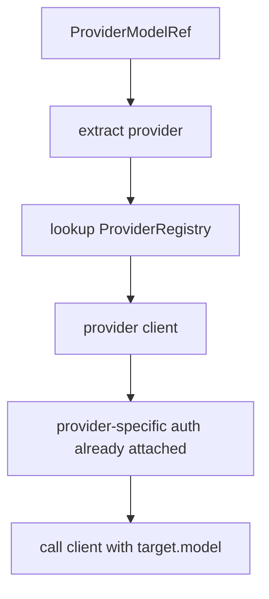
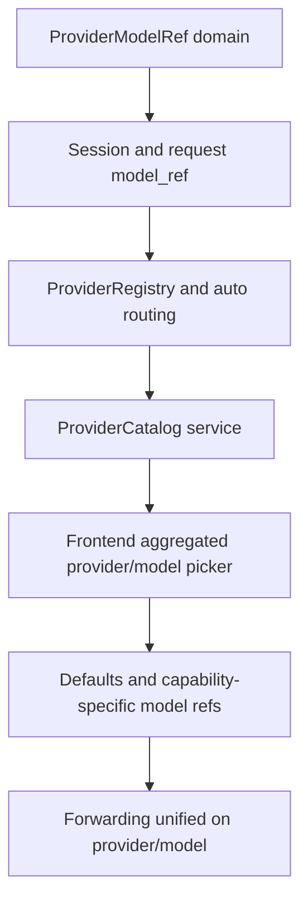

# Provider/Model 一等概念重构方案

## 1. 核心结论

系统的核心选择单位直接定义成：

```text
provider + model
```

所有需要选择模型的地方都统一选择这个组合。

这意味着：

1. **配置层**管理 provider 的 auth / endpoint / capability
2. **目录层**管理 provider 下有哪些 models
3. **会话层**持久化选中的 `provider/model`
4. **运行时**根据 `provider` 自动路由到对应 provider client
5. **前端**展示的是全量可选 `provider/model` 组合，不再围绕单个 active provider 组织聊天逻辑

这个方向比“先选 active provider，再在 provider 里选 model”更稳定，也更符合未来多 provider 并行使用的产品形态。

## 2. 当前问题的本质

当前系统的组织方式是：

- 根配置有一个 `provider`
- provider config 里再有 `model`
- 执行时默认按当前激活 provider 决定模型来源

当前代码里最典型的单-provider 假设落在这些位置：

- `bamboo/crates/bamboo-infrastructure/src/config/config.rs:206`
- `bamboo/crates/bamboo-infrastructure/src/config/config.rs:941`
- `bamboo/crates/bamboo-infrastructure/src/llm/provider_factory.rs:27`
- `bamboo/crates/bamboo-server/src/app_state/mod.rs:171`
- `bamboo/crates/bamboo-domain/src/session/types.rs:406`
- `lotus/src/pages/ChatPage/store/slices/providerSlice.ts:11`
- `lotus/src/pages/ChatPage/hooks/useActiveModel.ts:28`

这套结构的问题很集中：

1. provider 是全局状态
2. session 只有 `model`，没有 `provider`
3. 前端选择逻辑围绕当前 provider 展开
4. runtime 只有一个 provider 实例
5. 转发接口底层也吃当前默认 provider

这会让系统很难表达下面这些场景：

- Session A 用 OpenAI，Session B 用 Anthropic
- 主对话走 Copilot，memory 走 OpenAI fast model
- 同时展示并选择所有 provider 的 model
- 外部转发接口明确命中指定 provider/model

## 3. 新设计的中心思想

### 3.1 provider 是执行通道

provider 管理这些事情：

- auth
- base_url
- protocol adapter
- request overrides
- provider-specific limits
- provider-specific model listing

### 3.2 model 是 provider 域内的可调用目标

model 管理这些事情：

- model id
- 显示名称
- capability
- 上下文长度
- 工具支持
- vision / reasoning 支持
- 来源和发现时间

### 3.3 系统实际选择的是 `ProviderModelRef`

我建议整个系统统一引入一个一等领域对象：

```rust
pub struct ProviderModelRef {
    pub provider: String,
    pub model: String,
}
```

这就是未来：

- session
- request
- defaults
- forwarding
- metrics
- UI selected option

的统一选择单位。

## 4. 推荐的一等领域对象

## 4.1 ProviderId

```rust
pub type ProviderId = String;
```

先允许 string，后续可以增加 known providers enum + custom providers。

## 4.2 ProviderModelRef

```rust
#[derive(Debug, Clone, Serialize, Deserialize, PartialEq, Eq, Hash)]
pub struct ProviderModelRef {
    pub provider: ProviderId,
    pub model: String,
}
```

### 为什么用对象，不用字符串 `provider/model`

对象表示更稳定：

1. model 名称里可能带 `/`
2. 序列化和兼容更稳
3. 未来可以自然扩展字段
4. 日志/UI 仍然可以派生显示字符串

### UI / 日志显示值

显示时再拼：

```text
OpenAI / gpt-4.1
Anthropic / claude-sonnet-4
Gemini / gemini-2.5-pro
```

## 4.3 ProviderDescriptor

```rust
pub struct ProviderDescriptor {
    pub id: ProviderId,
    pub display_name: String,
    pub enabled: bool,
    pub authenticated: bool,
    pub protocol_family: String,
    pub health: ProviderHealth,
}
```

## 4.4 ProviderModelDescriptor

```rust
pub struct ProviderModelDescriptor {
    pub reference: ProviderModelRef,
    pub display_name: String,
    pub provider_display_name: String,
    pub capabilities: ModelCapabilities,
    pub availability: ModelAvailability,
    pub source: ModelSource,
    pub discovered_at: Option<String>,
}
```

## 4.5 ModelCapabilities

```rust
pub struct ModelCapabilities {
    pub supports_tools: bool,
    pub supports_vision: bool,
    pub supports_reasoning: bool,
    pub supports_streaming: bool,
    pub max_context_tokens: Option<u32>,
    pub max_output_tokens: Option<u32>,
}
```

## 4.6 ProviderCatalog

```rust
pub struct ProviderCatalog {
    pub providers: Vec<ProviderDescriptor>,
    pub models: Vec<ProviderModelDescriptor>,
    pub updated_at: String,
}
```

这里的关键点是：

- `models` 是全量展开后的 provider/model 列表
- 前端直接使用这个列表渲染选择器
- 不再围绕 `currentProvider -> models[]` 做主选择流程

## 5. 配置模型重构

## 5.1 新配置结构的目标

配置模型要表达三件事：

1. provider 如何认证和访问
2. provider 下已发现/缓存了哪些 models
3. 系统默认使用哪个 `provider/model`

## 5.2 推荐结构

```json
{
  "providers": {
    "openai": {
      "enabled": true,
      "api_key": "...",
      "base_url": "https://api.openai.com/v1",
      "request_overrides": {},
      "catalog": {
        "updated_at": "2026-04-19T16:00:00Z",
        "models": [
          {
            "model": "gpt-4.1",
            "display_name": "GPT-4.1",
            "capabilities": {
              "supports_tools": true,
              "supports_vision": true,
              "supports_reasoning": true
            }
          },
          {
            "model": "gpt-4o-mini",
            "display_name": "GPT-4o Mini",
            "capabilities": {
              "supports_tools": true,
              "supports_vision": true,
              "supports_reasoning": false
            }
          }
        ]
      },
      "defaults": {
        "primary": "gpt-4.1",
        "fast": "gpt-4o-mini",
        "vision": "gpt-4.1"
      }
    },
    "anthropic": {
      "enabled": true,
      "api_key": "...",
      "catalog": {
        "updated_at": "2026-04-19T16:00:00Z",
        "models": [
          {
            "model": "claude-sonnet-4",
            "display_name": "Claude Sonnet 4",
            "capabilities": {
              "supports_tools": true,
              "supports_vision": true,
              "supports_reasoning": true
            }
          }
        ]
      },
      "defaults": {
        "primary": "claude-sonnet-4"
      }
    }
  },
  "defaults": {
    "chat": { "provider": "openai", "model": "gpt-4.1" },
    "fast": { "provider": "openai", "model": "gpt-4o-mini" },
    "vision": { "provider": "anthropic", "model": "claude-sonnet-4" },
    "memory_background": { "provider": "openai", "model": "gpt-4o-mini" }
  }
}
```

## 5.3 兼容策略

### 保留
- `providers.openai.model`
- `providers.openai.fast_model`
- `providers.openai.vision_model`
- 根级 `provider`

### 新语义
- 根级 `provider` 作为兼容输入，映射到 `defaults.chat.provider`
- provider config 里的 `model/fast_model/vision_model` 作为兼容输入，映射到 provider defaults 或 global defaults

### 新规范
系统内部统一使用：

- `ProviderModelRef`
- `defaults.chat/fast/vision/memory_background`

## 6. Session 与请求模型重构

## 6.1 Session

当前 Session 只有：

- `model: String`

代码位置：

- `bamboo/crates/bamboo-domain/src/session/types.rs:406`

### 推荐结构

```rust
pub struct Session {
    ...
    pub model_ref: Option<ProviderModelRef>,
    pub reasoning_effort: Option<ReasoningEffort>,
    ...
}
```

### 兼容策略

保留旧字段一段时间：

```rust
pub model: String, // deprecated compat
pub model_ref: Option<ProviderModelRef>,
```

读取规则：

1. 优先 `model_ref`
2. 否则根据旧 `model` + 默认 provider 恢复一个 compat ref

写入规则：

1. 新逻辑一律写 `model_ref`
2. 兼容期同步回写 `model` 为 `model_ref.model`

## 6.2 CreateSessionRequest

当前：

- `model?: string`

代码位置：

- `bamboo/crates/bamboo-server/src/handlers/agent/sessions/types.rs:68`
- `bamboo/crates/bamboo-server/src/handlers/agent/sessions/types.rs:75`

### 新结构

```rust
pub struct CreateSessionRequest {
    pub title: Option<String>,
    pub system_prompt: Option<String>,
    pub model_ref: Option<ProviderModelRef>,
    pub reasoning_effort: Option<ReasoningEffort>,
}
```

兼容输入：

```rust
pub provider: Option<String>, // deprecated bridge
pub model: Option<String>,    // deprecated bridge
```

桥接规则：

- `model_ref` 优先
- 其次 `provider + model`
- 再其次 `defaults.chat`

## 6.3 ChatRequest

当前：

- `model: String`

代码位置：

- `bamboo/crates/bamboo-server/src/handlers/agent/chat/types.rs:16`
- `bamboo/crates/bamboo-server/src/handlers/agent/chat/types.rs:32`

### 新结构

```rust
pub struct ChatRequest {
    pub message: String,
    pub session_id: Option<String>,
    pub model_ref: ProviderModelRef,
    pub reasoning_effort: Option<ReasoningEffort>,
    ...
}
```

兼容层仍可接受：

- `provider`
- `model`

## 6.4 ExecuteRequest

当前 execute 只有：

- `model?: string`

### 新结构

```rust
pub struct ExecuteRequest {
    pub model_ref: Option<ProviderModelRef>,
    pub reasoning_effort: Option<ReasoningEffort>,
    ...
}
```

规则：

1. request.model_ref
2. session.model_ref
3. defaults.chat

## 7. 运行时重构

## 7.1 三层分工

### A. ProviderRegistry
管理 provider client 实例：

```rust
HashMap<ProviderId, Arc<dyn LLMProvider>>
```

### B. ModelCatalogService
管理 provider 下可用 models：

- fetch
- refresh
- cache
- merge static fallback / upstream results

### C. ProviderModelRouter
给定 `ProviderModelRef`，完成：

1. 找 provider client
2. 找 provider auth/config
3. 调对应 provider
4. 传 `model_ref.model`

## 7.2 Router 核心接口

```rust
pub struct ProviderModelRouter {
    registry: Arc<ProviderRegistry>,
}

impl ProviderModelRouter {
    pub async fn route(&self, target: &ProviderModelRef) -> Result<Arc<dyn LLMProvider>, RouteError> {
        ...
    }
}
```

### 路由规则



### 关键判断

- auth 选择完全由 `provider` 决定
- model 只在 provider 域内解释
- provider 和 model 不再拆成两个不同阶段的全局状态

## 7.3 runtime 调用统一入口

当前大量地方直接拿 `Arc<dyn LLMProvider>`：

- `bamboo/crates/bamboo-server/src/app_state/provider_api.rs:31`
- `bamboo/crates/bamboo-engine/src/runtime/runtime.rs:47`

新设计建议：

### A. 兼容层继续保留 `get_provider()`
返回默认 chat `ProviderModelRef` 对应的 provider client。

### B. 新主路径引入：

```rust
pub async fn get_provider_for_model_ref(
    &self,
    target: &ProviderModelRef,
) -> Result<Arc<dyn LLMProvider>, AppError>
```

### C. 进一步推荐
如果条件允许，Agent Runtime 最终持有的主接口从：

```rust
Arc<dyn LLMProvider>
```

演进为：

```rust
Arc<dyn ProviderModelExecutor>
```

接口像这样：

```rust
#[async_trait]
pub trait ProviderModelExecutor: Send + Sync {
    async fn chat_stream_with_target(
        &self,
        messages: &[Message],
        tools: &[ToolSchema],
        max_output_tokens: Option<u32>,
        target: &ProviderModelRef,
        options: Option<&LLMRequestOptions>,
    ) -> Result<LLMStream, LLMError>;
}
```

这个接口更贴合你的新设计。

## 7.4 我对 runtime 的最终建议

### 短期
- 保持 `LLMProvider`
- 增加 `get_provider_for_model_ref()`
- 在 server 层 resolve provider 后继续调用 trait

### 中期
- 引入 `ProviderModelExecutor`
- Agent 直接执行 `ProviderModelRef`

## 8. model catalog 设计

## 8.1 catalog 是一等服务

当前 settings 有 provider models 拉取接口：

- `bamboo/crates/bamboo-server/src/handlers/settings/provider/models/dispatch.rs:20`

这个能力应该升级成统一 catalog service，而不是仅供 settings 页面使用。

### 新职责

- fetch provider models
- cache fetched models
- normalize provider-specific schema
- merge manual/custom models
- produce aggregated `ProviderCatalog`

## 8.2 catalog 输出给前端的结构

```json
{
  "providers": [
    {
      "id": "openai",
      "display_name": "OpenAI",
      "enabled": true,
      "authenticated": true
    },
    {
      "id": "anthropic",
      "display_name": "Anthropic",
      "enabled": true,
      "authenticated": true
    }
  ],
  "models": [
    {
      "reference": { "provider": "openai", "model": "gpt-4.1" },
      "display_name": "GPT-4.1",
      "provider_display_name": "OpenAI",
      "capabilities": {
        "supports_tools": true,
        "supports_vision": true,
        "supports_reasoning": true
      }
    },
    {
      "reference": { "provider": "anthropic", "model": "claude-sonnet-4" },
      "display_name": "Claude Sonnet 4",
      "provider_display_name": "Anthropic",
      "capabilities": {
        "supports_tools": true,
        "supports_vision": true,
        "supports_reasoning": true
      }
    }
  ]
}
```

## 8.3 UI 选择方式

前端选择器直接用 aggregated list：

```text
OpenAI / GPT-4.1
OpenAI / GPT-4o Mini
Anthropic / Claude Sonnet 4
Gemini / Gemini 2.5 Pro
Copilot / GPT-4o
```

这就是你说的“所有可能性都可以选择”。

## 9. 前端重构

## 9.1 当前问题

当前前端状态模型是：

- `currentProvider`
- `getActiveModel()`
- `useActiveModel()`

代码位置：

- `lotus/src/pages/ChatPage/store/slices/providerSlice.ts:11`
- `lotus/src/pages/ChatPage/hooks/useActiveModel.ts:28`

这套状态模型会把聊天主流程绑在一个全局 provider 上。

## 9.2 新前端状态模型

### A. ProviderCatalogStore

```ts
interface ProviderCatalogStore {
  catalog: ProviderCatalog
  selectedDefaultChatModelRef?: ProviderModelRef
  selectedDefaultFastModelRef?: ProviderModelRef
  refreshCatalog(): Promise<void>
}
```

### B. Session-level state

每个 chat session：

```ts
config: {
  modelRef?: ProviderModelRef
  reasoningEffort?: ReasoningEffort | null
}
```

### C. Draft selection state

新建 session / 当前 composer draft：

```ts
composerSelection: {
  modelRef?: ProviderModelRef
}
```

## 9.3 hook 重构

当前：

- `useActiveModel(sessionId)`

建议改成：

- `useActiveModelRef(sessionId)`
- `useActiveModelOption(sessionId)`

### 优先级

1. session.config.modelRef
2. composer draft modelRef
3. default chat modelRef

## 9.4 ProviderSettings 页面重构

当前 ProviderSettings 页面组织方式仍然是：

- 当前 provider
- 当前 provider 的配置
- 当前 provider 的 models

代码入口：

- `lotus/src/pages/SettingsPage/components/ProviderSettings/index.tsx:95`

### 新组织方式

拆成两块：

#### A. Provider Auth Settings
- OpenAI auth
- Anthropic auth
- Gemini auth
- Copilot auth

#### B. Model Catalog & Defaults
- 刷新各 provider 的 models
- 展示 aggregated catalog
- 设置 default chat/fast/vision/memory_background 的 `ProviderModelRef`

## 9.5 Chat 输入区重构

当前 `InputContainer` 逻辑仍然拿：

- `currentProvider`
- `providerConfig`
- `activeModel`

代码位置：

- `lotus/src/pages/ChatPage/components/InputContainer/index.tsx:168`
- `lotus/src/pages/ChatPage/components/InputContainer/index.tsx:176`

### 新逻辑

InputContainer 直接展示：

- 当前 session 的 `provider/model`
- 一个统一选择器
- 选择结果写回 `session.config.modelRef`

## 10. API 设计

## 10.1 新 API 规范

### provider catalog

```http
GET /v1/bamboo/provider-catalog
```

返回：

- providers
- aggregated models
- defaults

### refresh provider models

```http
POST /v1/bamboo/provider-catalog/refresh
{
  "provider": "openai"
}
```

### create session

```http
POST /api/v1/sessions
{
  "title": "...",
  "model_ref": {
    "provider": "openai",
    "model": "gpt-4.1"
  }
}
```

### patch session

```http
PATCH /api/v1/sessions/:id
{
  "model_ref": {
    "provider": "anthropic",
    "model": "claude-sonnet-4"
  }
}
```

### chat

```http
POST /api/v1/chat
{
  "session_id": "...",
  "message": "...",
  "model_ref": {
    "provider": "openai",
    "model": "gpt-4.1"
  }
}
```

### execute

```http
POST /api/v1/execute/:session_id
{
  "model_ref": {
    "provider": "openai",
    "model": "gpt-4.1"
  }
}
```

## 10.2 转发接口

转发接口也围绕 `ProviderModelRef` 设计。

### 内部统一逻辑

无论协议入口是什么，内部都需要得到：

```rust
ProviderModelRef
```

### 推荐规则

#### OpenAI-compatible forwarding

保持：
- `/openai/v1/chat/completions`
- `/openai/v1/responses`

新增 selector：
- `X-Bamboo-Provider: openai`
- `X-Bamboo-Provider: anthropic`
- `X-Bamboo-Provider: gemini`

模型仍来自 request body `model`，然后内部得到：

```rust
ProviderModelRef {
  provider: selector_provider,
  model: request.model,
}
```

#### provider-scoped forwarding

再补更明确的路径：

- `/openai/v1/providers/{provider}/chat/completions`

这样外部 SDK 可以更明确地说：

- 用 OpenAI 协议
- 调 Anthropic provider
- 模型是 `claude-sonnet-4`

## 11. 迁移策略

## Phase A：领域模型先落地

### 目标
把 `ProviderModelRef` 引入领域层。

### 任务
1. 新增 `ProviderModelRef`
2. 新增 provider catalog 相关类型
3. Session 增加 `model_ref`
4. API request/response 增加 `model_ref`

### 结果
系统开始具备“provider/model 一等概念”。

## Phase B：运行时按 provider/model 路由

### 目标
runtime 根据 `model_ref.provider` 自动找到 provider client。

### 任务
1. ProviderRegistry
2. get_provider_for_model_ref
3. create/execute/chat 三条链路改成用 `model_ref`

### 结果
系统运行时真正围绕 `ProviderModelRef` 工作。

## Phase C：catalog 成为统一选择源

### 目标
前后端都使用统一 provider catalog。

### 任务
1. settings model fetch 升级成 catalog service
2. 前端改成 aggregated model picker
3. 移除 currentProvider 主流程依赖

### 结果
“所有可能性都可以选择”成立。

## Phase D：默认值与辅助能力统一成 provider/model

### 目标
chat / fast / vision / memory_background 的默认值全部用 `ProviderModelRef`。

### 任务
1. defaults 重构
2. title generation / memory / vision 改造
3. metrics 增加 provider/model 双维度

## Phase E：转发链统一

### 目标
forwarding 也统一使用 `ProviderModelRef`。

### 任务
1. selector 设计
2. OpenAI / Anthropic / Gemini forwarding 内部统一解析
3. `/models` 与 catalog 对齐

## 12. 推荐重构顺序



## 13. 我建议你现在就拍板的设计决定

### 决定 1

**系统唯一的模型选择单位就是 `ProviderModelRef`。**

### 决定 2

**根级 `active provider` 从主语义退场，兼容期只做 migration alias。**

### 决定 3

**前端主选择器改成 aggregated provider/model picker。**

### 决定 4

**运行时自动路由只看 `model_ref.provider`。**

### 决定 5

**转发协议与 provider 身份解耦，内部统一解析成 `ProviderModelRef`。**

## 14. 我的最终建议

你的这个方向是正确方向。

系统最稳的重构方式是：

- **领域模型中心**：`ProviderModelRef`
- **配置中心**：provider auth + model catalog + model_ref defaults
- **运行时中心**：根据 `model_ref.provider` 自动路由 provider client
- **前端中心**：展示和选择所有 provider/model 组合
- **兼容中心**：旧 `provider` 和旧 `model` 字段保留一段时间做 bridge

这样做完之后，Bamboo 的主概念会非常清晰：

- provider 负责通道和认证
- model 负责能力和目标
- provider/model 负责真正的执行选择