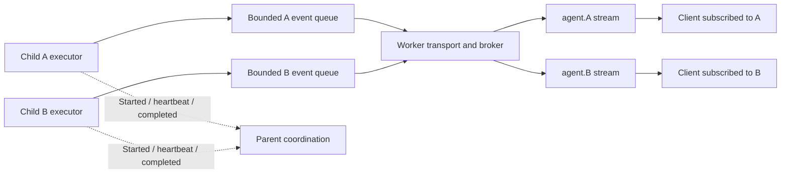

# Session and subagent concurrency

The runtime gives each child its own event stream and bounded producer queue.
The parent receives semantic child lifecycle events; it does not relay a child's
token stream. This document covers the in-process coordination and resource
lifetimes that remain important even after recursive token forwarding was removed.

## Boundaries

| Path | Coordination | Reason |
| --- | --- | --- |
| Session cache lookup/publication | Lock-free skip-list index and atomic immutable snapshots | A reader or a long transcript clone must not block another session or its writer. |
| Narrow cached metadata patch | Retry a pure patch with compare-and-swap | Preserve another writer's publication instead of overwriting a detached old snapshot. |
| Live token publication | Per-run atomic admission fence and activity clock | Token traffic does not acquire the process-wide runner registry. |
| Runner replacement and replayable state | Existing lifecycle registry coordination | Drain admitted old frames before a successor publishes Started; preserve snapshot/live replay ordering. |
| Durable session commits | Existing per-session and cross-process transaction locks | Preserve filesystem atomicity, task generations and recovery journals. These are not advertised as lock-free storage. |
| Worker event production | Bounded async queue | Slow downstream transport applies backpressure instead of retaining unlimited JSON events. |
| Idle session eviction | Exact channel identity, external subscribers and producer ownership | Internal notification relays must not prevent their own reclamation; active clients and child producers remain protected. |

## Session snapshots

`SessionCache::default()` creates the shared cache. `SessionSnapshot::new(session)`
creates an immutable published version. `read()` returns a stable view, and
`read().clone()` retains the existing detached `Session` contract.

A live cache entry keeps a stable slot until eviction. Publishing a full snapshot
updates that slot atomically. A narrow `update` retries against the latest slot
value, so it cannot successfully patch an orphaned version while another writer
publishes the replacement. Update closures must have no external side effects.
Durable I/O remains in `SessionRepository`, outside those retry closures.

Snapshot writes copy the session value. This deliberately trades copying on
writes for independent readers. Token events do not mutate session snapshots;
large transcript copying must not be moved into the token path.

## Independent event delivery

Each run owns an `EventPublication` fence. Synchronous token publication first
obtains an atomic permit. Replacing or removing a runner closes admission and
waits for admitted sends to finish before exposing a successor. This prevents a
late old token from appearing after the successor's Started event without taking
any global runner lock for that token. Critical replay state still uses the
existing cache-and-broadcast transaction. The child's activity clock includes
these atomic token publications, so a busy stream is not mistaken for a stalled
worker by its watchdog.

This is an application coordination guarantee. Tokio channels, networking,
allocators, disk persistence and operating-system processes have their own
synchronization and are not claimed to be universally lock-free.

## Resource ownership

Notification observers register their exact channel with a weak sender. Their
RAII subscription unregisters before dropping its receiver, including task
cancellation. An old channel generation cannot clear the registration of a new
relay. Idle eviction discounts only the matching internal receiver and retains
external receivers and outstanding producer handles. The paired runner, event
sender and cached transcript are reclaimed together; durable session history
remains available for later loads.

The per-session persistence-lock registry also arms cleanup before waiting for
the mutex. Cancelling the final waiter after its predecessor releases the lock
must not leave one entry per historical child session. Parent wake serialization
also leases its registry entry: completion or cancellation of the final holder
removes the entry while keeping concurrent wakes serialized.

Worker connection tasks own their execution and helper tasks. Disconnect and
replacement cancel the execution, allow bounded cooperative shutdown, then abort
and join remaining tasks. Correlation waiters and run registrations have RAII
cleanup, and executor panics become terminal errors rather than leaving an
inflight record with no task behind it. CLI process ownership also survives
cancellation of the graceful-exit future: on Unix, Drop kills the owned process
group and tracked descendants. An active app-server connection belongs to that
run, and returns to the warm slot only after a completed turn and helper cleanup;
an aborted run cannot leave the previous turn in a reusable connection.

## Verification contract

- Hold the global runner write guard while 512 independent child streams deliver
  32,768 token events; every stream must make progress and record activity.
- Retain an old session read across publication; it remains coherent while the
  new version becomes readable. Concurrent narrow patches preserve all 512 keys.
- Force a full publication between a narrow patch's first read and CAS; the
  patch retries and keeps both the new snapshot and the patch.
- Retire a run with an admitted publication; replacement waits for that frame,
  and rejects new old-generation frames.
- Cancel the final waiter for 512 session IDs and verify both persistence-lock
  maps and waiting counters return to baseline.
- Run real notification relays for 512 terminal children and verify idle cleanup
  reclaims their runtime resources while preserving subscribed/running sessions.
- Fill a worker's bounded event queue; the producer waits for receiver capacity,
  and cancellation/disconnect leaves no detached execution or correlation waiter.
- Run real Unix CLI stubs through WebSocket Cancel and server-owner abort; both
  leader and grandchild disappear. After abort, app-server establishes a fresh
  connection and can reuse it after a healthy completed turn.
- Reply-only Ask/Task executions can emit more than one queue capacity and still
  return their answer; intentionally unused event receivers are closed.

These deterministic fixtures exercise hundreds of sessions without launching
hundreds of paid model requests or OS worker processes. Physical worker capacity
and provider/network quotas remain separate deployment limits.
