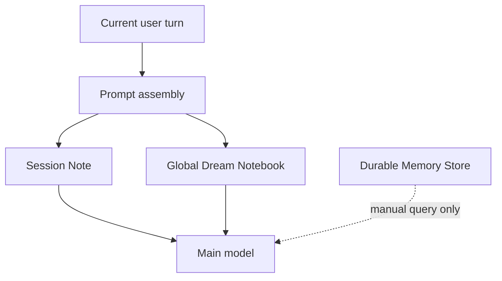
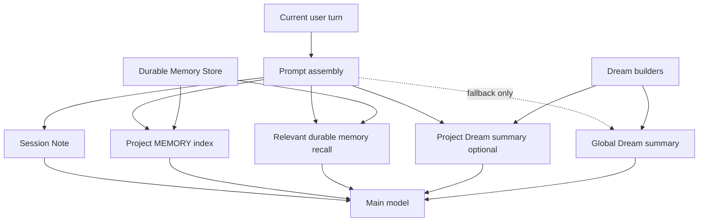
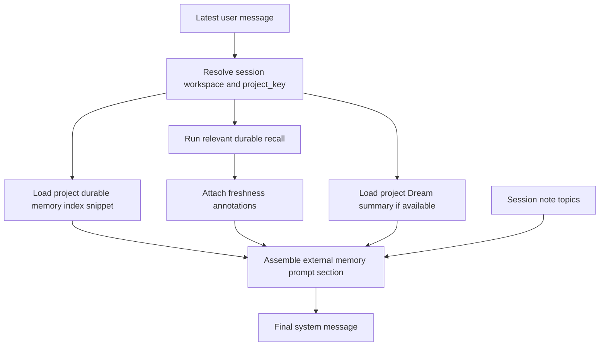
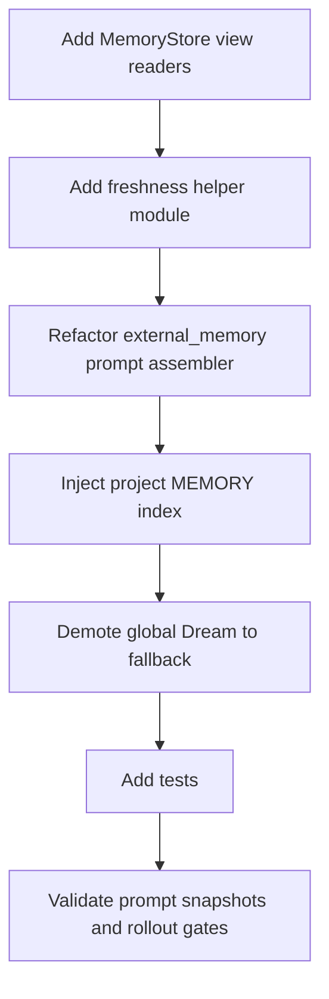

# Bamboo Memory Recall Architecture Refactor Plan

- **Date**: 2026-04-09
- **Author**: Bodhi
- **Status**: Draft
- **Scope**: Refactor Bamboo’s memory recall and prompt-injection pipeline so durable project memory becomes the primary cross-session source, while Dream notebook is demoted to an auxiliary synthesis layer.

This document follows the findings in:

- [`research/claude-code-vs-bamboo-memory-robustness-check-2026-04-09.md`](./research/claude-code-vs-bamboo-memory-robustness-check-2026-04-09.md)
- [`research/claude-code-vs-zenith-context-memory-comparison.md`](./research/claude-code-vs-zenith-context-memory-comparison.md)

It narrows the focus to one implementation question:

> **How do we keep Bamboo’s existing structured durable memory platform, while making recall as robust and useful in the main conversation flow as Claude Code’s `MEMORY.md` + relevant-memory system?**

---

## Executive Summary

Bamboo already has a stronger **memory storage model** than Claude Code in several respects:

- scoped durable memory (`session`, `project`, `global`)
- typed durable memory (`user`, `feedback`, `project`, `reference`)
- memory status / relation modeling (`active`, `stale`, `superseded`, `contradicted`, `archived`)
- generated views and indexes (`MEMORY.md`, `RECENT.md`, `STALE.md`, `lexical.json`, `graph.json`, `taxonomy.json`)
- session-local `session_note`
- background cross-session synthesis via Dream notebook

However, Bamboo’s current **default recall path** is materially weaker than Claude Code’s:

1. the main prompt primarily consumes **Dream notebook** and `session_note`
2. Dream is currently **global**, not project-first
3. Dream is currently **recent-batch overwrite oriented**, not a stable canonical memory index
4. durable memory artifacts are generated on disk but **not automatically surfaced into the main prompt**
5. durable recall depends too heavily on the model explicitly calling `memory query/get`
6. recalled memories do not yet have a strong **freshness / staleness guardrail**

As a result, Bamboo can feel as if:

- cross-session context is really “the previous session summary”
- unrelated projects bleed into the current conversation
- memory exists on disk but is not reliably used by the agent

This refactor plan addresses that by changing Bamboo’s memory stack from:



into:



The key strategic decision is:

> **Project durable memory becomes the primary canonical cross-session source for the main prompt. Dream becomes auxiliary.**

---

## Problem Statement

### Current user-visible failure modes

The current system can produce the following undesirable behaviors:

1. **Cross-project contamination**
   - sessions from unrelated workspaces can influence the injected Dream block
   - current project conversations can see prior operational or unrelated project summaries

2. **Previous-session shadowing**
   - Dream content often feels like a summary of the last consolidation window rather than a stable long-term memory layer

3. **Stored-but-not-recalled durable memory**
   - the durable memory system may have the right information in `topics/*.md` and generated `views/MEMORY.md`, but the model does not automatically see it

4. **Weak recall under natural language prompts**
   - when the user asks for prior decisions, preferences, or remembered context, Bamboo currently depends too much on the model deciding to call `memory query`

5. **Stale historical claims sounding authoritative**
   - past file-level or behavior-level claims can be mistaken for current truth because there is no explicit freshness annotation in the default recall path

---

## Architectural Goals

### Goal 1 — Make current-project durable memory the primary canonical recall layer

The current project’s generated durable memory index should be surfaced into the main prompt automatically.

### Goal 2 — Preserve Bamboo’s structured durable memory store

Do not regress from structured scope/type/status/relation/index modeling into a flat file-only system.

### Goal 3 — Add query-aware relevant recall for the current turn

The system should be able to surface the most relevant durable memories for the current user request without requiring an explicit manual tool call.

### Goal 4 — Demote Dream from primary recall to auxiliary synthesis

Dream remains useful, but only as a background synthesis layer, not the canonical durable recall entry point.

### Goal 5 — Prevent stale or cross-project memory from being over-trusted

Project scoping and freshness warnings must become first-class parts of the recall pipeline.

---

## Non-Goals

This refactor should **not** attempt the following in its first implementation phases:

- replacing or deleting the existing durable memory store
- removing `session_note`
- migrating all memory state to a different storage backend
- introducing embeddings or vector search immediately
- rewriting all Dream generation logic in the same first patch
- changing the public `memory` tool contract in a breaking way

---

## Target Memory Model

The refactored system should treat Bamboo memory as four explicit layers.

### Layer 1 — Session Memory Note

**Purpose**:
- current-session continuity
- temporary but durable local context within the same session/workstream
- compression-boundary protection

**Properties**:
- session-scoped
- writable by agent through `session_note`
- topic-aware
- prompt-injected each round

**What it is not**:
- not canonical cross-session project memory
- not a substitute for project/global durable memory

---

### Layer 2 — Project Durable Memory Index

**Purpose**:
- the stable, canonical cross-session memory entry point for the current project
- Bamboo’s equivalent to a project-scoped `MEMORY.md`

**Backing artifact**:
- `scopes/projects/<project_key>/views/MEMORY.md`

**Properties**:
- automatically injected into the main prompt when a current project is known
- short, index-like, human-readable, low-token
- derived from canonical durable memory documents

**What it is not**:
- not a full dump of all durable memory documents
- not intended to carry full details of each memory item

---

### Layer 3 — Relevant Durable Memory Recall

**Purpose**:
- dynamically surface the most relevant memory items for the current user turn
- provide high-signal, low-volume contextual recall

**Backing artifacts**:
- primarily `lexical.json` + canonical durable docs
- later optional fast-model rerank

**Properties**:
- query-aware
- top-k bounded
- project-first, global-second
- freshness-annotated

**What it is not**:
- not a replacement for the durable index
- not intended to surface every possibly-related memory

---

### Layer 4 — Dream Summary

**Purpose**:
- summarize recurring themes, active threads, and cross-session patterns
- provide auxiliary background context

**Properties**:
- project Dream preferred over global Dream
- global Dream only as fallback or explicit supplemental context
- lower-trust than durable memory index / relevant recall

**What it is not**:
- not canonical project durable memory
- not a substitute for current-state verification

---

## Canonical Priority Order

The system should internally treat memory layers in the following order:

1. **Current observed state from tools/files**
2. **Session note**
3. **Relevant durable memories**
4. **Project durable MEMORY index**
5. **Project Dream summary**
6. **Global Dream summary**

This priority should be reflected in prompt wording as well as implementation.

---

## Proposed Prompt Architecture Changes

### Current Prompt Memory Shape

Today Bamboo effectively does this:

- inject Dream notebook block
- inject session note block
- rely on the model to call `memory query/get` if it wants durable memory

This is insufficient because durable memory is not a first-class participant in main-turn reasoning.

### Target Prompt Memory Shape

Refactor the external memory section to something conceptually like:

```text
## External Memory

### Session Memory Note
...

### Project Durable Memory Index
...

### Relevant Durable Memories
...

### Project Dream Summary
...

### Global Dream Summary
... (rare / fallback)
```

### Required Prompt Principles

1. session note remains explicitly session-local
2. durable project memory is identified as the canonical cross-session project layer
3. recalled memories include freshness warnings when needed
4. Dream is explicitly described as a synthesized orientation aid, not authoritative current truth
5. the prompt reminds the model to verify current code/resources before treating recalled memory as live state

---

## New Recall Pipeline

The new recall pipeline should run during prompt preparation.



---

## Detailed Design

## A. Project Durable Memory Index Injection

### Summary

Add a new prompt component that automatically reads the current project’s generated durable memory view and injects a truncated summary into the system prompt.

### Data Source

Use the existing generated artifact:

- `scopes/projects/<project_key>/views/MEMORY.md`

This has several benefits:

- no new canonical storage format required
- consistent with current durable memory generation
- human-readable and already designed as a summarized/index-like view

### Behavior

When a session has a resolvable current project:

1. resolve `project_key`
2. read project `MEMORY.md`
3. trim whitespace
4. truncate to a bounded size
5. inject into the prompt under “Project Durable Memory Index”

### Budget Guidance

Suggested initial budget:

- per-project durable memory index snippet: **1,200–2,000 chars**

This should be configurable later, but a hardcoded conservative starting value is acceptable.

### Failure Behavior

If the project memory view is missing or unreadable:

- do not fail prompt assembly
- simply omit the section
- emit debug logging / metrics

---

## B. Relevant Durable Memory Recall

### Summary

Introduce an automatic relevant-memory recall step that selects a small number of durable memory items relevant to the current user turn.

### Why this is needed

The project durable memory index provides a stable overview, but it is not sufficient for turn-specific needs such as:

- “what did we decide last time?”
- “what does the user prefer here?”
- “what ongoing project constraint matters for this request?”

Relevant recall fills that gap.

### Phase-2 Retrieval Strategy

#### Step 1 — Resolve scope

Prefer:
- current project scope

Fallback:
- global scope

Do **not** mix unrelated project scopes.

#### Step 2 — Lexical shortlist

Use `lexical.json` from the resolved scope to compute a shortlist.

Ranking signals can initially include:

- query tokens matching title keywords
- query tokens matching tags
- query tokens matching retrieval keywords
- entity overlap
- exact title/token matches boosted
- active memories preferred over stale/superseded/archived

This first version can be fully deterministic and local.

#### Step 3 — Optional rerank

Phase 2 can optionally rerank the shortlist using the configured fast/background model.

This rerank step should be:

- optional behind a feature flag
- bounded to the shortlist only
- strictly output top-k IDs or filenames, not freeform text

#### Step 4 — Materialize top-k items

Fetch the canonical durable documents for the final selected items and render compact recall snippets.

### Output Shape

Each recall item should include:

- title
- type
- scope
- status
- updated_at (or relative age)
- summary
- optional tags
- optional related ids if low-cost

### Initial Limits

Suggested defaults:

- shortlist size: 15–20
- injected result count: 3–5
- total rendered recall budget: 1,500–2,500 chars

### Freshness Annotation

Each recalled memory item should be passed through freshness logic.

Examples:

- no warning for very recent memories
- lightweight warning for older memories
- stronger warning for stale memories referencing repo/file/function state

---

## C. Freshness / Staleness Guard

### Summary

Add a first-class freshness helper for prompt rendering.

### Motivation

Historical memory is valuable, but dangerous when it is silently treated as current truth.

Bamboo should explicitly teach the model:

- memory is a historical observation
- files/functions/configs may have changed
- verify against current state before asserting as fact

### Suggested Rules

#### Rule 1 — No warning for very recent memory

If updated within the freshness threshold, do not add noise.

Suggested initial threshold:
- 0–1 day: no warning

#### Rule 2 — Soft warning for older memory

If older than the threshold:
- annotate with relative age
- remind the model to verify before using as current truth

#### Rule 3 — Stronger warning for state-like claims

If a recalled memory appears to encode live repository state:
- mention files
- mention symbols/functions
- mention configuration flags

then add stronger wording:
- “verify against current code before asserting as fact”

### Reuse Points

Freshness formatting should be reusable for:

- relevant durable memory recall
- project MEMORY index rendering
- future `memory get` display improvements
- future UI surfaces

---

## D. Dream Refactor

Dream should remain in the architecture, but its role must change.

### Immediate Role Change

In early phases:
- reduce Dream’s prominence in the prompt
- stop treating global Dream as the default cross-session memory source

### Medium-Term Structural Change

Introduce project-scoped Dream in addition to global Dream.

#### New desired views

- `scopes/projects/<project_key>/views/DREAM_NOTEBOOK.md`
- `scopes/global/views/DREAM_NOTEBOOK.md`

### Long-Term Generation Change

Current Dream generation is effectively:
- read current Dream just for `last_consolidated_at`
- summarize new sessions since then
- overwrite the notebook

This should evolve toward either:

1. **refine mode**
   - existing Dream + recent sessions + recent durable memory -> refined Dream

or

2. **periodic rebuild mode**
   - project durable memory + recent sessions -> rebuilt Dream

Recommended long-term strategy:

- high-frequency refine
- low-frequency full rebuild

### Prompt Role After Refactor

Project Dream may be injected as a low-priority orientation layer.
Global Dream should only be used:

- when there is no current project scope
- or when explicitly requested / clearly useful

---

## E. Scope Resolution Hardening

### Current Risk

Today project key resolution can fall back through session workspace state and configured default workspace.

This is convenient, but for prompt injection it creates a risk of surfacing the wrong project memory.

### Prompt-Assembly Rule

For **automatic prompt injection of project durable memory**, use a stricter rule:

- if project scope cannot be resolved confidently from session workspace / metadata, omit project durable memory injection
- do **not** silently inject from a guessed default workspace

This is safer than the current permissive fallback behavior used by tool actions.

### Tool Behavior

The `memory` tool may continue using its existing fallback behavior for explicit user/model queries, but the prompt layer should be stricter.

---

## Implementation Phases

## Phase 1 — Prompt Recall Baseline

### Goal

Make current-project durable memory visible in the main prompt and stop defaulting to global Dream as the primary cross-session layer.

### Deliverables

1. project durable memory index prompt injection
2. stricter project scope resolution for prompt injection
3. freshness helper module
4. revised external memory prompt layout
5. global Dream injection demoted to fallback/optional behavior

### Expected Impact

- immediate reduction in cross-project contamination
- immediate improvement in durable memory visibility
- lower chance of “previous session summary” dominating the prompt

### Files likely affected

- `src/agent/loop_module/runner/prompt_context/external_memory.rs`
- `src/agent/core/memory_store/store.rs`
- `src/agent/core/memory_store/mod.rs`
- `src/agent/tools/tools/workspace_state.rs` (possibly via helper reuse only)
- `src/server/handlers/agent/sessions/handlers/crud/system_prompt.rs` (if prompt snapshot extraction needs alignment)

---

## Phase 2 — Relevant Durable Recall

### Goal

Add automatic turn-specific recall from durable memory.

### Deliverables

1. lexical shortlist over current project memory
2. rendered relevant durable memory snippets
3. optional fast-model rerank behind feature flag
4. prompt section for relevant recalled durable memories
5. metrics around recall hit rate / render size / scope usage

### Expected Impact

- Bamboo begins to behave like it “remembers the right things” during natural conversations
- explicit `memory query` remains available but no longer carries all recall burden

### Files likely affected

- new module: `src/agent/core/memory_store/recall.rs` or similar
- `src/agent/core/memory_store/store.rs`
- `src/agent/loop_module/runner/prompt_context/external_memory.rs`
- possibly `src/server/services/auto_dream.rs` only for metrics alignment, not required in the first Phase-2 patch

---

## Phase 3 — Dream Scope and Generation Refactor

### Goal

Make Dream project-aware and cumulative/refining instead of primarily recent-batch overwrite oriented.

### Deliverables

1. project Dream storage paths and read/write helpers
2. project Dream generation pipeline
3. project-first prompt injection for Dream
4. optional refine-mode generation using prior Dream + recent sessions + recent durable memory
5. updated metrics and operational controls

### Expected Impact

- Dream becomes useful background context instead of noisy recent-snapshot residue
- cross-session synthesis becomes aligned with project boundaries

### Files likely affected

- `src/server/services/auto_dream.rs`
- `src/agent/core/memory_store/paths.rs`
- `src/agent/core/memory_store/store.rs`
- `src/agent/loop_module/runner/prompt_context/external_memory.rs`

---

## File-Level Change Plan

## 1. `src/agent/loop_module/runner/prompt_context/external_memory.rs`

### Current responsibility

- read Dream notebook
- read session note topics
- render external memory section

### Planned changes

Refactor into composable loaders/renderers:

- `load_session_note_section(...)`
- `load_project_memory_index_section(...)`
- `load_relevant_durable_memories_section(...)`
- `load_project_dream_section(...)`
- `load_global_dream_fallback_section(...)`

Add explicit budgets per subsection.

Suggested constants:

- `PROJECT_MEMORY_INDEX_MAX_CHARS`
- `RELEVANT_MEMORY_TOTAL_MAX_CHARS`
- `PROJECT_DREAM_MAX_CHARS`
- `GLOBAL_DREAM_MAX_CHARS`

### Prompt wording changes

The prose in the section should explicitly distinguish:

- session-local persistence
- canonical project durable memory
- recalled historical memory requiring verification
- Dream as synthesized orientation, not authoritative current truth

---

## 2. `src/agent/core/memory_store/store.rs`

### Planned additions

Add read helpers for generated views and indexes, such as:

- `read_memory_view(scope, project_key)`
- `read_recent_view(scope, project_key)`
- `read_stale_view(scope, project_key)`
- `read_lexical_index(scope, project_key)`

Add lexical shortlist helper:

- `search_lexical_index(scope, project_key, query, options)`

This keeps prompt logic from hand-assembling file paths or reparsing low-level structures.

---

## 3. New freshness helper module

### Suggested file

- `src/agent/core/memory_store/freshness.rs`

### Suggested responsibilities

- parse memory age from `updated_at`
- generate relative-age labels
- generate prompt-safe freshness text
- classify stronger warnings for state-like claims

---

## 4. New relevant recall module

### Suggested file

- `src/agent/core/memory_store/recall.rs`

### Suggested responsibilities

- tokenize query
- score lexical index items
- shortlist top candidates
- materialize canonical docs
- apply freshness annotations
- render compact prompt snippets

This module should stay deterministic in its first version.

Optional fast-model rerank can be added later behind a feature flag.

---

## 5. `src/server/services/auto_dream.rs`

### Phase-1 changes

Minimal or none.

Potential Phase-1 adjustment:
- expose project-aware helpers only if low-risk
- otherwise leave generation untouched and only demote prompt usage

### Phase-3 changes

- add project-scoped Dream generation
- add project Dream write path
- optionally incorporate refine mode
- stop treating global Dream as the only operational Dream artifact

---

## 6. `src/server/handlers/agent/sessions/handlers/crud/system_prompt.rs`

### Why this matters

This code already parses external memory sections into prompt snapshot components.
If the external memory section structure changes materially, prompt snapshot extraction should remain accurate.

### Required updates

- support new project memory / relevant memory section parsing where appropriate
- ensure prompt snapshot fields remain meaningful
- optionally add explicit prompt snapshot fields later for:
  - `project_memory_index`
  - `relevant_durable_memories`
  - `project_dream`

This snapshot expansion is optional in Phase 1, but strongly recommended afterward for observability.

---

## Prompt Snapshot Extension (Recommended)

Bamboo’s prompt snapshot system is one of its architectural strengths. This refactor is a good opportunity to extend it.

### Suggested additions

In a follow-up patch, add fields such as:

- `project_memory_index: Option<String>`
- `relevant_durable_memories: Option<String>`
- `project_dream: Option<String>`
- `global_dream_fallback: Option<String>`

This will significantly improve debugging and evaluation.

---

## Backward Compatibility Strategy

### Durable memory storage compatibility

Keep the existing durable memory storage layout unchanged:

- no topic document migration required
- no index schema breaking change in Phase 1
- no changes required to existing `memory` tool calls

### Session note compatibility

No changes required.

### Dream compatibility

Retain the existing global Dream artifact for compatibility.
Project Dream can be introduced as additive behavior.

### Tool API compatibility

The `memory` tool should remain backward compatible.
This refactor is primarily about **automatic recall and prompt assembly**, not breaking the explicit tool surface.

---

## Testing Plan

## Unit Tests

### External memory prompt rendering

Add tests for:

1. injecting session note + project memory index together
2. omitting project memory when project scope is unavailable
3. preferring project Dream over global Dream
4. omitting global Dream in project-scoped flows if configured
5. respecting per-section truncation budgets

### Freshness helpers

Add tests for:

1. fresh memory -> no warning
2. older memory -> soft warning
3. clearly state-like memory -> stronger warning
4. malformed timestamps -> safe degradation

### Lexical recall scoring

Add tests for:

1. title keyword hits outranking tag-only hits
2. active memories outranking stale/superseded memories
3. project scope recall excluding unrelated project scopes
4. top-k stability / deterministic ordering

---

## Integration Tests

### Project memory index enters prompt

Scenario:

1. write durable memory in a project scope
2. rebuild artifacts
3. create session with that project workspace
4. inject external memory
5. assert prompt contains project `MEMORY.md` snippet

### Cross-project isolation

Scenario:

1. create durable memories for project A and project B
2. bind session to project A
3. inject prompt
4. assert project B memory is absent

### Relevant recall works

Scenario:

1. write several durable memories in the same project
2. provide a query matching only a subset
3. run recall
4. assert only the relevant items are rendered

### Freshness warning appears

Scenario:

1. construct an older durable memory item
2. recall it
3. assert freshness annotation is present

---

## End-to-End Tests

Extend or add memory-system E2E coverage for:

1. session 1 writes durable memory
2. session 2 in the same project sees project durable memory in prompt
3. unrelated project memory does not appear
4. recalled memory includes staleness guidance when old

This should be added to or aligned with:

- `docs/development/memory-system-e2e-checklist.md`

---

## Metrics And Observability

This refactor should add lightweight instrumentation to avoid regressions hiding behind prompt behavior.

### Suggested metrics

- project memory index injected / omitted
- missing project scope for prompt memory injection
- relevant recall candidate count
- relevant recall rendered count
- relevant recall total chars injected
- number of stale warnings emitted
- project Dream injected / omitted
- global Dream fallback used

### Prompt snapshot observability

As noted earlier, extending prompt snapshots is strongly recommended.

---

## Rollout Strategy

### Phase 1 Rollout

Ship behind a feature flag if possible, for example:

- `memory_project_prompt_injection`
- `memory_project_first_dream`

Roll out to development/test environments first.

### Phase 2 Rollout

Relevant recall should be behind its own feature flag, for example:

- `memory_relevant_recall`
- optional separate flag for model-based rerank

### Phase 3 Rollout

Project Dream generation can be gated separately:

- `memory_project_dream`
- `memory_dream_refine_mode`

This phased approach allows safe experimentation and targeted rollback.

---

## Risks And Mitigations

## Risk 1 — Prompt growth

Adding project memory index and relevant recall can increase prompt size.

### Mitigation

- strict per-section budgets
- cap recall count to 3–5
- inject summaries, not full documents
- conservative defaults before tuning upward

---

## Risk 2 — Noisy or irrelevant recalls

Lexical retrieval may surface weak matches.

### Mitigation

- prefer precision over recall in the initial scoring
- rank active memories higher
- keep shortlist conservative
- use optional rerank later if needed

---

## Risk 3 — Durable memory and Dream disagreement

Different layers may encode slightly different interpretations.

### Mitigation

Prompt wording and internal logic must establish a clear hierarchy:

- relevant/project durable memory outranks Dream
- current tool-observed state outranks all memory
- Dream is advisory synthesis only

---

## Risk 4 — Wrong project inference

Automatic project memory injection is dangerous if scope is guessed incorrectly.

### Mitigation

Use stricter scope resolution in prompt assembly than in explicit tool calls.
If project scope is not confidently known, omit project injection rather than guessing.

---

## Detailed Phase-1 Execution Breakdown

This section expands Phase 1 into a directly implementable sequence. The goal is to ship the highest-ROI memory recall improvement without changing durable storage semantics or taking on Dream-generation refactors too early.

### Phase-1 outcome definition

Phase 1 is complete when all of the following are true:

1. the current project’s durable `views/MEMORY.md` is automatically injected into the prompt when project scope is confidently known
2. global Dream is no longer the primary cross-session source in project-scoped sessions
3. injected project memory and recalled historical memory carry freshness guidance when appropriate
4. unit + integration coverage exists for prompt injection, project scoping, and freshness behavior
5. no existing `memory` tool contract or durable storage layout is broken

### Phase-1 implementation order



### Phase-1 patch sequence

#### Patch 1 — MemoryStore read helpers

**Goal**: expose generated view files through typed helpers instead of path assembly in prompt code.

**Files**:
- `src/agent/core/memory_store/store.rs`
- optionally `src/agent/core/memory_store/mod.rs`

**Changes**:
- add helpers such as:
  - `read_memory_view(scope, project_key)`
  - `read_recent_view(scope, project_key)`
  - `read_stale_view(scope, project_key)`
- return `io::Result<Option<String>>`
- enforce scope validation using existing `require_project_key(...)` patterns
- keep behavior read-only; do not alter artifact generation logic

**Acceptance criteria**:
- project/global `MEMORY.md` can be loaded through `MemoryStore`
- missing files return `Ok(None)`
- helper behavior is covered by unit tests

#### Patch 2 — Freshness helper module

**Goal**: create reusable historical-memory warning logic before wiring new prompt sections.

**Files**:
- new: `src/agent/core/memory_store/freshness.rs`
- `src/agent/core/memory_store/mod.rs` exports

**Changes**:
- add helpers such as:
  - `memory_age_days(updated_at: &str) -> Option<i64>`
  - `memory_freshness_text(updated_at: &str) -> Option<String>`
  - `render_freshness_note(updated_at: &str, summary_kind: FreshnessKind) -> Option<String>`
- define thresholds for:
  - no warning for very recent memory
  - soft warning for older memory
  - stronger warning for state-like claims

**Acceptance criteria**:
- valid timestamps produce stable age computation
- malformed timestamps degrade safely
- tests cover fresh / old / invalid timestamp behavior

#### Patch 3 — Project memory index injection in `external_memory.rs`

**Goal**: make project durable memory visible in the main prompt.

**Files**:
- `src/agent/loop_module/runner/prompt_context/external_memory.rs`

**Changes**:
- add helper to resolve prompt-safe project scope using session metadata / workspace state
- read project `MEMORY.md` through `MemoryStore`
- truncate and inject under a new section:
  - `### Project Durable Memory Index`
- keep `session_note` behavior intact
- do not yet add relevant lexical recall in this patch

**Acceptance criteria**:
- project-scoped sessions render `Project Durable Memory Index`
- sessions with no confident project scope omit the section
- session note rendering is unchanged except for section order/layout

#### Patch 4 — Dream demotion and fallback policy

**Goal**: stop using global Dream as the default primary cross-session memory layer.

**Files**:
- `src/agent/loop_module/runner/prompt_context/external_memory.rs`

**Changes**:
- change rendering policy to:
  - prefer project durable memory index over Dream
  - only render global Dream as fallback/auxiliary context
- if project Dream does not yet exist, render either:
  - no Dream section
  - or a low-priority global Dream fallback section with explicit wording that it is synthesized and may be unrelated to the current project
- add prompt wording that Dream is advisory, not canonical project memory

**Acceptance criteria**:
- project sessions are no longer dominated by global Dream content
- fallback behavior is explicit and bounded
- tests cover project-known / project-unknown cases

#### Patch 5 — Prompt snapshot compatibility and tests

**Goal**: ensure prompt observability and regression safety.

**Files**:
- `src/server/handlers/agent/sessions/handlers/crud/system_prompt.rs`
- `src/agent/loop_module/runner/prompt_context/tests.rs`
- any existing prompt snapshot tests

**Changes**:
- update snapshot parsing if section headings changed materially
- optionally preserve backward-compatible extraction behavior for Dream/session note blocks
- add tests validating that new sections are correctly reflected or safely ignored

**Acceptance criteria**:
- prompt snapshots still parse external memory cleanly
- no regression in current session-memory extraction behavior
- tests cover new prompt layout

---

## Direct File Change Checklist

This checklist is intended for the engineer implementing the first end-to-end patch set.

### `src/agent/core/memory_store/store.rs`

- [ ] Add `read_memory_view(scope, project_key)`
- [ ] Add `read_recent_view(scope, project_key)` if useful now
- [ ] Add tests for missing and existing generated views
- [ ] Keep artifact generation and durable writes unchanged

### `src/agent/core/memory_store/mod.rs`

- [ ] Export new freshness helpers and any new view-reader types/helpers as needed
- [ ] Keep public surface additive only

### `src/agent/core/memory_store/freshness.rs` (new)

- [ ] Implement age calculation from RFC3339 timestamps
- [ ] Implement soft and strong warning rendering
- [ ] Add focused unit tests

### `src/agent/loop_module/runner/prompt_context/external_memory.rs`

- [ ] Add project-scope resolution helper for prompt injection
- [ ] Add project MEMORY index rendering
- [ ] Reorder sections so durable project memory is above Dream
- [ ] Reduce or fallback-gate global Dream rendering
- [ ] Add freshness note rendering where historical memory is surfaced
- [ ] Add prompt-budget constants for each subsection
- [ ] Add tests for section rendering and truncation

### `src/server/handlers/agent/sessions/handlers/crud/system_prompt.rs`

- [ ] Confirm section extraction still works for prompt snapshot parsing
- [ ] Add/adjust tests for new headings if needed

### `docs/development/memory-system-e2e-checklist.md`

- [ ] Add scenarios for project durable memory prompt injection
- [ ] Add scenarios for cross-project isolation
- [ ] Add scenarios for stale memory guidance

---

## Phase-1 Task Decomposition

The following tasks are suitable as implementation tickets or commit-sized work units.

### T1 — Add generated view read APIs to `MemoryStore`

**Dependencies**: none

**Deliverable**:
- typed helper methods for reading generated `MEMORY.md` views

**Suggested commit shape**:
- `feat(memory): add MemoryStore helpers for generated memory views`

### T2 — Add freshness/staleness helper module

**Dependencies**: T1 not strictly required

**Deliverable**:
- reusable timestamp-to-warning helpers for prompt rendering

**Suggested commit shape**:
- `feat(memory): add freshness helpers for recalled historical memory`

### T3 — Inject current project durable memory into the prompt

**Dependencies**: T1, T2

**Deliverable**:
- project `MEMORY.md` prompt section with truncation and safety behavior

**Suggested commit shape**:
- `feat(memory): inject project durable memory index into external prompt context`

### T4 — Demote global Dream in project-scoped sessions

**Dependencies**: T3

**Deliverable**:
- prompt ordering/policy change that prevents global Dream from dominating project conversations

**Suggested commit shape**:
- `refactor(memory): demote global Dream to fallback in project-scoped prompt assembly`

### T5 — Update prompt snapshot parsing and tests

**Dependencies**: T3, T4

**Deliverable**:
- compatible snapshot parsing and regression coverage

**Suggested commit shape**:
- `test(memory): cover project durable memory prompt injection and snapshot compatibility`

### T6 — Expand E2E checklist and validation docs

**Dependencies**: T3, T4, T5

**Deliverable**:
- updated documentation and validation checklist for rollout

**Suggested commit shape**:
- `docs(memory): add project-first prompt recall validation checklist`

---

## Epic And Issue Backlog

This backlog is structured so the plan can be copied directly into GitHub issues, Linear tickets, or a roadmap board.

### Epic A — Project-first memory recall in prompt assembly

**Goal**: make current-project durable memory the default cross-session prompt layer.

#### Issue A1 — Add generated view readers to `MemoryStore`
- **Priority**: P1
- **Scope**: backend / memory store
- **Description**: expose generated durable-memory view files through typed helpers rather than ad hoc path reads.
- **Done when**:
  - `read_memory_view(...)` exists
  - behavior is unit-tested
  - no storage schema changes are introduced

#### Issue A2 — Add freshness helper for historical memory rendering
- **Priority**: P1
- **Scope**: backend / prompt rendering
- **Description**: add reusable age/freshness warnings for recalled memory content.
- **Done when**:
  - helper module exists
  - tests cover fresh/old/invalid timestamps
  - prompt code can call it without custom inline logic

#### Issue A3 — Inject project durable memory index into `external_memory.rs`
- **Priority**: P0
- **Scope**: runtime / prompt assembly
- **Description**: automatically inject current project `views/MEMORY.md` into the external memory prompt section.
- **Done when**:
  - project sessions include the index
  - non-project sessions safely omit it
  - section is budgeted and tested

#### Issue A4 — Demote global Dream to fallback in project-scoped sessions
- **Priority**: P0
- **Scope**: runtime / prompt assembly
- **Description**: ensure global Dream is no longer the primary cross-session prompt layer when a project scope is known.
- **Done when**:
  - prompt ordering is changed
  - fallback semantics are explicit
  - tests cover project-known and project-unknown cases

#### Issue A5 — Keep prompt snapshot extraction compatible
- **Priority**: P2
- **Scope**: observability / prompt snapshots
- **Description**: align prompt snapshot parsing with the updated external memory section structure.
- **Done when**:
  - snapshot parsing still succeeds
  - relevant tests are updated

---

### Epic B — Relevant durable memory recall

**Goal**: surface the most useful durable memories for each user turn automatically.

#### Issue B1 — Add lexical recall shortlist over project durable memory
- **Priority**: P1
- **Scope**: backend / retrieval
- **Description**: implement deterministic lexical scoring over `lexical.json` and canonical durable docs.
- **Done when**:
  - shortlist function exists
  - active memories are preferred
  - unrelated project scopes are excluded

#### Issue B2 — Render top-k relevant durable memories into the prompt
- **Priority**: P1
- **Scope**: runtime / prompt assembly
- **Description**: inject 3–5 compact, freshness-annotated memory snippets under a dedicated prompt section.
- **Done when**:
  - top-k rendered section exists
  - total char budget is enforced
  - integration tests cover expected recall behavior

#### Issue B3 — Add optional fast-model rerank behind feature flag
- **Priority**: P3
- **Scope**: retrieval / experimentation
- **Description**: use a background model to rerank lexical shortlist items without changing canonical storage.
- **Done when**:
  - flag-gated rerank path exists
  - deterministic lexical fallback remains available
  - metrics compare lexical-only vs reranked recall

---

### Epic C — Dream scope and synthesis refactor

**Goal**: make Dream a useful auxiliary synthesis layer rather than a noisy global recent snapshot.

#### Issue C1 — Add project-scoped Dream storage paths and readers
- **Priority**: P2
- **Scope**: memory store / Dream support
- **Description**: support project Dream artifacts alongside the existing global Dream artifact.
- **Done when**:
  - project Dream path helpers exist
  - prompt assembly can prefer project Dream if present

#### Issue C2 — Add project Dream generation in `auto_dream`
- **Priority**: P2
- **Scope**: background services
- **Description**: generate project Dream summaries using project-bound sessions rather than only global session windows.
- **Done when**:
  - project Dream can be produced for active project scopes
  - generation is scoped correctly

#### Issue C3 — Refine Dream generation model
- **Priority**: P3
- **Scope**: background services / synthesis quality
- **Description**: evolve from recent-batch overwrite toward refine/cumulative Dream synthesis.
- **Done when**:
  - prior Dream can be incorporated into synthesis
  - recent sessions do not fully replace long-term useful Dream context

---

### Epic D — Validation, rollout, and observability

**Goal**: roll out the new memory recall path safely and make it debuggable.

#### Issue D1 — Add prompt-injection integration tests for project memory
- **Priority**: P1
- **Scope**: test coverage
- **Description**: validate project durable memory prompt injection and cross-project isolation.
- **Done when**:
  - integration tests cover injection and isolation

#### Issue D2 — Expand memory-system E2E validation checklist
- **Priority**: P2
- **Scope**: docs / QA
- **Description**: update the E2E checklist to reflect the new recall architecture.
- **Done when**:
  - checklist includes project index injection, cross-project isolation, and stale-warning scenarios

#### Issue D3 — Add rollout metrics and feature flags
- **Priority**: P2
- **Scope**: telemetry / rollout
- **Description**: add instrumentation and flags for project memory prompt injection and relevant recall.
- **Done when**:
  - prompt-injection counters exist
  - missing-project-scope cases are observable
  - relevant recall usage is measurable

## Epic C Function-Level Implementation Notes

This section expands Issues C1–C3 into function-level implementation guidance for project-scoped Dream support and Dream generation refactoring.

### C1 — Add project-scoped Dream storage paths and readers

#### Current code facts

The current path model already supports project/global `views_dir(...)` generically, and `refresh_scope_artifacts(...)` already creates a `DREAM_NOTEBOOK.md` placeholder under each scope’s views directory.

Relevant locations:
- `src/agent/core/memory_store/paths.rs:125`
- `src/agent/core/memory_store/store.rs:1313`
- `src/agent/core/memory_store/store.rs:1330`

What is missing is not the directory structure itself, but typed **project Dream read/write helpers** analogous to the current global-only Dream API.

#### Recommended function additions to `MemoryStore`

Keep the existing global API for compatibility, but add explicit scoped helpers such as:

```rust
pub async fn read_project_dream_view(&self, project_key: &str) -> io::Result<Option<String>>
pub async fn write_project_dream_view(&self, project_key: &str, content: &str) -> io::Result<PathBuf>
```

To avoid copy/paste, introduce a private helper such as:

```rust
async fn read_scope_dream_view(
    &self,
    scope: MemoryScope,
    project_key: Option<&str>,
) -> io::Result<Option<String>>

async fn write_scope_dream_view(
    &self,
    scope: MemoryScope,
    project_key: Option<&str>,
    content: &str,
) -> io::Result<PathBuf>
```

#### State marker guidance

Current global Dream writes update:
- `state/last_dream.json`

Project Dream writes should do the same under the project scope’s `state_dir(...)`.
That preserves observability symmetry with global Dream.

#### Patch boundary

C1 should only add project Dream read/write support and tests.
It should **not** change Dream generation logic yet.
It should **not** change prompt injection policy yet.

#### Recommended tests

Add unit/integration tests for:
- writing and reading project Dream view
- missing project Dream view returns `None`
- global Dream behavior remains unchanged
- project Dream write updates `last_dream.json` under project state directory

---

### C2 — Add project Dream generation in `auto_dream`

#### Current code facts

Current `auto_dream` behavior is global-only:
- reads global Dream via `read_dream_view()`
- determines `since` from the global Dream’s `Last consolidated at`
- collects candidate sessions without project filtering
- writes the generated notebook back to global Dream

Relevant locations:
- `src/server/services/auto_dream.rs:91`
- `src/server/services/auto_dream.rs:121`
- `src/server/services/auto_dream.rs:445`
- `src/server/services/auto_dream.rs:469`

The key structural problem is that collection and writeback are both global.

#### Recommended refactor strategy

Do not rewrite the whole service in one step.
Instead, extract explicit project-aware helpers.

#### Suggested helper extraction

Split candidate collection into:

```rust
async fn collect_candidate_sessions(
    ctx: &AutoDreamContext,
    since: DateTime<Utc>,
) -> Vec<(SessionIndexEntry, Option<String>)>

async fn collect_candidate_sessions_for_project(
    ctx: &AutoDreamContext,
    memory: &MemoryStore,
    project_key: &str,
    since: DateTime<Utc>,
) -> Vec<(SessionIndexEntry, Option<String>)>
```

And split enriched collection similarly:

```rust
async fn collect_candidate_session_contexts(...)
async fn collect_candidate_session_contexts_for_project(...)
```

#### Recommended filtering behavior

For project-scoped Dream generation:
- collect root sessions only
- derive each candidate session’s project key from `workspace_path` or `memory.project_key_for_session(...)`
- retain only sessions whose derived project key equals the target project key

That logic should reuse existing `CandidateSessionContext.project_key` derivation rather than duplicating workspace parsing elsewhere.

#### Recommended generation entry points

Keep the current public API for global Dream:

```rust
pub async fn run_auto_dream_once(...)
```

Add additive scoped APIs such as:

```rust
pub async fn run_project_auto_dream_once(
    ctx: &AutoDreamContext,
    project_key: &str,
) -> Result<Option<AutoDreamRunResult>, String>
```

Optional internal shared helper:

```rust
async fn run_auto_dream_once_for_scope(
    ctx: &AutoDreamContext,
    memory: &MemoryStore,
    scope: MemoryScope,
    project_key: Option<&str>,
) -> Result<Option<AutoDreamRunResult>, String>
```

#### Write target behavior

Project Dream generation should write to:
- `write_project_dream_view(project_key, ...)`

Global Dream generation should keep writing to:
- `write_dream_view(...)`

#### Patch boundary

C2 should add **project Dream generation** as an additive capability.
It should not yet remove the existing global Dream task.
It should not yet alter prompt policy.

#### Recommended tests

Add tests for:
- project Dream generation only includes sessions from the target project
- project Dream writes to the project scope path
- global Dream generation remains intact
- a project with no recent sessions yields `Ok(None)` without corrupting existing Dream state

---

### C3 — Refine Dream generation model

#### Current code facts

Current Dream generation reads the existing Dream only to parse:
- `Last consolidated at`

It does **not** incorporate the prior Dream body into synthesis.
This is why Dream behaves more like a recent batch snapshot than a cumulative notebook.

Relevant locations:
- `src/server/services/auto_dream.rs:445`
- `src/server/services/auto_dream.rs:449`
- `src/server/services/auto_dream.rs:459`

#### Recommended first-step refactor

Do not jump directly to a complex perpetual-refinement system.
Instead, create a more explicit abstraction around Dream source material.

Suggested helper types:

```rust
struct DreamSourceWindow {
    existing_dream: Option<String>,
    sessions: Vec<(SessionIndexEntry, Option<String>)>,
}
```

Suggested helper:

```rust
fn build_consolidation_prompt_with_existing_dream(
    existing_dream: Option<&str>,
    sessions: &[(SessionIndexEntry, Option<String>)],
) -> String
```

The first improvement is simple:
- feed existing Dream summary + recent sessions into the model
- ask it to preserve still-relevant durable themes while updating active threads

#### Recommended prompt evolution

Today the prompt says roughly:
- synthesize durable cross-session signal from recent sessions

Refined version should say:
- start from the existing Dream notebook when present
- retain durable still-valid context
- update active threads and remove obsolete items when justified by recent sessions

#### Safe rollout strategy

Keep this behind a dedicated flag or implementation branch because it changes synthesis behavior, not just plumbing.

Suggested flag:
- `memory_dream_refine_mode`

Fallback behavior:
- if refine mode disabled -> current recent-window generation path
- if enabled and refine prompt/model path fails -> fallback to current path

#### Optional future extension

A later enhancement can incorporate durable project memory itself into Dream refinement, for example:
- project `MEMORY.md`
- top recent durable memories
- recent session summaries

But that should be a second-step improvement, not part of the initial C3 patch.

#### Patch boundary

C3 should be strictly about synthesis model behavior.
It should not introduce a new prompt-injection policy and should not alter lexical recall.

#### Recommended tests

Add tests for:
- prompt builder includes existing Dream when present
- refine-mode fallback works when existing Dream is absent
- refine-mode failure falls back safely to legacy generation path

---

## Recommended Epic-C Implementation Order

The cleanest execution order for Epic C is:

1. **C1** — add project Dream read/write helpers
2. **C2** — add project Dream generation with project-filtered session collection
3. **C3** — optionally refine Dream synthesis model using prior Dream as input

This preserves the right layering:
- storage helpers first
- scoped generation second
- synthesis quality changes last

---

## Minimal Patch Boundary For Epic C

If Epic C is started after Epic A and B are stable, the smallest cohesive slice is:

1. `MemoryStore` project Dream read/write helpers
2. project-filtered session collection helpers in `auto_dream.rs`
3. additive `run_project_auto_dream_once(...)`
4. prompt injection preference for project Dream over global Dream
5. tests for project Dream pathing and project session filtering

Only after that should Dream refine-mode be introduced.

---

## Epic B Function-Level Implementation Notes

This section expands Issues B1–B3 into function-level implementation guidance for the relevant durable memory recall pipeline.

### B1 — Add lexical recall shortlist over project durable memory

#### Current code facts

Bamboo already has several reusable building blocks:

- `LexicalIndex` and `LexicalIndexItem`
- `extract_keywords(...)`
- `detect_entities(...)`
- `match_memory_query(...)`
- `query_scope(...)`

Relevant locations:
- `src/agent/core/memory_store/mod.rs:381`
- `src/agent/core/memory_store/mod.rs:487`
- `src/agent/core/memory_store/store.rs:251`

However, none of these currently provide a dedicated **project-first shortlist API** that works directly from generated lexical indexes without materializing the full prompt/query result path.

#### Recommended new module

Create a dedicated retrieval helper module, for example:

- `src/agent/core/memory_store/recall.rs`

This keeps recall logic separate from:
- storage reads/writes in `store.rs`
- prompt rendering in `external_memory.rs`

#### Recommended data structures

Add compact retrieval-oriented types, for example:

```rust
pub struct MemoryRecallCandidate {
    pub id: String,
    pub title: String,
    pub score: f64,
    pub scope: MemoryScope,
    pub project_key: Option<String>,
    pub status: DurableMemoryStatus,
    pub updated_at: String,
    pub summary: String,
}

pub struct MemoryRecallOptions {
    pub shortlist_limit: usize,
    pub include_global_fallback: bool,
    pub max_candidates_per_scope: usize,
}
```

#### Recommended function surface

A clean first-pass API would be:

```rust
pub async fn shortlist_relevant_memories(
    store: &MemoryStore,
    project_key: Option<&str>,
    query: &str,
    options: &MemoryRecallOptions,
) -> io::Result<Vec<MemoryRecallCandidate>>
```

Internally, this can call smaller helpers such as:

```rust
fn score_lexical_index_item(item: &LexicalIndexItem, query_tokens: &[String]) -> Option<f64>
fn lexical_status_penalty(status: DurableMemoryStatus) -> f64
fn sort_recall_candidates(candidates: &mut [MemoryRecallCandidate])
async fn load_lexical_index(...)
```

#### Reuse and divergence guidance

Do **not** simply reuse `query_scope(...)` for shortlist generation.

Why:
- `query_scope(...)` loads full durable docs and produces end-user tool output
- shortlist generation should be cheaper and tuned for prompt injection
- recall needs project-first fallback semantics that are not the same as tool query semantics

However, you should reuse ideas from `match_memory_query(...)`:
- title > keywords > tags > entities > body-like summary text
- recency as tie-breaker

#### Recommended scoring heuristics for v1

Start with deterministic scoring over `LexicalIndexItem` only:

- title token hit: +3.0
- keyword hit: +2.5
- tag hit: +2.0
- entity hit: +1.5
- summary hit: +1.0
- status penalties:
  - active: +0
  - stale: -0.75
  - superseded / contradicted / archived: strong penalty or filter-out by default

Recommended first-pass behavior:
- include only `active` by default
- optionally allow `stale` later under explicit fallback logic
- exclude superseded/contradicted/archived from prompt recall

#### Scope behavior

Recommended project-first flow:

1. if `project_key` exists, shortlist project scope first
2. if project shortlist is empty and `include_global_fallback == true`, shortlist global scope
3. do not mix unrelated project scopes

#### Patch boundary

B1 should stop at **shortlisting**.
Do **not** yet render prompt text.
Do **not** yet add fast-model reranking.

#### Recommended tests

Add unit tests for:
- title matches outrank keyword-only matches
- active items outrank stale items
- superseded/contradicted memories are filtered or heavily penalized
- project scope shortlist excludes global fallback when project hits exist
- global fallback triggers only when project hits are absent

---

### B2 — Render top-k relevant durable memories into the prompt

#### Current code facts

`external_memory.rs` already assembles multiple sections into a single prompt block and is the natural insertion point for relevant recall.

Relevant location:
- `src/agent/loop_module/runner/prompt_context/external_memory.rs:137`

Phase A already introduced the concept of splitting load/render responsibilities in this file, so B2 should build on that refactor rather than add more monolithic logic.

#### Recommended retrieval-to-render flow

After B1 exists, add a rendering path like:

```rust
async fn load_relevant_memory_snippets(
    session: &Session,
    memory: &MemoryStore,
    project_key: Option<&str>,
) -> Vec<RenderedRelevantMemory>

fn render_relevant_memory_section(items: &[RenderedRelevantMemory]) -> Option<String>
```

Suggested render struct:

```rust
struct RenderedRelevantMemory {
    id: String,
    title: String,
    r#type: DurableMemoryType,
    scope: MemoryScope,
    status: DurableMemoryStatus,
    summary: String,
    freshness_note: Option<String>,
}
```

#### Query source for prompt-time recall

Recommended first-pass source:
- latest user-authored message in the session

Do not use:
- whole transcript
- task list text
- prior system prompt sections

A small helper in `external_memory.rs` or a shared prompt-context helper can provide this:

```rust
fn latest_user_query_text(session: &Session) -> Option<String>
```

Behavior:
- iterate from the end of `session.messages`
- return the newest non-empty user message content
- ignore system messages
- assistant/tool messages should not drive recall in v1

#### Prompt section format

Add a new subsection such as:

```text
### Relevant Durable Memories
```

Recommended rendering shape:

```text
- [feedback][project] User prefers terse answers
  Summary: Keep responses concise and avoid recap.
  Note: This memory is 3 days old. Verify if the current task context suggests a change.
```

#### Recommended budgets

Add section-specific budgets/constants, for example:

- `RELEVANT_MEMORY_RESULT_LIMIT`
- `RELEVANT_MEMORY_TOTAL_MAX_CHARS`
- `RELEVANT_MEMORY_PER_ITEM_MAX_CHARS`

A safe first-pass choice:
- top-k = 3
- per item summary = 180–240 chars
- total section budget = 1,500–2,000 chars

#### Freshness integration

B2 should call the A2 freshness helpers when rendering each item.
Use:
- `FreshnessKind::RecalledMemory` by default
- `FreshnessKind::StateLikeClaim` later if recall text begins surfacing file/symbol/config-like claims

#### Patch boundary

B2 should render deterministic lexical recall only.
Do **not** add model reranking here.
Do **not** add project Dream changes here.

#### Recommended tests

Extend `prompt_context/tests.rs` with async tests for:
- relevant memory section appears when query matches project durable memory
- section is absent when no matches exist
- only top-k items are rendered
- rendered items include freshness text for older memories
- total section budget is respected

Optional integration tests:
- same-project recall works across sessions
- global fallback only occurs when project recall is empty

---

### B3 — Add optional fast-model rerank behind feature flag

#### Current code facts

There is no dedicated recall reranking path yet, but Bamboo already has background-model access patterns through Dream and other runtime services.

Relevant precedent:
- `src/server/services/auto_dream.rs`
- existing config path for memory/background model selection

#### Recommended architecture

Keep reranking as a thin optional layer **on top of** B1 shortlist results.

Do not entangle reranking with:
- lexical shortlist generation
- prompt rendering
- canonical memory storage

Recommended boundary:

```rust
pub async fn rerank_recall_candidates(
    provider: Arc<dyn LLMProvider>,
    model: &str,
    query: &str,
    candidates: &[MemoryRecallCandidate],
    limit: usize,
) -> Result<Vec<String>, String>
```

Return only IDs in ranked order.
Then a small adapter can filter/reorder the lexical shortlist accordingly.

#### Prompt / model contract

Use a strict JSON output contract, similar in spirit to existing Dream extraction prompts.

Suggested prompt responsibilities:
- given the current user query
- given shortlist candidates with `id`, `title`, `type`, `summary`
- return top candidate IDs only
- choose at most `k`

#### Feature flag behavior

Keep this behind a feature flag such as:
- `memory_relevant_rerank`

Recommended runtime behavior:
- if flag disabled -> lexical order only
- if flag enabled but rerank fails -> lexical order only
- rerank failure must never break prompt assembly

#### Patch boundary

B3 should not change section formatting.
It should only improve candidate ordering.

#### Recommended tests

Add tests for:
- lexical fallback when rerank disabled
- lexical fallback when rerank errors
- rerank output IDs reorder candidates correctly
- invalid rerank IDs are ignored safely

---

## Recommended Epic-B Implementation Order

The cleanest execution order for Epic B is:

1. **B1** — lexical shortlist API and tests
2. **B2** — prompt rendering of top-k relevant durable memories
3. **B3** — optional rerank behind a feature flag

That preserves the right layering:
- shortlist first
- prompt injection second
- quality upgrade third

---

## Minimal Patch Boundary For Epic B

If Epic B is implemented immediately after Epic A, the smallest cohesive slice is:

1. new `recall.rs` with deterministic shortlist logic
2. latest-user-query extraction helper
3. relevant-memory render section in `external_memory.rs`
4. freshness notes on rendered recall items
5. prompt tests for hit / miss / top-k / fallback

Only after that should model reranking be introduced.

---


This section expands Issues A1–A5 into function-level implementation guidance so the first execution pass can proceed with minimal ambiguity.

### A1 — Add generated view readers to `MemoryStore`

#### Current code facts

- generated durable views are written in `refresh_scope_artifacts(...)`
- there is already a global-only `read_dream_view(...)`
- there is not yet a corresponding typed reader for project/global `MEMORY.md`, `RECENT.md`, or `STALE.md`

Relevant locations:
- `src/agent/core/memory_store/store.rs:216`
- `src/agent/core/memory_store/store.rs:1182`
- `src/agent/core/memory_store/store.rs:1313`

#### Recommended function additions

Add the following methods to `impl MemoryStore`:

```rust
pub async fn read_memory_view(
    &self,
    scope: MemoryScope,
    project_key: Option<&str>,
) -> io::Result<Option<String>>

pub async fn read_recent_view(
    &self,
    scope: MemoryScope,
    project_key: Option<&str>,
) -> io::Result<Option<String>>

pub async fn read_stale_view(
    &self,
    scope: MemoryScope,
    project_key: Option<&str>,
) -> io::Result<Option<String>>
```

#### Suggested helper extraction

To avoid copy/paste with `read_dream_view(...)`, introduce a private helper such as:

```rust
async fn read_scope_view(
    &self,
    scope: MemoryScope,
    project_key: Option<&str>,
    file_name: &str,
) -> io::Result<Option<String>>
```

Behavior should match `read_dream_view(...)` semantics:
- validate/resolve scope with `require_project_key(...)`
- return `Ok(None)` for missing files
- trim whitespace
- return `Ok(None)` for empty content

#### Patch boundary

A1 should be storage-read only.
Do **not** combine it with:
- freshness logic
- prompt rendering changes
- Dream behavior changes

#### Recommended tests

Add unit tests near `store.rs` tests for:
- reading existing project `MEMORY.md`
- reading missing project `MEMORY.md`
- reading global `MEMORY.md`
- reading empty/whitespace view file returning `None`

---

### A2 — Add freshness helper for historical memory rendering

#### Current code facts

- `memory_store::mod.rs` already exposes `parse_rfc3339(...)`
- query ranking already sorts by parsed `updated_at`
- there is no dedicated reusable freshness-text helper today

Relevant locations:
- `src/agent/core/memory_store/mod.rs:469`
- `src/agent/core/memory_store/store.rs:285`

#### Recommended new module

Create:

- `src/agent/core/memory_store/freshness.rs`

Export it through:
- `src/agent/core/memory_store/mod.rs`

#### Recommended function surface

Prefer a minimal additive API:

```rust
pub enum FreshnessKind {
    Index,
    RecalledMemory,
    StateLikeClaim,
}

pub fn memory_age_days(updated_at: &str) -> Option<i64>
pub fn memory_age_label(updated_at: &str) -> Option<String>
pub fn memory_freshness_text(updated_at: &str, kind: FreshnessKind) -> Option<String>
```

Optional convenience renderer:

```rust
pub fn render_memory_freshness_note(updated_at: &str, kind: FreshnessKind) -> Option<String>
```

#### Suggested implementation style

- reuse `parse_rfc3339(...)`
- compare against `Utc::now()`
- clamp future timestamps to no warning / age 0
- keep strings concise because these land in prompts

#### Initial thresholds

Recommended first-pass rules:
- `0..=1` day: no warning
- `2..=7` days: soft warning
- `>7` days: stronger warning
- `StateLikeClaim` can use stronger wording than `Index`

#### Patch boundary

A2 should **not** yet decide where warnings are shown in the prompt.
It should only provide reusable helpers and tests.

#### Recommended tests

Add unit tests for:
- same-day timestamp
- multi-day-old timestamp
- invalid RFC3339 string
- future timestamp
- different output text for `Index` vs `StateLikeClaim`

---

### A3 — Inject project durable memory index into `external_memory.rs`

#### Current code facts

`inject_external_memory_into_system_message_with_store(...)` currently does all of the following in one function:
- reads global Dream
- reads all session note topics
- renders the entire external memory section
- appends context-pressure warning

Relevant location:
- `src/agent/loop_module/runner/prompt_context/external_memory.rs:44`

This function is currently too monolithic for project-first memory injection.

#### Recommended helper extraction

Before adding new behavior, split the function into internal helpers such as:

```rust
fn truncate_chars(value: &str, max_chars: usize) -> (String, bool)

async fn load_session_note_snippets(...)
async fn load_project_memory_index_snippet(...)
async fn load_global_dream_snippet(...)
fn render_session_note_section(...)
fn render_project_memory_index_section(...)
fn render_dream_section(...)
```

The exact names can vary, but the behavior should be decomposed along **load vs render** boundaries.

#### Recommended project-scope resolution helper

Add a prompt-assembly-local resolver, for example:

```rust
fn resolve_prompt_project_key(session: &Session, memory: &MemoryStore) -> Option<String>
```

Recommended behavior:
- first prefer `session.metadata["workspace_path"]`
- canonicalize via `project_key_from_path(...)` if available
- optionally fall back to `memory.project_key_for_session(Some(session.id.as_str()))`
- do **not** fall back blindly to configured default workspace if confidence is weak

This function should be stricter than the explicit `memory` tool’s fallback path.

#### Recommended section rendering

Add a new external-memory subsection:

```text
### Project Durable Memory Index
```

Render flow:
1. resolve project key
2. call `read_memory_view(MemoryScope::Project, Some(project_key))`
3. truncate to subsection budget
4. append freshness note if the rendered index is historical enough

#### Suggested constants

Add section-specific budgets near the top of `external_memory.rs`, for example:

- `PROJECT_MEMORY_INDEX_PROMPT_MAX_CHARS`
- `GLOBAL_DREAM_NOTEBOOK_PROMPT_MAX_CHARS`
- optionally rename current Dream constant to make intent clearer

#### Patch boundary

A3 should add only the **project durable index**.
Do **not** add relevant lexical recall yet.

#### Recommended tests

Extend `prompt_context/tests.rs` with new async tests for:
- project memory index appears when project scope exists
- project memory index is omitted when scope cannot be resolved
- project memory index truncation note appears when needed
- existing session note rendering remains intact

---

### A4 — Demote global Dream to fallback in project-scoped sessions

#### Current code facts

Current logic eagerly loads and injects global Dream first:
- `read_dream_view()` is called unconditionally
- the prompt text currently describes Dream as a primary cross-session persistence layer

Relevant location:
- `src/agent/loop_module/runner/prompt_context/external_memory.rs:60`
- `src/agent/loop_module/runner/prompt_context/external_memory.rs:141`

#### Recommended code changes

After A3 exists, change the control flow so that Dream rendering is conditional on prompt context state.

Recommended logic:

```rust
let project_key = resolve_prompt_project_key(...);
let project_memory_index = load_project_memory_index_snippet(...);
let global_dream = load_global_dream_snippet(...);

let should_render_global_dream = project_memory_index.is_none();
```

Alternative slightly richer behavior:
- render global Dream only when there is no project key
- or render it under an explicit fallback heading when no project index was available

#### Recommended prompt wording change

Update the prose block at the top of the external memory section so it no longer says, in effect, “Use the Dream notebook for broad cross-session orientation” as the main default for all sessions.

Instead, describe layers explicitly:
- session note = current session continuity
- project memory index = canonical project durable memory
- Dream = synthesized auxiliary orientation

#### Optional intermediate compromise

If removing Dream entirely from project-scoped prompt injection feels too aggressive for the first patch, render it only when:
- project index is missing
- or under a clearly lower-priority heading such as:
  - `### Global Dream Summary (fallback)`

#### Recommended tests

Add tests for:
- project session with project memory index does not surface global Dream by default
- non-project session can still surface global Dream fallback
- system prompt wording reflects Dream’s downgraded role

---

### A5 — Keep prompt snapshot extraction compatible

#### Current code facts

Two code paths parse external memory sections:
- `src/server/handlers/agent/sessions/handlers/crud/system_prompt.rs`
- `src/agent/loop_module/runner/session_setup/prompt_setup.rs` snapshot refresh helpers

Both currently assume only two extracted external-memory components:
- Dream notebook
- session memory note

Relevant locations:
- `src/server/handlers/agent/sessions/handlers/crud/system_prompt.rs:206`
- `src/agent/loop_module/runner/session_setup/prompt_setup.rs:441`
- `src/agent/core/agent/types.rs:575`

#### Recommended compatibility strategy

Phase 1 should keep this issue small.

##### Option A — Minimal compatibility approach
Keep snapshot structs unchanged for now:
- continue extracting `dream_notebook`
- continue extracting `session_memory_note`
- leave `project durable memory index` only inside `external_memory`

This is the smallest-risk path.

##### Option B — Additive snapshot extension
Add optional fields to `PromptSnapshot` such as:
- `project_memory_index: Option<String>`
- `global_dream_fallback: Option<String>`

This is cleaner long-term, but larger in surface area.

#### Recommended Phase-1 choice

Use **Option A** for the first implementation pass unless you want prompt observability immediately.
That keeps A5 limited to parser compatibility rather than schema expansion.

#### Required parser adjustments even under Option A

If new headings are inserted into external memory, update helper logic if necessary so that:
- Dream extraction still works when Dream is present under a renamed fallback heading
- session note extraction still works when new sections appear between headings

Concretely, the likely helpers to update are:

```rust
split_external_memory_components(...)
extract_markdown_block_by_heading(...)
collect_session_memory_topics(...)
```

in both:
- `system_prompt.rs`
- `prompt_setup.rs`

#### Recommended tests

Add tests for:
- external memory with new `### Project Durable Memory Index` still yields correct `dream_notebook` and `session_memory_note`
- external memory with Dream fallback heading still parses if intended
- snapshot fallback parsing still works when prompt snapshot metadata is absent

---

## Minimal First-Round Patch Recommendation

If you want the smallest safe implementation order for Epic A, the most pragmatic sequence is:

1. **A1** — add `read_scope_view(...)` + `read_memory_view(...)`
2. **A2** — add `freshness.rs`
3. **A3** — refactor `external_memory.rs` just enough to inject project durable memory index
4. **A4** — demote global Dream to fallback
5. **A5** — update parser/tests only as needed for compatibility

That sequence minimizes merge risk because each step unlocks the next cleanly.

---


Once this plan is accepted, the first implementation session should focus only on **Epic A / Issues A1–A4**.

That gives the fastest path to user-visible improvement because it directly addresses the biggest current failure mode:

> durable memory exists, but the main prompt still leans too heavily on global Dream.

A good implementation boundary for the first coding pass is:

1. add generated view readers
2. add freshness helpers
3. inject project durable memory index
4. demote global Dream to fallback
5. add tests

That is the smallest cohesive slice that materially improves behavior without overreaching into retrieval reranking or Dream regeneration.

---

## Recommended MVP Sequence

If implementation bandwidth is limited, the recommended highest-ROI sequence is:

### MVP 1

- inject current project `views/MEMORY.md` into prompt
- demote global Dream injection
- add freshness warning helper

### MVP 2

- add deterministic lexical relevant recall
- inject top-k relevant durable memories

### MVP 3

- add project Dream support
- make Dream project-first and auxiliary

### MVP 4

- add optional model rerank
- extend prompt snapshot fields and metrics more deeply

---

## Recommended First Patch Shape

The best first implementation patch should aim to be small but materially useful.

### Patch contents

1. add `read_memory_view(...)` helper to `MemoryStore`
2. add freshness helper module
3. update `external_memory.rs` to inject project durable memory index
4. make Dream project-fallback/global-fallback aware at prompt-render time
5. add unit + integration tests for prompt injection behavior

### Why this first

This gives Bamboo immediate user-visible improvement without requiring:

- new storage migrations
- new background services
- model-based reranking
- complicated Dream regeneration changes

---

## Final Recommendation

The correct strategic direction is **not** to replace Bamboo’s structured memory system with Claude Code’s simpler file-first approach.

Instead, Bamboo should:

1. **keep** its strong durable memory platform
2. **promote** project durable memory into the default prompt path
3. **add** query-aware relevant recall
4. **demote and scope** Dream appropriately
5. **annotate** memory freshness explicitly

In short:

> **Bamboo already has the right storage substrate. The missing piece is a robust, project-first, freshness-aware recall pipeline in the main prompt assembly path.**

That should be the focus of implementation.
