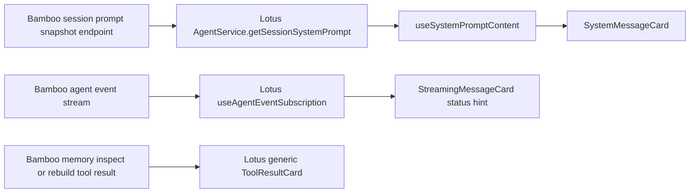
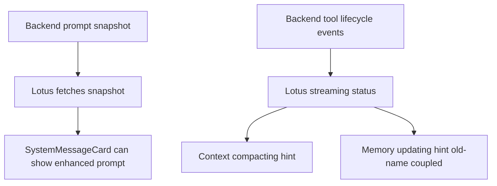
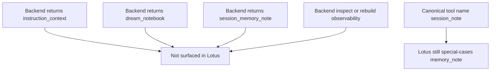

# 前后端联动评估：memory / session_note / prompt 增强是否已在前端体现

## Executive Summary

结论：**有一部分前端增强已经存在，但明显没有跟上这轮后端 memory / `session_note` / prompt snapshot 的增强深度。**

当前前端已经具备的增强主要集中在两类：

1. **System Prompt 可视化**：Lotus 可以从后端拉取 session prompt snapshot，并在聊天页里切换查看 Base / Enhanced prompt。
2. **运行中提示文案**：Lotus 对 context compaction、tool running、memory updating 有流式状态提示。

但当前仍存在 4 个明确缺口：

1. **前端类型契约落后于后端响应**：后端已经返回 `instruction_context`、`dream_notebook`、`session_memory_note`，Lotus 的 `SessionSystemPromptResponse` 还没跟上。
2. **UI 只消费了 `effective_system_prompt`**：没有把 prompt snapshot 分块展示成 workspace/env/skill/tool-guide/dream/session-note/task-list 等结构化视图。
3. **`session_note` canonical 化没有同步到前端提示逻辑**：Lotus 运行状态仍然把 `memory_note` 作为 special-case，导致 canonical 工具名 `session_note` 可能退化成普通 `tool_running:session_note` 展示。
4. **memory inspect/rebuild 的 observability 没有专门 UI**：后端已经能返回 `index_files` / `state_files` / `stale_candidate_count` / `last_reindex_at` / `last_dream_at`，前端仍只会把这些结果当通用 JSON 文本展示。

---

## 范围

- **Backend**: `bamboo/`
- **Frontend**: `lotus/`
- **Desktop shell**: `bodhi/`

说明：`bodhi/` 当前看起来主要是 Tauri 壳层，没有独立的 prompt / memory UI 消费逻辑；真正的前端体验主要落在 `lotus/`。

---

## 关键数据流

---

## 已经存在的前端增强

### 1. System Prompt 已有“增强版查看”能力

前端目前**确实已经有 prompt 相关增强**，不是完全没有。

#### 后端
- `bamboo/src/server/handlers/agent/sessions/handlers/crud/system_prompt.rs:33`
  - 提供 `GET /api/v1/sessions/{session_id}/system-prompt`
- `bamboo/src/server/handlers/agent/sessions/handlers/crud/system_prompt.rs:73-88`
  - 将 prompt snapshot 拆成多个字段返回

#### 前端
- `lotus/src/services/chat/AgentService.ts:472-478`
  - `getSessionSystemPrompt(sessionId)` 调用该接口
- `lotus/src/pages/ChatPage/components/SystemMessageCard/useSystemPromptContent.ts:117-123`
  - 拉取 snapshot 并优先使用 `effective_system_prompt`
- `lotus/src/pages/ChatPage/components/SystemMessageCard/index.tsx:58-72`
  - UI 提供 `View Enhanced` / `View Base` 切换

#### 结论
这说明前端**已经开始消费 prompt snapshot**，并不是零增强。

---

### 2. 前端已经有 context compaction / memory updating 的运行中提示

#### 前端事件订阅
- `lotus/src/hooks/useAgentEventSubscription.ts:302-309`
  - tool start 时设置 streaming status
- `lotus/src/hooks/useAgentEventSubscription.ts:412-419`
  - tool lifecycle begin 时设置 streaming status
- `lotus/src/pages/ChatPage/components/StreamingMessageCard/index.tsx:279-294`
  - 把 status 映射为用户可见文案
- `lotus/src/shared/i18n/resources.ts:367-371`
  - 文案包括：
    - `Assistant is compacting context...`
    - `Assistant is compacting context (degraded mode)...`
    - `Assistant failed to compact context. Continuing...`
    - `Assistant is updating memory...`
    - `Assistant is running {{tool}}...`

#### 结论
**提示类增强是有的**，尤其是 context compaction 这一块已经明显 surfaced 到前端。

---

## 目前最明显的前后端不对齐

## 1. `session_note` canonical 化没有同步到 Lotus 的状态提示逻辑

### 后端已经 canonical 化
- `bamboo/src/agent/tools/tools/memory_note.rs:23`
  - `const TOOL_NAME: &str = "session_note"`
- `bamboo/src/agent/loop_module/runner/prompt_context/external_memory.rs:14`
  - `EXTERNAL_MEMORY_TOOL_NAME = "session_note"`

### Lotus 仍写死旧名字
- `lotus/src/hooks/useAgentEventSubscription.ts:304-306`
  - 只有 `normalizedToolName === "memory_note"` 才映射到 `memory_updating`
- `lotus/src/hooks/useAgentEventSubscription.ts:414-416`
  - lifecycle begin 也同样只识别 `memory_note`
- `lotus/src/hooks/__tests__/useAgentEventSubscription.test.tsx:470-497`
  - 测试同样仍以 `memory_note` 为基准

### 影响
如果后端现在主路径发出的是 `session_note`：
- Lotus 不会命中 `memory_updating`
- 而会退化成通用文案 `Assistant is running session note...`

### 结论
这不是“完全没有增强”，而是**已有增强存在旧名字耦合，已经开始落后于后端 canonical 名称**。

---

## 2. 后端 prompt snapshot 已经更细，但 Lotus 类型和 UI 没跟上

### 后端返回字段更丰富
`bamboo/src/server/handlers/agent/sessions/types.rs:88-112` 当前返回：
- `base_system_prompt`
- `enhancement_prompt`
- `workspace_context`
- `instruction_context`
- `env_context`
- `skill_context`
- `tool_guide_context`
- `dream_notebook`
- `session_memory_note`
- `external_memory`
- `task_list`
- `effective_system_prompt`

而且 `bamboo/src/server/handlers/agent/sessions/handlers/crud/system_prompt.rs:73-88` 明确把这些字段全部填充进响应。

### Lotus 类型没对齐
`lotus/src/services/chat/AgentService.ts:261-272` 里 `SessionSystemPromptResponse` 只有：
- `base_system_prompt`
- `enhancement_prompt`
- `workspace_context`
- `env_context`
- `skill_context`
- `tool_guide_context`
- `external_memory`
- `task_list`
- `effective_system_prompt`

**缺少：**
- `instruction_context`
- `dream_notebook`
- `session_memory_note`

### Lotus UI 实际消费更少
- `lotus/src/pages/ChatPage/components/SystemMessageCard/useSystemPromptContent.ts:119-123`
  - 实际只拿 `effective_system_prompt`
- `lotus/src/pages/ChatPage/components/SystemMessageCard/index.tsx:54-98`
  - 只是“系统 prompt 的 markdown 查看卡片”

### 结论
后端已经把 prompt snapshot 细分成可结构化展示的数据，但前端目前**只把它当成一个整体增强 prompt 文本**来看。

---

## 3. `dream_notebook` / `session_memory_note` 后端已提供，但前端没有任何专门展示

### 后端
- `bamboo/src/server/handlers/agent/sessions/handlers/crud/system_prompt.rs:83-85`
  - 返回 `dream_notebook` 与 `session_memory_note`

### 前端
在 `lotus/src/` 中搜索：
- `dream_notebook`
- `session_memory_note`
- `instruction_context`

没有找到实际消费代码；目前只有系统 prompt snapshot 类型本身的一部分字段声明，且连这几个新增字段声明都没补上。

### 影响
你这轮后端在 prompt observability 上做的非常有价值的拆分：
- Dream notebook
- Session memory note
- instruction layer

**前端用户现在基本看不到这些结构化价值**。

---

## 4. memory inspect / rebuild observability 没有专门前端视图

### 后端已有增强
memory inspect/rebuild 现在已能提供：
- `index_files`
- `state_files`
- `stale_candidate_count`
- `last_reindex_at`
- `last_dream_at`

见：
- `bamboo/src/agent/core/memory_store/types.rs:217-241`
- `bamboo/src/agent/core/memory_store/store.rs:296-408`
- `bamboo/src/server/tools/memory.rs:809-835`

### Lotus 没有对应消费层
在 `lotus/src/` 中没有看到：
- memory inspect 专门卡片
- rebuild 专门卡片
- stale/index/state 专门可视化
- dream / reindex metadata 提示

当前 tool result 的展示路径是：
- `lotus/src/pages/ChatPage/components/MessageCard/MessageCardContent.tsx:157-166`
  - 普通 `tool_result` 直接进入 `ToolResultCard`
- `lotus/src/pages/ChatPage/components/ToolResultCard/index.tsx:42-59`
  - 只做通用格式化
- `lotus/src/pages/ChatPage/components/ToolResultCard/index.tsx:157-275`
  - 不是 diff 就是普通 JSON / 文本渲染

### 结论
**后端已经有 observability，前端没有 memory-specific presentation。**

---

## 5. Bodhi 壳层目前看不到额外的 memory/prompt UI 增强

对 `bodhi/` 的扫描结果：
- 没有命中 `session_note`
- 没有命中 `memory_note`
- 没有命中 `prompt snapshot`
- 没有命中 `dream_notebook` / `session_memory_note`

结合目录结构看，Bodhi 当前更像是 Tauri 容器壳层，相关体验增强基本都应当落在 Lotus，而不是 Bodhi 自己另做一层。

---

## 当前状态判断

### 已有的前端增强

### 尚未跟上的增强

---

## 最终结论

**一句话结论：前端“有增强，但不够，而且已经开始落后于后端这轮 memory/prompt 演进”。**

更准确地说：

- **有**：
  - Enhanced system prompt 查看
  - context compaction 提示
  - memory updating 提示框架
- **没有跟上**：
  - `session_note` canonical 名称联动
  - `dream_notebook` / `session_memory_note` / `instruction_context` 的结构化展示
  - memory inspect/rebuild observability 的专门 UI
  - memory-specific result rendering

所以如果你的问题是：

> 我们做了这么多后端改进，前端有没有对应增强？

答案是：

> **有一部分，但明显不够；现在最需要补的是“前端对新后端能力的 surfaced UI”，而不是后端继续埋能力。**

---

## 建议优先级

### P0：必须尽快补
1. **把 Lotus 的 `memory_note` special-case 改成同时支持 `session_note` / `memory_note`**
   - 文件：`lotus/src/hooks/useAgentEventSubscription.ts:304-306, 414-416`
   - 否则 memory updating 提示会和后端 canonical 名称脱节。

2. **同步 `SessionSystemPromptResponse` 前端类型**
   - 文件：`lotus/src/services/chat/AgentService.ts:261-272`
   - 补上：
     - `instruction_context?`
     - `dream_notebook?`
     - `session_memory_note?`

### P1：最值得做的体验增强
3. **升级 SystemMessageCard，从“整段 enhanced prompt”切到“分块 snapshot 视图”**
   - 建议分 Tabs 或 Sections：
     - Base
     - Enhancement
     - Workspace
     - Instruction
     - Env
     - Skills
     - Tool Guide
     - Dream
     - Session Memory
     - Task List
     - Effective Prompt

4. **为 memory inspect / rebuild 做专门结果卡片**
   - 重点可视化：
     - `stale_candidate_count`
     - `index_files`
     - `state_files`
     - `last_reindex_at`
     - `last_dream_at`

### P2：可选但很有价值
5. **在 SystemMessageCard 里增加“Prompt composition badges”**
   - 例如：Workspace / Env / Skill / Dream / Session Memory / Task List 是否启用

6. **给 `session_note` 做更友好的运行中文案**
   - 不是 generic `running session note`
   - 而是更接近“正在保存会话记忆 / 正在更新记忆摘要”

---

## 推荐的下一批前端实施项

如果要我来排，我建议按这个顺序推进：

1. Lotus：修 `memory_note` → `session_note` 状态识别
2. Lotus：补齐 prompt snapshot TS 类型
3. Lotus：SystemMessageCard 分块展示 snapshot 字段
4. Lotus：memory inspect/rebuild 专用 result card
5. Lotus：为 Dream / Session Memory 增加显式提示与说明文案

---

## 结论等级

- **前端已有增强**：✅ 是
- **是否充分覆盖本轮后端改进**：❌ 还没有
- **是否存在前后端命名脱节/回归风险**：⚠️ 有，最明显的是 `memory_note` vs `session_note`
