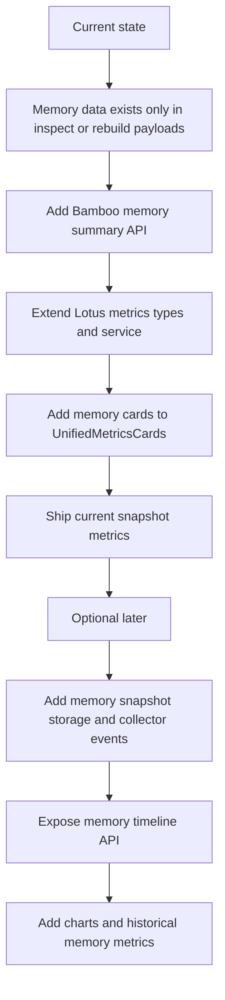

# Memory Metrics Feasibility for Lotus

## Executive Summary

**Short answer:** yes, Lotus can show memory-related metrics, **but not from the current metrics pipeline as-is**.

Today there are **two separate data planes**:

1. **Metrics plane** used by the Settings metrics dashboards
   - Chat/session/round/tool/forward metrics only
   - Backed by Bamboo metrics APIs and SQLite metrics storage
2. **Memory observability plane** used by the chat memory tool UI
   - Memory snapshot data from `memory inspect` / `memory rebuild`
   - Includes `total_memories`, `stale_candidate_count`, `last_reindex_at`, `last_dream_at`, `by_type`, `by_status`, `topic_paths`

The current Lotus metrics dashboards consume only the first plane, while memory data currently lives only in the second plane.

## Conclusion

- **Can Lotus metrics display memory indicators today without backend changes?**
  - **No, not via the existing metrics dashboard data pipeline.**
- **Can Lotus display memory indicators with reasonable engineering effort?**
  - **Yes.**
- **Best near-term path:**
  - Add a **memory summary API** in Bamboo and consume it from Lotus metrics cards.
- **If historical memory trend lines are required:**
  - Add a **memory metrics collection/storage pipeline** to Bamboo metrics.

---

## Frontend Findings

### Current metrics consumers in Lotus

Lotus metrics hooks and dashboards read from `@services/metrics` only:

- `lotus/src/pages/SettingsPage/components/SystemSettingsPage/hooks/useMetrics.ts:56`
- `lotus/src/pages/SettingsPage/components/SystemSettingsPage/hooks/useUnifiedMetrics.ts:42`
- `lotus/src/services/metrics/MetricsService.ts:36`

### Current metrics API methods consumed by Lotus

`lotus/src/services/metrics/MetricsService.ts:37-137` calls:

- `GET metrics/summary`
- `GET metrics/by-model`
- `GET metrics/sessions`
- `GET metrics/sessions/{session_id}`
- `GET metrics/daily`
- `GET metrics/forward/summary`
- `GET metrics/forward/by-endpoint`
- `GET metrics/forward/requests`
- `GET metrics/v2/summary`
- `GET metrics/v2/timeline`

### Current metrics types in Lotus

`lotus/src/services/metrics/types.ts:9-183` contains:

- `MetricsSummary`
- `ModelMetrics`
- `SessionMetrics`
- `RoundMetrics`
- `DailyMetrics`
- `PeriodMetrics`
- `ForwardMetricsSummary`
- `ForwardEndpointMetrics`
- `ForwardRequestMetrics`
- `UnifiedSummary`
- `CombinedSummary`
- `UnifiedTimelinePoint`

These types contain fields for:

- sessions
- rounds
- tokens
- tool calls
- active sessions
- forward proxy requests
- sync mismatches
- prompt cache compactions

They **do not contain any memory-specific fields** such as:

- `total_memories`
- `stale_candidate_count`
- `last_reindex_at`
- `last_dream_at`
- `by_type`
- `by_status`

### Current cards shown in Lotus metrics UI

The cards currently shown in Lotus are based on chat/forward metrics only:

- `lotus/src/pages/SettingsPage/components/SystemSettingsPage/metrics/MetricCards.tsx:49-106`
- `lotus/src/pages/SettingsPage/components/SystemSettingsPage/metrics/UnifiedMetricsCards.tsx:75-245`

Examples of currently rendered metrics:

- sync mismatches
- total sessions
- chat tokens
- total tool calls
- average session duration
- prompt cache compactions
- total requests
- success rate
- average response time
- forward requests/tokens/success/failure

No current card has any memory-specific datasource or rendering path.

---

## Backend Findings

### Current Bamboo metrics routes

Bamboo currently exposes these relevant metrics routes:

- `bamboo/src/server/routes/agent.rs:165-185`
  - `/metrics/summary`
  - `/metrics/by-model`
  - `/metrics/sessions`
  - `/metrics/sessions/{session_id}`
  - `/metrics/daily`
  - `/metrics/forward/summary`
  - `/metrics/forward/by-endpoint`
  - `/metrics/forward/requests`

Unified handlers also exist:

- `bamboo/src/server/handlers/agent/metrics/unified_handlers.rs:12-72`
  - `GET /metrics/v2/summary`
- `bamboo/src/server/handlers/agent/metrics/unified_handlers.rs:71-144`
  - `GET /metrics/v2/timeline`

### What Bamboo metrics currently aggregate

The Bamboo metrics model is chat/round/tool/forward oriented:

- `bamboo/src/agent/metrics/types.rs:110-238`
- `bamboo/src/server/metrics_service.rs:33-128`

Current metrics types include:

- `ToolCallMetrics`
- `RoundMetrics`
- `SessionMetrics`
- `DailyMetrics`
- `MetricsSummary`
- `Forward*` metrics

Current summary/timeline/session data includes:

- token usage
- tool calls
- message count
- duration
- active/completed/error status
- prompt cached tool outputs
- execute sync mismatches
- forward proxy request stats

There are **no memory-specific fields in the current metrics types**.

### What Bamboo metrics collector currently records

`bamboo/src/agent/metrics/collector.rs:10-74` shows the collector records:

- `SessionStarted`
- `SessionMessageCount`
- `SessionCompleted`
- `RoundStarted`
- `RoundCompleted`
- `ToolStarted`
- `ToolCompleted`
- `ExecuteSyncMismatch`
- `ForwardStarted`
- `ForwardCompleted`

There is **no collector command for memory snapshot / memory rebuild / memory inspect / reindex / dream state**.

This is the key reason memory is not already present in the metrics APIs.

---

## Existing Memory Data That Already Exists

Memory data **does** already exist in Bamboo, just not in the metrics pipeline.

### Bamboo memory inspect result

`bamboo/src/agent/core/memory_store/types.rs:217-242`

`MemoryInspectResult` already exposes:

- `scope`
- `project_key`
- `total_memories`
- `by_type`
- `by_status`
- `recent_ids`
- `view_files`
- `index_files`
- `state_files`
- `stale_candidate_count`
- `last_reindex_at`
- `last_dream_at`
- `topic_paths`

### Bamboo memory tool returns this structure today

- `bamboo/src/server/tools/memory.rs:807-857`

The `memory inspect` and `memory rebuild` tool results already return structured JSON payloads carrying the fields above.

### Lotus already understands these payloads in chat UI

Lotus already has a parser for this memory payload:

- `lotus/src/pages/ChatPage/utils/resultFormatters.ts:35-56`

So the frontend already knows the shape of current memory snapshot data.

**Important limitation:** this is **snapshot/tool-result data**, not metrics timeline data.

---

## Why It Cannot Be Shown Directly in Metrics Today

## Root cause

The current metrics dashboards are hard-wired to `@services/metrics` and the Bamboo metrics APIs.

Those APIs are backed by the metrics collector and storage system, which currently track:

- chat sessions
- rounds
- tool calls
- forward requests
- sync mismatches
- prompt cache compactions

They do **not** track:

- current memory inventory
- stale memory candidate counts
- last dream/reindex timestamps
- memory type/status breakdown

Meanwhile, the existing memory tool data is produced on-demand by `memory inspect` / `memory rebuild`, not stored in the metrics DB and not exposed through the metrics endpoints.

Therefore:

- **The data exists**
- **The metrics UI exists**
- **But the data is not connected to the metrics UI pipeline**

---

## Feasibility Matrix

| Goal | Feasible now? | Needs backend changes? | Notes |
|---|---:|---:|---|
| Show current total memories in metrics | No | Yes | Need summary endpoint or metrics extension |
| Show stale candidate count in metrics | No | Yes | Same |
| Show last reindex / last dream timestamps | No | Yes | Same |
| Show by-type / by-status memory breakdown | No | Yes | Need structured memory summary payload |
| Show historical memory trend line | No | Yes, larger | Requires collector/storage/timeline support |
| Show ad-hoc current memory snapshot elsewhere in UI | Yes | Minimal / already partially possible | Could reuse memory inspect payload, but not as true metrics |

---

## Recommended Implementation Paths

## Option A — Recommended P0: Add a live memory summary API

### Idea
Add a dedicated backend API that returns the **current** memory snapshot by reading from memory storage on demand.

Example shape:

```json
{
  "scope": "project",
  "project_key": "zenith",
  "total_memories": 42,
  "stale_candidate_count": 3,
  "last_reindex_at": "2026-04-03T13:00:00Z",
  "last_dream_at": "2026-04-03T13:10:00Z",
  "by_type": {
    "project": 20,
    "reference": 22
  },
  "by_status": {
    "active": 38,
    "stale": 4
  }
}
```

### Why this is the best short-term choice

- Reuses existing `MemoryInspectResult`
- Does **not** require extending the metrics collector first
- Lets Lotus show meaningful memory cards quickly
- Lower risk than modifying the existing metrics storage schema immediately

### Suggested backend endpoint

Two viable designs:

#### Design A1 — dedicated memory metrics endpoint
- `GET /metrics/memory/summary?scope=project&project_key=zenith`
- optional: `GET /metrics/memory/summaries`

#### Design A2 — extend unified summary
Add a `memory` object to `GET /metrics/v2/summary`

Example:

```json
{
  "chat": { ... },
  "forward": { ... },
  "combined": { ... },
  "memory": {
    "total_memories": 42,
    "stale_candidate_count": 3,
    "last_reindex_at": "...",
    "last_dream_at": "..."
  }
}
```

### Suggested Lotus work for P0

- Extend `lotus/src/services/metrics/types.ts`
- Extend `lotus/src/services/metrics/MetricsService.ts`
- Extend `useUnifiedMetrics` or create `useMemoryMetrics`
- Add 2-4 cards in `UnifiedMetricsCards.tsx`, for example:
  - Total Memories
  - Stale Candidates
  - Last Reindex
  - Last Dream

### Effort
- **Backend:** low to medium
- **Frontend:** low
- **Overall:** best short-term ROI

---

## Option B — P1/P2: Add historical memory metrics into Bamboo metrics pipeline

### Idea
Treat memory state as a first-class metrics stream and persist snapshots over time.

### What needs to change

1. Extend Bamboo metrics storage schema with memory snapshot tables
2. Extend `MetricsCollector` with memory-related events, e.g.
   - `MemorySnapshotRecorded`
   - `MemoryRebuildCompleted`
   - `MemoryDreamCompleted`
3. Decide when to record snapshots
   - after memory write/merge/purge/contradict
   - after memory rebuild
   - after dream generation
   - optionally periodic scheduled sampling
4. Extend summary/timeline APIs with memory series

### Benefit
This gives you true dashboard metrics such as:

- memory growth over time
- stale candidate trend
- reindex/dream recency trend
- per-project memory inventory trend

### Cost
Higher than Option A because it changes:

- collector
- storage
- aggregation logic
- APIs
- frontend types/charts/cards

### Effort
- **Backend:** medium to high
- **Frontend:** medium
- **Overall:** right choice only if historical charting is required

---

## Suggested Field Set

## Minimal P0 summary fields

Recommended fields for immediate UI value:

- `total_memories`
- `stale_candidate_count`
- `last_reindex_at`
- `last_dream_at`
- `by_type`
- `by_status`

## If timeline support is added later

Recommended time-series fields:

- `date`
- `scope`
- `project_key`
- `total_memories`
- `stale_candidate_count`
- `active_memories`
- `stale_memories`
- `project_memories`
- `reference_memories`

---

## Recommended Decision

### If the goal is: “show useful memory indicators in metrics soon”
Choose **Option A**.

### If the goal is: “show true memory trends over time in charts”
Choose **Option B**, possibly after shipping Option A first.

---

## Recommended Delivery Sequence



## Practical Recommendation

Ship in two phases:

1. **Phase 1**: current snapshot cards
2. **Phase 2**: historical timeline if still needed

---

## Final Answer

**Can the Lotus metrics dashboard display our memory metrics?**

- **Not directly today** through the existing metrics pipeline.
- **Yes, with backend support.**
- The fastest correct path is to add a **Bamboo memory summary API** and then surface those values in Lotus metrics cards.
- If you want historical trend lines rather than point-in-time values, you also need to extend Bamboo’s metrics collector/storage pipeline.
