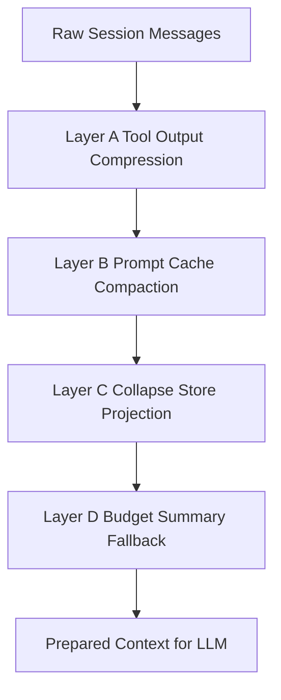
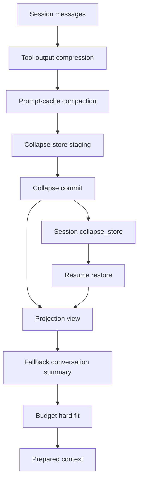

# Zenith / Bamboo 引入 Claude Code 风格 Collapse Store 的改造设计

## 1. 设计目标

当前 Zenith / Bamboo 已经具备以下压缩能力：

1. **tool-output 级压缩**
   - tool execution 后按场景压缩 Bash / Read / Grep / WebFetch 结果
2. **tool message 级截断**
   - 超大 tool result 入 session 时即截断
3. **budget 级会话压缩**
   - 基于 exposure / trigger / target 生成 summary
   - 将旧消息标记为 `compressed = true`
   - 写入 `conversation_summary` 与 `compression_events`
4. **prompt-cache 级旧 tool output summary**
   - 在 `prepare_hybrid_context()` 中将旧长 tool outputs 替换成缓存友好的 compact summary

但与 Claude Code 相比，Zenith 仍缺少一个关键能力：

> **可恢复、可重放、可投影的 collapse-store 状态层**

Claude Code 的强点并不是“会写 summary”，而是：
- collapse 不是一次性重写 transcript
- collapse 有 **commit log**
- collapse 有 **snapshot/staged queue**
- resume 时可以恢复 collapse 状态
- query 时可以通过 `projectView()` 重新投影 collapsed view

而 Zenith 当前更接近：
- 在 `Session` 上维护一个 authoritative summary 状态
- 压缩后旧消息被 archive
- prepare context 时把 summary 注回去

这种模式简单直接，但会遇到几个上限：

### 1.1 当前 Zenith 的缺口

1. **只有单一当前 summary，缺少多段 collapsed span 的显式状态**
2. **缺少 staged collapse queue**
   - 无法表达“哪些候选 span 已总结但尚未 commit”
3. **缺少 replay projection 机制**
   - resume 后只能依赖 session 原始字段，而不是重建 collapse view
4. **缺少多层压缩策略的显式互斥/优先级模型**
   - tool-output compression
   - prompt-cache compaction
   - conversation-span collapse
   - budget hard-fit
   这些策略都存在，但还没有统一编排器
5. **缺少面向 UI 的 collapsed-span 数据模型**
   - 现在 UI 主要靠 `compression_events` 和 message `compressed` 状态
   - 还不能很好表达“这一段历史被哪条摘要替换”

### 1.2 目标

这份设计要补的是：

- 引入 **collapse store** 作为独立状态层
- 保留现有 `conversation_summary + compression_events + compressed flags` 兼容性
- 让 Zenith 能做到：
  - 预压缩 candidate span staging
  - commit-log 式 collapse 记录
  - 根据 session + collapse store 重放 collapsed view
  - pre-turn / mid-turn 使用相同的 collapse 状态机
  - UI 可以精确渲染 collapsed spans 与摘要边界

---

## 2. 设计原则

1. **不推翻现有 `Session` 模型**
   - 以增量兼容为主
2. **collapse store 与 budget summary 共存**
   - collapse store 是更细粒度的 span-level 状态
   - budget summary 仍保留作为 hard-limit / fallback 层
3. **投影视图不等于物理删除**
   - 历史消息保留在 session storage 中
   - collapse view 是投影
4. **resume 可恢复**
   - collapse state 必须持久化
5. **UI 先于 prompt 完整可解释**
   - 所有 collapse commit / snapshot 都应可被 UI 解释
6. **多层策略要有优先级**
   - tool result compression
   - prompt cache compaction
   - collapse store
   - budget summary fallback

---

## 3. 拟新增的核心概念

## 3.1 Collapse Span

表示一段“原始历史消息范围”，这些消息在投影视图中会被一个摘要节点替代。

建议结构：

```rust
#[derive(Debug, Clone, Serialize, Deserialize)]
pub struct CollapseSpan {
    pub collapse_id: String,
    pub start_message_id: String,
    pub end_message_id: String,
    pub summary_message_id: String,
    pub summary_text: String,
    pub archived_message_ids: Vec<String>,
    pub created_at: DateTime<Utc>,
    pub risk_score: f32,
    pub tokens_before: u32,
    pub tokens_after: u32,
    pub source: CollapseSource,
}
```

其中：
- `start_message_id` / `end_message_id`：span 边界
- `summary_message_id`：投影视图中的虚拟/合成 summary message id
- `archived_message_ids`：被此 collapse 覆盖的原始消息 id
- `risk_score`：给 future merge/stage/commit 决策用
- `source`：如 `pre_turn`, `mid_turn`, `manual`, `overflow_recovery`

### 3.2 Collapse Store

表示当前 session 下的 collapse 状态总表。

建议结构：

```rust
#[derive(Debug, Clone, Serialize, Deserialize, Default)]
pub struct CollapseStore {
    pub version: u32,
    pub session_id: String,
    pub commits: Vec<CollapseCommit>,
    pub snapshot: Option<CollapseSnapshot>,
}
```

### 3.3 Collapse Commit

一个 commit 代表一次正式“提交”的 collapse 操作。

```rust
#[derive(Debug, Clone, Serialize, Deserialize)]
pub struct CollapseCommit {
    pub commit_id: String,
    pub created_at: DateTime<Utc>,
    pub spans: Vec<CollapseSpan>,
    pub trigger_phase: CollapsePhase,
    pub usage_before_percent: f64,
    pub usage_after_percent: f64,
    pub notes: Option<String>,
}
```

### 3.4 Collapse Snapshot

snapshot 用来记录 staged queue 与运行状态，类似 Claude Code 的 `marble-origami-snapshot`。

```rust
#[derive(Debug, Clone, Serialize, Deserialize)]
pub struct CollapseSnapshot {
    pub staged: Vec<StagedCollapseCandidate>,
    pub armed: bool,
    pub last_spawn_tokens: u32,
    pub updated_at: DateTime<Utc>,
}
```

### 3.5 Staged Collapse Candidate

表示“已经被候选出来，可能下一轮 commit”的 span。

```rust
#[derive(Debug, Clone, Serialize, Deserialize)]
pub struct StagedCollapseCandidate {
    pub candidate_id: String,
    pub start_message_id: String,
    pub end_message_id: String,
    pub draft_summary: String,
    pub risk_score: f32,
    pub staged_at: DateTime<Utc>,
    pub source: CollapsePhase,
}
```

---

## 4. 与现有 Session 模型的整合

当前 `Session` 已经有：
- `messages`
- `conversation_summary`
- `compression_events`
- `prompt_snapshot`

建议新增：

```rust
#[serde(default, skip_serializing_if = "Option::is_none")]
pub collapse_store: Option<CollapseStore>,
```

并且保留现有：
- `conversation_summary`：作为 legacy / fallback / hard-limit summary
- `compression_events`：继续给 UI 提供 timeline

### 兼容原则

- **v1**：`collapse_store` 为空时，系统按现在行为运行
- **v2**：有 `collapse_store` 时，优先使用 projection-based collapsed view
- `conversation_summary` 仍保留，作为：
  - collapse store 不足时的 fallback
  - overflow/hard-limit safety summary
  - older clients 的兼容字段

---

## 5. 新的压缩分层架构

建议把 Zenith 的上下文压缩明确拆成 4 层：

1. **Layer A — Tool Output Compression**
   - 现有 `output_compressor`
   - 目标：减少单条 tool result 噪声
2. **Layer B — Prompt Cache Compaction**
   - 现有 `maybe_compact_old_tool_outputs_for_prompt`
   - 目标：低风险缩短旧 tool outputs
3. **Layer C — Collapse Store Projection**
   - 新增
   - 目标：把老的 conversation spans 投影成多个 collapsed spans
4. **Layer D — Budget Summary Fallback**
   - 现有 `conversation_summary` + `apply_compression_plan`
   - 目标：极限情况下硬保命

可视化如下：



### 关键原则

- A/B 优先于 C/D
- C 是“中风险、高收益”的 conversation-span 级压缩
- D 是最后 fallback

---

## 6. 新运行时流程设计

## 6.1 Pre-turn 流程

在 `prepare_round_context()` 中，新增 collapse-store 处理流程：

### 当前流程
- maybe_apply_host_context_compression_with_budget(pre-turn)
- prepare_hybrid_context()

### 新流程建议

1. 计算当前 exposure
2. 先尝试 **Layer B** prompt-cache compaction
3. 若 exposure 继续上升到 collapse trigger：
   - 从旧消息中切出 candidate spans
   - 生成 staged candidates
   - 若满足 commit 条件则写入 `collapse_store.commits`
4. 构造 projected active view
5. 如果 projected view 仍过大，再走现有 host summary fallback
6. 最后 `prepare_hybrid_context()` 只对 projected view 做 hard-fit

建议新伪代码：

```rust
prepare_round_context(session):
  budget = resolve_budget(session)
  maybe_apply_prompt_cache_compaction(session)
  maybe_stage_or_commit_collapse_spans(session, phase="pre-turn")
  projected_session = project_session_with_collapse_store(session)
  maybe_apply_host_summary_fallback(projected_session)
  prepared = prepare_hybrid_context(projected_session)
  return prepared
```

## 6.2 Mid-turn 流程

当前 Zenith 已支持：
- tool call 后 `maybe_apply_mid_turn_context_compression`

建议改造成：

1. tool 执行完
2. 先做 tool output compression
3. 若 token exposure 超过 mid-turn collapse threshold：
   - stage/commit collapse spans
4. 若仍接近极限，再触发现有 summary fallback

这样可以做到：
- 中途工具产生大量 trace 时，不是马上把所有历史压成单条 summary
- 而是优先 collapse 较老 spans

## 6.3 Resume 流程

新增：
- session load 时，读 `collapse_store`
- 构建内存中的 `CollapseProjectionState`
- UI 与 query 都使用 `project_session_with_collapse_store()`

也就是说，resume 之后：
- 不靠“当前 messages 是否已经物理替换”来恢复状态
- 而靠 `collapse_store.commits + snapshot`

这就是 Claude Code 风格的“replay projection”。

---

## 7. Collapse Store 的 projection 设计

## 7.1 为什么需要 projection

如果继续沿用当前 Zenith 模型：
- 历史消息打 `compressed=true`
- 再插入单一 summary

那么会有两个问题：
1. 很难表达多个 collapsed spans
2. UI 无法精确恢复“哪段历史被哪个摘要替代”

projection 的核心思想是：
- 原始消息仍保留在 session 存储里
- 对外提供“投影视图”
- 投影视图中，某些 spans 被 synthetic summary node 替代

## 7.2 Projection 规则

### 输入
- `session.messages`
- `collapse_store.commits`
- `collapse_store.snapshot`

### 输出
- `projected_messages`

### 规则

1. 从原始 messages 按时间顺序扫描
2. 如果当前 message id 落入某个 committed collapse span：
   - 只输出一次 synthetic summary message
   - 跳过 span 内其余原始消息
3. 不在 span 中的消息照常输出
4. 对最近保护区（latest user turns / latest tool chains）永不 collapse
5. 如果 snapshot 中有 staged spans：
   - UI 可显示“待提交 collapse 候选”
   - 但默认不进入 LLM projected context

### 合成 summary message 结构

建议用一条 system message 或新 message variant：

```rust
Message {
  id: summary_message_id,
  role: Role::System,
  content: "<!-- COLLAPSE_SPAN_START --> ... <!-- COLLAPSE_SPAN_END -->",
  metadata: {
    "collapse_id": "...",
    "synthetic": true,
    "archived_range": [start, end]
  }
}
```

这样可以兼容现有 provider message 结构，不必先引入新 role。

---

## 8. 如何切分 candidate spans

Zenith 当前已经有 `MessageSegmenter` 和 tool-chain 原子性逻辑，这是巨大的优势。

建议直接复用现有 segmenter，而不是重新发明一套 span 算法。

## 8.1 候选切分规则

候选 span 应满足：

1. 位于最近保护区之前
2. 不打断 tool-chain 原子性
3. 优先从旧 segments 中组块
4. 不跨越关键 anchors：
   - 第一个 user request
   - 最后一个 user turn
   - 最新 textual assistant outcome
5. skill/tool guide/system prompt message 不进入普通 collapse

## 8.2 commit 条件

建议 collapse commit 只有在满足以下之一时触发：

- usage > collapse_trigger_percent
- staged spans 累积 token 足够大
- mid-turn after tools 产生大量 trace
- resume 后恢复出的 staged 状态已超过阈值

## 8.3 draft summary 生成

draft summary 可复用现有：
- `LlmSummarizer`
- existing_summary
- task_list_prompt

但生成粒度改为：
- 针对候选 span 单独 summarization
- 而不是直接覆盖整个 `conversation_summary`

---

## 9. 与现有 conversation_summary 的关系

不建议直接删除 `conversation_summary`，建议改成：

### 9.1 短期
- `conversation_summary` 保留
- collapse store 引入后，`conversation_summary` 仅作为：
  - hard-limit fallback
  - older UI compatibility
  - auto_dream 输入源之一

### 9.2 中期
- 主上下文连续性更多依赖 collapse spans
- `conversation_summary` 变成“全局 fallback summary”

### 9.3 长期
可以把 `conversation_summary` 重命名概念化为：
- `fallback_summary`

但不建议一开始就改字段名，避免迁移面太大。

---

## 10. 需要新增/调整的事件

当前已有：
- `ContextCompressionStatus`
- `ContextSummarized`
- `TokenBudgetUpdated`

建议新增：

### 10.1 `ContextCollapseStaged`

```rust
ContextCollapseStaged {
  phase: String,
  candidate_count: usize,
  token_impact_estimate: u32,
}
```

### 10.2 `ContextCollapseCommitted`

```rust
ContextCollapseCommitted {
  phase: String,
  commit_id: String,
  span_count: usize,
  messages_archived: usize,
  usage_before_percent: f64,
  usage_after_percent: f64,
}
```

### 10.3 `ContextCollapseRestored`

```rust
ContextCollapseRestored {
  commit_count: usize,
  staged_count: usize,
}
```

这些事件会让 UI 更容易做：
- staged candidate 可视化
- collapse timeline
- resume 后状态恢复提示

---

## 11. PromptSnapshot 需要怎么扩展

当前 `PromptSnapshot` 已包含：
- base/system/env/skill/tool_guide/task_list
- dream_notebook
- session_memory_note

建议新增可选字段：

```rust
pub collapsed_view_summary: Option<String>,
pub collapse_commit_count: Option<usize>,
pub collapse_staged_count: Option<usize>,
```

用途：
- 调试“当前 prompt 是否使用 collapse projection”
- UI 显示“本轮 prompt 里包含几个 collapsed spans”

---

## 12. 数据持久化方案

建议不要一开始就额外建独立 sqlite / log 文件。

### v1 方案：先内嵌进 Session

优点：
- 实施快
- 复用现有 session storage
- 便于和 `compression_events` 协同

缺点：
- session.json 体积增加
- commit 数量多时可能臃肿

### v2 方案：再拆为 sidecar log

如果 commit log 变多，可迁移为：
- `session.json` 保存 latest snapshot
- `collapse-log.jsonl` 保存 commit log

这与 Claude Code 的 transcript append 结构更接近。

**建议路线：先 v1，再按规模演进到 v2。**

---

## 13. 与现有 auto_dream / durable memory 的关系

collapse store 不是 memory system 的替代，而是为 memory system 提供更好的中间层。

### 13.1 对 auto_dream 的好处

现在 auto_dream 主要读：
- `conversation_summary`
- 或 session outline

引入 collapse store 后，可以改成：
- 优先聚合 collapse spans 的摘要
- 再 fallback 到 `conversation_summary`

这会让 dream notebook 更细粒度、更接近真实任务演进。

### 13.2 对 durable memory 的好处

collapse spans 是很好的 durable memory 候选源：
- 某些稳定 span summary 可自动建议升级为 durable memory doc
- 比直接从完整 transcript 提取更高效

---

## 14. 分阶段实施计划

## Phase 0 — 文档与观测先行

目标：不改行为，只增强可观测性。

- 增加 `prompt_snapshot` 中的 collapse 相关调试字段
- 增加 `ContextCollapse*` 事件类型
- 为 `prepare_round_context()` 和 mid-turn compression 加详细 tracing

## Phase 1 — 引入 CollapseStore 数据结构，但不改变 prepared context

目标：先能记录 collapse commit/snapshot。

- 在 `Session` 中新增 `collapse_store`
- pre-turn/mid-turn 生成 staged candidates 和 commits
- UI 可看到 collapse timeline
- 但 LLM 仍沿用现有 `conversation_summary`

## Phase 2 — 引入 projection view

目标：让 prepared context 使用 `project_session_with_collapse_store()`。

- 添加 synthetic summary span message
- prepare context 基于 projected messages 而非单纯 `!compressed`
- 仍保留 fallback `conversation_summary`

## Phase 3 — 策略编排统一化

目标：把多层压缩做成显式 pipeline。

建议顺序：
1. tool-output compression
2. prompt-cache compaction
3. collapse-store projection commit
4. budget summary fallback
5. final hard-fit segment selection

## Phase 4 — resume / sidecar persistence / UI 深化

- resume 恢复 collapse store
- 视需要拆 sidecar log
- UI 增加：
  - collapsed span 展示
  - staged queue 展示
  - 恢复提示

---

## 15. 风险与注意事项

### 15.1 双重压缩风险

如果 collapse-store 和 `conversation_summary` 同时强介入，可能会：
- 重复摘要
- 信息损失叠加

解决：
- 明确 collapse-store 优先
- `conversation_summary` 仅作 fallback

### 15.2 事件顺序与 resume 一致性

如果 commit 与 snapshot 的写入顺序不稳定，会导致恢复错乱。

解决：
- 统一 commit -> snapshot 顺序
- 恢复时永远 last snapshot wins

### 15.3 synthetic summary message 与 provider 兼容

如果引入新 message role，可能影响 provider 适配。

解决：
- v1 使用 `Role::System` + metadata 标记 synthetic
- 不改 provider protocol

### 15.4 与 task list 冲突

collapse span summary 如果覆盖当前执行关键任务，可能误导模型。

解决：
- latest user turns / latest task-relevant chains 永不 collapse
- summarizer prompt 始终附带 task list context

---

## 16. 最终建议

如果只给一个实施建议，我建议 Zenith 按下面顺序演进：

1. **先引入 `CollapseStore` 结构和事件，不改主行为**
2. **再引入 projection view，让 collapsed spans 进入 prepared context**
3. **最后把 `conversation_summary` 降级为 fallback summary**

这是最稳的路线，因为：
- 不会一次性推翻当前 budget 系统
- 能复用现有 `MessageSegmenter`、`CompressionEvent`、`PromptSnapshot`
- 能逐步靠近 Claude Code 那种“collapse-store + replay projection”模型

---

## 17. 一句话版本

> **Zenith 下一阶段最值得做的，不是继续强化单一 `conversation_summary`，而是把“压缩结果”从一个字段升级成一个可恢复、可重放、可投影的 `collapse_store`。**

