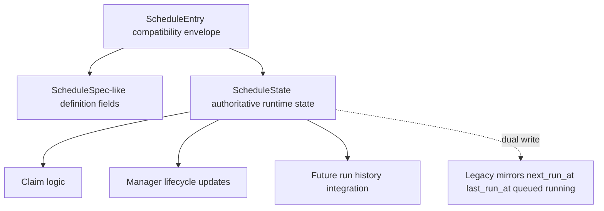

# ScheduleState Refactor Plan

- **Date**: 2026-04-04
- **Author**: Bodhi
- **Status**: Draft
- **Scope**: Focused migration plan for making `ScheduleState` authoritative while preserving `ScheduleEntry` compatibility during the Bamboo scheduler redesign

This document complements [`schedule-system-redesign.md`](./schedule-system-redesign.md). The broader redesign doc explains the long-term target architecture. This document narrows the focus to one concrete problem:

> **How do we move Bamboo from legacy top-level schedule runtime fields to an authoritative `ScheduleState` model without breaking existing storage, API, and runtime behavior?**

---

## Executive Summary

The scheduler has now progressed beyond the original interval-only prototype.

Current Bamboo scheduler capabilities already include:

- trigger-based schedule definitions via `ScheduleTrigger`
- native trigger computation for `interval`, `daily`, `weekly`, and `monthly`
- cron-backed trigger computation behind `TriggerEngine`
- timezone-aware trigger evaluation
- explicit `misfire_policy` and `overlap_policy`
- minimal dispatch-time enforcement of misfire / overlap behavior

However, the mutable runtime state is still not modeled cleanly.

Today, actual runtime state is split across legacy fields on `ScheduleEntry`:

- `next_run_at`
- `last_run_at`
- `queued_run_count`
- `running_run_count`

Meanwhile `ScheduleState` exists in the domain model, but is not yet authoritative. It is currently derived only through `ScheduleEntry::to_schedule_state()` and is not the source of truth for scheduler execution.

This document proposes a phased refactor that:

1. makes `ScheduleState` the authoritative mutable runtime state
2. preserves compatibility with current persisted `ScheduleEntry` JSON and HTTP responses
3. keeps `TriggerEngine`, policy evaluation, and execution flow stable while state ownership moves
4. creates a clean bridge toward first-class `ScheduleRunRecord` persistence later

---

## Current Implementation Checkpoint

### What is already in place

The scheduler already has a significant portion of the redesign foundations implemented:

- `ScheduleTrigger`, `MisfirePolicy`, `OverlapPolicy`, `ScheduleState`, and `ScheduleRunRecord` domain types exist
- trigger-based HTTP API and validation already exist
- `TriggerEngine` is already interface-oriented
- `default_trigger_engine()` already routes between native and cron-backed engines
- minimal misfire / overlap semantics already run in `claim_due_runs_with_engine(...)`
- manager lifecycle already updates queued / running counters around dispatch

### What is still structurally wrong

Despite the above progress, the system still has an architectural mismatch:

1. `ScheduleEntry` mixes **definition state** and **runtime state**
2. `ScheduleState` is mostly unused as a real persistence boundary
3. HTTP list/get responses still expose raw `ScheduleEntry`
4. runtime bookkeeping semantics are only partially aligned with long-term state design
5. run history does not yet exist as authoritative persisted scheduler state

---

## Current Code Facts

### 1. `ScheduleState` is present but not authoritative

Current `ScheduleState` in `src/server/schedules/domain.rs` contains:

- `next_fire_at`
- `last_scheduled_at`
- `last_started_at`
- `last_finished_at`
- `last_success_at`
- `last_failure_at`
- counters for failures / successes / misses

But current runtime does **not** persist or update it as the main scheduler state object.

`ScheduleEntry::to_schedule_state()` currently only maps:

- `next_run_at -> state.next_fire_at`
- `last_run_at -> state.last_scheduled_at`

Everything else remains defaulted.

### 2. `ScheduleEntry` is still the real source of runtime truth

Current `ScheduleEntry` in `src/server/schedules/store.rs` contains both schedule definition and mutable runtime data:

#### Definition-oriented fields

- `id`
- `name`
- `enabled`
- `interval_seconds` (legacy)
- `trigger`
- `timezone`
- `start_at`
- `end_at`
- `misfire_policy`
- `overlap_policy`
- `run_config`
- `created_at`
- `updated_at`

#### Runtime-oriented fields

- `last_run_at`
- `next_run_at`
- `queued_run_count`
- `running_run_count`

This makes `ScheduleEntry` an awkward hybrid rather than a clean spec/state separation.

### 3. Current API shape leaks storage layout

`ListSchedulesResponse` currently returns `Vec<ScheduleEntry>` directly.

That means external API consumers are implicitly coupled to the current storage representation, including legacy fields that should eventually become implementation details.

### 4. Current running-state semantics are not yet final-quality

A particularly important current fact:

- the manager worker calls `mark_run_started(...)` before `run_schedule_job(...)`
- `run_schedule_job(...)` creates a session and then spawns the actual agent loop in a background task
- the worker currently calls `mark_run_finished(...)` when `run_schedule_job(...)` returns

This means current `running_run_count` does **not** yet mean “background agent execution is still running until terminal completion”.

Today it more closely means:

> “the schedule dispatch worker is actively processing this run handoff”

That is acceptable for the current minimal overlap implementation, but it is not the long-term meaning we want `ScheduleState.running_run_count` to carry.

### 5. Tool migration is not finished yet

The HTTP API is already trigger-based, but the server-side scheduler tool still retains interval-oriented assumptions. That means storage and runtime migration should preserve legacy compatibility for one more phase.

---

## Refactor Goals for This Phase

The ScheduleState refactor should achieve the following:

1. **Make `ScheduleState` authoritative for mutable runtime scheduler state.**
2. **Keep `ScheduleSpec` semantics unchanged.**
3. **Preserve backward compatibility with existing `schedules.json` entries.**
4. **Preserve current HTTP behavior until a safer API transition is ready.**
5. **Avoid rewriting trigger engine code or policy code unnecessarily.**
6. **Create a clean handoff point for future `ScheduleRunRecord` persistence.**

### Non-goals for this focused refactor

This phase should **not** attempt to solve everything at once.

Out of scope for the first ScheduleState refactor step:

- moving all schedule entities to SQLite immediately
- introducing full run history persistence in the same patch
- redesigning the tool API in the same patch
- perfecting background-agent completion semantics in the same patch
- removing all legacy fields in one go

---

## Proposed State Model

## Core decision

`ScheduleState` should become the authoritative mutable scheduler state, while `ScheduleEntry` temporarily remains the compatibility envelope used by JSON persistence and current APIs.

That means the near-term relationship becomes:



---

## Required `ScheduleState` semantics

The existing `ScheduleState` fields should be reinterpreted and extended in a way that matches real scheduler lifecycle ownership.

### Phase-1 required authoritative fields

These fields should be authoritative as soon as ScheduleState migration begins:

- `next_fire_at`
- `last_scheduled_at`
- `queued_run_count`
- `running_run_count`

### Phase-2 lifecycle fields

These should become authoritative when actual run lifecycle is wired through terminal completion events:

- `last_started_at`
- `last_finished_at`
- `last_success_at`
- `last_failure_at`
- `consecutive_failures`
- `total_run_count`
- `total_success_count`
- `total_failure_count`
- `total_missed_count`

### Recommended extension

The current `ScheduleState` type does not yet include queue / running counters. It should be extended to include them.

Recommended near-term shape:

```rust
pub struct ScheduleState {
    pub next_fire_at: Option<DateTime<Utc>>,
    pub last_scheduled_at: Option<DateTime<Utc>>,
    pub last_started_at: Option<DateTime<Utc>>,
    pub last_finished_at: Option<DateTime<Utc>>,
    pub last_success_at: Option<DateTime<Utc>>,
    pub last_failure_at: Option<DateTime<Utc>>,
    pub queued_run_count: u32,
    pub running_run_count: u32,
    pub consecutive_failures: u32,
    pub total_run_count: u64,
    pub total_success_count: u64,
    pub total_failure_count: u64,
    pub total_missed_count: u64,
}
```

### Important semantic note

In Phase 1, `running_run_count` may still temporarily reflect current worker-scoped dispatch semantics rather than true background execution lifetime. That is acceptable **only as a migration bridge**.

Phase 2 should tighten the meaning to:

> count of non-terminal scheduled runs currently in `Running` status

That transition becomes much easier once `ScheduleRunRecord` persistence exists.

---

## Compatibility Envelope Design

## Near-term `ScheduleEntry` shape

Instead of deleting legacy fields immediately, add a `state` field and keep legacy mirrors for compatibility.

Recommended near-term shape:

```rust
pub struct ScheduleEntry {
    // definition / compatibility envelope
    pub id: String,
    pub name: String,
    pub enabled: bool,
    pub interval_seconds: u64, // legacy mirror for interval trigger
    pub trigger: Option<ScheduleTrigger>,
    pub timezone: Option<String>,
    pub start_at: Option<DateTime<Utc>>,
    pub end_at: Option<DateTime<Utc>>,
    pub misfire_policy: MisfirePolicy,
    pub overlap_policy: OverlapPolicy,
    pub created_at: DateTime<Utc>,
    pub updated_at: DateTime<Utc>,
    pub run_config: ScheduleRunConfig,

    // authoritative mutable state
    pub state: ScheduleState,

    // temporary legacy mirrors
    pub last_run_at: Option<DateTime<Utc>>,
    pub next_run_at: DateTime<Utc>,
    pub queued_run_count: u32,
    pub running_run_count: u32,
}
```

### Why this bridge is worth it

This avoids a dangerous big-bang rewrite.

It allows Bamboo to:

- deserialize existing JSON safely with `#[serde(default)]`
- keep API responses backward-compatible for current consumers
- migrate scheduler internals to state-first reads/writes
- remove legacy fields later after handlers/tools stop depending on them

---

## Legacy Mapping Rules

The migration should use explicit, centralized mapping rules.

| Current field | New canonical location | Migration note |
|---|---|---|
| `interval_seconds` | still top-level legacy mirror | remains until interval-only callers are retired |
| `next_run_at` | `state.next_fire_at` | top-level field becomes a mirror |
| `last_run_at` | `state.last_scheduled_at` | preserves current claim-time semantics initially |
| `queued_run_count` | `state.queued_run_count` | top-level field becomes a mirror |
| `running_run_count` | `state.running_run_count` | top-level field becomes a mirror |

### Backfill rule

When loading persisted entries:

1. if `state` is absent, initialize it from legacy fields
2. if `state` is present, prefer it
3. re-sync legacy mirrors from authoritative `state` before writing back

### Sync direction

During the compatibility phase, writes should follow this order:

1. mutate `entry.state`
2. regenerate legacy mirror fields from `state`
3. persist the combined envelope

This guarantees a single internal source of truth even before the API contract is cleaned up.

---

## Responsibility Boundaries After Refactor

## Store responsibilities

The store should own:

- persisted `ScheduleEntry` compatibility envelope
- `ScheduleState` backfill and migration
- atomic mutation helpers that operate on `ScheduleState`
- syncing legacy mirror fields before persist

Examples of state-first store helpers:

- `current_due_at(entry)` should read `entry.state.next_fire_at`
- `mark_run_started(...)` should mutate `entry.state.queued_run_count` / `entry.state.running_run_count`
- `mark_run_finished(...)` should mutate `entry.state.running_run_count`
- `claim_due_runs_with_engine(...)` should read/write `entry.state.next_fire_at` and `entry.state.last_scheduled_at`

## Claim / policy responsibilities

Claim resolution should own:

- due occurrence detection
- misfire expansion / coalescing
- overlap gating
- advancing `state.next_fire_at`
- incrementing queued counters for materialized dispatches

It should **not** own final success/failure accounting. That belongs to actual run lifecycle.

## Manager responsibilities

The manager should own:

- queue handoff lifecycle
- transition from queued to running
- eventual transition from running to terminal completion hooks

### Important boundary correction

The current manager marks “finished” when the dispatch handoff function returns, not when the background agent loop actually reaches terminal completion.

The ScheduleState design should treat this as a temporary approximation, not the final lifecycle model.

## Future run-history responsibilities

Once `ScheduleRunRecord` persistence lands, it should own:

- the authoritative per-run lifecycle
- exact `Queued -> Running -> Success/Failed/Skipped/Missed` transitions
- derivation of aggregate ScheduleState counters

At that point, `ScheduleState` becomes the aggregate summary and `ScheduleRunRecord` becomes the detailed event history.

---

## API Strategy

## Near-term API compatibility

Do **not** break current HTTP responses in the first state-refactor patch.

Recommended Phase-1 behavior:

- keep `ListSchedulesResponse { schedules: Vec<ScheduleEntry> }`
- add `state` to serialized `ScheduleEntry`
- keep existing top-level legacy fields in responses

This allows clients to begin consuming `state` while old consumers keep working.

## Medium-term API cleanup

After internal state migration stabilizes, move handlers away from raw `ScheduleEntry` and introduce a stable response shape, for example:

```rust
pub struct ScheduleView {
    pub spec: ScheduleSpec,
    pub state: ScheduleState,
}
```

That decouples API shape from storage implementation.

---

## Recommended Phased Rollout

## Phase S1: state-in-entry compatibility bridge

Deliverables:

- extend `ScheduleState` with queued / running counters
- add `state: ScheduleState` to `ScheduleEntry`
- backfill state from legacy fields on load
- switch internal scheduler helpers to read/write `state`
- dual-write legacy mirror fields
- add compatibility tests for old persisted schedules

### Success criteria

- scheduler behavior remains unchanged from user perspective
- `state` is persisted and stable across restart
- internal runtime code stops treating legacy top-level fields as authoritative

## Phase S2: state-first runtime semantics

Deliverables:

- update claim / manager code to use `state` directly
- centralize state mutation helpers
- tighten meaning of `last_scheduled_at`, `last_started_at`, `last_finished_at`
- document temporary approximation vs final lifecycle semantics

### Success criteria

- all scheduling decisions use `state`
- `next_run_at` and related top-level fields are mirrors only
- code review can point to one canonical runtime-state object

## Phase S3: run-history integration

Deliverables:

- persist `ScheduleRunRecord`
- move start / finish / failure accounting to run records
- derive `ScheduleState` counters from run lifecycle updates
- attach `schedule_run_id` to created sessions

### Success criteria

- `running_run_count` and completion timestamps reflect actual run lifecycle
- observability and auditability improve materially

## Phase S4: API / tool cleanup

Deliverables:

- introduce `ScheduleView` or equivalent response type
- remove raw `ScheduleEntry` exposure from handlers
- migrate scheduler tool away from interval-only assumptions
- deprecate legacy mirror fields

### Success criteria

- external contract no longer depends on storage internals
- `interval_seconds`, `next_run_at`, `last_run_at`, and top-level counters become removable

---

## Recommended First Implementation Slice

The safest first code change after this design doc is:

1. add `state: ScheduleState` to `ScheduleEntry`
2. extend `ScheduleState` with `queued_run_count` and `running_run_count`
3. implement `backfill_state_from_legacy(entry)`
4. implement `sync_legacy_fields_from_state(entry)`
5. switch the following helpers to state-first logic:
   - `current_due_at(...)`
   - `compute_initial_next_run_at(...)` write path
   - `claim_due_runs_with_engine(...)`
   - `mark_run_started(...)`
   - `mark_run_finished(...)`
   - `mark_run_dequeued_without_start(...)`
6. add migration tests proving that old JSON without `state` loads and writes back correctly

This slice is small enough to land safely, but meaningful enough to move the architecture onto the right rails.

---

## Open Questions

1. Should `last_scheduled_at` continue to mean claim-time for one bridge phase, or should it move immediately to “scheduled occurrence timestamp”? 
2. Should `running_run_count` stay named as-is during the bridge phase even though its current semantics are only approximate?
3. Should Phase S1 keep `next_run_at: DateTime<Utc>` non-optional for compatibility, or relax it once `state.next_fire_at` becomes authoritative?
4. Should handler responses expose both legacy fields and `state`, or introduce `ScheduleView` immediately?
5. Should the tool API migration happen before or after `ScheduleState` becomes authoritative internally?

---

## Recommendation

The best next step is **not** a big rewrite.

The best next step is a controlled compatibility bridge:

> **Persist `ScheduleState` inside `ScheduleEntry`, make scheduler internals state-first, dual-write legacy mirrors, and postpone external cleanup until after runtime behavior is stable.**

That path preserves momentum, minimizes risk, and gives Bamboo a clean foundation for run history, metrics, and eventual storage/API cleanup.
