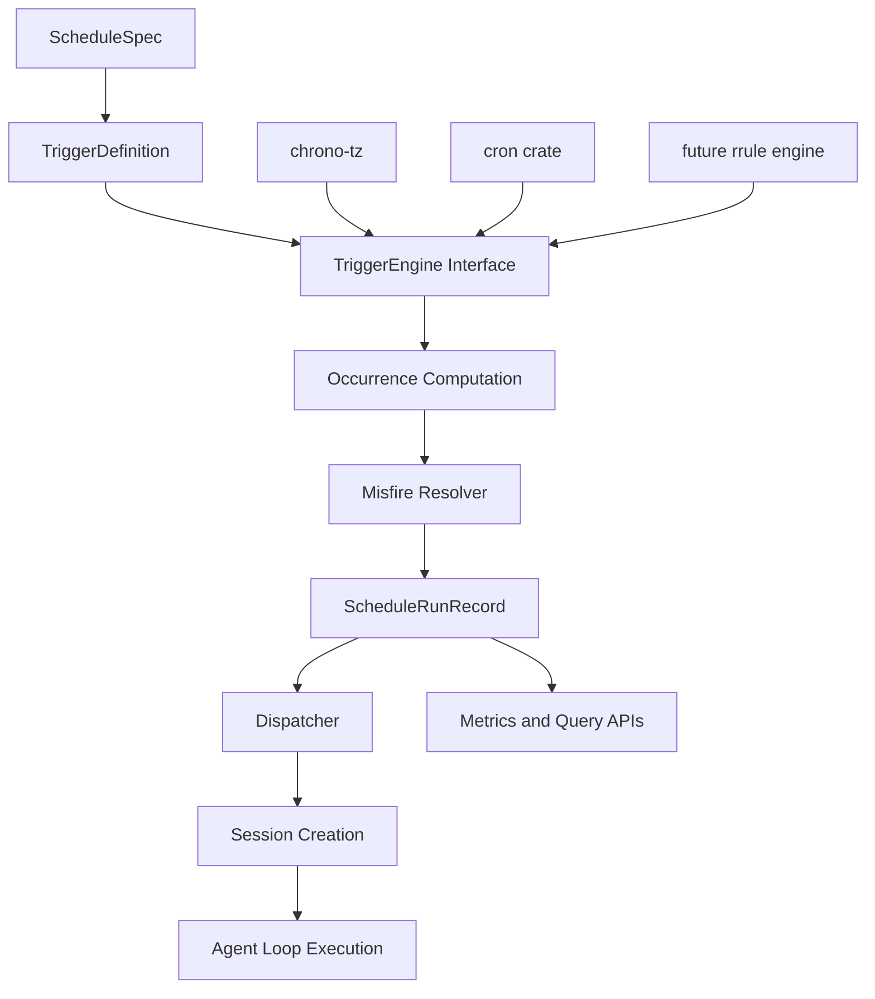
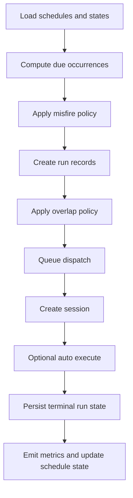

# Schedule System Redesign

- **Date**: 2026-04-04
- **Author**: Bodhi
- **Status**: Draft
- **Scope**: Bamboo scheduler redesign for calendar-based schedules, misfire handling, observability, and pluggable trigger computation

## Executive Summary

The current Bamboo schedule system is a lightweight interval timer that persists schedule definitions and periodically creates root sessions. It is useful as a minimal automation primitive, but it does not yet model a full scheduling domain.

Today the system supports only:

- fixed `interval_seconds`
- coarse 15-second due scanning
- session creation plus optional agent auto-execution
- schedule-to-session linkage via `created_by_schedule_id`
- generic agent/session metrics only

It does **not** support:

- daily / weekly / monthly calendar rules
- explicit `start_at` / `end_at` windows
- timezone-aware local-time scheduling
- configurable misfire behavior when runs are missed
- schedule run history as a first-class concept
- schedule-specific metrics and query APIs
- pluggable trigger engines behind stable interfaces

This document proposes a redesign that keeps Bamboo in control of the **scheduler domain** while allowing specific parts of time-rule computation to be delegated to interchangeable libraries. The core principle is:

> **Own the scheduling domain, abstract the trigger engine, and make implementations replaceable.**

---

## Background and Current State

### Current implementation locations

Current scheduler implementation lives primarily in:

- `src/server/schedules/store.rs`
- `src/server/schedules/manager.rs`
- `src/server/tools/schedule_tasks.rs`
- `src/server/handlers/agent/schedules/*`

### Current behavior summary

#### Data model

The current persisted `ScheduleEntry` contains:

- `id`
- `name`
- `enabled`
- `interval_seconds`
- `created_at`
- `updated_at`
- `last_run_at`
- `next_run_at`
- `run_config`

This means the system models only a repeated fixed interval. It does not model a calendar recurrence.

#### Scheduling loop

The current manager:

- starts a background ticker every 15 seconds
- scans all schedules for `next_run_at <= now`
- claims due schedules
- advances `next_run_at` by `interval_seconds`
- enqueues jobs into a single worker queue
- processes jobs sequentially

#### Missed runs today

If the process is down or delayed long enough to miss multiple intended intervals, the current implementation effectively coalesces them into a single due claim and then advances from `now`. This means missed occurrences are neither preserved nor explicitly recorded.

#### Metrics today

Scheduled sessions inherit the generic agent/session/round/tool metrics pipeline, but there is no schedule-specific metrics model. The only durable schedule-to-session relationship today is `created_by_schedule_id` propagated into session metadata and the session index.

---

## Problem Statement

The existing system is too limited for product-grade scheduling needs. The desired system needs to support requirements such as:

- every day at a specific local time
- every week on specific weekdays
- every month on specific days
- explicit activation windows like `start_at` and optional `end_at`
- handling of missed runs according to explicit policy
- schedule-level metrics and observability
- architecture that programs against interfaces so trigger engines can be replaced later

The redesign must therefore solve two problems simultaneously:

1. expand the scheduling model from interval-only to calendar-capable recurrence
2. separate Bamboo's scheduler domain from the concrete library used to compute occurrences

---

## Goals

### Functional goals

1. Support multiple trigger types:
   - fixed interval
   - daily
   - weekly
   - monthly
   - optional cron expression support
2. Support optional schedule lifecycle windows:
   - `start_at`
   - `end_at`
3. Support explicit timezone-aware local-time scheduling.
4. Support explicit misfire handling policies.
5. Support overlap/concurrency policies.
6. Persist first-class schedule run records.
7. Add schedule-specific observability and metrics.
8. Preserve compatibility with Bamboo sessions and agent execution.
9. Expose stable interfaces so trigger calculation implementations can be swapped.

### Architectural goals

1. Keep Bamboo in control of schedule definitions, state, policies, and execution.
2. Keep trigger/time-rule computation behind interfaces.
3. Avoid locking the domain model to one specific third-party crate.
4. Make future additions like cron, RRULE, business calendars, or distributed execution possible without rewriting the whole system.

---

## Non-Goals

The first redesign phase should **not** attempt to solve all possible advanced scheduling concerns.

Out of scope for the first implementation phase:

- distributed multi-node scheduler coordination
- leader election / global locks across replicas
- holiday/business calendar support
- complex exclusion windows
- full RFC RRULE parity
- arbitrary user-defined scripting inside schedules
- unlimited replay of every missed occurrence after long downtime
- perfect DST semantics for every possible edge case on day one

These should remain future extensibility targets, not first-phase requirements.

---

## Design Principles

### 1. Interface-first design

Bamboo should program to abstractions rather than directly to a concrete scheduler library.

### 2. Bamboo owns the scheduler domain

Bamboo should own:

- schedule definitions
- schedule state
- run records
- dispatch and execution
- misfire and overlap policy enforcement
- metrics and query APIs

### 3. Libraries are implementation details

Third-party crates should help with:

- recurrence rule evaluation
- next occurrence computation
- timezone-aware temporal arithmetic

But they should not become the single source of truth for schedule state.

### 4. Clear separation of concerns

Split the design into layers:

- **spec layer**: what the user wants
- **trigger layer**: when occurrences should happen
- **policy layer**: what to do with missed or overlapping runs
- **run layer**: concrete claimed or executed occurrences
- **dispatch layer**: how work gets executed
- **metrics layer**: how the system is observed

---

## Proposed Architecture



---

## Proposed Domain Model

## ScheduleSpec

`ScheduleSpec` represents user intent and persistent schedule definition.

```rust
pub struct ScheduleSpec {
    pub id: String,
    pub name: String,
    pub enabled: bool,
    pub trigger: ScheduleTrigger,
    pub timezone: Option<String>,
    pub start_at: Option<DateTime<Utc>>,
    pub end_at: Option<DateTime<Utc>>,
    pub misfire_policy: MisfirePolicy,
    pub overlap_policy: OverlapPolicy,
    pub run_config: ScheduleRunConfig,
    pub created_at: DateTime<Utc>,
    pub updated_at: DateTime<Utc>,
}
```

### Notes

- `timezone` expresses how local-time schedules should be interpreted.
- `start_at` and `end_at` define active windows.
- `run_config` remains Bamboo-specific execution configuration.
- `misfire_policy` and `overlap_policy` are explicit domain semantics, not hidden behavior.

---

## ScheduleTrigger

`ScheduleTrigger` is the abstract recurrence definition.

```rust
pub enum ScheduleTrigger {
    Interval(IntervalTriggerSpec),
    Daily(DailyTriggerSpec),
    Weekly(WeeklyTriggerSpec),
    Monthly(MonthlyTriggerSpec),
    Cron(CronTriggerSpec),
}
```

### IntervalTriggerSpec

```rust
pub struct IntervalTriggerSpec {
    pub every_seconds: u64,
    pub anchor_at: Option<DateTime<Utc>>,
}
```

### DailyTriggerSpec

```rust
pub struct DailyTriggerSpec {
    pub hour: u8,
    pub minute: u8,
    pub second: u8,
}
```

### WeeklyTriggerSpec

```rust
pub struct WeeklyTriggerSpec {
    pub weekdays: Vec<ScheduleWeekday>,
    pub hour: u8,
    pub minute: u8,
    pub second: u8,
}
```

### MonthlyTriggerSpec

```rust
pub struct MonthlyTriggerSpec {
    pub days: Vec<u8>,
    pub hour: u8,
    pub minute: u8,
    pub second: u8,
}
```

### CronTriggerSpec

```rust
pub struct CronTriggerSpec {
    pub expr: String,
}
```

---

## ScheduleState

`ScheduleState` tracks scheduler-owned state derived from execution progress.

```rust
pub struct ScheduleState {
    pub next_fire_at: Option<DateTime<Utc>>,
    pub last_scheduled_at: Option<DateTime<Utc>>,
    pub last_started_at: Option<DateTime<Utc>>,
    pub last_finished_at: Option<DateTime<Utc>>,
    pub last_success_at: Option<DateTime<Utc>>,
    pub last_failure_at: Option<DateTime<Utc>>,
    pub consecutive_failures: u32,
    pub total_run_count: u64,
    pub total_success_count: u64,
    pub total_failure_count: u64,
    pub total_missed_count: u64,
}
```

This state should be separated from the schedule definition so it can evolve independently.

---

## ScheduleRunRecord

A schedule occurrence should become a first-class run record.

```rust
pub struct ScheduleRunRecord {
    pub run_id: String,
    pub schedule_id: String,
    pub scheduled_for: DateTime<Utc>,
    pub claimed_at: DateTime<Utc>,
    pub started_at: Option<DateTime<Utc>>,
    pub completed_at: Option<DateTime<Utc>>,
    pub status: ScheduleRunStatus,
    pub outcome_reason: Option<String>,
    pub session_id: Option<String>,
    pub dispatch_lag_ms: Option<u64>,
    pub execution_duration_ms: Option<u64>,
    pub was_catch_up: bool,
}
```

### ScheduleRunStatus

```rust
pub enum ScheduleRunStatus {
    Queued,
    Running,
    Success,
    Failed,
    Skipped,
    Missed,
    Cancelled,
}
```

This record is the basis for:

- auditing
- UI history
- debugging
- metrics
- future replay support

---

## Policy Model

## MisfirePolicy

Misfire behavior must be explicit.

```rust
pub enum MisfirePolicy {
    Skip,
    RunOnce,
    CatchUpAll,
    CatchUpWindow {
        max_catch_up_runs: u32,
        max_lateness_seconds: u64,
    },
}
```

### Recommended defaults

- `Interval`: `CatchUpWindow` with conservative limits
- `Daily`: `RunOnce`
- `Weekly`: `RunOnce`
- `Monthly`: `Skip` or `RunOnce` depending on product choice

### Behavior definitions

- `Skip`: missed occurrences are counted and recorded but not executed
- `RunOnce`: coalesce all missed occurrences into one compensating run
- `CatchUpAll`: materialize every missed occurrence
- `CatchUpWindow`: materialize only a bounded set of recent missed occurrences

---

## OverlapPolicy

If one run is still active when another occurrence becomes due, behavior must be explicit.

```rust
pub enum OverlapPolicy {
    Allow,
    Skip,
    QueueOne,
}
```

### Recommended default

`QueueOne` or `Skip` is safer than unrestricted overlap.

---

## Interface-Oriented Trigger Design

This is the key design direction for pluggability.

## Core abstraction

```rust
pub trait TriggerEngine: Send + Sync {
    fn kind(&self) -> TriggerEngineKind;

    fn next_after(
        &self,
        trigger: &ScheduleTrigger,
        timezone: Option<&str>,
        after: DateTime<Utc>,
        window: &ScheduleWindow,
    ) -> Result<Option<DateTime<Utc>>, TriggerComputationError>;

    fn due_between(
        &self,
        trigger: &ScheduleTrigger,
        timezone: Option<&str>,
        from: DateTime<Utc>,
        to: DateTime<Utc>,
        window: &ScheduleWindow,
        limit: usize,
    ) -> Result<Vec<DateTime<Utc>>, TriggerComputationError>;
}
```

### Supporting types

```rust
pub struct ScheduleWindow {
    pub start_at: Option<DateTime<Utc>>,
    pub end_at: Option<DateTime<Utc>>,
}
```

```rust
pub enum TriggerEngineKind {
    Native,
    CronBacked,
    RRuleBacked,
}
```

### Why this abstraction matters

This allows Bamboo to:

- start with a native implementation for interval/daily/weekly/monthly
- add cron support through a crate-backed implementation
- replace a library later without touching schedule policies or run execution
- unit-test domain behavior separately from library behavior

---

## Recommended Implementation Strategy

## What Bamboo should own directly

Bamboo should implement and own:

- `ScheduleSpec`
- `ScheduleState`
- `ScheduleRunRecord`
- store and persistence
- materialization of due runs
- misfire resolution
- overlap resolution
- dispatch and execution
- session linkage
- metrics emission
- HTTP and tool APIs

## What may be delegated to libraries

Libraries may be used for:

- timezone-aware recurrence arithmetic
- cron parsing and next occurrence calculation
- future RFC-style recurrence expansion

---

## Library Evaluation and Recommendation

### Recommended foundational crates

#### `chrono-tz`

Recommended for timezone support.

Use it to:

- interpret local schedule times under named timezones
- handle local-time scheduling for daily/weekly/monthly triggers
- convert local occurrences into UTC for persistence and dispatch

#### `cron`

Recommended for optional `CronTriggerSpec` support.

Use it to:

- parse cron expressions
- compute successive fire times

### Potential future crate

#### `rrule`

Worth evaluating later if Bamboo needs more expressive recurrence rules. It should be introduced only if the product needs exceed what explicit trigger structs plus cron support can provide.

### Not recommended as the scheduler core

Libraries like `tokio_schedule` or `tokio-cron-scheduler` may be useful references or helpers, but they should **not** become the authoritative scheduler state machine.

Reasons:

1. Bamboo needs durable schedule state and run history.
2. Bamboo needs explicit misfire and overlap semantics.
3. Bamboo already has persistent stores and session orchestration.
4. In-memory job registries are a poor source of truth after restart.
5. Runtime schedulers risk creating dual ownership of scheduling state.

### Recommended architecture statement

> Use external libraries for trigger computation, not for authoritative schedule lifecycle ownership.

---

## Execution Model

## High-level flow

1. load enabled schedules and their states
2. compute next due occurrences using `TriggerEngine`
3. resolve missed occurrences via `MisfirePolicy`
4. materialize `ScheduleRunRecord`s
5. dispatch runnable records to execution workers
6. create Bamboo sessions and optionally execute them
7. persist run outcomes and emit metrics
8. compute and persist new `next_fire_at`



---

## Scheduling loop recommendation

Instead of relying only on a fixed 15-second scan loop, Bamboo should move toward a hybrid model:

### Primary path

- compute the earliest `next_fire_at` across enabled schedules
- sleep until that time or until schedule definitions change

### Reconciliation path

- run a periodic due scan as a safety net
- recover from clock drift, process wakeups, missed notifications, or crashes

This preserves correctness while improving precision over the current coarse polling loop.

---

## Worker model recommendation

The current single sequential worker is simple but too restrictive for future scale.

Recommended evolution:

- bounded dispatch queue
- configurable worker concurrency
- per-schedule overlap policy enforcement
- explicit cancellation and timeout handling
- metrics for queue delay and worker saturation

The first implementation can remain conservative, but the redesigned interfaces should not assume single-threaded sequential execution forever.

---

## Storage Model

## Recommended persistence split

Separate schedule definition, mutable state, and run history.

### Option A: JSON definition + JSON state + SQLite runs

- `schedules.json` for definitions
- `schedule_state.json` for compact mutable scheduler state
- SQLite table for `schedule_runs`

### Option B: move the full scheduler domain to SQLite

- `schedule_specs`
- `schedule_states`
- `schedule_runs`

### Recommendation

For long-term maintainability, prefer **SQLite** for run records at minimum. JSON is acceptable for compact definitions early on, but run history will grow and should not be modeled as an ever-expanding JSON document.

---

## API Design Proposal

## Create schedule request

```json
{
  "name": "weekly-report",
  "enabled": true,
  "trigger": {
    "type": "weekly",
    "weekdays": ["mon", "fri"],
    "hour": 9,
    "minute": 0,
    "second": 0
  },
  "timezone": "Asia/Shanghai",
  "start_at": "2026-04-05T00:00:00Z",
  "end_at": null,
  "misfire_policy": {
    "type": "run_once"
  },
  "overlap_policy": "queue_one",
  "run_config": {
    "task_message": "Generate weekly report",
    "auto_execute": true
  }
}
```

## Patch schedule request

Patch semantics should support partial updates to:

- `name`
- `enabled`
- `trigger`
- `timezone`
- `start_at`
- `end_at`
- `misfire_policy`
- `overlap_policy`
- `run_config`

### Important patch semantic rule

Updating schedule configuration should recompute `next_fire_at` from the new spec, not blindly from wall-clock interval addition.

---

## Additional query endpoints

Recommended future endpoints:

- `GET /api/v1/schedules/{schedule_id}`
- `GET /api/v1/schedules/{schedule_id}/runs`
- `GET /api/v1/schedules/{schedule_id}/metrics`
- `POST /api/v1/schedules/{schedule_id}/pause`
- `POST /api/v1/schedules/{schedule_id}/resume`

---

## Tool API Proposal

The server-only scheduler tool should evolve from interval-only arguments to trigger-based arguments.

### Current limitation

Current tool schema only supports `interval_seconds`.

### Proposed shape

```json
{
  "action": "create",
  "name": "daily-report",
  "trigger": {
    "type": "daily",
    "hour": 9,
    "minute": 0,
    "second": 0
  },
  "timezone": "Asia/Shanghai",
  "misfire_policy": {
    "type": "run_once"
  },
  "overlap_policy": "skip",
  "run_config": {
    "task_message": "Generate daily report",
    "auto_execute": true
  }
}
```

This keeps the tool aligned with the HTTP API and avoids the interval-only trap.

---

## Session Integration

A scheduled run should continue to create Bamboo sessions, but the run should become the primary execution record.

### Recommended metadata additions

When a schedule run creates a session, attach:

- `created_by_schedule_id`
- `schedule_run_id`
- optionally `scheduled_for`

This preserves current schedule-to-session discoverability while making the formal schedule run record the authoritative scheduler artifact.

---

## Metrics and Observability

## Why schedule-specific metrics are needed

Generic session metrics are not enough to answer scheduler questions such as:

- how many times was this schedule supposed to run?
- how often did it miss?
- how late does it usually start?
- how often is it skipped because of overlap?
- how many failures happened consecutively?

## Proposed schedule metrics

### Counters

- `schedule_triggered_total{schedule_id}`
- `schedule_run_started_total{schedule_id}`
- `schedule_run_completed_total{schedule_id,status}`
- `schedule_run_missed_total{schedule_id}`
- `schedule_run_skipped_total{schedule_id,reason}`
- `schedule_catchup_total{schedule_id}`

### Histograms

- `schedule_dispatch_lag_ms{schedule_id}`
- `schedule_execution_duration_ms{schedule_id}`
- `schedule_schedule_to_start_ms{schedule_id}`

### Gauges

- `schedule_next_fire_timestamp{schedule_id}`
- `schedule_overdue_seconds{schedule_id}`
- `schedule_backlog_runs{schedule_id}`
- `schedule_consecutive_failures{schedule_id}`

## Query model

Expose schedule metrics summary and recent run history together so UI can render both:

- health status
- recent successes/failures
- misfire count
- average lateness
- upcoming next fire time

---

## Error Handling and Recovery

## Trigger computation failures

If trigger computation fails because of invalid timezone, invalid cron syntax, or internal engine error:

- reject invalid user input at validation time when possible
- surface engine errors as schedule validation or schedule health issues
- avoid silently disabling or corrupting schedules

## Execution failures

Failed schedule runs should:

- produce terminal run records
- update `ScheduleState.last_failure_at`
- increment failure counters
- preserve error messages for troubleshooting

## Restart recovery

On startup, Bamboo should:

1. reload schedule specs and states
2. reconcile due/missed occurrences up to `now`
3. apply misfire policy
4. materialize new run records as needed
5. compute fresh `next_fire_at`

This is exactly why Bamboo must own authoritative schedule state rather than outsource lifecycle ownership to an in-memory library runtime.

---

## Migration Strategy

## Phase 1 compatibility goal

Preserve compatibility with existing interval schedules while introducing the new model.

### Migration mapping

Current:

```json
{
  "interval_seconds": 3600,
  "next_run_at": "...",
  "last_run_at": "..."
}
```

Maps to:

- `trigger = Interval { every_seconds: 3600, anchor_at: existing creation or derived anchor }`
- `state.next_fire_at = old next_run_at`
- `state.last_scheduled_at = old last_run_at`

### Migration requirements

1. load old persisted schedule entries
2. convert them into `ScheduleSpec + ScheduleState`
3. preserve `id`, `name`, and `run_config`
4. do not break existing schedule CRUD users during the transition

### Deprecation plan

- mark `interval_seconds` as legacy in API and tool schemas
- add trigger-based APIs first
- remove interval-only assumptions after migration is complete

---

## Phased Implementation Plan

## Phase A: design and interfaces

Deliverables:

- this design document
- interface definitions for trigger engine and policy evaluators
- data model proposal
- migration plan

## Phase B1: domain model introduction

Deliverables:

- introduce `ScheduleTrigger`
- introduce `MisfirePolicy` and `OverlapPolicy`
- introduce `ScheduleState`
- add trigger-based API and validation
- preserve old interval schedule compatibility

## Phase B2: trigger engine implementation

Deliverables:

- native engine for interval/daily/weekly/monthly
- timezone support via `chrono-tz`
- optional cron-backed implementation using `cron`
- plug concrete engines behind the `TriggerEngine` trait

## Phase B3: run records and execution pipeline

Deliverables:

- `ScheduleRunRecord` persistence
- due-run materialization
- overlap handling
- improved dispatcher
- session metadata enhancements

## Phase B4: observability

Deliverables:

- schedule-specific metrics
- `GET /schedules/{id}/runs`
- `GET /schedules/{id}/metrics`
- UI-facing summaries

## Phase B5: cleanup and deprecation

Deliverables:

- retire interval-only assumptions from tool and API code
- finish migration of persisted schedule definitions
- add documentation and test coverage for new model

---

## Testing Strategy

## Unit tests

Add focused tests for:

- trigger next occurrence calculation
- due occurrence expansion between time ranges
- timezone interpretation
- DST edge cases for supported trigger types
- misfire policy resolution
- overlap policy resolution

## Integration tests

Add integration tests for:

- create/patch/list schedule APIs
- restart recovery behavior
- missed-run reconciliation
- run history persistence
- session linkage via `schedule_run_id`
- schedule metrics summary queries

## Compatibility tests

Add migration tests proving that old interval schedules are upgraded safely.

---

## Open Questions

1. Should `Monthly` support invalid dates like day 31 by skipping shorter months or clamping?
2. Should `RunOnce` on multiple missed occurrences preserve the earliest missed timestamp, the latest, or the current time as `scheduled_for`?
3. Should overlap policy default to `Skip` or `QueueOne`?
4. Should first-phase storage be mixed JSON + SQLite, or go directly to SQLite for all schedule entities?
5. Should cron be first-phase or second-phase support?
6. Should schedule metrics be stored inside the existing metrics DB or a scheduler-specific table group?

---

## Recommended Decisions

To reduce scope while keeping the architecture strong, the recommended near-term decisions are:

1. **Program to interfaces from day one.**
2. **Keep Bamboo as the scheduler domain owner.**
3. **Use `chrono-tz` for timezone support.**
4. **Start with native implementations for interval/daily/weekly/monthly triggers.**
5. **Add `cron` support as a pluggable engine, not the only engine.**
6. **Persist first-class run records.**
7. **Add explicit misfire and overlap policies before expanding feature surface.**
8. **Treat `tokio_schedule`-style crates as optional helpers, not the authoritative scheduler core.**

---

## Final Recommendation

Bamboo should redesign its scheduler around a stable domain model and pluggable trigger engine interfaces.

The right architecture is **not** to outsource the scheduler entirely to a library. Instead, Bamboo should:

- own schedule specs, states, runs, policies, and metrics
- expose interface-based trigger computation
- use crates selectively where they are strongest
- preserve implementation flexibility for future replacement

In short:

> **Build the scheduler as a domain system, and treat recurrence libraries as replaceable engines behind interfaces.**
